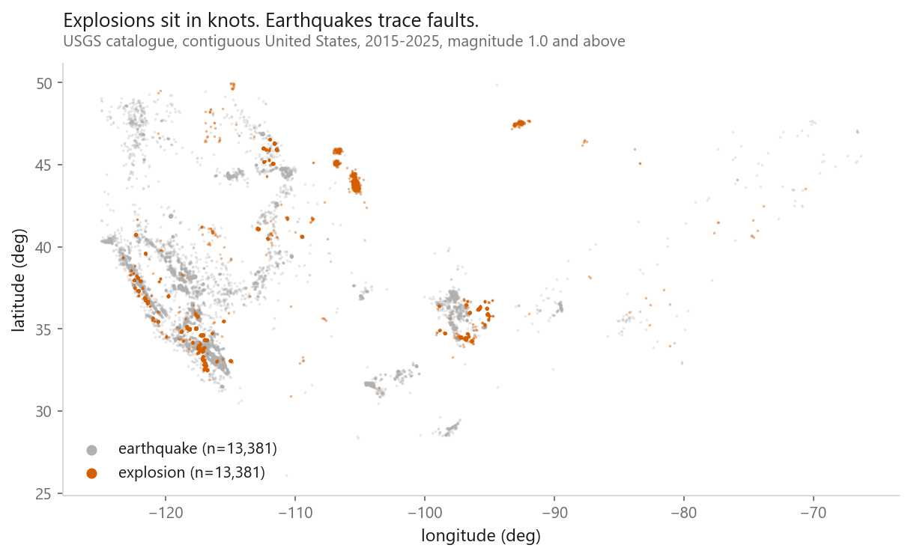
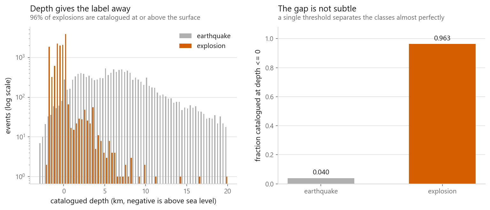
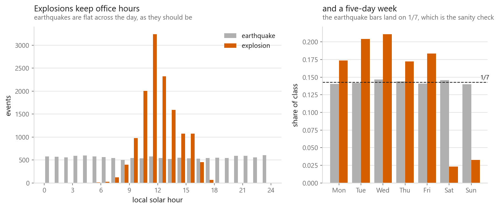
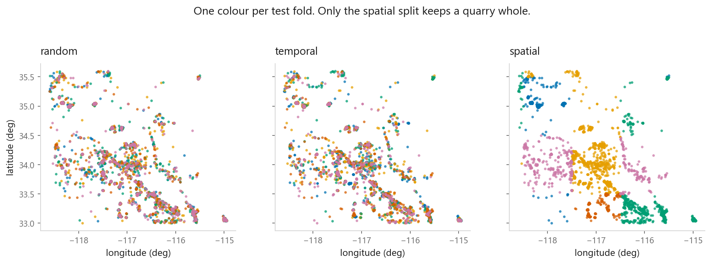
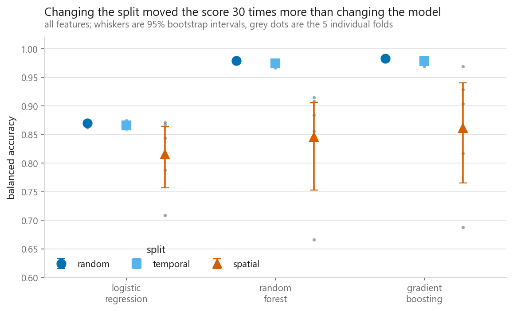
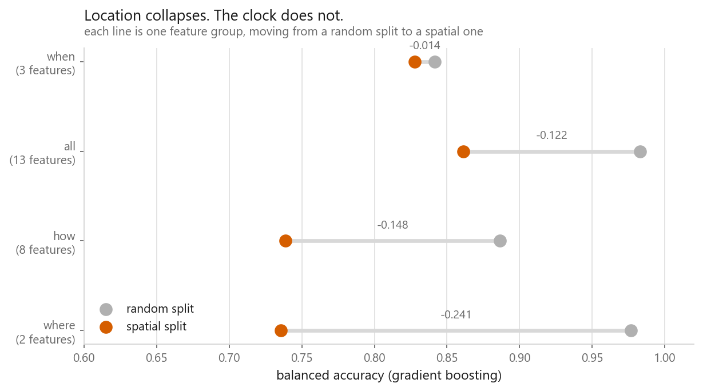
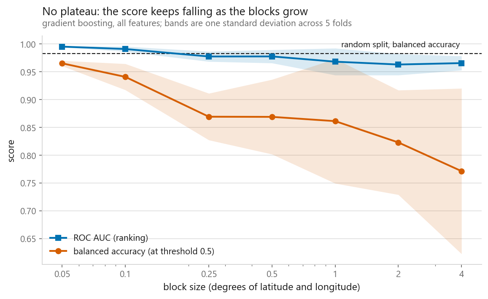

# Three splits, three different truths

**Can a model tell a quarry blast from an earthquake using nothing but the
catalogue row? And how much does the answer depend on how I cut the data?**

[Open the notebook](notebook.ipynb) · Part 1, Foundations · by
[Elyes Lounissi](https://www.linkedin.com/in/elyes-lounissi/)

---

## The short version

A gradient boosting model separates catalogued explosions from earthquakes at
**0.983 balanced accuracy** under a random split. The same model, on the same
data, scores **0.861** when the folds are blocked by location — an error rate of
1.7% against 13.9%, or **8.1 times as many mistakes**.

The gap between the two tree ensembles anyone would actually choose between was
0.004. The gap between splits was 0.122. Here, the way the folds were arranged
mattered about thirty times more than the model.

A temporal split — the reflex answer when someone says "watch out for leakage" —
cost half a point, which is roughly what changing the model cost. It bought
almost nothing, because the leak in this dataset is geographic and reshuffling
time leaves the map untouched.

## The data

Every explosion the USGS catalogued in the contiguous United States between 2015
and 2025 at magnitude 1.0 and above (13,381 events, labelled `quarry blast` or
`mining explosion`), matched one-for-one against earthquakes drawn from the same
calendar months. 26,762 events total, exactly balanced.

Matching within months matters. Explosions are a working-hours activity whose
count follows construction demand; earthquake counts are dominated by a few
aftershock sequences. Sampling across the whole decade at once would let a model
score well by learning which years were quiet — a fact about my sampling, not
about the events.

Public domain, from the USGS FDSN event service. Rebuild it with
[`data/fetch/usgs_blasts_vs_quakes.py`](../../data/fetch/usgs_blasts_vs_quakes.py).

Quarries do not move. A quarry that blasted in 2016 is blasting in 2024 from the
same coordinates, so the orange piles onto a few hundred pixels — the ten busiest
tenth-of-a-degree cells hold 42% of all explosions. Earthquakes come from faults,
which are lines, and the grey spreads along them.

## Two features I had to throw away

96.3% of explosions are catalogued at or above the surface, against 4.0% of
earthquakes. That is not a discovery — an analyst who has decided an event is a
quarry blast fixes its depth at the surface, *because* that is where quarry
blasts happen. The number is a consequence of the label, not evidence for it.

`status` went for the same reason: an event is `reviewed` rather than `automatic`
because a human opened it, and a human opened it in order to apply the label.
Network codes and magnitude type went too, less obviously — they say which
regional network processed the event, which is coarse location wearing a
different hat.

## The clock

98.7% of explosions happen between 08:00 and 18:00 local solar time, against
40.2% of earthquakes. 94.4% fall Monday to Friday, against 71.4%.

The earthquake bars landing on 1/7 are the sanity check. Nothing in the sampling
forced that, so it says the earthquakes behave like a process with no weekly
structure — which means the explosion side is a real difference and not an
artefact of how the file was built.

## Three ways to cut the same data

Colour is the fold each event was tested in, zoomed to the quarry district east
of Los Angeles. Under random and temporal splits each quarry is a rosette of all
five colours: it was in the training set every time it was tested. Only the
spatial split keeps a quarry whole.

## The result

Balanced accuracy, because the spatially blocked folds have explosion rates
running from 0.30 to 0.70 and plain accuracy would reward guessing the majority.

| Features | Random | Temporal | Spatial | Drop |
|---|---|---|---|---|
| where (2) | 0.977 | 0.972 | 0.736 | −0.241 |
| how (8) | 0.886 | 0.865 | 0.739 | −0.148 |
| all (13) | 0.983 | 0.978 | 0.861 | −0.122 |
| when (3) | 0.841 | 0.841 | 0.828 | −0.014 |

This is the finding. Under a random split, location beats time of day by a wide
margin, and a reasonable person would conclude location is the informative
feature. Under a spatial split the ordering reverses: location becomes the
weakest group and the clock becomes the strongest. Two conclusions, same data,
same model.

`how` sits in between, and its drop confirms a caveat raised before the modelling
started: azimuthal gap, station counts, and distance-to-nearest-station describe
the seismic network around the event, and network geometry is a property of
place. Those columns were carrying location under a physical-sounding name.

## Where it did not go to plan

I expected the block-size sweep to fall and then level off, on the reasoning that
once a held-out region is genuinely unfamiliar there is no leak left to remove.
It never levelled off. Balanced accuracy slid from 0.965 at a twentieth of a
degree to 0.772 at four degrees and was still falling.

So I cannot separate the two things that grow together as blocks get bigger:
leakage removed, and difficulty added by pushing the test region further from
anything in training. **"The" spatially blocked score does not exist — it is a
function of a block size I chose.** One degree is defensible as roughly the scale
over which quarry districts repeat, but it is a judgement, and the headline
number depends on it.

The two curves separating is the useful part. AUC, which only cares about
ranking, degrades gently; balanced accuracy at a fixed 0.5 threshold falls much
faster, and its fold-to-fold spread grows from 0.005 to 0.149. The model's
ability to *order* events by how explosion-like they are survives relocation far
better than its ability to place a decision boundary. Deployed, this would want a
per-region threshold and an AUC headline.

I also cut a chart. I ran permutation importance under both splits expecting the
feature ranking to invert as cleanly as the group experiment did. It did not —
latitude stays near the top under spatial blocking, because latitude carries real
coarse signal as well as the quarry lookup. An ambiguous figure argues for
whatever the reader already believed, so it is not in the notebook.

## What this does not show

The labels are analyst decisions, not ground truth. If analysts label events near
known quarries as blasts partly *because* they are near known quarries, some of
what I call a spatial leak is baked into the labelling and no split removes it.
Settling that needs events labelled from waveforms alone.

One country, one decade, and nothing tuned. A tuned model would score higher
everywhere; I have no evidence on whether tuning widens or narrows the gap
between splits, though I would expect it to widen, since tuning on randomly split
folds optimises for the leak.

## Prior work

Blast-versus-earthquake discrimination is a long-standing seismology problem, and
the published classifiers are good — but they use waveform physics (corner
frequency, spectral ratios) and report accuracy in the high nineties under random
k-fold. This project uses only the catalogue row, which exists for every
published event and costs nothing, and it audits the split rather than the
classifier. Full notes, including the near misses, are in
[`ORIGINALITY.md`](../../ORIGINALITY.md).

---

Data: U.S. Geological Survey, Earthquake Hazards Program, ANSS Comprehensive
Catalog. Public domain.

**Elyes Lounissi** ·
[LinkedIn](https://www.linkedin.com/in/elyes-lounissi/) ·
[pilot.tun@gmail.com](mailto:pilot.tun@gmail.com)
