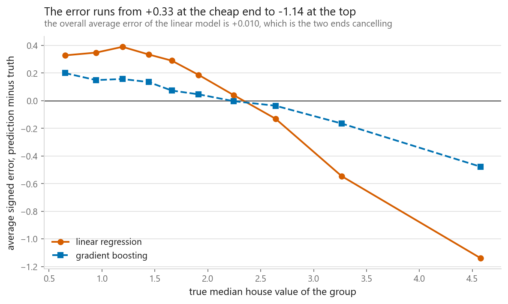
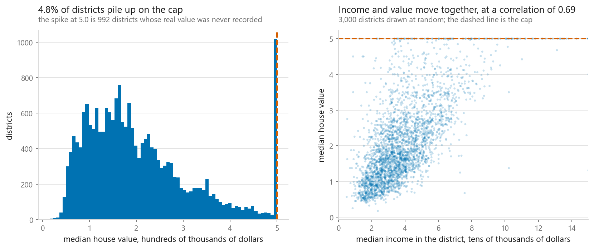
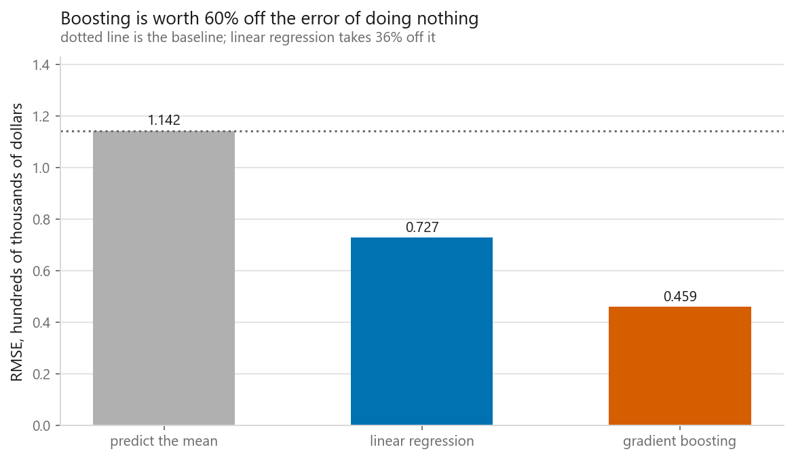
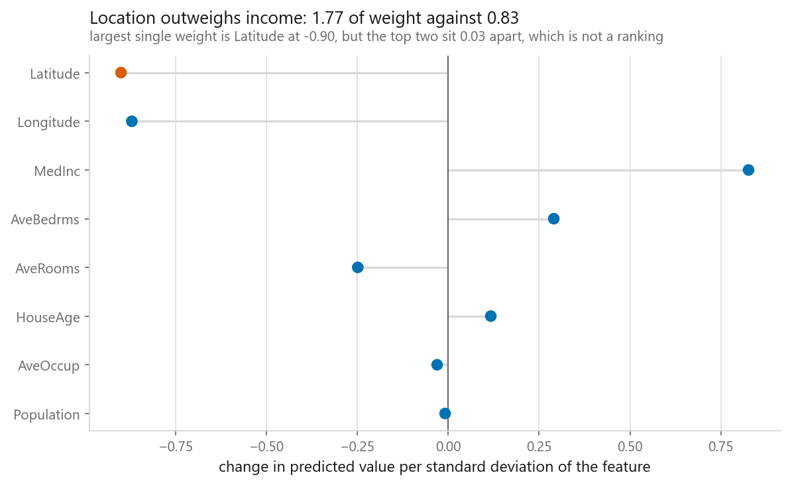
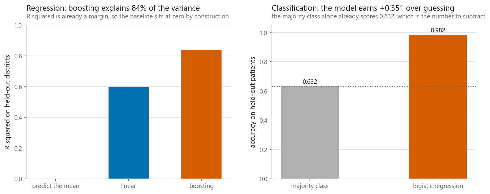

# What machine learning actually does

### The seven steps on one small problem, and the summary statistic that hid a structural failure

**[Open the notebook](notebook.ipynb)** · Part 1, Foundations ·
Made by [Elyes Lounissi](https://www.linkedin.com/in/elyes-lounissi/)

| | |
|---|---|
| **What you will learn** | What a supervised model is doing, why the first thing to build is the dumbest possible predictor, how to split data so a score means something, and what would have to be true before anyone acted on the output |
| **You should already know** | Python and pandas well enough to read a `DataFrame`. No machine learning at all |
| **Datasets** | California Housing, 20,640 districts, 8 numeric columns, zero missing values. Breast Cancer Wisconsin, 569 rows and 30 columns, for the classification version. Both ship with scikit-learn |
| **Runtime** | Under a minute on a laptop CPU. One 80/20 split at seed 0, three models, no tuning |

---

## The result I would lead with

The linear model's average signed error across all 4,128 held-out districts is
**+0.0104**, in units of hundreds of thousands of dollars. That reads as a model
with no bias worth mentioning. Group the same held-out rows into ten price
buckets and the number falls apart:

| Decile | True median value | Average signed error | Rows |
|---|---|---|---|
| 0 | 0.6505 | **+0.3284** | 413 |
| 1 | 0.9446 | +0.3483 | 414 |
| 2 | 1.1936 | +0.3901 | 414 |
| 3 | 1.4415 | +0.3347 | 410 |
| 4 | 1.6601 | +0.2900 | 413 |
| 5 | 1.9132 | +0.1871 | 413 |
| 6 | 2.2446 | +0.0406 | 412 |
| 7 | 2.6396 | -0.1301 | 414 |
| 8 | 3.2650 | -0.5460 | 412 |
| 9 | 4.5776 | **-1.1395** | 413 |

The model overprices the cheapest tenth of districts by about a third of a unit
and underprices the dearest tenth by more than a whole one. Those two errors
have opposite signs and roughly equal weight, so averaging them produces
+0.0104 and the failure disappears.

This is what a straight line does to a skewed target. It cannot bend, so it
raises the floor to pay for the ceiling. The bottom row has a second cause on top
of that: 992 districts were recorded at the 5.0 cap when they were worth more, so
a model predicting below 5.0 for them is penalised for being right.

**Break the error down by something, always.** One `groupby` turned a model that
looked unbiased into one that is wrong in a predictable direction at both ends of
the range it will actually be used on. Group by the target itself, by a segment
you will be judged on, or by time.

Gradient boosting, the dashed line, has the same sign pattern and a much flatter
run. Being the better model here means having a smaller version of the same
problem, not a different one.

## Look at the target for ten seconds first

**992 districts, 4.81% of the table, sit at exactly 5.0.** The target was capped
when the 1990 census data was assembled, so every district worth more than the
cap was recorded at the cap. No model can recover a number that was never
written down.

That is not trivia. The cap is the reason the bottom row of the decile table above
exists: those districts were scored against a value known to be too low, so a
model predicting below 5.0 for them is penalised for being right.

The right panel is why fitting anything is worth the effort. Income and median
value move together at a correlation of 0.69, so one column already carries real
information. The cloud is also wide, which is why one column is not enough.

## The baseline, then the model, then the subtraction

`DummyRegressor(strategy="mean")` is one line, and it is the exact least-squares
solution to the problem when the features are ignored. That is what makes it the
right thing to beat rather than a strawman.

| Model | RMSE | MAE | R squared | RMSE beaten by | Better than baseline |
|---|---|---|---|---|---|
| predict the mean | 1.1421 | 0.9071 | -0.0003 | +0.0000 | +0.0% |
| linear regression | 0.7273 | 0.5351 | +0.5943 | +0.4148 | +36.3% |
| **gradient boosting** | **0.4595** | **0.3090** | **+0.8381** | **+0.6826** | **+59.8%** |

An RMSE of 0.4595 means nothing on its own. An RMSE of 0.4595 against a do-nothing
predictor's 1.1421 is a result. The eight features are worth 60% off the error of
guessing, and that 60% is the only part of the score the model earned.

For the record, the from-scratch versions agree with the library. The closed-form
least-squares slope through `MedInc` and `LinearRegression`'s differ by
**4.44e-16**.

## R squared is the baseline in disguise, and it is not exactly zero

R squared is one minus the ratio of the model's squared error to the constant
predictor's, so a margin over the mean is already built into it. The notebook
checks that against the library rather than asserting it:

| Quantity | Value |
|---|---|
| 1 - mse(model) / mse(test mean) | 0.59432327 |
| `r2_score` from scikit-learn | 0.59432327 |
| 1 - mse(model) / mse(train mean) | 0.59444402 |

The baseline row in the table above scores **-0.0003**, not 0. `r2_score`
compares against the mean of the held-out target, 2.0528, while the baseline you
could actually ship predicts the mean of the training target, 2.0725. Two
different constants, so the deployable one lands a shade below zero. The gap
between the two references is 2.98e-04 of the total, which is small on a split
this size and would not be on a small one.

## The coefficient I did not expect

Every feature went through a `StandardScaler` inside the pipeline, so each weight
answers the same question: how far does the prediction move per standard
deviation of that column.

| Feature | Weight |
|---|---|
| Latitude | -0.9004 |
| Longitude | -0.8706 |
| MedInc | +0.8262 |
| AveBedrms | +0.2904 |
| AveRooms | -0.2489 |
| HouseAge | +0.1171 |
| AveOccup | -0.0306 |
| Population | -0.0086 |

I expected income to carry the largest weight. Both location columns beat it.
Whether latitude or longitude comes out nominally larger is not a finding: the two
sit 0.0298 apart on weights near 0.9, and a different split seed would reorder
them. The finding is that location carries 1.77 of weight against income's 0.83.

The mechanism is geography. Price falls off with distance from the coast, the
California coast runs diagonally, and a linear model can only approximate a
diagonal boundary by leaning hard on both coordinates at once. That is a clumsy
way to encode a map, and it is why trees do better here: a tree splits on
latitude, then on longitude, and gets the same shape for free. The gradient
boosting row above is that advantage cashed in.
[02-01](../../02-regression/01-linear-regression/) reaches the same coefficients
and works through it in more detail.

**A coefficient describes the model, not the world.** It does not say that moving
a district north would lower its house prices.

## The same steps on a yes-or-no question

Nothing above depended on the target being a number. Swap in Breast Cancer
Wisconsin, 569 rows and 30 columns, with a training class balance of 62.64% to
37.36%:

| Model | Accuracy |
|---|---|
| always predict the majority class | 0.6316 |
| logistic regression | **0.9825** |
| margin | **+0.3509** |

Logistic regression leaves **0.048 of the baseline's error rate** standing, so it
removed about 95% of the mistakes guessing would have made. The workflow did not
change: baseline, model, subtraction.

Accuracy is the metric that needs this treatment most, because it is not a margin
over anything. When the class you care about is rare the majority-class rate
climbs toward one and the margin collapses, and the accuracy figure keeps looking
excellent while meaning less and less.

## What would have to be true before anyone used this

Five facts about the world, not about the code.

**The data is from the 1990 census.** Any use today assumes the relationship
between income, location and price has not moved in more than three decades.

**The rows are districts, not houses.** Every column is an average over a few
thousand people, so a prediction is a claim about a district's median.

**The target is censored.** 992 rows sit on the cap, and the decile table shows
what that does at the expensive end.

**Nobody has said what an error costs.** RMSE assumes a mistake of two units
hurts four times as much as one of a single unit, and that overpricing and
underpricing hurt equally.

**The held-out set was used once.** The moment you start adjusting the model
because you did not like the held-out number, that number stops estimating
anything.

## Cheat sheet

| | |
|---|---|
| **Supervised learning** | Fit a function from feature columns to a target column, using rows where both are known |
| **First model, always** | `DummyRegressor(strategy="mean")` or `DummyClassifier(strategy="most_frequent")`. One line, and it defines what winning means |
| **Report** | The model's score and the baseline's score together. A score alone cannot be interpreted by anybody, including the person who produced it |
| **RMSE** | Same units as the target, punishes large mistakes hardest. 1.1421 for the baseline here, 0.4595 for the winner |
| **R squared** | Already a margin over the mean. The shippable baseline scored -0.0003, not 0, because the reference mean is the test set's |
| **Accuracy** | Unreadable without the majority-class rate beside it. 0.9825 against 0.6316 is the result, not 0.9825 |
| **Split** | Hold rows back before fitting. One split shows the idea; it is not enough to trust a close comparison |
| **Coefficients** | Location outweighed income, 1.77 to 0.83. Read that as a fact about the fit, never as a cause |
| **Do next** | `groupby` a column and look at the signed error inside each group. It found a +0.33 to -1.14 swing hiding under an average of +0.01 |
| **Next chapter** | [Train, validation, test](../02-train-validation-test/), which is why one held-out set is not enough |

---

If this chapter was useful, a star on the repository helps other people find it.
The code is yours to use, copy and adapt in your own work, no permission needed.

Made by **Elyes Lounissi** ·
[LinkedIn](https://www.linkedin.com/in/elyes-lounissi/) ·
[pilot.tun@gmail.com](mailto:pilot.tun@gmail.com)

Back to [Part 1](../) · [the curriculum](../../CURRICULUM.md) · [the book](../../README.md)

`#MachineLearning` `#Baseline` `#LinearRegression` `#GradientBoosting`
`#LogisticRegression` `#CaliforniaHousing` `#BreastCancerWisconsin` `#ScikitLearn`
`#MLTutorial` `#LearnMachineLearning` `#DataScience` `#AI`
