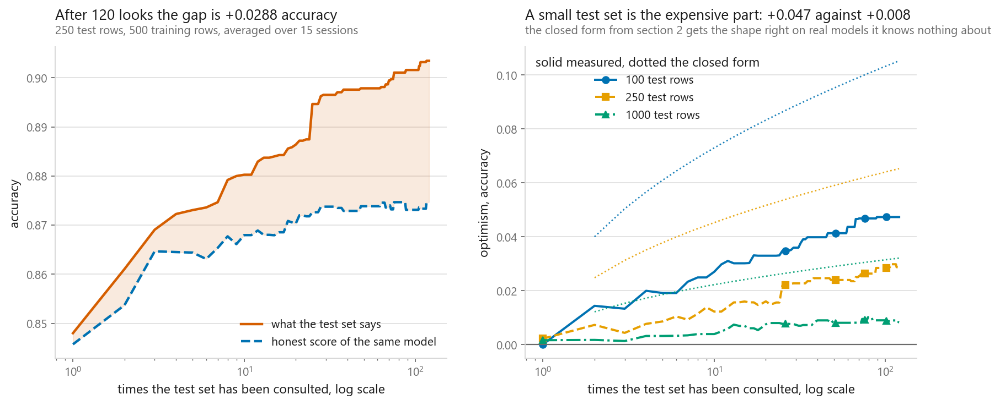
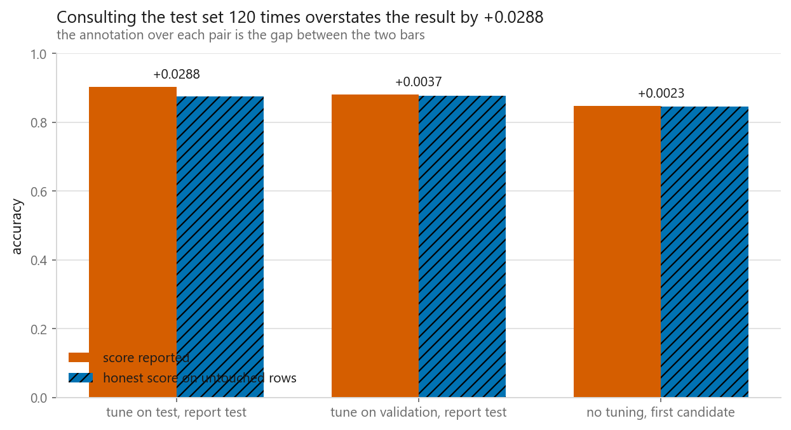
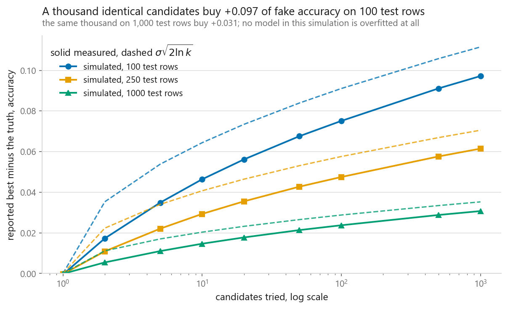
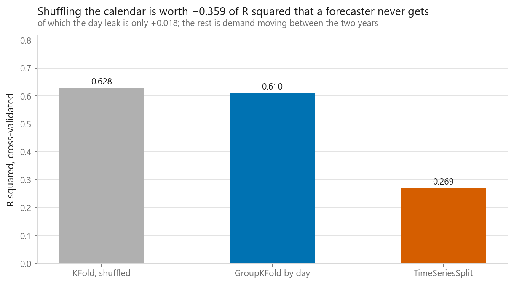
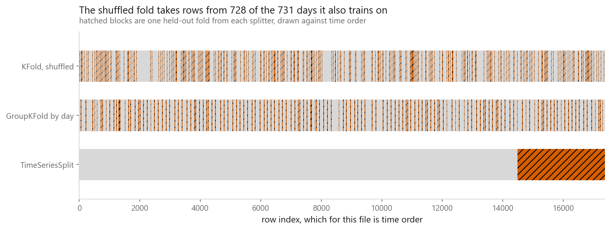

# Train, validation, test

### Tuning against a test set the way people actually do it, with the damage measured after every look

**[Open the notebook](notebook.ipynb)** · Part 1, Foundations ·
Made by [Elyes Lounissi](https://www.linkedin.com/in/elyes-lounissi/)

| | |
|---|---|
| **What you will learn** | How far a test score drifts from honest performance as a function of how often it was consulted, what the third split buys, what nested cross-validation measures that a single search cannot, and the two situations where a random split is the wrong split |
| **You should already know** | [What machine learning actually does](../01-what-machine-learning-does/) |
| **Datasets** | UCI Dry Bean (6,000-row subsample, 7 varieties), Breast Cancer Wisconsin (200-row subsample), UCI Bike Sharing (17,379 hours), plus a simulation |
| **Runtime** | Two to three minutes on a laptop CPU |

---

## The result I would lead with

120 candidate decision trees, tried one after another, keeping whichever scored
best on a 250-row test set. 500 training rows, 15 repeated sessions, and a large
untouched pool of Dry Bean rows standing in for reality.

| Times the test set was consulted | Test score reported | Honest score of that model | Optimism |
|---|---|---|---|
| 1 | 0.8480 | 0.8457 | +0.0023 |
| 2 | 0.8611 | 0.8537 | +0.0074 |
| 5 | 0.8731 | 0.8644 | +0.0087 |
| 10 | 0.8803 | 0.8680 | +0.0123 |
| 20 | 0.8864 | 0.8703 | +0.0161 |
| 50 | 0.8979 | 0.8739 | +0.0240 |
| **120** | **0.9035** | **0.8747** | **+0.0288** |

The gap grows at every single step, with no level at which it stops. From look
20 to look 120 the reported score improved by **+0.0171**. Honest performance
improved by **+0.0044**. So **25.7% of that late improvement was real** and the
other three quarters was the test set being mined.

Now compare the two procedures by the quality of the model each one picked,
rather than by the number each one reported:

| | Score reported | Honest score | Optimism |
|---|---|---|---|
| tune on test, report test | 0.9035 | 0.8747 | +0.0288 |
| tune on validation, report test | 0.8805 | 0.8768 | +0.0037 |
| no tuning, first candidate | 0.8480 | 0.8457 | +0.0023 |

The two tuned models are the same model in every way that matters. 0.8747 against
0.8768 is a fifth of a percentage point, and the notebook prints the paired
standard error across the 15 sessions beside it so you can see it is noise. It
should be noise. Both rules take the maximum of the same 120 candidates scored on
a 250-row set, so they are solving an identical selection problem and there is no
mechanism by which one would find better trees than the other.

What differs is the number: **+0.0288 against +0.0037**. The whole cost of tuning
against the test set landed on the report, not on the model. That is the harder
failure to notice, because there is nothing wrong with the model to find when it
disappoints somewhere you cannot rerun it. The artefact of the mistake is a figure
in a document, and figures in documents do not throw exceptions.

## The formula gets the shape right and the level wrong

The standard derivation says the winner of `k` equally good candidates is
flattered by roughly the noise on one score times the expected maximum of `k`
normals, which is about `sigma * sqrt(2 ln k)`. The notebook simulates exactly
that situation, every candidate worth the same, noise exactly binomial, nothing
overfitted anywhere:

| Candidates | Measured optimism, 250 test rows | `sigma * sqrt(2 ln k)` |
|---|---|---|
| 1 | -0.0003 | 0.0000 |
| 2 | +0.0109 | 0.0223 |
| 5 | +0.0221 | 0.0340 |
| 10 | +0.0293 | 0.0407 |
| 50 | +0.0427 | 0.0531 |
| 100 | +0.0475 | 0.0576 |
| 1000 | +0.0615 | 0.0705 |

The closed form is high in every row: **2.05x the measurement at two candidates**
and still 15% high at a thousand. The `sqrt(2 ln k)` approximation to the
expected maximum is asymptotic and it does not earn its keep at small `k`. Read
it as a shape, which it gets right, and not as a level.

The two dials the simulation does settle, and they matter more than the formula's
level:

| | 100 test rows | 250 test rows | 1000 test rows |
|---|---|---|---|
| 10 candidates | +0.0464 | +0.0293 | +0.0147 |
| 100 candidates | +0.0751 | +0.0475 | +0.0237 |
| 1000 candidates | +0.0972 | +0.0615 | +0.0307 |

Going from 10 candidates to 1000, a hundredfold, roughly doubles the damage.
Going from 250 test rows to 1000, fourfold, halves it. **The test-set size is the
dial worth turning.** A small test set consulted often is the worst combination
and it is the most common one.

## Nested cross-validation, on 200 rows

When there are not enough rows to carve off a permanent validation set, put the
whole search inside an outer fold. The inner loop chooses hyperparameters, the
outer loop scores the procedure on rows the procedure never saw.

| | |
|---|---|
| `best_score_` from the search | 0.9900 |
| Nested estimate | 0.9850 |
| Gap | **+0.0050** |
| Outer folds | 0.95, 1.00, 1.00, 1.00, 0.975 |

200 rows of Breast Cancer, 20 candidate SVM settings. The gap is small because
20 candidates is a narrow search, and it points the direction it always points:
`best_score_` is the maximum of a set of noisy numbers and the maximum of noisy
numbers is biased upward whatever the models were. Note the outer-fold spread,
0.95 to 1.00, which is wider than the gap it is being used to detect.

## When a random split is the wrong split

Bike Sharing is 17,379 hourly hire counts over **731 distinct days**, so 23.8
rows share a day. Rows from one day share weather, a weekday, and a general level
of demand.

Under a shuffled 5-fold split, **100.00% of test rows have a sibling from their
own day sitting in training.** Not most of them. All of them.

| Splitter | Mean R² | Worst fold | Best fold | Question it answers |
|---|---|---|---|---|
| KFold, shuffled | 0.6281 | 0.6221 | 0.6382 | can you fill in a missing hour from a day you have seen? |
| GroupKFold by day | 0.6098 | 0.6002 | 0.6190 | can you handle a day you have never seen? |
| TimeSeriesSplit | **0.2693** | **-0.0421** | 0.4651 | can you handle next month? |

Same model, same rows, same metric. Only the definition of a held-out row
changes, and it is worth **0.359 of R²** that a forecaster never collects.

Two different failures are stacked in that table, and only one of them is about
grouping.

The day leak is the smaller one. Shuffled to grouped costs **0.018**, with
non-overlapping fold ranges, so it is a real effect and a modest one. All 17,379
test rows had a sibling from their own day in training and it bought almost
nothing, because the features already carry the hour, the temperature and the
weekday, which is most of what a day is.

Non-stationarity is the expensive one. Grouped to time-ordered costs **0.340**,
and the worst fold lands at **-0.0421**, below predicting the mean. The file
covers two years and demand grew across them, so a model fitted on the early
block is being asked to extrapolate to a level it has never seen rather than
interpolate inside one. No splitter fixes that. `TimeSeriesSplit` only stops you
from being lied to about it. The fixes are a feature that carries the trend, or
refitting often enough that the gap between training and use stays small.

Drawing one held-out fold from each splitter against the calendar makes the
difference visible: the shuffled fold pulls rows from **728 of the 731 days it
also trains on**, the grouped fold keeps whole days together, and the time fold is
a single block at the end.

## Cheat sheet

| | |
|---|---|
| **Training set** | Fits parameters. Anything the algorithm optimises belongs here |
| **Validation set** | Fits your choices. Model family, hyperparameters, stopping point, threshold |
| **Test set** | Touched once, at the end, to produce the number you report |
| **The rule** | A set that decided something can no longer measure it |
| **The dial that matters** | Test-set size. Four times more rows halved the optimism; a hundred times more candidates only doubled it |
| **What it costs you** | Here, nothing measurable in model quality and 0.0288 in the reported number. The number is the whole cost |
| **Never report** | `GridSearchCV.best_score_`. It ran 0.0050 above the nested estimate on 200 rows and 20 candidates, and the gap widens with the search |
| **Do not trust** | `sigma * sqrt(2 ln k)` as a level. It overstated the simulated optimism in every row, by 2x at small `k` |
| **Repeated rows** | `GroupKFold`, grouped by whatever repeats: patient, day, device, session. A shuffled split leaked 100.00% of test days here, and it was worth 0.018 |
| **Time order** | `TimeSeriesSplit` or a fixed date cut. Worth 0.340 here, twenty times the grouping leak, because demand moved between the two years |
| **Next** | [Overfitting and underfitting](../03-overfitting-and-underfitting/), then [cross-validation](../04-cross-validation/) |

---

If this chapter was useful, a star on the repository helps other people find it.
The code is yours to use, copy and adapt in your own work, no permission needed.

Made by **Elyes Lounissi** ·
[LinkedIn](https://www.linkedin.com/in/elyes-lounissi/) ·
[pilot.tun@gmail.com](mailto:pilot.tun@gmail.com)

Back to [Part 1](../) · [the curriculum](../../CURRICULUM.md) · [the book](../../README.md)

`#MachineLearning` `#ModelEvaluation` `#TrainTestSplit` `#ValidationSet`
`#NestedCrossValidation` `#GroupKFold` `#TimeSeriesSplit` `#DataLeakage`
`#WinnersCurse` `#ScikitLearn` `#DryBean` `#BikeSharing` `#MLTutorial`
`#LearnMachineLearning` `#DataScience` `#AI`
