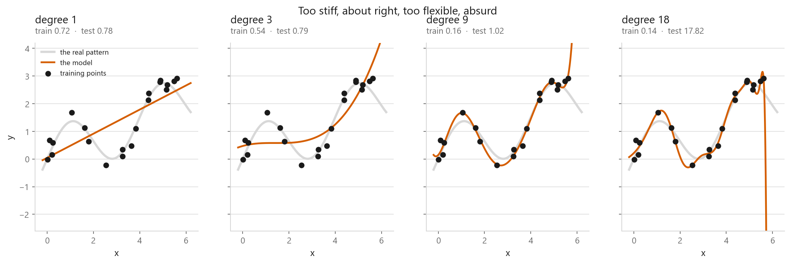
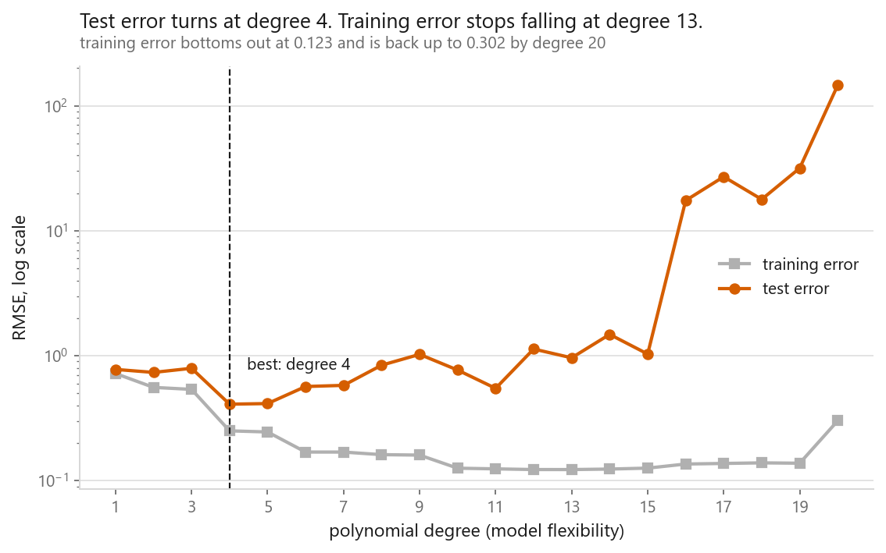
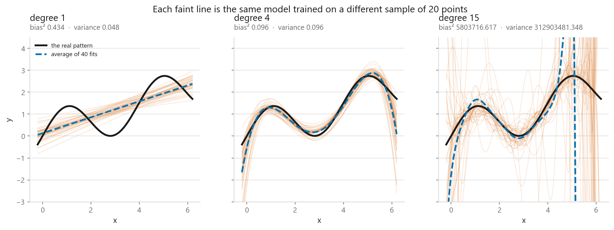
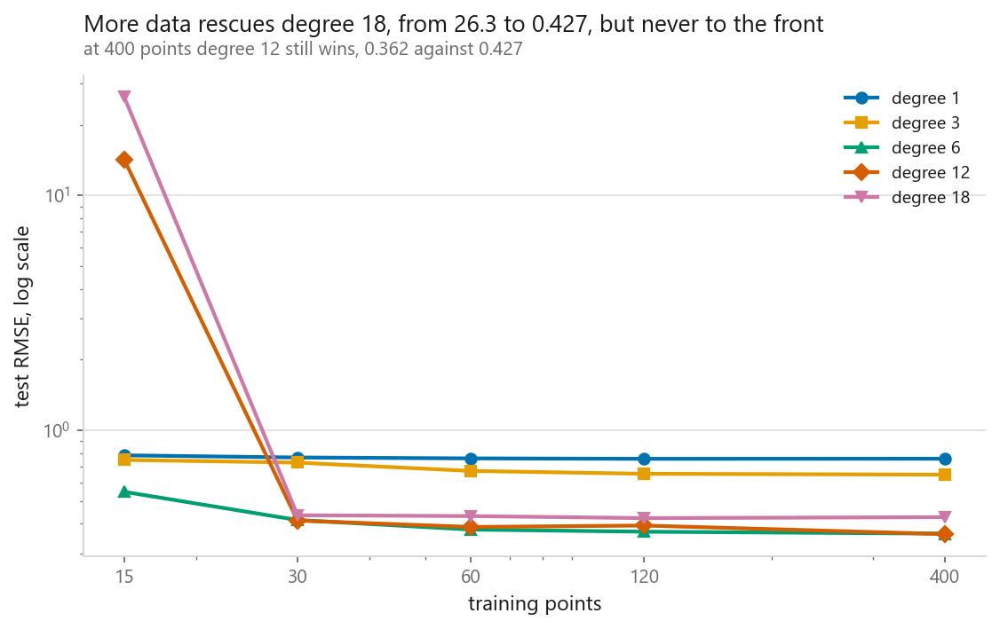
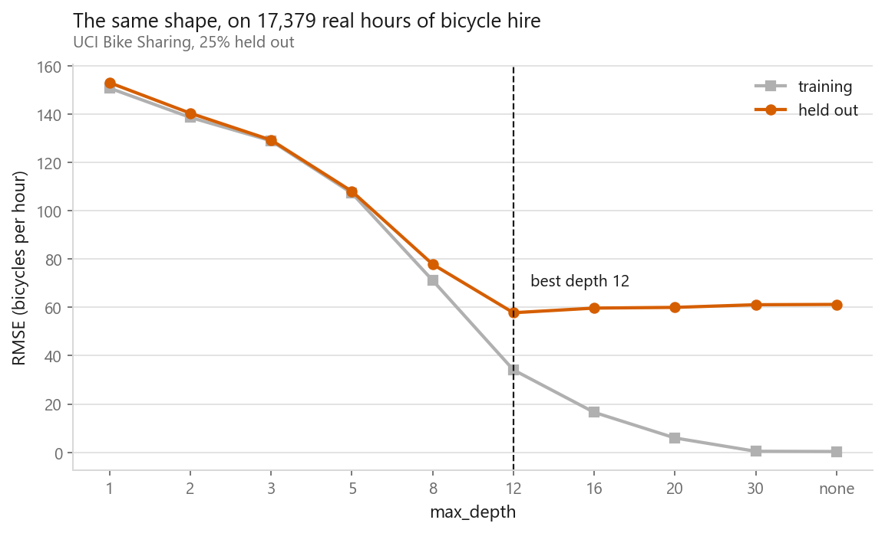

# Overfitting and underfitting

### Seen, rather than described

**[Open the notebook](notebook.ipynb)** · Part 1, Foundations ·
Made by [Elyes Lounissi](https://www.linkedin.com/in/elyes-lounissi/)

| | |
|---|---|
| **What you will learn** | What overfitting looks like on a chart rather than in a definition, how to spot it from two numbers, what the bias-variance tradeoff means concretely, and how more data moves the line |
| **You should already know** | [Linear regression](../../02-regression/01-linear-regression/) |
| **Datasets** | UCI Bike Sharing, plus a small synthetic curve |
| **Runtime** | About a minute on a laptop CPU |

---

## The one sentence version

**Underfitting** is a model too simple to capture the pattern, wrong on training
data and wrong on new data, in the same way.

**Underfitting** is visible. **Overfitting** is not: the model is *right* on the
training data and wrong on new data, and the gap between those two is the only
warning you get.

| Degree | Train RMSE | Test RMSE | |
|---|---|---|---|
| 1 | 0.720 | 0.777 | underfitting |
| 4 | 0.250 | **0.409** | about right |
| 20 | 0.302 | **146.102** | overfitting |

Degree 20 has a test error 357 times worse than degree 4, and it does not even
buy that with a better fit to the training data: 0.302 against 0.250. Which is
not what the textbook curve does, and the reason turns out to be worth a section.

## The two numbers that matter

This is the most useful diagnostic in machine learning, and its shape is worth
memorising. Two thirds of it came out as expected.

**Test error falls, bottoms out, then rises.** The turning point, degree 4 here,
is the model you want. **The gap between the lines is the overfitting**, not the
height of either one.

**Training error does not keep falling.** It reaches 0.123 at degree 13 and then
climbs back to 0.302 by degree 20, which every account of this chart says is
impossible: 21 coefficients fitted to 20 points should interpolate them exactly.

The cause is arithmetic rather than statistical. The features are raw powers of
x with x up to 6, so the design matrix at degree 20 has a condition number of
1.1e+21, past what double precision can resolve, and the least-squares driver
inside `LinearRegression` discards small singular values and returns something
that is not the minimiser. Standardise the columns first, which does not change
what functions the model can represent, and the training error drops to 0.041
and the textbook picture comes back.

So: a low training error tells you nothing on its own, and a high one does not
always mean the model is too stiff. Sometimes it means the solver gave up.

## Bias and variance, without the definitions

Each faint line is the same model refitted on a different sample of 20 points.

**Degree 1: high bias, low variance.** The forty fits sit on top of each other,
stable, and all wrong in the same way. Consistently mistaken. Bias² 0.434,
variance 0.048.

**Degree 4 balances them.** Bias² 0.096, variance 0.096.

**Degree 15 does not have low bias, and I expected it to.** The textbook line is
that a flexible model is unreliable one fit at a time but averages out to the
truth. The variance is certainly there, 312903481.348. The bias is there too:
5803716.617, against 0.434 for degree 1, so the most flexible model in the
figure is also the most systematically wrong, by seven orders of magnitude.

Squared bias averages the fits, and an average has no defence against one bad
member. The largest prediction anywhere in that panel is 868921.3, from a single
fit. Take the median of the forty instead of the mean and the same quantity
comes out at 4.925. "Low bias, high variance" assumes the scatter is symmetric;
when it is heavy tailed the flexible model is unstable *and* biased, and those
are one fact seen twice.

High bias is being wrong the same way every time. High variance is being wrong a
different way every time. Degree 15 manages both.

## More data moves the line

| Degree | n=15 | n=400 |
|---|---|---|
| 1 | 0.783 | 0.757 |
| 6 | 0.547 | 0.363 |
| 12 | 14.233 | **0.362** |
| 18 | 26.305 | 0.427 |

At 15 points, degree 18 is a disaster. At 400 it is survivable, and still 18%
behind degree 12. It trails both degree 6 and degree 12 at every sample size
from 30 upwards. More data made the extra flexibility affordable, not free;
closing the last stretch takes
[regularisation](../../02-regression/04-ridge-regression/) instead.

Degree 1 does not improve at all, 0.783 to 0.757, because no amount of evidence
fixes a model that structurally cannot represent the pattern.

**More data cures variance, not bias.**

## The same shape on real data

| max_depth | Train RMSE | Held-out RMSE |
|---|---|---|
| 12 | 34.1 | **57.8** |
| unrestrained | **0.3** | 61.2 |

The unrestrained tree is essentially perfect on data it has already seen, and
worse on data it has not.

## What to do about it

**If you are overfitting**, in order of what to try first: get more data; reduce
flexibility; add [regularisation](../../02-regression/04-ridge-regression/); stop
training earlier; average several models
([bagging](../../04-ensembles/01-bagging/) exists almost entirely for this).

**If you are underfitting**, the list inverts: more flexibility, better features,
less regularisation, longer training.

---

If this chapter was useful, a star on the repository helps other people find it.
The code is yours to use, copy and adapt in your own work, no permission needed.

Made by **Elyes Lounissi** ·
[LinkedIn](https://www.linkedin.com/in/elyes-lounissi/) ·
[pilot.tun@gmail.com](mailto:pilot.tun@gmail.com)

Back to [Part 1](../) · [the curriculum](../../CURRICULUM.md) · [the book](../../README.md)

`#MachineLearning` `#Overfitting` `#BiasVarianceTradeoff` `#Underfitting`
`#Python` `#ScikitLearn` `#DataScience` `#MLTutorial` `#LearnMachineLearning`
