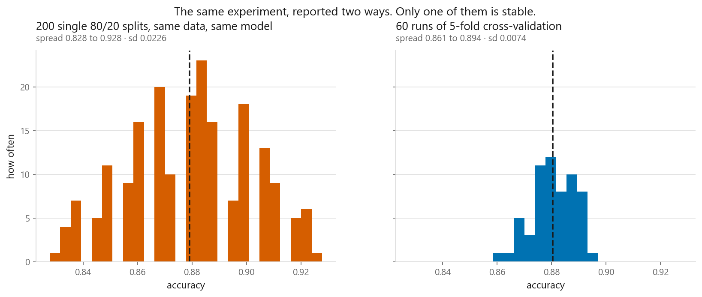
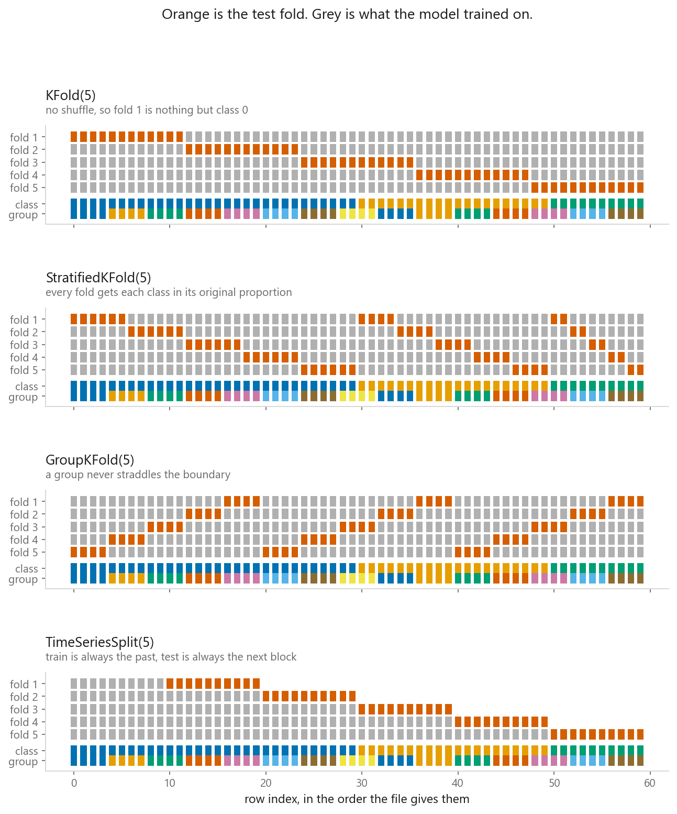
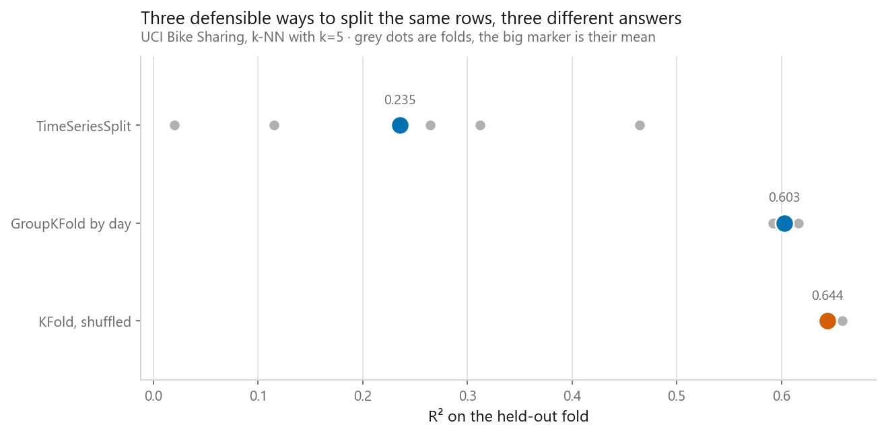
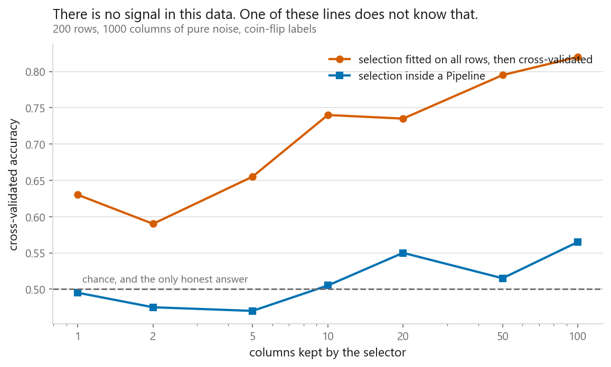

# Cross-validation

### Which flavour to use when, and why the fold boundary is where leaks happen

**[Open the notebook](notebook.ipynb)** · Part 1, Foundations ·
Made by [Elyes Lounissi](https://www.linkedin.com/in/elyes-lounissi/)

| | |
|---|---|
| **What you will learn** | Why one train/test split tells you almost nothing, how KFold, StratifiedKFold, GroupKFold and TimeSeriesSplit differ, when LeaveOneOut is a waste of electricity, what repeated CV buys, and how much a score inflates when preprocessing happens outside the fold |
| **You should already know** | [Train, validation, test](../02-train-validation-test/), [overfitting and underfitting](../03-overfitting-and-underfitting/) |
| **Datasets** | UCI Dry Bean, UCI Bike Sharing, Breast Cancer Wisconsin, plus one matrix of pure noise |
| **Runtime** | Two to three minutes on a laptop CPU |

---

## The number that should scare you

I made 200 rows of Gaussian noise, 1000 columns wide, with coin-flip labels. There
is no signal, so cross-validating a logistic regression on it can only return 0.5.
Selecting the 100 columns most correlated with the label *before* the
cross-validation loop returned **0.8200**: **+0.3200 accuracy over chance,
manufactured out of nothing.** The same selector inside a `Pipeline` returns 0.5650.
Everything else here is about *where* to cut the folds. This is about what you may
do before cutting, and it is the expensive mistake.

## One split is a sample of size one

| Same slice, same tree, only the seed changing | mean | sd | range |
|---|---|---|---|
| Single 80/20 split, 200 seeds | 0.8792 | 0.0226 | 0.1000 |
| 5-fold mean, 60 shuffles | 0.8805 | **0.0074** | 0.0333 |

The centres agree, so a single split is not biased here. It is noisy: **3.0× more
variable** than the cross-validated answer, with a full 10-point spread between the
luckiest and unluckiest seed. Two honest people would disagree and both be right.

## Picking k

| k | Train rows | Mean | Fold sd |
|---|---|---|---|
| 2 | 450 | 0.8522 | 0.0189 |
| 3 | 600 | **0.8844** | 0.0113 |
| 5 | 720 | **0.8844** | 0.0181 |
| 10 | 810 | 0.8778 | 0.0492 |
| 20 | 855 | 0.8711 | 0.0514 |

`k = 2` is the clear loser at 0.8522, because each model only sees half the data.
After that I expected the estimate to climb toward the full-data score as the
training folds grew. It falls instead: 0.8844 at k=3 and k=5, then 0.8778, then
0.8711, while the training set goes from 600 rows to 855.

That whole k=3 to k=20 range is 0.0133 wide, and the table above it measured the
seed-to-seed sd of a single 5-fold mean at 0.0074, with a 0.0200 gap between the
luckiest and unluckiest run. **Past k=3, changing k moves the answer less than
changing the seed does.** The column that behaves is the time, which grows
linearly in k, and that is the real reason to stop at five or ten.

The fold sd column is misread twice. It rises from k=3 onwards, 0.0113 to 0.0514,
because each test fold is smaller and its score noisier, a property of fold size
and not evidence that large k is unreliable. But it is not monotone: k=2 sits at
0.0189, above k=3, because a standard deviation of two numbers is barely a
standard deviation. Those scores are also correlated, since any two training sets
share about (k−2)/(k−1) of their rows, so sd/√k is not a valid standard error.
Treat the spread as a smell test.

## Choosing a splitter

**Stratify for classification.** BOMBAY is the rarest Dry Bean variety, 35 rows out
of the 900-row slice. Across ten test folds, plain `KFold(10, shuffle=True)` gave
each fold **1 to 7** BOMBAY rows; `StratifiedKFold` gave **3 to 4**. Per-class
recall from a fold holding one example of a class is computed from nothing.

**Group when rows repeat.** Bike Sharing is hourly: 17,379 rows, 730 days, 23.8
rows per day, so 24 rows share one day's weather and demand level.

| Same k-NN pipeline, three ways | Mean R² | The question it answers |
|---|---|---|
| `KFold`, shuffled | **0.6441** | Can you fill in a missing hour from a day you already saw? |
| `GroupKFold` by day | 0.6029 | Can you handle a day you have never seen? |
| `TimeSeriesSplit` | **0.2353** | Can you handle next month? |

Shuffling inflates R² by 0.0412 over the grouped split and by 0.4088 over the time
split. Nothing errors. The number just comes back looking reasonable and describing
a model that does not exist. The time-split folds run
`[0.115, 0.265, 0.020, 0.312, 0.464]`, and that spread is expected: fold 1 trains
on a fifth of the history, fold 5 on nearly all of it.

## LeaveOneOut, and repeated CV

| Breast Cancer, logistic regression | Fits | Mean | Fold sd |
|---|---|---|---|
| 5-fold | 5 | 0.9789 | 0.0142 |
| 10-fold | 10 | 0.9772 | 0.0193 |
| LeaveOneOut | **569** | 0.9789 | 0.1437 |

The mean is fine. Everything else is not. LeaveOneOut's fold scores take exactly
**2 distinct values, 0 and 1**, because a one-row test set is either right or
wrong. The one thing cross-validation gives you beyond a point estimate is gone.

And it costs 569 fits with no bulk discount: the notebook prints milliseconds per
fit alongside the totals, and they are the same for all three schemes, so
LeaveOneOut takes about what 114× as many fits should take.

That timing needed a second attempt. My first version timed everything with
`n_jobs=-1` and reported that 569 fits finished faster than five, which is not a
fact about LeaveOneOut. It is the fixed cost of standing up joblib's worker pool
and shipping the data to it, paid once per `cross_val_score` call and spread over
five fits in one case and 569 in the other. The notebook now times on one thread
and keeps the parallel run beside it, because **benchmarking a cheap operation
under `n_jobs=-1` measures the scheduler**, and that is worth seeing once.

Repeating fixes a different problem. Across ten repeats of 5-fold on the bean
slice, the best single run scored 0.8889 and the worst 0.8689: that **0.0200 gap
is the accuracy you can claim by trying seeds until you like the answer.**
Averaging the ten runs cuts the spread from 0.0061 to 0.0019.

## The leak, measured

Pure noise, 200 rows, 1000 columns, balanced labels. The honest score is 0.5.

| Columns kept | Selector outside the loop | Selector in a `Pipeline` | Inflation |
|---|---|---|---|
| 1 | 0.6300 | 0.4950 | +0.1350 |
| 10 | 0.7400 | 0.5050 | +0.2350 |
| 50 | 0.7950 | 0.5150 | +0.2800 |
| 100 | **0.8200** | 0.5650 | +0.2550 |

The piped line lands where it should. The other is a paper that passes review.

Not every leak costs the same. Fitting a `StandardScaler` on everything before
cross-validating Breast Cancer scored 0.9789, identical to the piped version, a
difference of **+0.0000**, because what leaks is a mean and a standard deviation
pooled over hundreds of rows. Fix both anyway; `Pipeline` is free. But knowing
which leaks are expensive tells you where to look when a result seems too good.

Hyperparameters leak too. A 24-point SVC grid on 150 Breast Cancer rows reported
its best cross-validated score as **0.9800**. Nested CV returned **0.9667**, a gap
of 0.0133. Grid scores ranged 0.6267 to 0.9800, and the maximum of 24 noisy numbers
sits above their true values by construction. The gap grows with grid size.

## Cheat sheet

| Situation | Splitter |
|---|---|
| Regression, rows independent | `KFold(5 or 10, shuffle=True, random_state=...)` |
| Classification | `StratifiedKFold`, always, and especially with a rare class |
| Repeated measurements: patients, sessions, days, devices | `GroupKFold` or `StratifiedGroupKFold` |
| Anything you will run on future data | `TimeSeriesSplit`, or a fixed cut by date |
| Under about 100 rows | `LeaveOneOut`, accepting fold scores of 0 and 1 |
| Two models closer than the fold noise | `RepeatedStratifiedKFold` |
| Reporting a tuned model's score | Nested CV, or a test set held back from the start |
| Any preprocessing at all | `Pipeline`, every time, no exceptions |

---

If this chapter was useful, a star on the repository helps other people find it.
The code is yours to use, copy and adapt in your own work, no permission needed.

Made by **Elyes Lounissi** ·
[LinkedIn](https://www.linkedin.com/in/elyes-lounissi/) ·
[pilot.tun@gmail.com](mailto:pilot.tun@gmail.com)

Back to [Part 1](../) · [the curriculum](../../CURRICULUM.md) · [the book](../../README.md)

`#MachineLearning` `#CrossValidation` `#ModelEvaluation` `#DataLeakage`
`#ScikitLearn` `#Pipeline` `#Python` `#DataScience` `#MLTutorial` `#KFold`
