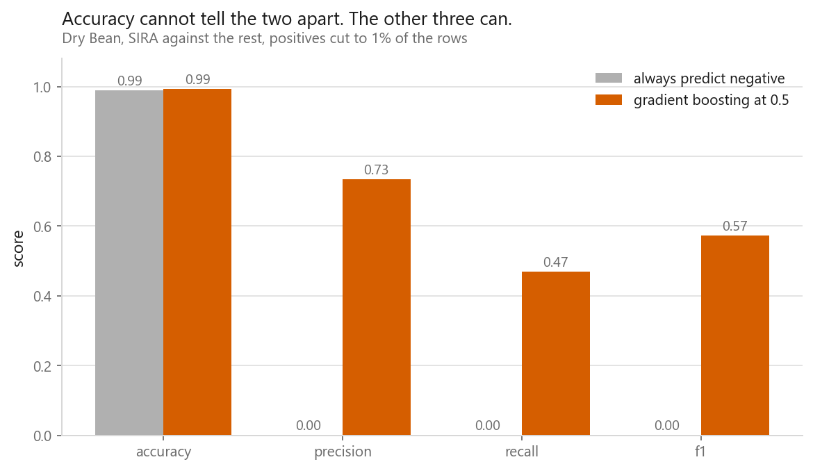
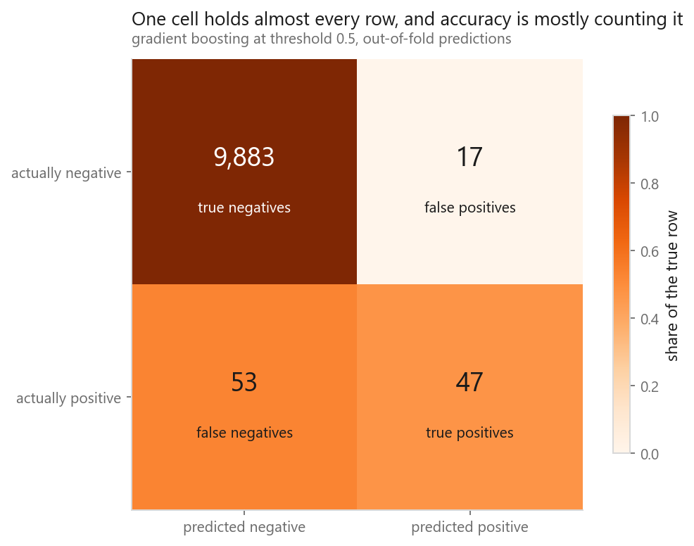
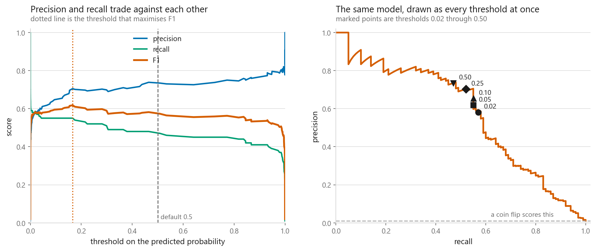
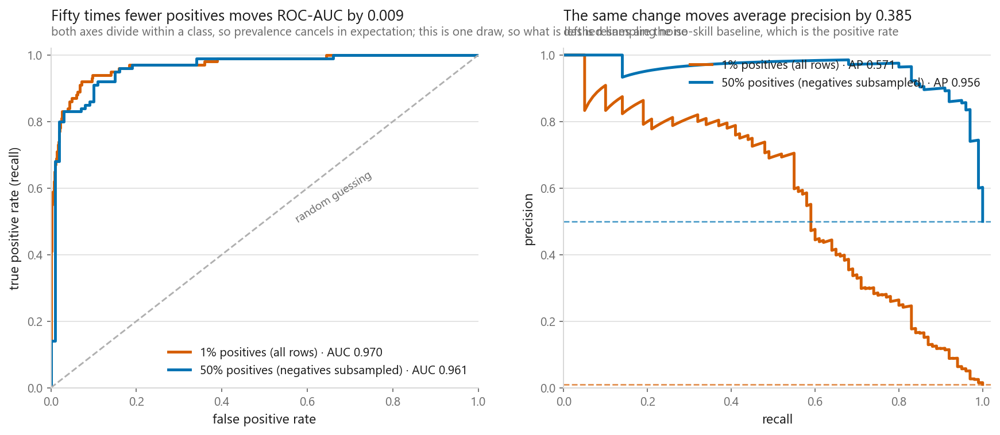
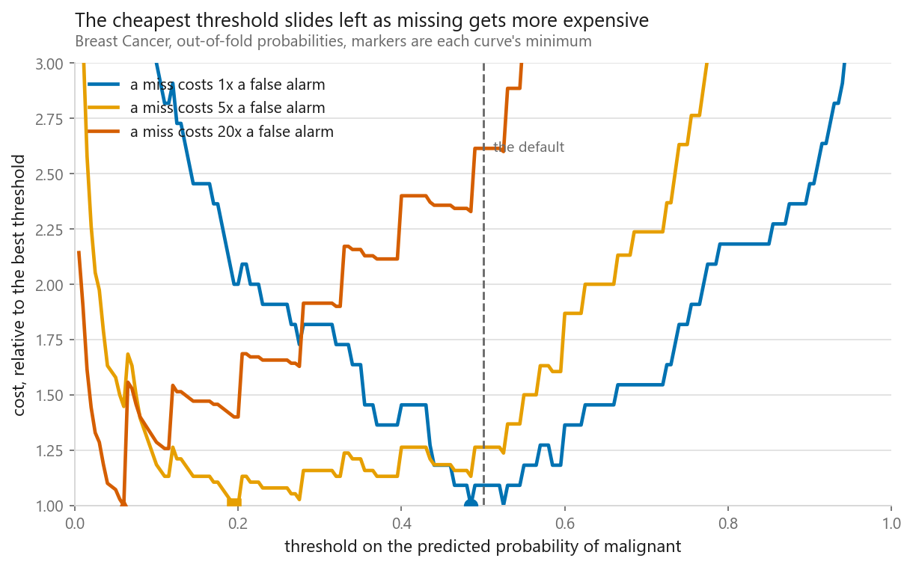

# Metrics for classification

### Accuracy, precision, recall, F1, ROC-AUC, PR-AUC, and when each one lies to you

**[Open the notebook](notebook.ipynb)** · Part 1, Foundations ·
Made by [Elyes Lounissi](https://www.linkedin.com/in/elyes-lounissi/)

| | |
|---|---|
| **What you will learn** | Why accuracy collapses on unbalanced data, how every other metric falls out of the confusion matrix, why precision and recall belong to a threshold rather than to a model, when to read a ROC curve and when to read a precision-recall curve, what macro, micro and weighted averaging do, and how to pick a threshold from the cost of each mistake |
| **You should already know** | [Train, validation, test](../02-train-validation-test/), [cross-validation](../04-cross-validation/) |
| **Datasets** | UCI Dry Bean, Wisconsin Breast Cancer |
| **Runtime** | Under two minutes on a laptop CPU |

---

## The number that should scare you

One array of out-of-fold scores, one model, evaluated twice: on all 10,000 rows at
1% positives, and on balanced subsets that keep every positive plus an equal
number of negatives, averaged over 20 draws.

| | ROC-AUC | PR-AUC | PR baseline |
|---|---|---|---|
| 1% positives, all 10,000 rows | **0.9699** | **0.5708** | 0.0100 |
| 50% positives, mean of 20 draws | **0.9699** ± 0.0045 | **0.9728** ± 0.0046 | 0.5000 |

Averaged over twenty draws ROC-AUC comes back to the same 0.9699 it started at.
PR-AUC moves by 0.4020. Same predictions, same ranking, and the only thing that
changed is how many negatives were in the room. Report ROC-AUC on a rare-positive
problem and you report a number blind to what makes it hard.

Draw by draw ROC-AUC does move a little, and it is worth knowing by how much: the
single draw plotted further down went 0.9699 to 0.9614. That 0.0085 is under two
standard deviations of the resampling noise. So the honest statement is that a
fifty-fold change in prevalence moves ROC-AUC by thousandths and PR-AUC by four
tenths, not that ROC-AUC is frozen.

## Accuracy on a 1% problem

| 10,000 Dry Bean rows, 100 SIRA positives (1.00%) | Accuracy | Precision | Recall | F1 |
|---|---|---|---|---|
| Always predict negative | **0.990** | 0.0000 | 0.00 | 0.0000 |
| Gradient boosting at 0.5 | 0.993 | 0.7344 | 0.47 | 0.5732 |

The grey model has no parameters and never looks at a feature. Accuracy pays it
0.990 for refusing to answer the question, and the real model beats it by 0.003.
The other three columns separate the two immediately, because they ignore the pile
of true negatives that accuracy is mostly counting.

Precision is *undefined* when a model flags nothing: the printed 0.0000 is
scikit-learn's `zero_division=0` convention, not a measurement.

## The confusion matrix is the only primitive

| | Predicted negative | Predicted positive |
|---|---|---|
| **Truly negative** | TN 9,883 | FP 17 |
| **Truly positive** | FN 53 | TP 47 |

Every metric here is arithmetic on those four counts, and computing them by hand
reproduces scikit-learn to six decimals: accuracy 0.993000, precision 0.734375,
recall 0.470000, f1 0.573171, specificity 0.998283, false positive rate 0.001717.
That last one sounds excellent. It is 17 false alarms against 47 real catches.
Rates hide counts, and on-call works in counts.

## Threshold is a choice, not a property

| Same model, same scores, same ranking | Flagged | Precision | Recall | F1 |
|---|---|---|---|---|
| threshold 0.02 | 98 | 0.5816 | 0.57 | 0.5758 |
| threshold 0.10 | 84 | 0.6548 | 0.55 | 0.5978 |
| threshold 0.50 | 64 | 0.7344 | 0.47 | 0.5732 |

The best-F1 threshold is **0.1662**, giving precision 0.7051, recall 0.5500 and
F1 **0.6180**, 0.0448 above what the default 0.5 delivers, from changing one
number and retraining nothing. So "this model has precision 0.73" is an incomplete
sentence. The complete one names a threshold.

## ROC against precision-recall

This figure is **one** balanced draw. The lead table at the top averages twenty
draws, so the two are not the same measurement. In the draw plotted here ROC-AUC
reads 0.970 against 0.961 and average precision 0.571 against 0.956. Over twenty
draws the ROC gap averages to zero and the PR gap does not.

Both ROC axes divide within a class, so neither moves *in expectation* when
prevalence changes, and what is left is sampling noise. Precision's denominator
mixes TP and FP, so it depends on how many negatives exist to generate false
positives from, and that is not noise. PR-AUC is also scored against a moving
floor: its baseline is the positive rate, 0.0100 here against 0.5000 balanced.

ROC-AUC has a reading with no curve in it. Enumerating all **990,000**
positive-negative pairs gives **0.969935**, matching scikit-learn exactly: it is
the probability a random positive outranks a random negative. Report both: ROC-AUC
to compare rankings, PR-AUC to judge whether the ranking is any use at the rate
your positives actually occur.

## Macro, micro and weighted

| Full Dry Bean, 7 varieties, logistic regression | Precision | Recall | F1 |
|---|---|---|---|
| macro | 0.9362 | 0.9341 | 0.9351 |
| micro | 0.9234 | 0.9234 | 0.9234 |
| weighted | 0.9238 | 0.9234 | 0.9235 |
| plain accuracy | | | **0.9234** |

Micro precision, micro recall and accuracy come out **identical**, and that is not
a coincidence: with one predicted label per row every mistake is a false positive
for one class and a false negative for another, so ΣFP = ΣFN and all three formulas
reduce to the fraction of rows that were right. Micro-F1 next to accuracy prints
one number twice.

Macro sits 0.0117 F1 *above* micro, which is the interesting direction: the
smallest class is the easiest. BOMBAY, 522 rows, scores a perfect 1.000 precision
and 1.000 recall, while the hardest class is SIRA at 0.866 F1 with 2,636 rows.
Rarity and difficulty are separate things.

## Choosing the threshold from what mistakes cost

Breast Cancer, 569 rows, 212 malignant (37.3%), ROC-AUC 0.9953, PR-AUC 0.9942.
Theory puts the cost-optimal threshold at c_FP / (c_FP + c_FN). I swept and measured.

| Cost of a miss | Theory threshold | Measured best | Cost at best | Cost at 0.50 | Excess at 0.50 |
|---|---|---|---|---|---|
| 1:1 | 0.5000 | 0.485 | 0.0193 | 0.0211 | +9.1% |
| 5:1 | 0.1667 | 0.195 | 0.0668 | 0.0844 | +26.3% |
| 20:1 | 0.0476 | 0.060 | 0.1230 | 0.3216 | **+161.4%** |

Theory and measurement land close, which quietly confirms the logistic model's
probabilities mean roughly what they say. The last column is the price of the
default: when a missed malignancy costs 20 times a false alarm, keeping 0.5 costs
**2.6× the achievable minimum**. Nothing about the model was wrong. One number was,
and it is a fitted parameter like any other, so pick it on validation data.

## Cheat sheet

| | |
|---|---|
| **Accuracy** | Fine when classes are balanced and mistakes cost the same. Otherwise compare it against the majority-class rate first |
| **Precision / recall** | Of what I flagged, how much was real; of what was real, how much I caught. Precision is undefined when nothing is flagged |
| **F1** | Harmonic mean of the two. A default when costs are unknown, a mistake when they are known |
| **ROC-AUC** | Probability a random positive outranks a random negative. Threshold-free and prevalence-free |
| **PR-AUC** | Baseline is the positive rate, so read it against that baseline, not against 1.0 |
| **Rare positives** | Report PR-AUC. ROC-AUC will look fine while the alert queue is mostly noise |
| **Multiclass** | Macro treats classes equally, micro equals accuracy for single-label problems, weighted sits between |
| **Threshold** | Set it from c_FP/(c_FP+c_FN) or a measured cost sweep, on validation data, never on test |

---

If this chapter was useful, a star on the repository helps other people find it.
The code is yours to use, copy and adapt in your own work, no permission needed.

Made by **Elyes Lounissi** ·
[LinkedIn](https://www.linkedin.com/in/elyes-lounissi/) ·
[pilot.tun@gmail.com](mailto:pilot.tun@gmail.com)

Back to [Part 1](../) · [the curriculum](../../CURRICULUM.md) · [the book](../../README.md)

`#MachineLearning` `#Metrics` `#PrecisionRecall` `#ROCAUC` `#ClassImbalance`
`#Python` `#ScikitLearn` `#DataScience` `#MLTutorial` `#ModelEvaluation`
