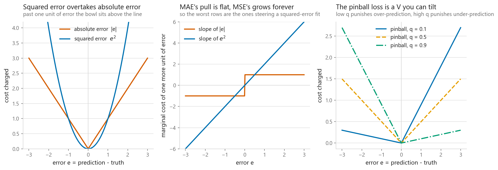
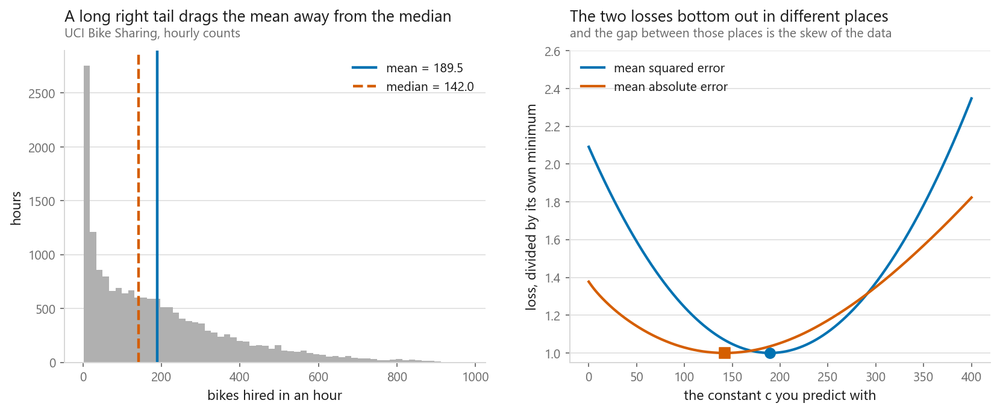
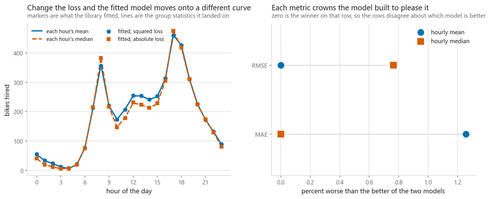
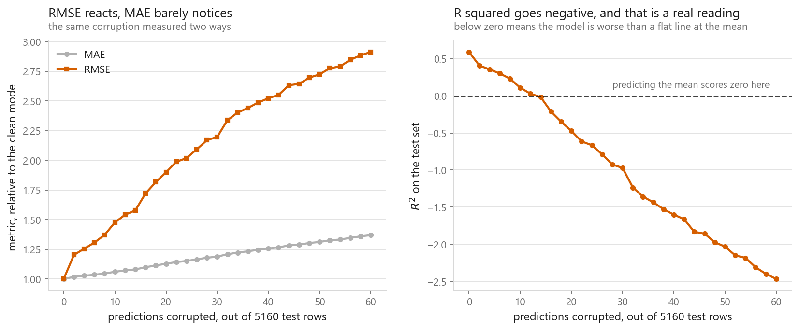
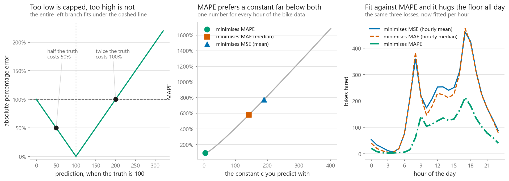

# Metrics for regression

### What each metric is willing to sacrifice to get the number it wants

**[Open the notebook](notebook.ipynb)** · Part 1, Foundations ·
Made by [Elyes Lounissi](https://www.linkedin.com/in/elyes-lounissi/)

| | |
|---|---|
| **What you will learn** | Why minimising MAE gives you the median and MSE gives you the mean, how a handful of rows takes over RMSE, what a negative R squared actually says, and the two ways MAPE breaks |
| **You should already know** | [Metrics for classification](../05-classification-metrics/), [cross-validation](../04-cross-validation/) |
| **Datasets** | California Housing (20,640 rows), UCI Bike Sharing (17,379 rows) |
| **Runtime** | Under a minute on a laptop CPU |

---

## The result I would lead with

I fitted three models of hourly bike hires from the hour of the day alone. The
only difference between them is the loss they were fitted under.

| Per-hour model | MAE | RMSE | R squared | MAPE | Mean bias |
|---|---|---|---|---|---|
| Hourly mean | 88.0995 | 128.0650 | 0.5015 | 1.3600 | 0.0000 |
| Hourly median | 87.0070 | 129.0445 | 0.4938 | 1.1639 | -8.5223 |
| Hourly MAPE-optimal | 118.1663 | 184.0993 | **-0.0302** | **0.6543** | **-106.4775** |

The MAPE-optimal model wins on MAPE by a wide margin (0.6543 against 1.3600),
and it is the worst model on the table by every other reading. Its R squared is
below zero, meaning it is beaten by a flat line at the mean, and it sits an
average of 106 bikes per hour under the truth.

Nobody chose to under-forecast. The metric did, while reporting a number that
looked better than everything else. That is the whole argument for picking a
metric on purpose.

## The loss shapes

MAE charges a fixed price per unit of error. MSE charges a price that grows with
the error, so the marginal cost of another unit is unbounded. RMSE ranks models
exactly as MSE does; it just puts the number back into the target's units.

## Minimising MSE gives the mean, minimising MAE gives the median

Sweeping a single constant $c$ across the bike counts and reading off the two
minima:

| | Grid argmin | Statistic |
|---|---|---|
| MSE | 189.50 | mean 189.46 |
| MAE | 142.00 | median 142.00 |

The gap between the two answers is **47.5 bikes per hour**. On a symmetric target
they would land on top of each other. The bike counts have a skew of 1.277, so
they separate, and that separation is the largest disagreement the choice of
metric can cause.

The pinball loss puts the same fact in a wider frame: minimising $L_q$ over a
constant returns the $q$-th quantile. The sweep recovers them exactly: 9.0 at
$q=0.1$, 40.0 at 0.25, 142.0 at 0.5, 281.0 at 0.75, and 452.0 against an
empirical 451.2 at 0.9.

## The same split, on a model

Asking scikit-learn for `loss="absolute_error"` genuinely fits the conditional
median. The mean absolute distance from the fitted model to each hour's statistic:

| Fitted under | To the hourly means | To the hourly medians |
|---|---|---|
| `squared_error` | **1.06** | 12.73 |
| `absolute_error` | 11.38 | **1.17** |

The median model wins on MAE (87.007 against 88.100) and the mean model wins on
RMSE (128.065 against 129.045). Those are 1.3% and 0.8% gaps, and gaps that small
normally would not be worth a sentence. These two are, because the ordering is not
an empirical finding that a different seed could reverse. Within each hour the mean
is exactly the constant minimising squared error and the median is exactly the
constant minimising absolute error, and summing over hours preserves both. The
mean model must win on RMSE and the median model must win on MAE, on this data
and on any other.

What is data-dependent is the size of the gap, and here it stays small for a reason
worth taking away. Conditioning on the hour has already removed most of the skew that
figure 2 shows, so the two metrics have much less left to disagree about.
**Conditioning on a good feature shrinks the gap between metrics.** On targets
where the skew survives conditioning, insurance claims and repair costs being the
usual examples, the same two models diverge far more than a percent.

Fit under one metric and report the other, and you have handed back a model that
is provably not the best one for the number you printed. Nothing in the output
says so. [02-08](../../02-regression/08-quantile-regression/) takes the same
argument to its conclusion and fits a whole family of conditional quantiles.

## Outliers, and R squared going negative

Before touching anything, squared error is already concentrated on a handful of
rows in a real California fit. The worst 1% of rows carry **17.2% of the squared
error and 5.5% of the absolute error**; the worst 10% carry 60.1% and 31.7%.

Then I break predictions on purpose, a decimal point in the wrong place:

| Corrupted rows | MAE | RMSE | R squared |
|---|---|---|---|
| 0 | 0.5369 | 0.7351 | 0.5912 |
| 10 | 0.5693 | 1.0852 | 0.1091 |
| 26 | 0.6255 | 1.5380 | -0.7895 |
| 60 | 0.7352 | 2.1411 | -2.4680 |

Corrupting **60 of 5,160 test rows (1.16%) multiplies RMSE by 2.91 and MAE by
1.37**. If RMSE jumps overnight on a dashboard, check the data before the model.

Which behaviour you want is a property of the problem, not of the metric. If one
catastrophic error is genuinely catastrophic, you want the number that screams.
If the tail is fat and nothing can be done about it, RMSE will spend its life
reporting on the tail while MAE reports on a normal day.
[02-07](../../02-regression/07-outlier-resistant-regression/) is the other half of
this: what to do when the outliers are in the training data rather than the
scoring set.

R squared has no units, which is why it travels where RMSE cannot. The California
linear fit scores RMSE 0.735 in hundreds of thousands of dollars and R squared
0.591; the bike model scores RMSE 128.065 in bikes per hour and R squared 0.501.
Only the second pair is comparable.

On constant predictors, the mean scores exactly 0.0000 by construction, the
median scores **-0.0685**, and zero scores -1.0911. The median lands below zero
on data where the median is arguably the better summary. A negative R squared
does not mean the model is broken. It means the model is worse than the mean at
the one thing R squared measures.

## MAPE's two failure modes

**The denominator.** With one true zero in four rows, scikit-learn does not
raise; it substitutes machine epsilon and returns **1.126e+15**. The guarded
version on the same rows, skipping that row, returns 0.083.

No bike count in this dataset is zero, and MAPE still misbehaves: the bottom 5%
of counts are **6.22% of rows carrying 31.9% of the total percentage error**, and
the worst single row scores **21,106%** on a true count of 1. MAPE weights every
row by one over its true value, so the smallest rows decide what your model
becomes.

**The asymmetry.** Predicting zero is the worst under-prediction available and it
costs 100%. There is no ceiling on the other side. The constant that minimises
MAPE on the bike counts is **4.00** (against a mean of 189.46 and a median of
142.00), and it matches the 1/y-weighted median exactly.

## Cheat sheet

| Metric | Minimising it gives you | Outliers | Units | Watch out for |
|---|---|---|---|---|
| **MAE** | The conditional median | Barely moves it | Target's | Deliberately blind to a disaster on a few rows |
| **MSE** | The conditional mean | Dominated by them | Target's, squared | Fit with it, report RMSE |
| **RMSE** | Same model as MSE | Dominated by them | Target's | Never comparable across datasets |
| **R squared** | Same model as MSE | Dominated by them | None, so it travels | Goes negative below the mean model |
| **MAPE** | A 1/y-weighted median, far below the median | Sensitive through the denominator | Percent | Undefined at zero, biases models downward |
| **Pinball $L_q$** | The conditional $q$-th quantile | Depends on $q$ | Target's | $q = 0.5$ is half of MAE |

Pick the metric from the shape of what being wrong costs you. Linear cost wants
MAE, convex cost wants RMSE, an over/under asymmetry wants the pinball loss.
Anything else is picking by habit.

---

If this chapter was useful, a star on the repository helps other people find it.
The code is yours to use, copy and adapt in your own work, no permission needed.

Made by **Elyes Lounissi** ·
[LinkedIn](https://www.linkedin.com/in/elyes-lounissi/) ·
[pilot.tun@gmail.com](mailto:pilot.tun@gmail.com)

Back to [Part 1](../) · [the curriculum](../../CURRICULUM.md) · [the book](../../README.md)

`#MachineLearning` `#Regression` `#ModelEvaluation` `#Metrics` `#RMSE`
`#RSquared` `#MAPE` `#QuantileRegression` `#Python` `#ScikitLearn`
