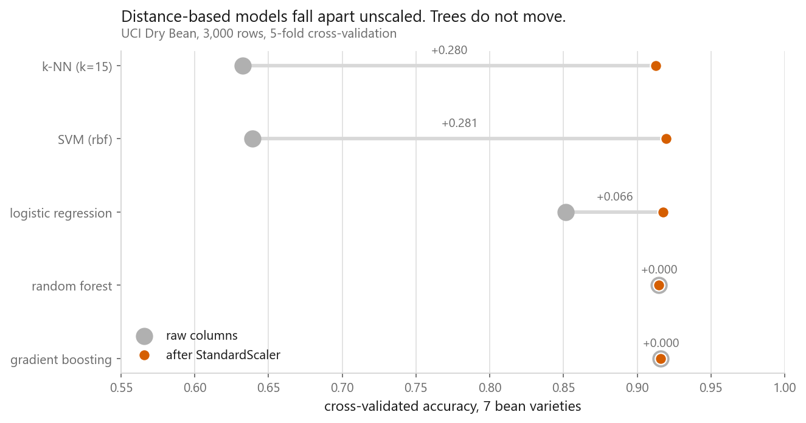
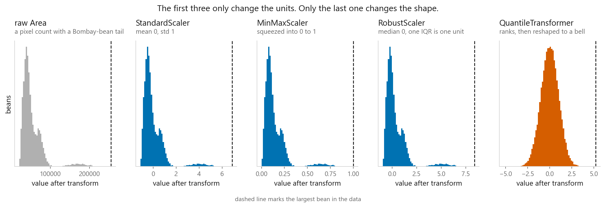
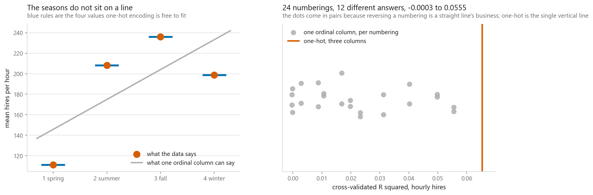
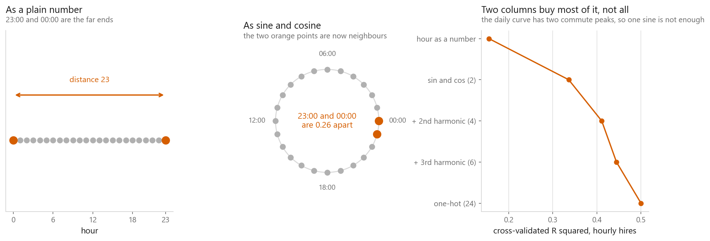
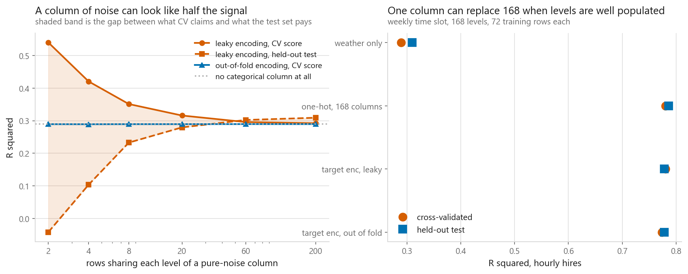

# Feature scaling and encoding

### Getting the columns into a shape the model can actually read

**[Open the notebook](notebook.ipynb)** · Part 1, Foundations ·
Made by [Elyes Lounissi](https://www.linkedin.com/in/elyes-lounissi/)

| | |
|---|---|
| **What you will learn** | Which models need scaling and which cannot tell the difference, what the four scalers do to a column with a long tail, why ordinal encoding invents an order that was never in the data, how to put a cyclical column on a circle, and how target encoding leaks the answer if you compute it in the wrong place |
| **You should already know** | [Cross-validation](../04-cross-validation/), [k-nearest neighbours](../../03-classification/02-k-nearest-neighbours/), [linear regression](../../02-regression/01-linear-regression/) |
| **Datasets** | UCI Dry Bean, UCI Bike Sharing |
| **Runtime** | Under two minutes on a laptop CPU |

---

## Two columns out of sixteen own the distance

Four thousand random pairs of Dry Bean rows, squared per-column gap, share of
the total squared Euclidean distance:

| Column | Share, raw table |
|---|---|
| ConvexArea | 50.7632% |
| Area | 49.2335% |
| Perimeter | 0.0026% |
| The other thirteen together | **0.0007%** |

`Area` and `ConvexArea` are close to the same measurement, so a nearest-neighbour
search on the raw table is a search on bean size and nothing else — every ratio,
every shape factor, every eccentricity ignored. The widest column's standard
deviation is **49,968,404x** the narrowest's. After `StandardScaler` the largest
share is MinorAxisLength at **6.4743%** and the smallest ShapeFactor4 at
**5.8836%**, against an equal split of 6.2500%. Scaling adds no information. It
stops the units from deciding which columns count.

## Which models care, measured



Same seven-class bean problem, 3,000 stratified rows, cross-validated accuracy:

| Model | Raw | Scaled | Change |
|---|---|---|---|
| k-NN (k=15) | 0.6327 | 0.9123 | **+0.2797** |
| SVM (rbf) | 0.6390 | 0.9197 | **+0.2807** |
| Logistic regression | 0.8517 | 0.9173 | +0.0657 |
| Random forest | 0.9147 | 0.9147 | **+0.0000** |
| Gradient boosting | 0.9160 | 0.9160 | **+0.0000** |

The two tree ensembles print a change of **exactly zero**, not a small one. A
split asks whether a column is above a threshold, and a monotone transform moves
the threshold by the same amount it moves the data, so the row ordering and
therefore the tree are untouched. Logistic regression fails differently:

```
iterations used, raw columns : 1000  (the cap is 1000)
iterations used, scaled      : 73
largest coefficient, raw     : 1.594e-01
largest coefficient, scaled  : 3.113e+00
```

It hit the cap. It did not find a bad answer, it ran out of budget looking. That
is also why a penalty on the coefficients only makes sense on scaled columns:
the penalty charges every coefficient the same rate, and an unscaled coefficient
is large or small for reasons of units alone.

## The four scalers barely differ from each other



Distance from the median to the largest bean in interquartile ranges, and k-NN
accuracy under each transform:

| | (max - median) / IQR | k-NN accuracy |
|---|---|---|
| Raw `Area`, no scaling | 8.397 | 0.6327 |
| StandardScaler | 8.397 | 0.9123 |
| MinMaxScaler | 8.397 | 0.9090 |
| RobustScaler | 8.397 | **0.9157** |
| QuantileTransformer | **3.822** | 0.9073 |

The ratio is identical for the raw column and all three affine scalers. An
affine transform cannot move a point relative to the rest of the column, so
**none of them does anything about an outlier** — they only decide what one unit
means. `QuantileTransformer` keeps the ranks and throws the values away, which
is why its number moves. Spread across the four accuracies: **0.0083**. Gap from
not scaling at all: **0.2747**, thirty-three times as large. Whether you scale
matters enormously; which scaler you pick is nearly a coin flip.

## The ordering you did not mean to invent



Bike Sharing hands you categories already converted to integers, with no warning
that they are labels. Mean hourly hires by season code: spring **111.1**, summer
**208.3**, fall **236.0**, winter **198.9** — real, and not monotone. Given the
raw code a model has one coefficient, so it must fit a straight ramp through
four points that are not on a line. `season` has four levels, so there are
exactly 24 ways to number them and none is more correct than another.

| Encoding | R squared |
|---|---|
| season, ordinal, worst of 24 numberings | -0.0003 |
| season, ordinal, average of 24 | 0.0215 |
| season, ordinal, best of 24 | 0.0555 |
| season, one-hot | **0.0653** |
| month, calendar order | **0.0142** |
| month, best of 30 random numberings | **0.0298** |
| month, one-hot (12 columns) | 0.0739 |

One-hot beats the *best* ordinal numbering of `season` by +0.0098 and is
invariant to a naming decision that carries no information. The month rows are
the sharper result: **calendar order lost to random relabellings**, scoring less
than half the best arbitrary one. The yearly pattern is a hump, a straight line
through a hump is nearly flat, and any numbering that happens to split busy
months from quiet ones does better than the honest one. A real ordering is not
automatically a useful one to a linear term.

## Hour of day is a circle



| Encoding | Columns | R squared |
|---|---|---|
| Hour as a number | 1 | 0.1551 |
| sin and cos | 2 | 0.3363 |
| + 2nd harmonic | 4 | 0.4111 |
| + 3rd harmonic | 6 | 0.4446 |
| One-hot | 24 | **0.5003** |

```
as a number: distance 23:00 to 00:00 = 23.000  |  00:00 to 12:00 = 12.000
as sin/cos : distance 23:00 to 00:00 =  0.261  |  00:00 to 12:00 =  2.000
```

Two numbers hold the whole idea: as a plain number, 23:00 and midnight are the
furthest apart of any pair in the column. One-hot still wins the score, because
Washington's demand has a morning peak and an evening peak while one sine wave
has one hump. The harmonics close most of that gap with a quarter of the columns.

## Target encoding and its leak



Day of week crossed with hour gives 168 weekly slots, 72 training rows each.
Weather alone scores CV 0.2894 and held-out 0.3094. One-hot over the 168 levels
scores 0.7802 and 0.7859; target encoding computed leakily scores 0.7802 and
0.7779; computed out of fold, 0.7736 and 0.7780. All three look fine, which is
what makes the mistake durable. So I add a column of pure noise — a random
ticket number — and vary how many rows share one:

| Rows per level | Levels | Leaky CV | Leaky test | Out-of-fold CV | Corr, leaky | Corr, safe |
|---|---|---|---|---|---|---|
| 2 | 6,082 | **0.5395** | **-0.0415** | 0.2893 | 0.6575 | -0.0029 |
| 8 | 1,520 | 0.3509 | 0.2327 | 0.2893 | 0.3544 | 0.0023 |
| 20 | 608 | 0.3157 | 0.2794 | 0.2893 | 0.2157 | -0.0091 |
| 200 | 60 | 0.2920 | 0.3090 | 0.2894 | 0.0734 | 0.0090 |

A column containing no information reports a cross-validated **0.5395** against
a baseline of 0.2894, and the test set pays back **-0.0415**, worse than the
model that never saw it. The out-of-fold column never leaves the baseline,
0.2891 to 0.2894 across the whole sweep, because a row's encoding never saw
that row's target.

## Cheat sheet

| | |
|---|---|
| **Scale for** | k-NN, SVM, PCA, k-means, neural nets, any penalised linear model. Anything using a distance or a gradient |
| **Do not bother for** | Trees and tree ensembles. The change was 0.0000, not small |
| **Default scaler** | `StandardScaler`. The four differed by 0.0083 and beat no scaling by 0.2747 |
| **Long tail** | `RobustScaler`. It does not remove the outlier — nothing affine can |
| **Always** | Fit the scaler inside a `Pipeline` so it never sees the validation fold |
| **Unordered categories** | One-hot. Invariant to how the levels happened to be numbered |
| **Ordered categories** | Ordinal only when the order is real *and* the spacing means something |
| **Cyclical** | sin and cos of the angle, plus harmonics if the shape has more than one peak |
| **High cardinality** | Target encoding computed out of fold. `TargetEncoder` in a `Pipeline` does it for you |

---

Made by **Elyes Lounissi** ·
[LinkedIn](https://www.linkedin.com/in/elyes-lounissi/) ·
[pilot.tun@gmail.com](mailto:pilot.tun@gmail.com)

Back to [Part 1](../) · [the curriculum](../../CURRICULUM.md) · [the book](../../README.md)

`#MachineLearning` `#FeatureEngineering` `#DataPreprocessing` `#ScikitLearn`
`#OneHotEncoding` `#TargetEncoding` `#DataLeakage` `#Python` `#DataScience`
`#MLTutorial`
