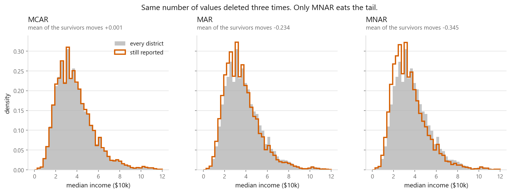
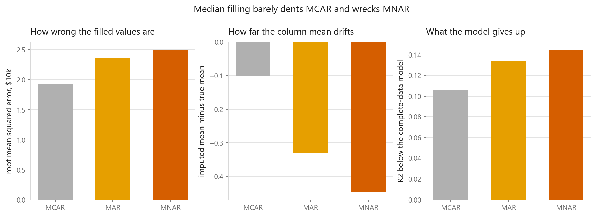
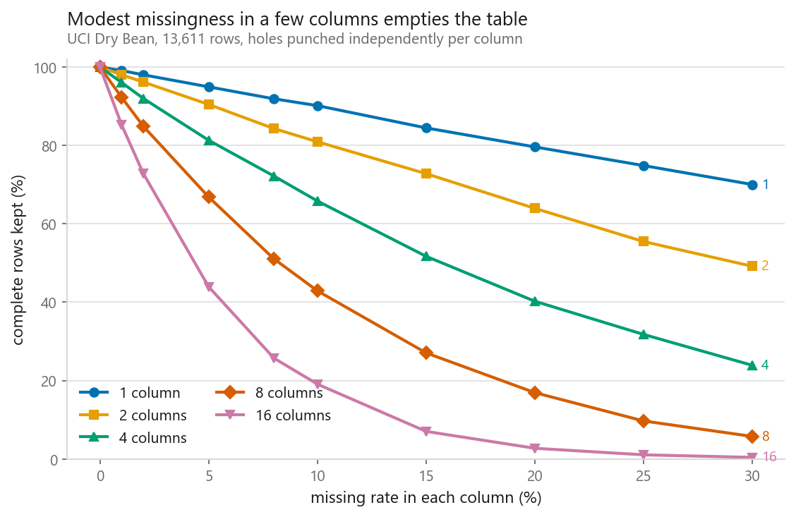
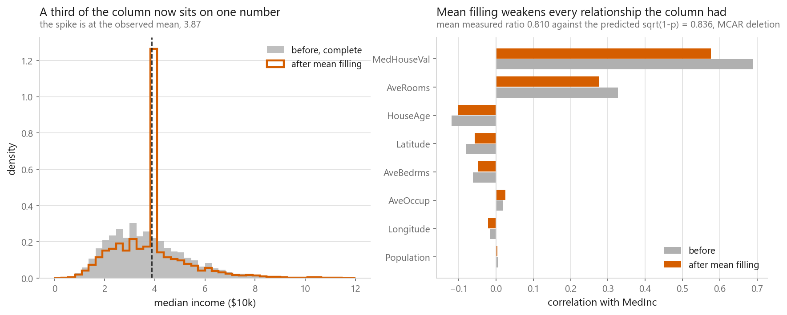
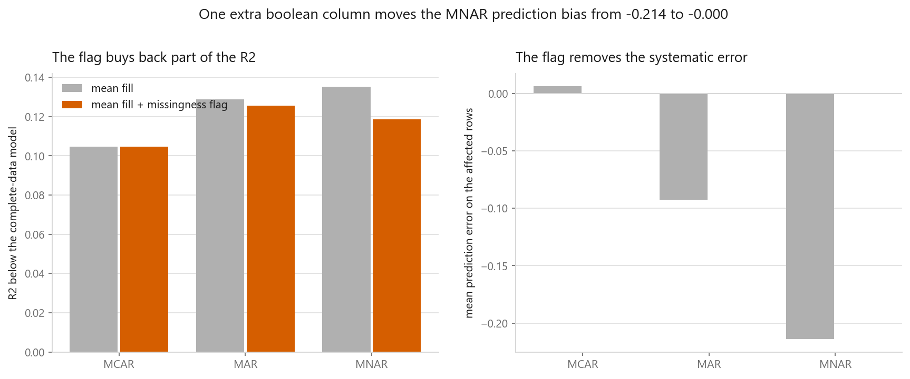

# Missing data

### Three mechanisms, deleted on purpose so the damage can be measured

**[Open the notebook](notebook.ipynb)** · Part 1, Foundations ·
Made by [Elyes Lounissi](https://www.linkedin.com/in/elyes-lounissi/)

| | |
|---|---|
| **What you will learn** | Why the missingness mechanism decides whether a fix is safe, what `dropna()` costs, how constant filling shrinks a column, what a missingness indicator buys, and why the imputer belongs inside the fold |
| **You should already know** | [Cross-validation](../04-cross-validation/), [feature scaling and encoding](../07-feature-scaling-and-encoding/) |
| **Datasets** | California Housing (20,640 rows), UCI Dry Bean |
| **Runtime** | Two to three minutes on a laptop CPU |

---

## The result I would lead with

The usual framing is that MCAR is harmless and MNAR is a catastrophe. I deleted
30% of `MedInc` three times, once under each mechanism, filled with the median,
and measured what each cost. The complete-data model scores R squared 0.6037.

| Mechanism | Fill error | Mean bias | R squared | R squared lost | MedInc coefficient |
|---|---|---|---|---|---|
| MCAR | 1.9256 | -0.1008 | 0.4976 | 0.1061 | 0.2987 |
| MAR | 2.3753 | -0.3313 | 0.4699 | 0.1338 | 0.2589 |
| MNAR | 2.5041 | -0.4473 | 0.4589 | 0.1448 | 0.2407 |

MNAR is worse, but only by **1.4x on R squared lost and 1.3x on fill error**.
The bigger number is the one nobody mentions: MCAR, the mechanism everyone calls
safe, still cost 0.1061 of R squared, about a sixth of the model, purely from
filling a third of one column with a constant. Getting the mechanism right does
not rescue you from the missing rate.

The coefficient column tells the sharper story. The true MedInc coefficient is
0.4367; under MNAR the model learns 0.2407. Squashing every high income to the
median flattens the relationship, and nothing in a score labelled "R squared"
tells you it happened.

## Which values disappeared

One deletion rule, three drivers: noise for MCAR, `AveRooms` for MAR, the column
itself for MNAR. All three delete about the same amount: 30.14%, 30.38% and
30.19% of 20,640 rows. The MedInc/AveRooms correlation is **+0.327**, and that is
what makes MAR partly recoverable later.

Against a true mean of 3.871, the survivors average 3.872 under MCAR, 3.637 under
MAR and 3.525 under MNAR. Only MCAR left the distribution's shape alone.

## Dropping rows

With $k$ columns each losing a fraction $p$, the complete fraction is $(1-p)^k$,
and the measured survivors track it: 65.81% for 4 columns at 10% (theory 65.61%),
42.89% for 8 at 10% (43.05%), 43.92% for 16 at 5% (44.01%), 2.72% for 16 at 20%
(2.81%).

Five per cent missing in each of sixteen columns sounds clean and leaves 43.92%
of the rows. The second cost is invisible. Dropping is only unbiased under MCAR:

Dropping kept 69.9%, 69.6% and 69.8% of rows under MCAR, MAR and MNAR, the same
number every time. Against a true mean of 3.8707 the survivors averaged 3.8719
(+0.0013), 3.6368 (**-0.2339**) and 3.5254 (**-0.3452**). Only one of the three
threw away a random selection.

## What constant filling does to a column

Replacing a fraction $p$ with a constant multiplies the column's variance by
$1-p$ and its correlations by $\sqrt{1-p}$. With $p = 0.3014$ the predicted factor
is **0.8358**. The standard deviation went 1.8998 to 1.5891, a ratio of 0.8365,
and the correlation with the target went 0.6881 to 0.5760, a ratio of 0.8371.

Those two land on the formula. The mean ratio across all eight correlations is
**0.9412**, well above 0.8358, so the shrink is not uniform in practice. Treat
$\sqrt{1-p}$ as a bound on the worst-affected relationships rather than a
prediction for every pair.

## The missingness indicator

Adding `SimpleImputer(add_indicator=True)` moved R squared from 0.4976 to 0.4989
under MCAR (+0.0013), 0.4699 to 0.4778 under MAR (+0.0079), and 0.4589 to 0.4849
under MNAR (**+0.0260**).

Under MCAR the indicator is a column of noise and buys nothing, which is correct.
Under MNAR it buys the most, but be precise about how much: 0.0260 recovered out
of 0.1448 lost is **18% of the damage**, not most of it. It costs one boolean
column and no thought, so it is still worth adding by default. It is not a repair.

## Clever imputers, on a 3,000-row subsample

This block runs on a subsample where the complete-data model scores R squared
**-4.3744**, so read it as a ranking rather than as levels.

| Mechanism | Imputer | Fill error | Mean bias | R squared lost |
|---|---|---|---|---|
| MCAR | median | 1.8313 | -0.1028 | 1.6467 |
| MCAR | KNN (k=5) | 1.0938 | 0.0156 | 0.1134 |
| MAR | median | 2.3019 | -0.3102 | 1.5486 |
| MAR | KNN (k=5) | 1.1772 | -0.0205 | -0.0173 |
| MNAR | median + indicator | 2.5239 | -0.4534 | 1.4274 |
| MNAR | KNN (k=5) | 1.2723 | -0.1133 | **-0.6963** |
| MNAR | iterative | **7.3979** | -0.1734 | 2.8929 |

Two things here contradict the tidy version of this story. KNN under MNAR does
not fail alongside the median; it beats every constant by a wide margin and cuts
the mean bias from -0.4534 to -0.1133. And `IterativeImputer` under MNAR is the
worst method on the table, with a fill error of 7.3979 against the median's
2.5239. The cheap method is not always close, and the expensive method is not
always safe.

## Imputing inside the fold

Paired comparison, same subsample, same folds, same model. Only the placement of
the cleaning step changes. Fitting the imputer before the split inflated R
squared by **+0.1487 for a mean** (higher in 72% of 60 repeats) and **+1.2226 for
KNN** (higher in 70%).

A KNN imputer fitted before the split fills held-out rows from their own
neighbours, and a row partly reconstructed from its own fold is easier to
predict. +1.2226 in R squared is not a rounding error, and it went the other way
in 30% of repeats, so a single run will not reliably reveal it.

On the full 20,640 rows with a median, the same test gives honest 0.497618
against leaky 0.497600, a difference of **-0.000018**. The leak is invisible
when the data is large and the imputer is simple. It does not stay that way.

## Cheat sheet

| | |
|---|---|
| **First question** | Why is it missing? Ask the people who collected the data |
| **MCAR** | Dropping is unbiased. Filling still cost 0.1061 R squared here |
| **MAR** | Constants are biased. Imputers reading other columns recover it |
| **MNAR** | Nothing recovers the tail. KNN still cut the bias 4x here |
| **Dropping rows** | $(1-p)^k$ survive. Count them before you commit |
| **Constant fill** | Variance times $1-p$, correlations times $\sqrt{1-p}$ |
| **Indicator** | One boolean column, recovered 18% of the MNAR loss. Free, not a fix |
| **KNNImputer** | Scale first. It leaked +1.2226 R squared when fitted outside the fold |
| **Always** | Imputer inside the `Pipeline`, refitted on every training fold |

---

Made by **Elyes Lounissi** ·
[LinkedIn](https://www.linkedin.com/in/elyes-lounissi/) ·
[pilot.tun@gmail.com](mailto:pilot.tun@gmail.com)

Back to [Part 1](../) · [the curriculum](../../CURRICULUM.md) · [the book](../../README.md)

`#MachineLearning` `#MissingData` `#Imputation` `#MCAR` `#MNAR`
`#DataCleaning` `#Python` `#ScikitLearn` `#DataScience` `#MLTutorial`
