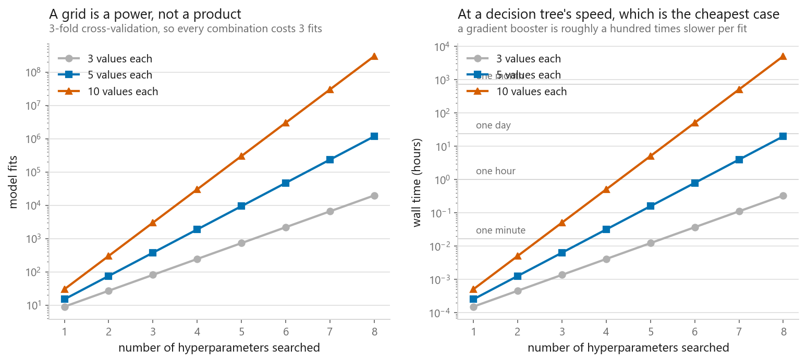
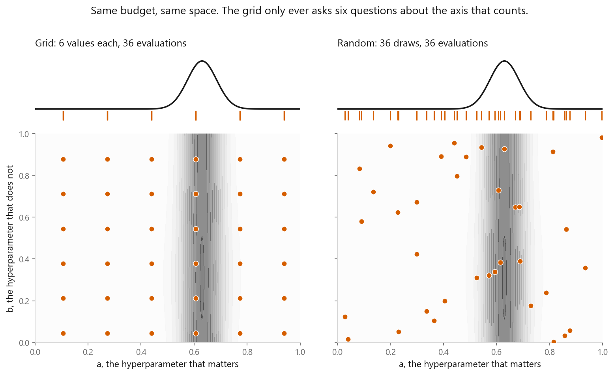
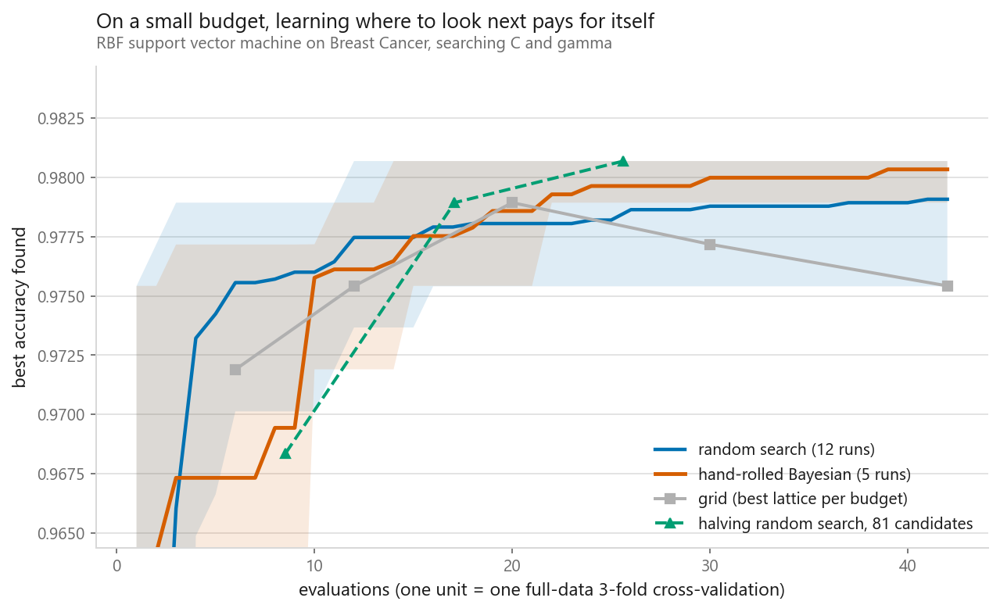
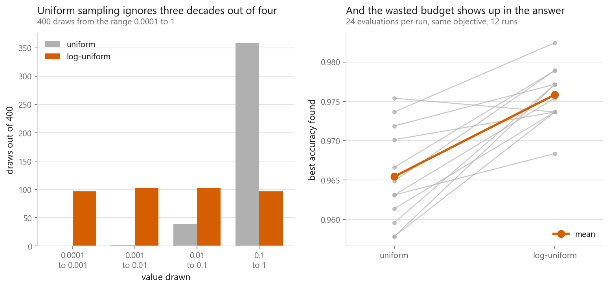
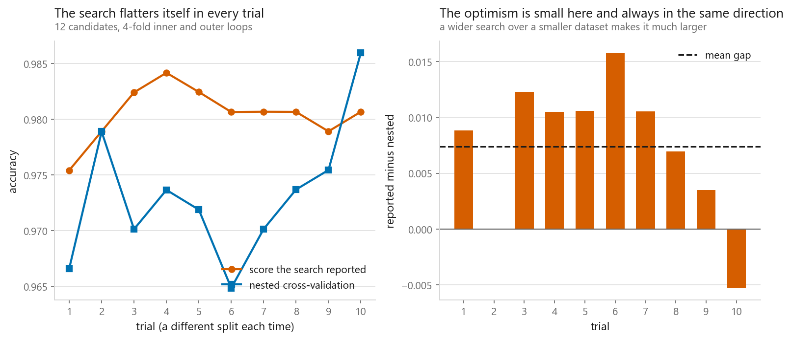

# Hyperparameter tuning

### Grid, random, halving, and a Bayesian search written by hand

**[Open the notebook](notebook.ipynb)** · Part 1, Foundations ·
Made by [Elyes Lounissi](https://www.linkedin.com/in/elyes-lounissi/)

| | |
|---|---|
| **What you will learn** | Why a grid wastes its budget when few hyperparameters matter, when random search loses instead, what halving buys, how to write expected improvement yourself, why penalties want log-uniform sampling, and why a search's own score is too high |
| **You should already know** | [Cross-validation](../04-cross-validation/), [overfitting and underfitting](../03-overfitting-and-underfitting/) |
| **Datasets** | UCI Dry Bean, Breast Cancer Wisconsin (569 rows, 30 features) |
| **Runtime** | About three minutes on a laptop CPU |

---

## The result I would lead with

"Random search beats grid search" is quoted everywhere. It is conditional, and I
measured both sides of the condition on the same budget of 36 evaluations over
800 repeats.

| Search space | Grid mean best | Random mean best | Random wins |
|---|---|---|---|
| Only one of two parameters matters | 0.7638 | **0.9840** | **78.1%** of repeats |
| Both parameters matter equally | **0.8592** | 0.7710 | **38.0%** of repeats |

When both axes carry signal, the grid wins and random search loses nearly two
repeats in three. The advantage was never about randomness. A grid pays for
resolution in every dimension at once, and you almost never need resolution in
every dimension, but when you do, the lattice is the right shape.

Even where random search wins, it wins on the average and not on the floor: the
grid's worst repeat scored 0.3680, random's worst scored 0.3514.

## Why the grid runs out

A grid on a decision tree over four hyperparameters: **96 candidates, 288 fits,
14.2 s**, best score 0.9000, median candidate 0.8780, worst 0.7043. One fit takes
60.4 ms, and at that speed the exponent decides everything. Three values each
over eight hyperparameters is 6,561 combinations and 0.33 hours. Five values each
is 390,625 and **19.66 hours**. Ten values each over eight is a hundred million
combinations and **5,033 hours**, on the fastest model in the book.

## What the grid never learns

Same space, same 36 evaluations. The grid tried **6 distinct values** of the
parameter that matters; random search tried **36**. A grid of $k$ values per
parameter never learns more than $k$ things about any one parameter, however
large the budget gets.

| Parameters | Budget | Grid values of $a$ | Grid best | Random best |
|---|---|---|---|---|
| 2 | 16 | 4 | 0.5750 | 0.8640 |
| 3 | 64 | 4 | 0.5297 | 1.0158 |
| 4 | 256 | 4 | 0.5761 | 1.0378 |
| 5 | 1024 | 4 | 0.5929 | 1.0415 |

Random search tried one distinct value of $a$ per evaluation, so its column ran
16, 64, 256, 1024. The grid's stayed at 4, and sixty-four times the budget bought
it nothing on the axis that mattered.

## Halving and a hand-written Bayesian search

The objective is a cross-validated RBF SVM on Breast Cancer over $\log_{10} C$
and $\log_{10} \gamma$, at 45 ms per evaluation. Expected improvement, written
out rather than imported:

$$\mathrm{EI}(x) = (\mu(x) - f^*)\,\Phi(z) + \sigma(x)\,\phi(z),
\qquad z = \frac{\mu(x) - f^*}{\sigma(x)}$$

The surrogate's early guesses are visibly bad, which is the point of the
uncertainty term. At step 5 it predicted 0.9370 and the truth was **0.6292**.

`HalvingRandomSearchCV` rations training rows instead of candidates.

It starts with 81 candidates on 60 rows and finishes with 9 on 540. The leader's
true full-data score climbs 0.9684, 0.9789, **0.9807** across the three rounds,
for a total cost of **25.62 full evaluations**.

| Budget | Random | Bayesian |
|---|---|---|
| 10 evaluations | 0.9760 | 0.9758 |
| 20 evaluations | 0.9780 | 0.9786 |
| 42 evaluations | 0.9791 | 0.9803 |

Halving reached 0.9807 at a cost of 25.6; the grid reached 0.9754 at a cost of 42.

**None of those gaps is a result.** Breast Cancer has 569 rows, so accuracy moves
in steps of 0.0018, one patient. The entire spread across all four methods at full
budget is 0.0053, three patients, and the spread across the 12 random-search seeds
alone is as wide. This objective does not separate the four search strategies and
I am not going to pretend it does.

That tie is worth more than a winner would be. Two hyperparameters, an easy
dataset and a broad optimum is a problem where forty evaluations is plenty for any
method, including drawing points out of a hat. Search strategy starts to matter
when the space is high-dimensional, the optimum is narrow, or evaluations are
expensive enough that you get a handful. If you compare search algorithms and they
all tie, the tuning is finished and the next improvement has to come from the
features or the model family.

What the chart does separate cleanly is the x axis. Halving reached the same
cluster for 25.6 evaluations against the grid's 42. When four methods agree on the
answer, cost is the only thing left to choose on.

One shape in the Bayesian curve is real, and it is not a ranking. The curve sits
level or behind early and climbs later. That is structural, not bad luck. The first eight
evaluations of every Bayesian run are random draws, because a Gaussian process
fitted to nothing has nothing to say. A method that spends eight evaluations
warming up cannot beat one that does not over a budget of ten, whatever the final
numbers say.

Applying halving to the section-2 tree grid instead:

| | Time | Best CV score |
|---|---|---|
| Full grid | 14.2 s | 0.9000 |
| Halving | 1.0 s | 0.8883 |

**14.1x faster, and it picked a different model**: `max_depth=5,
min_samples_leaf=1` instead of `max_depth=8, min_samples_leaf=5`. Judging on a
slice of the rows did lose the winner here. That is the trade, stated with a run
that shows it happening rather than as a footnote.

Note which hyperparameters got confused. `max_depth` and `min_samples_leaf` are
exactly the two that interact with dataset size: a leaf minimum of 5 looks
different on 200 rows than on 3,000, so a candidate judged on a slice is judged
under a different regime. That is the failure mode to watch for with
`resource="n_samples"`. If depth limits and leaf minimums are what you are tuning,
ration `n_estimators` instead and the elimination stops being biased against the
settings that need data.

## Sample multiplicative parameters on a log scale

Over the range 1e-4 to 1, uniform sampling puts **0.8% of draws below 0.01** and
finds a best of 0.9655. Log-uniform puts **50.0%** there and finds **0.9759**,
winning **92% of 12 runs**. It is a one-word change: `loguniform(1e-4, 1e0)`
instead of `uniform(1e-4, 1)`.

## The score from the search is too high

Every candidate truly worth 0.900, each measurement carrying noise of 0.020, no
model differences at all. With 1 candidate the reported best averages 0.8997;
with 20 it averages 0.9375 (**+0.0375**); with 100, 0.9501 (**+0.0501**); with
500, 0.9606 (**+0.0606**).

The inflation is a property of the maximum. Nested cross-validation measures the
procedure instead: the search reported **0.9805**, nested cross-validation said
**0.9731**, a mean optimism of **+0.0074**.

The search looked better in **9 of 10 trials**: strongly consistent, not
universal, and one trial is not enough to detect it. Ten nested trials cost
10.7 s. The gap is small because twelve candidates on 569 rows is a narrow
search; it scales with how much freedom the search had to chase noise.

## Cheat sheet

| | |
|---|---|
| **Grid** | $k^d$ evaluations, $k$ distinct values per axis forever. Fine at one or two hyperparameters, and genuinely better when they all matter |
| **Random** | One distinct value per parameter per evaluation. The default when you do not know which parameters matter |
| **Halving** | Screened 81 candidates for 25.6 evaluations and 14.1x faster on the tree grid. It dropped the full grid's winner here |
| **Bayesian** | Surrogate plus expected improvement. It cannot win over its own warm-up, and it did not separate from random search on this objective |
| **When they tie** | Stop tuning. Four methods inside three patients of each other means the answer is not in the hyperparameters |
| **Scales** | `loguniform` for C, alpha, gamma, learning rates. 0.8% of uniform draws landed in the bottom two decades |
| **Reporting** | Nested CV, or a test set the search never saw. Never `best_score_` |
| **Next** | [Linear regression](../../02-regression/01-linear-regression/), where the tuning problem has a closed-form answer for once |

---

If this chapter was useful, a star on the repository helps other people find it.
The code is yours to use, copy and adapt in your own work, no permission needed.

Made by **Elyes Lounissi** ·
[LinkedIn](https://www.linkedin.com/in/elyes-lounissi/) ·
[pilot.tun@gmail.com](mailto:pilot.tun@gmail.com)

Back to [Part 1](../) · [the curriculum](../../CURRICULUM.md) · [the book](../../README.md)

`#MachineLearning` `#HyperparameterTuning` `#RandomSearch` `#GridSearch`
`#BayesianOptimization` `#GaussianProcess` `#CrossValidation` `#Python`
`#ScikitLearn` `#DataScience`
