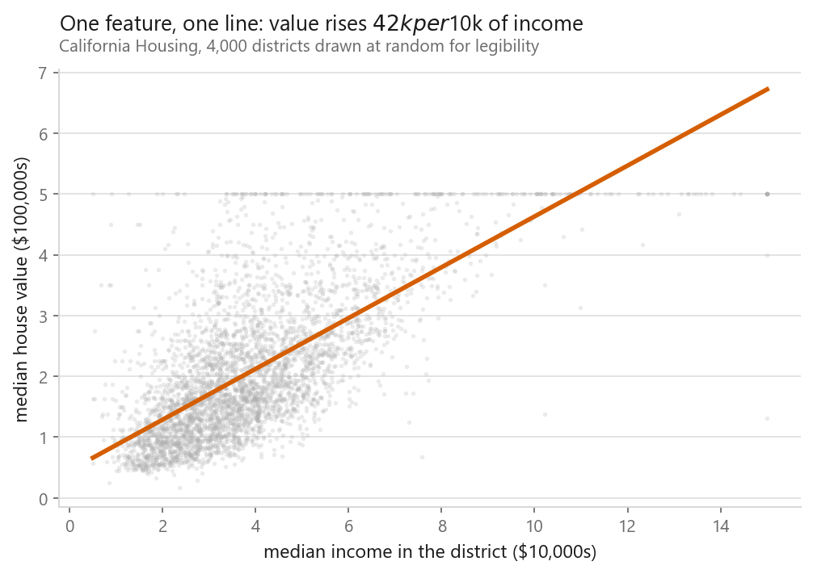
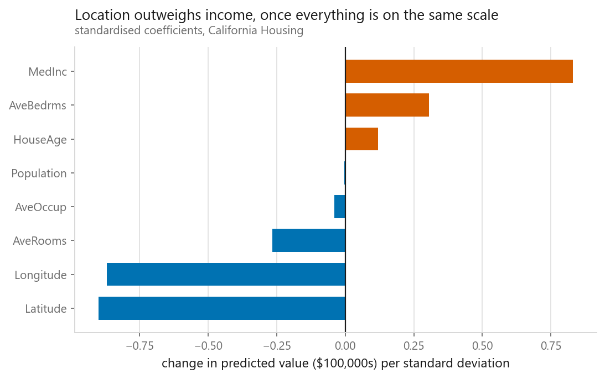
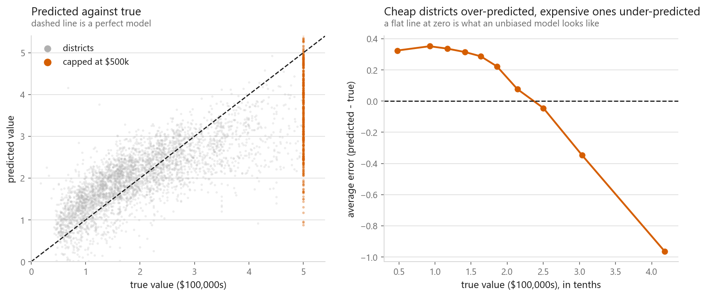

# Linear regression

### From the normal equation to scikit-learn, in one sitting

**[Open the notebook](notebook.ipynb)** · Part 2, Regression ·
Made by [Elyes Lounissi](https://www.linkedin.com/in/elyes-lounissi/)

| | |
|---|---|
| **What you will learn** | How linear regression works, how to derive and code it yourself, how to use the library version properly, and when it is the wrong tool |
| **You should already know** | Python, NumPy arrays, and what a mean is |
| **Datasets** | California Housing (20,640 districts), Bike Sharing (17,379 hours) |
| **Runtime** | Under a minute on a laptop CPU |

---

## The idea in one line

Predict a number as a **weighted sum** of the numbers you already have, and pick
the weights that make the total squared error smallest.

$$\hat{y} = w_1 x_1 + w_2 x_2 + \dots + w_n x_n + b$$

Set the derivative of the squared error to zero and you get the **normal
equation**, which solves for every weight at once with no iteration, no learning
rate, and no epochs:

$$w = (X^\top X)^{-1} X^\top y$$

## What the notebook covers

**1. The idea**: one feature first, so you can see the line before you see the algebra.

Two things visible here come back later: the flat band along the top is a price
cap baked into the data, and the vertical spread shows why one feature is never enough.

**2. The maths**: the loss, the derivative, the normal equation, and the two
things that break it (cost grows as $O(n^3)$ in features, and correlated columns
make the matrix uninvertible).

**3. From scratch**: a 30-line NumPy implementation, agreeing with scikit-learn to
**2.4 × 10⁻¹³**. It uses `lstsq` rather than inverting $X^\top X$, and the notebook
explains why that difference matters for numerical stability.

**4. In practice**: scaling inside a `Pipeline` so the scaler never sees the test
fold, five-fold cross-validation, and reading the coefficients.

This one surprised me. I expected income to carry the largest weight; latitude
(−0.90) and longitude (−0.87) both outrank it (0.83). The model is spending
weight to say "the south-west coast is expensive" using two straight lines, a
clumsy way to draw a coastline, and a preview of why trees do better here.

The orange stripe is 992 districts capped at $500,000, whose true values no longer
exist, not a modelling failure.

The right panel is the real finding, and it needed binning to see. A raw residual
scatter looked like a formless smear. Averaging the error within each tenth of the
price range shows the error sitting at **+0.33 across the cheaper half**, then
falling through zero to **−0.96** in the dearest tenth. Overall the average error
is +0.06, which looks unbiased and is not: it is a large positive bias at the
bottom cancelling a large negative one at the top. A summary number hid it; the
chart did not.

**5. When it wins, when it loses**: the same code on Bike Sharing, where R
squared falls from 0.60 to 0.39.

Demand has two peaks, at the morning and evening commutes. A straight line
through the hour column can say "demand rises through the day" or "demand falls".
It cannot say "up, down, up, down". No amount of fitting fixes that, because the
shape is not available to the model.

One-hot encoding the hour column, **changing nothing about the model**, takes it
from 0.39 to 0.68, better than the same method managed on California Housing.
That is the most reliable lesson in applied machine learning: the features are
usually where the win is.

## Results

| | California Housing | Bike Sharing |
|---|---|---|
| Predict the mean (baseline) | RMSE 1.154 | R² 0.000 |
| Linear regression | RMSE 0.726 (**37% better**) | R² 0.388 |
| Linear regression, hours encoded | | R² **0.684** |

R² on California Housing is 0.604, with folds spanning 0.594 to 0.618.

## Cheat sheet

| | |
|---|---|
| **Use it when** | You want a fast, explainable baseline; relationships look roughly straight; more rows than columns |
| **Avoid it when** | The pattern bends or cycles; features are strongly correlated; outliers are common |
| **Assumes** | Errors independent, constant variance, roughly normal. Predictions survive violations; confidence intervals do not |
| **Scaling** | Not needed for correctness, needed to interpret coefficients |
| **Cost** | About $O(n \cdot m^2)$ for $m$ features, instant below a few hundred columns |
| **Hyperparameters** | None, which is part of the appeal |
| **Next** | [Ridge](../04-ridge-regression/) if features correlate, [Lasso](../05-lasso-regression/) for feature selection |

---

Made by **Elyes Lounissi** ·
[LinkedIn](https://www.linkedin.com/in/elyes-lounissi/) ·
[pilot.tun@gmail.com](mailto:pilot.tun@gmail.com)

Back to [Part 2](../) · [the curriculum](../../CURRICULUM.md) · [the book](../../README.md)

`#MachineLearning` `#LinearRegression` `#Python` `#ScikitLearn` `#DataScience`
`#MLTutorial` `#NumPy` `#Regression` `#LearnMachineLearning`
