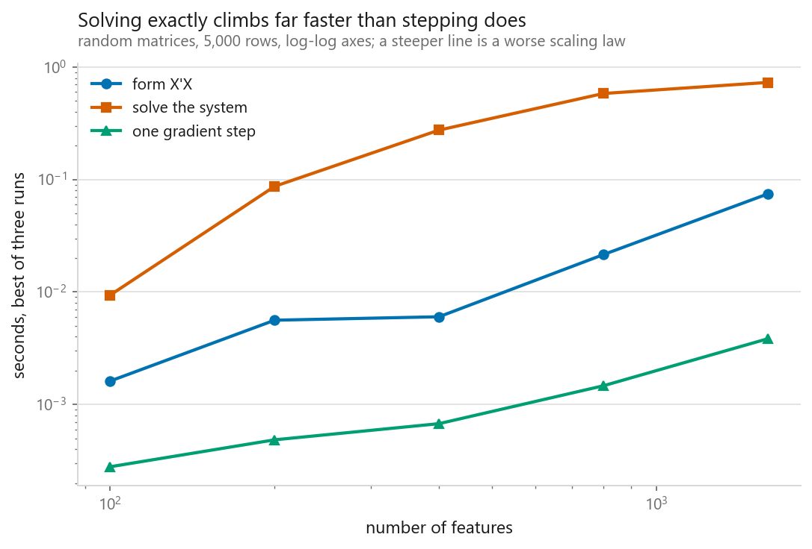
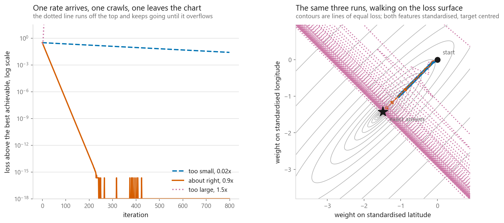
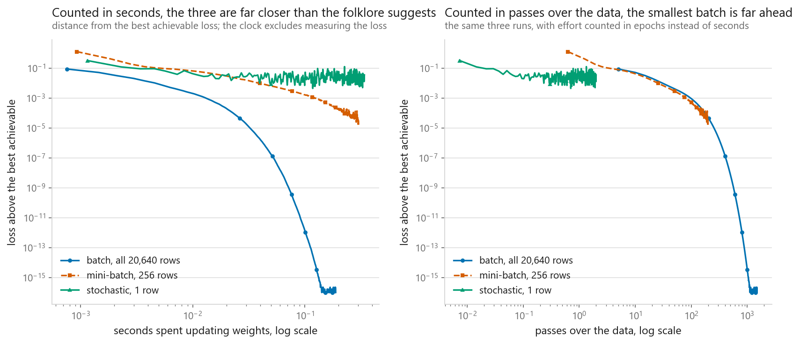
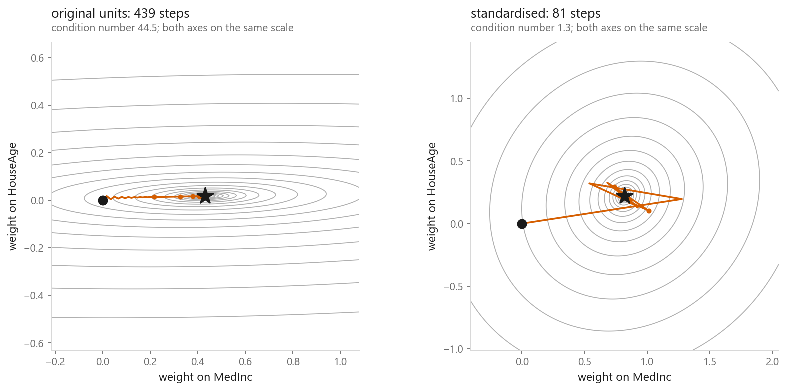

# Gradient descent

### The learning rate has an exact ceiling, and full batch won on the clock

**[Open the notebook](notebook.ipynb)** · Part 2, Regression ·
Made by [Elyes Lounissi](https://www.linkedin.com/in/elyes-lounissi/)

| | |
|---|---|
| **What you will learn** | Why an iterative solver exists when an exact formula already does, how to derive and code the update rule, the exact stable ceiling on the learning rate, what batch size actually buys, and what feature scaling saves |
| **You should already know** | [Linear regression](../01-linear-regression/) and the normal equation, NumPy arrays, and what a derivative is |
| **Datasets** | California Housing (20,640 districts, 8 features), plus random matrices for the timings |
| **Runtime** | Under two minutes on a laptop CPU |

---

## Start here: the folklore about small batches did not survive the stopwatch

Everyone repeats that stochastic gradient descent is the fast one. Counted in seconds
rather than passes over the data, here it was the slow one *and* the inaccurate one.
Full batch finished 1,500 updates in **0.205 s** and landed **1.000e-16** from the best
achievable loss; stochastic descent spent **0.366 s** on 41,250 updates and stopped
**3.699e-02** away — fourteen orders of magnitude worse, for 78% more wall-clock time.
That is not an argument against small batches, it is an argument about what makes them
fast: memory pressure and model shape, neither of which applies here.

## Why iterate when a formula exists

| Features | Form $X^\top X$ | Solve | One gradient step |
|---|---|---|---|
| 100 | 0.0027 s | 0.1555 s | 0.00052 s |
| 400 | 0.0089 s | 1.1905 s | 0.00093 s |
| 1600 | 0.0830 s | 1.2883 s | 0.00392 s |

Fitted exponents against theory: forming $X^\top X$ came out at **1.61** (theory says
2), one gradient step at **1.04** (theory says 1), and the solve at **0.06** against a
theoretical 3. Say that last one plainly: at these sizes a multithreaded BLAS solve is
nowhere near its asymptotic regime, so the exponent is meaningless and the time
projection built on it is nonsense. The memory projection is not — **$X^\top X$ alone
would need 80 GB** at 100,000 features.

Cost is the reason people quote. Rank is the reason that stops you. Duplicate one
column and the matrix has 9 columns at **rank 8**; numpy refused with `Singular
matrix`. Gradient descent walked the same problem to **MSE 0.52432099**, matching
`lstsq` exactly, and put **+0.414810** on each duplicate — without being told anything
about the duplication.

## The update rule, checked against the closed form

$$\nabla J(w) = \frac{2}{m}X^\top(Xw - y), \qquad w \leftarrow w - \eta\,\nabla J(w)$$

On eight standardised features, run to a flat gradient in **447 steps**, gradient
descent reached **MSE 0.5243209862** against the closed form's **0.5243209862**. The
largest disagreement in the weights was **2.700e-09**, in the intercept **4.441e-16**,
in the predictions **2.524e-08**. Nothing about the destination is approximate, only
the route.

## The learning rate is a cliff, not a curve

Error along an eigendirection of curvature $\lambda$ is multiplied by
$(1-\eta\lambda)$ every step, so the safe range is exactly $\eta < 2/\lambda_{\max}$.
Here that ceiling is **0.4934**. Multiples of it, 600 steps each:

| Multiple | Learning rate | Final loss | Outcome |
|---|---|---|---|
| 0.90 | 0.44402 | 5.2432e-01 | converging |
| **0.99** | 0.48842 | **5.2432e-01** | converging |
| **1.01** | 0.49829 | **3.3577e+07** | growing |
| 1.10 | 0.54269 | 1.6724e+92 | growing |
| 1.50 | 0.74003 | inf | overflowed at step 510 |

There is no gentle degradation between 0.99 and 1.01. You are not hunting a broad
optimum, you are finding the edge of a cliff and standing back from it. A loss of
`nan` in a training log is almost always this.

**Stop on the gradient, not on the loss.** Same problem, rate 0.01039, tolerance 1e-6:
the loss rule quit after **2,203 steps**, still **6.525e-02** from the exact answer.
The gradient rule ran **8,742 steps** and finished **2.316e-06** away. The loss rule
cannot tell "nowhere left to go" from "barely moving".

## Batch, stochastic, mini-batch

Row lengths are the wrinkle: median squared length **5.1**, max **14307.4**. Clipping
at ±5 touches **282 of 20,640 rows** and brings the max to **70.8**. Each method then
gets the largest step safe for its own gradient estimate, so this compares batch sizes
and not learning rates.

| Method | Updates | Seconds | Final gap | Uphill steps | Wobble |
|---|---|---|---|---|---|
| Batch, all 20,640 rows | 1,500 | **0.205** | **1.000e-16** | 21 / 299 | 0.808 |
| Mini-batch, 256 rows | 16,000 | 0.377 | 1.711e-05 | 85 / 319 | 0.281 |
| Stochastic, 1 row | 41,250 | 0.366 | 3.699e-02 | 140 / 274 | 0.293 |

Per pass over the data the stochastic curve is far ahead, and the right panel shows it
— that is why nobody trains a network full-batch. Per second the ordering reverses,
because one batch step is a single BLAS call across every core on a cached matrix while
41,250 single-row steps are 41,250 trips through the Python interpreter. The wobble
column is the spread of the remaining gap on a log scale over the last 40% of each run,
so batch's 0.808 is large because that run was still falling through orders of
magnitude, not because it was noisy. And at a constant learning rate stochastic descent
never converges to a point — it settles into a cloud, and decaying the rate shrinks it.

## What scaling saves

Two centred features, same model, same minimum loss of **0.65363196** both ways —
original units: condition **44.5**, **439 steps**. Standardised: condition **1.3**,
**81 steps**. On all eight features with a shared 20,000-iteration budget it stops
being cosmetic:

| Version | Condition number | Steps | Gradient left | Loss gap |
|---|---|---|---|---|
| Original units | **42,145,624** | 20,000 (budget spent) | 4.52e-02 | 6.567e-01 |
| Standardised | 44 | **359** | 9.99e-09 | 1.443e-15 |

The normal equation does not care about units — the exact solution is the exact
solution. The moment you walk downhill, units decide whether the walk finishes at all.

## Cheat sheet

| | |
|---|---|
| **Use it when** | The exact solution is too expensive, does not exist, or was never available — every model after this chapter |
| **Update rule** | $w \leftarrow w - \eta\,\frac{2}{m}X^\top(Xw-y)$, at $O(mn)$ per step against $O(n^3)$ for one exact solve |
| **Safe learning rate** | Strictly below $2/\lambda_{\max}$. At 0.99× it converges, at 1.01× it grows to 3.4e7 in 600 steps |
| **Scaling** | Not optional. It sets the condition number, and the condition number sets the step count |
| **Batch size** | Small batches win per pass over the data. On one cached matrix product they lost on the clock |
| **Stopping rule** | Relative gradient length, plus an iteration cap, plus a finite-loss check |

---

Made by **Elyes Lounissi** ·
[LinkedIn](https://www.linkedin.com/in/elyes-lounissi/) ·
[pilot.tun@gmail.com](mailto:pilot.tun@gmail.com)

Back to [Part 2](../) · [the curriculum](../../CURRICULUM.md) · [the book](../../README.md)

`#MachineLearning` `#GradientDescent` `#Optimization` `#LearningRate`
`#LinearRegression` `#Python` `#NumPy` `#DataScience` `#MLTutorial` `#SGD`
