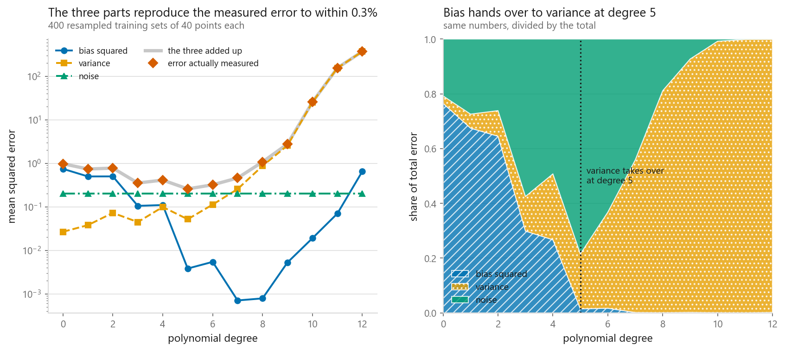
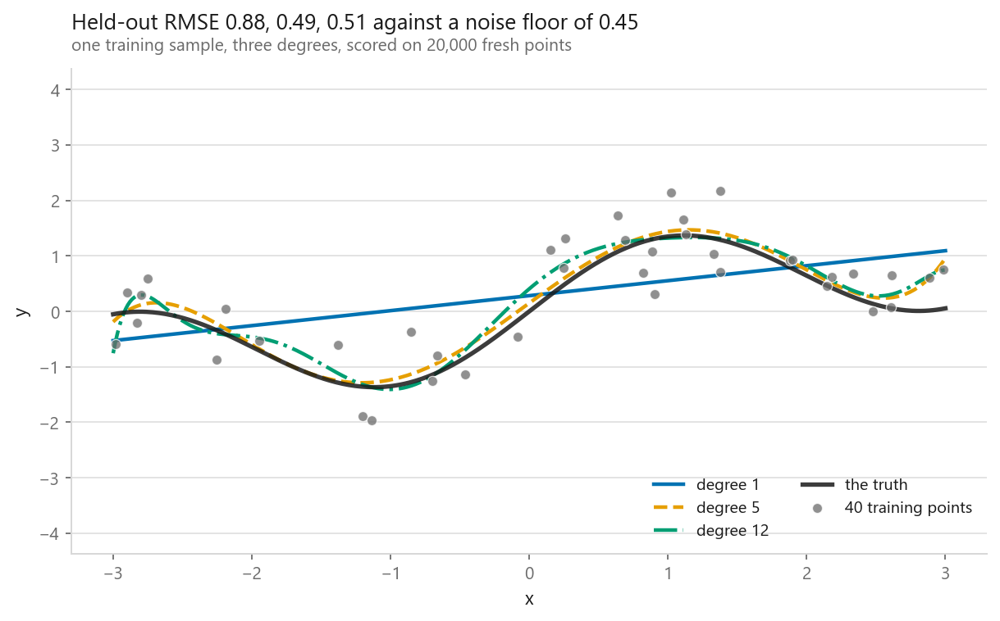
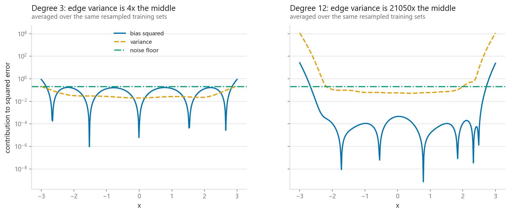
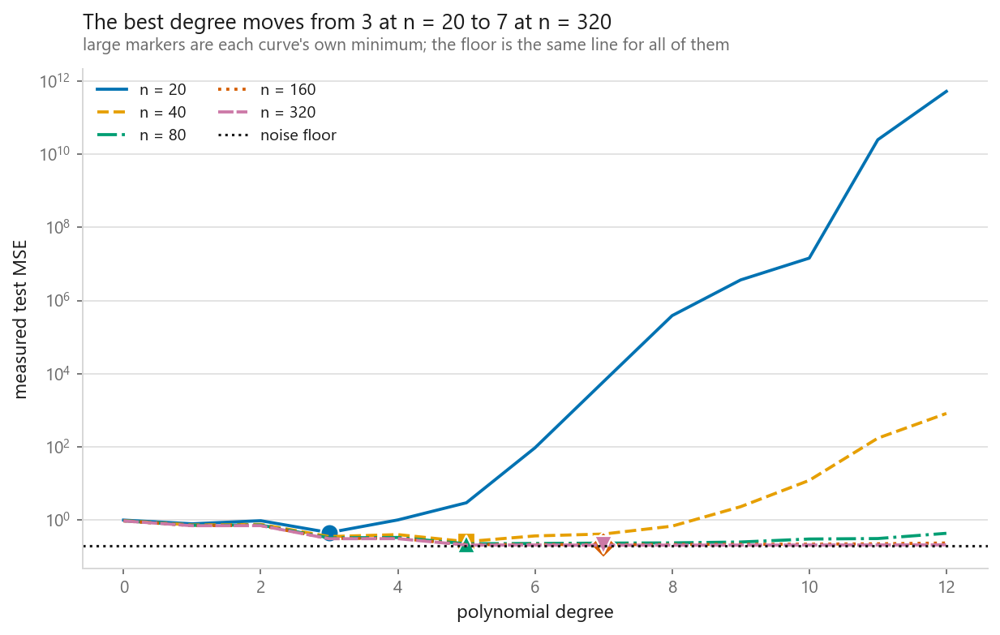
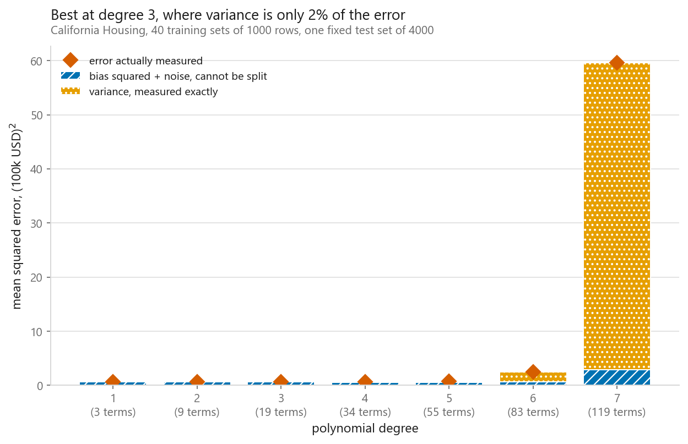

# Polynomial regression and the bias-variance tradeoff

### The decomposition everyone draws with unlabelled axes, measured instead

**[Open the notebook](notebook.ipynb)** · Part 2, Regression ·
Made by [Elyes Lounissi](https://www.linkedin.com/in/elyes-lounissi/)

| | |
|---|---|
| **What you will learn** | How a linear model fits a curve, how to split a test error into bias squared, variance and noise by resampling, why the three parts add up to the error you actually observe, and why the famous U-shaped curve moves when the training size moves |
| **You should already know** | [Linear regression](../01-linear-regression/) and [overfitting](../../01-foundations/03-overfitting-and-underfitting/) |
| **Datasets** | A synthetic curve, `sin(1.6x) + 0.35x` with noise of sd 0.45, so the truth and the noise floor are both known. Then California Housing, three columns kept |
| **Runtime** | Around three minutes on a laptop CPU. 400 resampled training sets per degree, 13 degrees, then a five-size sweep at 200 resamples each |

---

## The result I would lead with

Bias squared, variance and the noise floor were computed from three separate
quantities, none of which looked at the test error. Then the test error was
measured independently on freshly noised targets. They reproduce it:

| Degree | Bias squared | Variance | Noise | Sum of three | Measured | Gap |
|---|---|---|---|---|---|---|
| 0 | 0.7457 | 0.0266 | 0.2025 | 0.9748 | 0.9754 | 0.06% |
| 1 | 0.4985 | 0.0380 | 0.2025 | 0.7390 | 0.7386 | 0.05% |
| 2 | 0.5000 | 0.0726 | 0.2025 | 0.7750 | 0.7740 | 0.13% |
| 3 | 0.1053 | 0.0446 | 0.2025 | 0.3524 | 0.3516 | 0.22% |
| 4 | 0.1098 | 0.0991 | 0.2025 | 0.4114 | 0.4108 | 0.15% |
| **5** | **0.0038** | **0.0518** | 0.2025 | **0.2581** | **0.2586** | 0.16% |
| 6 | 0.0054 | 0.1125 | 0.2025 | 0.3204 | 0.3203 | 0.03% |
| 7 | 0.0007 | 0.2557 | 0.2025 | 0.4589 | 0.4595 | 0.12% |
| 8 | 0.0008 | 0.8707 | 0.2025 | 1.0740 | 1.0767 | 0.25% |
| 9 | 0.0053 | 2.5704 | 0.2025 | 2.7782 | 2.7816 | 0.12% |
| 10 | 0.0190 | 25.2672 | 0.2025 | 25.4887 | 25.4918 | 0.01% |
| 11 | 0.0700 | 154.9097 | 0.2025 | 155.1823 | 155.1765 | 0.00% |
| 12 | 0.6514 | 370.1834 | 0.2025 | 371.0373 | 371.0284 | 0.00% |

**Worst disagreement across all thirteen rows: 0.25%. Median: 0.12%.** The
picture in the textbooks is an identity, and with 400 resampled training sets it
is checkable to a fraction of a percent.

The column I did not expect to behave this way is the first one. Bias squared does
not fall monotonically. It rises at every even degree in the sweep: 0.4985 to
0.5000 at degree 2, 0.1053 to 0.1098 at degree 4, 0.0038 to 0.0054 at degree 6,
0.0007 to 0.0008 at degree 8.

Before believing that, check it against the estimator's own error. The plug-in
bias squared is inflated by variance divided by the replicate count, which the
notebook now prints alongside it. At degrees 2, 4 and 6 the rise is several times
that inflation, so those three are real. At degree 8 the inflation is larger than
the entire bias squared value, so **that row says nothing at all** and I have
stopped citing it as evidence. Three consistent rises, not four.

The mechanism holds for the three that survive. The truth is `sin(1.6x) + 0.35x`,
an odd function on a symmetric range, so an even-power column has nothing to
contribute and its coefficient is sampling wobble. With a random design that
wobble does not average out into the odd part cleanly, so the average fit moves
off the truth and bias rises. Those columns bought negative value on bias and were
charged for on variance anyway.

The general lesson is bigger than the example. The two plug-in terms are each
biased, in opposite directions, by the same amount, which is why the sum below
checks out to a fraction of a percent. **A tight sum is not permission to compare
small differences within either part.**

The best degree is 5, at a measured MSE of **0.2586 against a noise floor of
0.2025**. That is 1.28x the floor, with only **0.0561** of the error attributable
to anything a modeller can change.

One caution on reading the right-hand panel. The dotted line is where variance
overtakes bias squared, at degree 5. Variance is not the largest term there:
at degree 5 the shares are bias 0.015, variance 0.201 and **noise 0.784**. The
noise floor is four times the variance at the best degree. Variance only becomes
the single largest term at degree 7, where its share is 0.557.

## One sample tells you which degree won, and lies about why

One training set of 40 points, three degrees, scored on 20,000 fresh points:

| Degree | Held-out RMSE | Multiple of the noise floor |
|---|---|---|
| 1 | 0.882 | 1.96x |
| 5 | 0.485 | 1.08x |
| 12 | 0.511 | 1.14x |

Degree 12 is the interesting row, because it does not look overfitted. It tracks
the truth about as closely as degree 5 does and costs only 5% more RMSE. The
Vandermonde design is rescaled so every column stays inside [-1, 1], and
`lstsq` with `rcond=None` goes through an SVD that discards the near-degenerate
directions, so the fit stays tame on this particular sample.

Now look at the same degree 12 in the table above: **variance 370.18**. One
sample cannot tell the difference between a model that is right and a model that
was lucky. Only refitting can, which is exactly why almost nobody measures bias
and variance and almost everybody draws them.

For the record, the from-scratch fit matches scikit-learn's `PolynomialFeatures`
plus `LinearRegression` to **1.73e-13** at degree 6.

## Variance does not sit still across x

The averages above hide where the damage is. Splitting the test range into edges
and middle:

| Degree | Variance at the edges | Variance in the middle | Ratio |
|---|---|---|---|
| 3 | 0.0902 | 0.0235 | 3.8x |
| 12 | **1233.7615** | **0.0586** | **21,050x** |

I expected the edge effect. I did not expect four orders of magnitude. In the
middle of the training range a degree-12 polynomial is pinned down by points on
both sides and its variance, 0.0586, is below the noise floor of 0.2025. At the
edges it is 1,234.

This is the practical reason a polynomial fit should never be trusted near the
ends of its training range, and the reason extrapolating one is meaningless. It
also explains a mismatch people hit in production: a model can have a reasonable
average test error and still be unusable on the part of the input space that
matters, because the average is dominated by the dense middle.

## The U-curve is a claim about one training size

Same generator, same degree sweep, five training sizes:

| Training size | Best degree | Best test MSE | Bias squared there | Variance there |
|---|---|---|---|---|
| 20 | 3 | 0.4572 | 0.1084 | 0.1484 |
| 40 | 5 | 0.2588 | 0.0044 | 0.0523 |
| 80 | 5 | 0.2259 | 0.0033 | 0.0192 |
| 160 | 7 | 0.2139 | 0.0001 | 0.0109 |
| 320 | **7** | **0.2071** | 0.0000 | 0.0055 |

The minimum slides right, from degree 3 to degree 7, and the best achievable MSE
walks down to 0.2071 against a floor of 0.2025. The complexity that was reckless
at 20 points is affordable at 320.

The notebook also prints, for each size, every degree within 2% of that curve's
own minimum, because an argmin over a Monte Carlo estimate is only a finding if
the bottom is pointed. The claim to take away is about the band rather than its
lowest pixel: the whole band of acceptable degrees shifts right as the sample
grows. Announcing "the optimal degree is 5" when 4 through 7 are within 2% of each
other is the same mistake as ranking models a thousandth apart.

Read the bias column carefully, because every row in it is a different model. It
reaches 0.0000 because the best degree moved from 3 to 7, not because data cures
bias. Bias is whatever the model class cannot represent, and no quantity of
evidence moves it while the class is held fixed. The column that responds to
sample size is the one beside it: variance at the best degree falls from 0.1484
to 0.0055 over the same sweep. **More data is a variance treatment.**

The second thing in that chart took me longer to notice. The curves are almost on
top of each other at low degree and separate only at the right-hand end. More
data does nothing at all in the bias-dominated part of the model space, and the
chart shows precisely which part it treats.

## On real data, one term stops being visible

California Housing, three columns kept, 40 training sets of 1,000 rows drawn from
a disjoint pool, one fixed test set of 4,000. Here neither the truth nor the
noise level is known, so bias squared and noise are welded into one lump:

| Degree | Terms | Bias squared + noise | Variance | Measured | Variance share |
|---|---|---|---|---|---|
| 1 | 3 | 0.66309 | 0.00269 | 0.66578 | 0.4% |
| 2 | 9 | 0.64681 | 0.00631 | 0.65312 | 1.0% |
| **3** | 19 | 0.61456 | 0.01192 | **0.62648** | **1.9%** |
| 4 | 34 | 0.60328 | 0.03321 | 0.63649 | 5.2% |
| 5 | 55 | 0.59394 | 0.17219 | 0.76613 | 22.5% |
| 6 | 83 | 0.69051 | 1.78809 | 2.47860 | 72.1% |
| 7 | 119 | 2.92619 | **56.71331** | **59.63950** | **95.1%** |

**The split into variance and everything-else is still exact.** The largest
residual on the identity across all seven rows is **7.11e-15**, which is floating
point. Nothing about it needed the truth, the noise level, or a distributional
assumption. It is algebra applied to a set of refits, and it costs one loop over
resampled training sets on any dataset you have.

What it cannot do is split the lump. The smallest lumped value anywhere in the
sweep is **0.5939**, and since the lump is bias squared plus noise and both are
non-negative, that is an upper bound on the irreducible noise and nothing more.
Anyone printing a separate noise term on tabular data has assumed one.

The variance bill is not a minority concern here either. It is 1.9% of the error
at the best degree and **95.1% at degree 7**, with the variance term itself going
from 0.00269 at degree 1 to 56.71331 at degree 7. The bar chart above is almost
entirely the variance band at the right-hand end.

One caveat specific to this dataset, and a good example of noise that is not
random. The target is capped at 5.0, and about a thousand districts sit exactly
on it (992, counted in [01-01](../../01-foundations/01-what-machine-learning-does/)).
Error against those rows lands in the lumped column and no model can reduce it,
so it behaves like noise. It is a recording artefact. The decomposition cannot
tell the difference; a person reading the data documentation can.

## Cheat sheet

| | |
|---|---|
| **Use it when** | The relationship is smooth and curved and the input dimension is small. It is still a linear solve |
| **Avoid it when** | You have many features. Terms grow as C(p+d, d): 30 columns at degree 8 is 48,903,491 terms |
| **Always** | Scale before expanding. Raw high powers wreck the conditioning, and the condition number here still ran 8.0 at degree 3 to 1.9e+04 at degree 12 |
| **Main dial** | Degree. Choose it by cross-validation, and remember the answer moved from 3 to 7 purely by growing n from 20 to 320 |
| **Bias** | The gap between the average fit and the truth. Only visible across refits, and unmoved by sample size while the degree is held fixed |
| **Variance** | The spread of fits about their own average. Falls with n, and concentrates where the data thins: 21,050x higher at the edges than the middle at degree 12 |
| **Noise** | Unmovable. On real data it cannot be separated from bias without repeated observations at the same input |
| **Sanity check** | Print bias squared plus variance plus noise next to the measured error. They agreed to 0.25% here. If yours does not, the resampling is wrong |
| **Do not** | Compare small differences inside the bias column. The plug-in estimate is inflated by variance over the replicate count, which swamped it entirely past degree 7 here |
| **Watch out** | Never extrapolate a polynomial fit. Variance past the last data point has nothing holding it down |
| **Next** | [Ridge regression](../04-ridge-regression/), which trades a little bias for a lot of variance on purpose |

---

If this chapter was useful, a star on the repository helps other people find it.
The code is yours to use, copy and adapt in your own work, no permission needed.

Made by **Elyes Lounissi** ·
[LinkedIn](https://www.linkedin.com/in/elyes-lounissi/) ·
[pilot.tun@gmail.com](mailto:pilot.tun@gmail.com)

Back to [Part 2](../) · [the curriculum](../../CURRICULUM.md) · [the book](../../README.md)

`#MachineLearning` `#PolynomialRegression` `#BiasVarianceTradeoff` `#Overfitting`
`#LinearRegression` `#CaliforniaHousing` `#NumPy` `#ScikitLearn` `#MLTutorial`
`#LearnMachineLearning` `#DataScience` `#AI`
