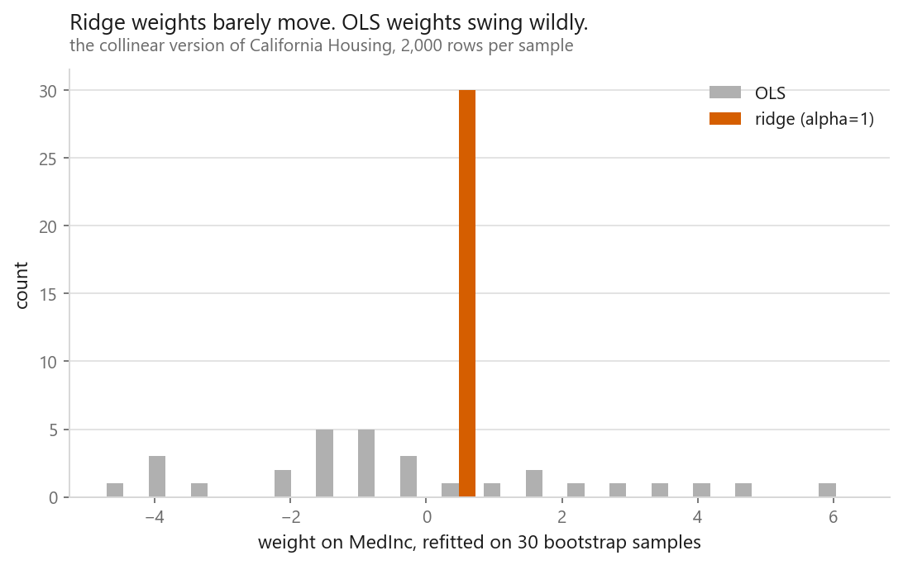
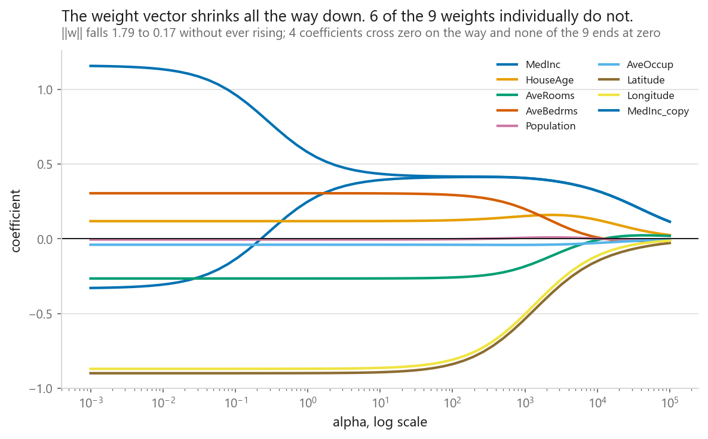
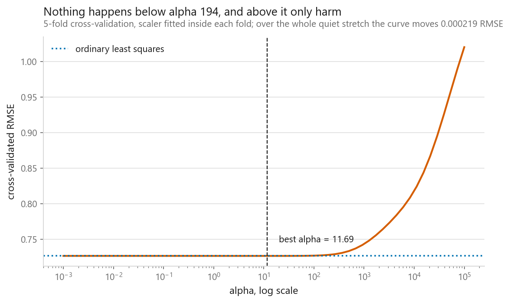

# Ridge regression

### Paying a penalty for large weights, and getting stability back

**[Open the notebook](notebook.ipynb)** · Part 2, Regression ·
Made by [Elyes Lounissi](https://www.linkedin.com/in/elyes-lounissi/)

| | |
|---|---|
| **What you will learn** | What the L2 penalty does, why correlated features make ordinary regression unstable, how to read a regularisation path, and what ridge does **not** buy you |
| **You should already know** | [Linear regression](../01-linear-regression/), [overfitting](../../01-foundations/03-overfitting-and-underfitting/) |
| **Datasets** | California Housing, plus a deliberately collinear construction |
| **Runtime** | About a minute on a laptop CPU |

---

## The idea

Least squares minimises error and nothing else. Ridge adds a second term, the
size of the weights themselves:

$$J(w) = \underbrace{\|Xw - y\|^2}_{\text{fit the data}} + \underbrace{\alpha \|w\|^2}_{\text{stay small}}$$

It has an exact solution, with $\alpha$ added down the diagonal, the "ridge" the
name refers to:

$$w = (X^\top X + \alpha I)^{-1} X^\top y$$

That also fixes a numerical problem for free: with perfectly collinear features
$X^\top X$ has no inverse and least squares has no unique answer, but adding
$\alpha$ makes it invertible for **any** $\alpha > 0$.

## What I expected, and what happened

I added a column equal to `MedInc` plus a whisper of noise (correlation
**0.999986**) expecting the textbook pathology: one weight at +1000, its twin at
-997.

**It did not happen.** The two weights came out around -0.3 and +1.2. The textbook
example quietly assumes scarce data; with 20,640 rows and 9 columns there is
enough evidence to keep the solution bounded. **Collinearity is only catastrophic
when rows are few relative to columns.**

## What ridge actually bought

| | Cross-validated RMSE |
|---|---|
| OLS, original 8 features | 0.7263 |
| OLS, with the near-copy | 0.7263 |
| Ridge, with the near-copy | 0.7263 |

**No accuracy at all**, identical to four decimal places. But refit on 30
bootstrap samples:

| | Spread of the `MedInc` weight |
|---|---|
| OLS | 2.682 |
| Ridge | **0.084** |

**Thirty-two times more stable.** The OLS coefficient is not a number you could
report to anyone, because a different sample of the same data gives a different
answer.

So the honest pitch has nothing to do with prediction. It is that **ridge gives you
coefficients that mean something**. If you only need predictions and have plenty of
rows, plain least squares was fine here.

## The regularisation path

I captioned this "every weight shrinks toward zero and none reaches it". The
second half is right. The first half is not, and the printout says so: **6 of the
9 weights do not fall monotonically at all**, and **4 change sign** somewhere on
the path.

| Coefficient | Smallest alpha | Largest magnitude, and where | Largest alpha |
|---|---|---|---|
| `MedInc` | -0.329 | 0.415 at alpha 265 | +0.1151 |
| `HouseAge` | +0.119 | 0.160 at alpha 2,360 | +0.0256 |
| `Longitude` | -0.870 | 0.870 at alpha 0.001 | -0.0122 |

What *is* monotone is the quantity the penalty actually charges for: the length of
the whole weight vector, **1.788 down to 0.169, falling at every step**. Ridge is
free to reshuffle weight between correlated features while the total shrinks, so a
path with a rising line in it is not a broken solver.

The twins do that reshuffling in the open. They start at -0.329 and +1.158, an
uneven split of the same 0.830, and converge: 0.394 and 0.436 by alpha 10, both
**0.322** by alpha 10,000. That is the **grouping effect**, and it is why the
squared penalty prefers spreading weight evenly across identical features
(2 × 0.5² beats 1²). It returns in [elastic net](../06-elastic-net/).

Nothing reaches zero: the smallest coefficient at the largest alpha is
**0.003863**. Ridge shrinks; it does not select.
[Lasso](../05-lasso-regression/) is the version that sets weights to exactly zero.

This chart has no U in it. Across every alpha from 0.001 to 100 the
cross-validated RMSE moves by **0.000219 in total** and never leaves the ordinary
least squares line by more than **0.000184**. Cross-validation picks **alpha
11.690**, which beats plain OLS by **0.000035** RMSE, about three dollars fifty on
a target measured in hundreds of thousands. The curve does not start climbing
until **alpha 194.149**; push it to 10⁵ and RMSE degrades to 1.02, so much penalty
the model is nearly a constant.

So the shape is a flat line followed by a cliff, not a valley. Seeing a real
minimum needs enough features relative to rows that unregularised least squares
overfits, and 20,640 rows against 9 columns is not that. The procedure is still
right; it just has nothing to find here, and reporting "nothing to find" is the
procedure working.

## The scaling argument, which surprised me

Sweeping alpha with and without scaling, on data where I deliberately re-expressed
income in dollars and population in millions:

| alpha | Unscaled | Scaled |
|---|---|---|
| 1 | 0.7263 | 0.7263 |
| 10,000 | **0.7682** | 0.8178 |
| 1,000,000 | **0.8084** | 1.1355 |

**The unscaled version scored better**, which is the opposite of the moral I
expected to write.

Follow the reason, because it is the actual argument for scaling. Inflating
`MedInc` by 10,000 forced its coefficient to shrink by the same factor, and a tiny
coefficient is nearly free under an $\alpha\|w\|^2$ penalty. So the unscaled model
kept the most predictive feature almost unregularised while the penalty flattened
everything else. It won **by accident**, because of a unit I chose arbitrarily.

That is the problem, not a defence. **Without scaling, your choice of units decides
which features the penalty protects.** Scaling does not promise a better score; it
promises the penalty responds to usefulness rather than to measurement units.

## Cheat sheet

| | |
|---|---|
| **Use it when** | Features are correlated; many features relative to rows; you want interpretable, stable coefficients |
| **Prefer Lasso when** | You want features actually removed |
| **Scaling needed** | Yes, so the penalty tracks usefulness, not units |
| **Main dial** | `alpha`. `RidgeCV` picks it efficiently |
| **Free bonus** | Always has a unique solution, even with perfect collinearity |
| **Watch out** | Choose `alpha` inside cross-validation, never by peeking at the test set |

---

If this chapter was useful, a star on the repository helps other people find it.
The code is yours to use, copy and adapt in your own work, no permission needed.

Made by **Elyes Lounissi** ·
[LinkedIn](https://www.linkedin.com/in/elyes-lounissi/) ·
[pilot.tun@gmail.com](mailto:pilot.tun@gmail.com)

Back to [Part 2](../) · [the curriculum](../../CURRICULUM.md) · [the book](../../README.md)

`#MachineLearning` `#RidgeRegression` `#Regularization` `#L2` `#LinearRegression`
`#Python` `#ScikitLearn` `#DataScience` `#MLTutorial` `#Multicollinearity`
