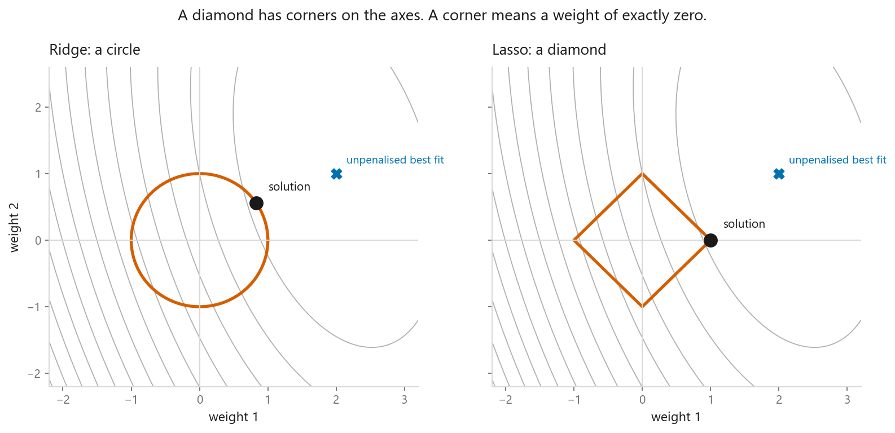
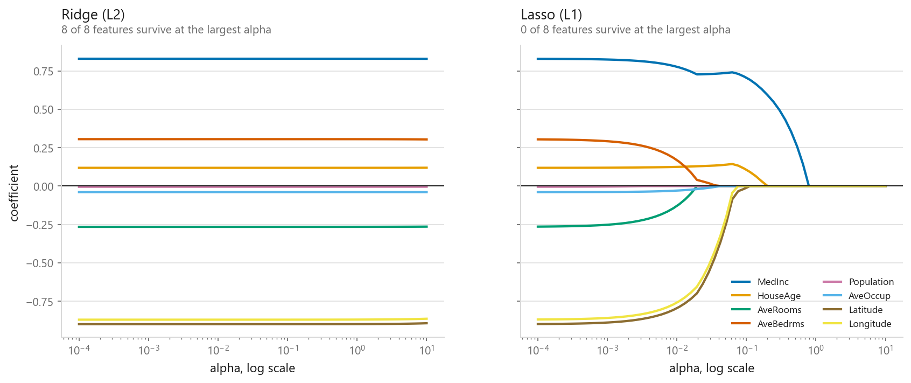
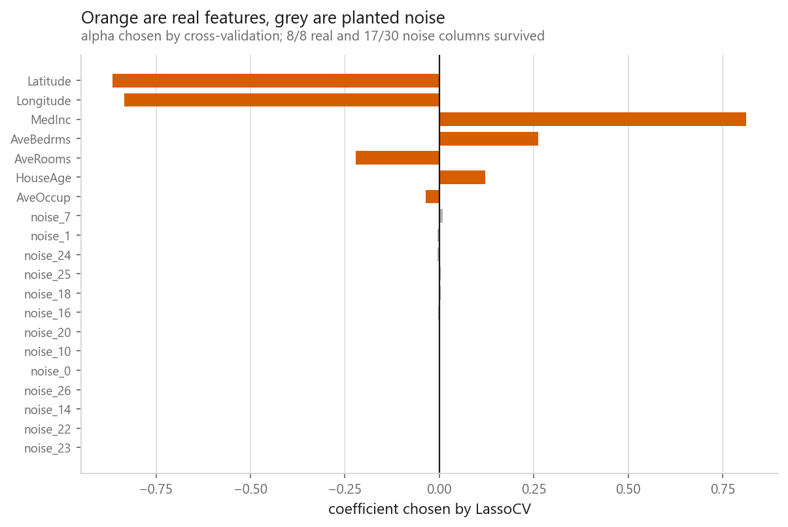
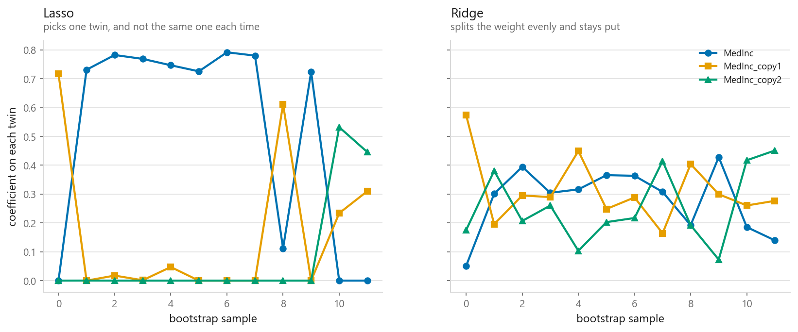

# Lasso regression

### The penalty that deletes features instead of shrinking them

**[Open the notebook](notebook.ipynb)** · Part 2, Regression ·
Made by [Elyes Lounissi](https://www.linkedin.com/in/elyes-lounissi/)

| | |
|---|---|
| **What you will learn** | Why swapping a square for an absolute value produces exact zeros, what that geometry looks like, how Lasso behaves on correlated features, and why `LassoCV` is **not** a feature selector |
| **You should already know** | [Ridge regression](../04-ridge-regression/) |
| **Datasets** | California Housing, with noise columns added to test feature selection |
| **Runtime** | About a minute on a laptop CPU |

---

## One character of difference

$$J_{\text{ridge}} = \|Xw - y\|^2 + \alpha \sum_i w_i^2 \qquad J_{\text{lasso}} = \|Xw - y\|^2 + \alpha \sum_i |w_i|$$

**Lasso sets weights to exactly zero. Ridge never does.**

The reason is the derivative. Near zero the square's gradient is $2w$, which
vanishes as $w$ does — the push toward zero weakens exactly when it is needed to
finish, so the weight glides in without arriving. The absolute value's gradient is
$\pm\alpha$, constant all the way down. It keeps pushing until the weight hits zero.

Geometrically: Ridge's budget region is a **circle**, Lasso's a **diamond** with
corners on the axes. A curve touching a circle almost never touches at exactly the
top. A curve touching a diamond very often touches at a corner — and a corner is a
point where one coordinate is exactly zero.

Ridge's lines glide toward zero and none arrive. Lasso's hit zero one by one:

| alpha | Features kept |
|---|---|
| 0.001 | all 8 |
| 0.05 | 4 — MedInc, HouseAge, Latitude, Longitude |
| 0.3 | 1 — MedInc |

## The result that matters: LassoCV is not a feature selector

I added **30 pure noise columns** to California Housing and let `LassoCV` choose
alpha. It kept every real feature — and **17 of the 30 noise columns**. More than
half the garbage survived a method sold as automatic feature selection.

The reason is a mismatch of objectives nobody mentions. Cross-validation chose
alpha to **minimise prediction error**, landing on 0.0032 — tiny. At that setting
the penalty barely bites, so useless columns get small non-zero weights instead of
exact zeros. Those small weights cost almost nothing in error, which is precisely
why cross-validation is indifferent to them.

| alpha | Real kept | Noise kept | CV RMSE |
|---|---|---|---|
| 0.0032 *(CV choice)* | 8/8 | **17/30** | 0.7267 |
| 0.01 | 7/8 | **1/30** | 0.7291 |
| 0.03 | 6/8 | 0/30 | 0.7497 |
| 0.1 | 3/8 | 0/30 | 0.8211 |

Raising alpha cleans the list out, and prediction error barely moves until real
features start going too. **Selecting features and predicting well are different
goals, and `LassoCV` optimises the second.** If you want a defensible shortlist,
choose alpha yourself — around 0.01 here buys a nearly clean list for 0.0024 RMSE.

## Where Lasso struggles

Given three near-identical copies of `MedInc`, Lasso keeps one **arbitrarily** and
the choice jumps from sample to sample:

| | Coefficient spread across 12 refits |
|---|---|
| Lasso | 0.360, 0.257, 0.191 |
| Ridge | 0.113, 0.113, 0.128 |

Fine if you only want predictions. Misleading if you then say "the model selected
this feature, so it is the important one". For correlated groups **and** selection,
use [Elastic Net](../06-elastic-net/).

## Cheat sheet

| | |
|---|---|
| **Use it when** | Many features, most probably useless; you want a smaller model |
| **Prefer Ridge when** | Features are correlated and you want stable coefficients |
| **Scaling needed** | Yes, always. The penalty is unit-blind |
| **No closed form** | The absolute value is not differentiable at zero, so it is solved by coordinate descent — hence `max_iter` |
| **Watch out** | Among correlated features it picks one nearly at random |
| **Watch out more** | `LassoCV` tunes for prediction, not sparsity. It kept 17 of 30 noise columns here |

---

Made by **Elyes Lounissi** ·
[LinkedIn](https://www.linkedin.com/in/elyes-lounissi/) ·
[pilot.tun@gmail.com](mailto:pilot.tun@gmail.com)

Back to [Part 2](../) · [the curriculum](../../CURRICULUM.md) · [the book](../../README.md)

`#MachineLearning` `#Lasso` `#L1Regularization` `#FeatureSelection` `#Regression`
`#Python` `#ScikitLearn` `#DataScience` `#MLTutorial` `#SparseModels`
