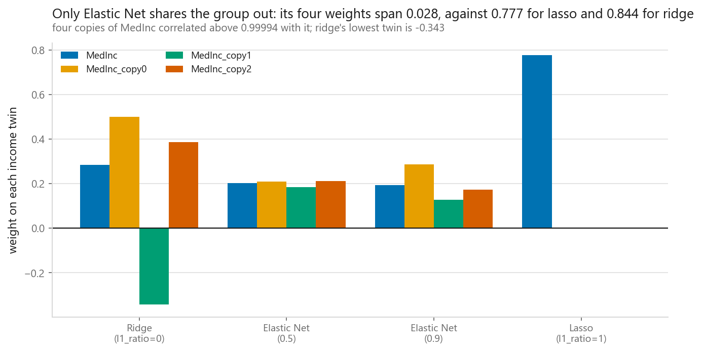
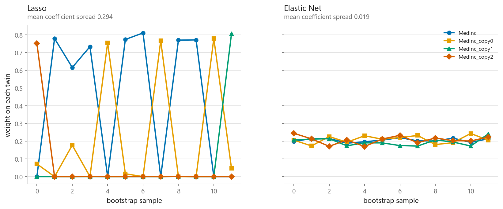
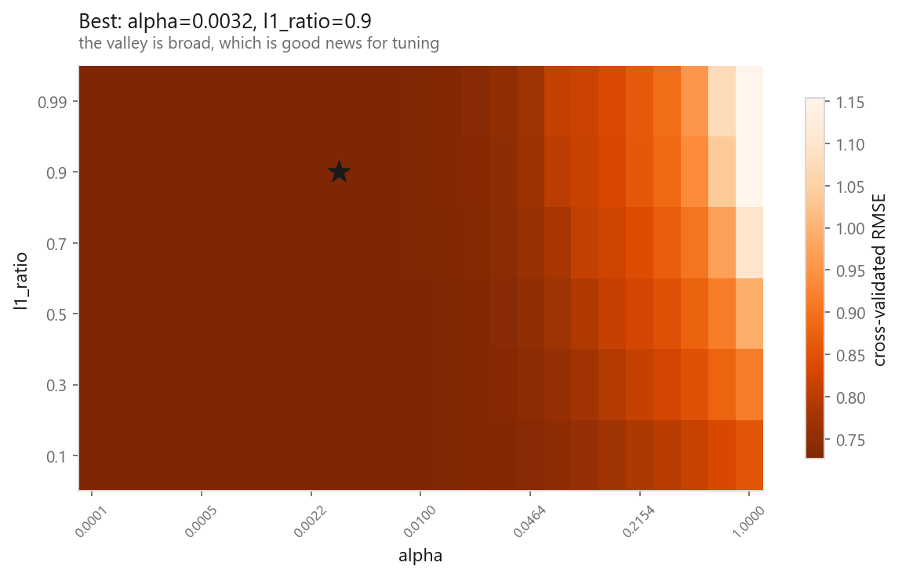
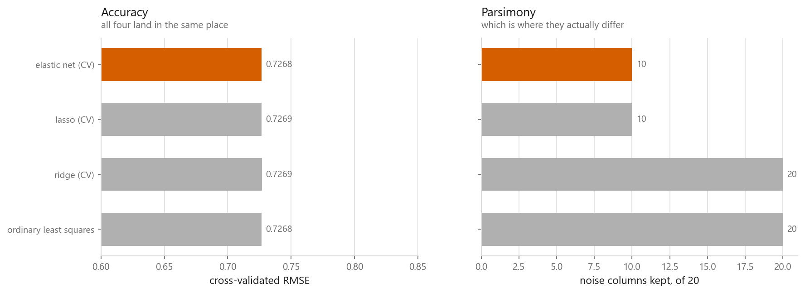

# Elastic Net

### Both penalties, and why you would want both

**[Open the notebook](notebook.ipynb)** · Part 2, Regression ·
Made by [Elyes Lounissi](https://www.linkedin.com/in/elyes-lounissi/)

| | |
|---|---|
| **What you will learn** | What mixing L1 and L2 buys, the grouping effect that neither penalty has alone, how to tune two hyperparameters without fooling yourself, and when the extra complexity is not worth it |
| **You should already know** | [Ridge](../04-ridge-regression/) and [Lasso](../05-lasso-regression/) |
| **Dataset** | California Housing, with correlated groups and noise columns planted |
| **Runtime** | Two to three minutes on a laptop CPU |

---

## The headline: accuracy is a tie, stability is not

Four regularisers on the same 20,640 rows and 31 columns (8 real features, 3
near-copies of `MedInc`, 20 pure noise):

| Model | RMSE | Noise columns kept | Twins kept |
|---|---|---|---|
| Ordinary least squares | 0.7268 | 20 | 4 |
| Ridge (CV) | 0.7269 | 20 | 4 |
| Lasso (CV) | 0.7269 | 10 | 2 |
| Elastic Net (CV) | 0.7268 | 10 | 2 |

**All four agree to within 0.0001 RMSE.** If prediction error is your only measure
you would never know which one you ran. Everything Elastic Net is worth shows up in
the coefficients, not the score.

And the number that actually earns it a place:

| Mean coefficient spread across 12 bootstrap refits | |
|---|---|
| Lasso | 0.2938 |
| Elastic Net (`l1_ratio=0.5`) | **0.0190** |

**Fifteen times steadier** on the same correlated group.

## The grouping effect

Four near-identical income columns. Ridge at `alpha=1.0`, the rest at `alpha=0.01`:

| Model | MedInc | copy0 | copy1 | copy2 | Twins kept | Twin sum | Noise kept |
|---|---|---|---|---|---|---|---|
| Ridge (`l1_ratio=0`) | 0.284 | 0.501 | **-0.343** | 0.387 | 4 | 0.830 | **20** |
| Elastic Net (0.5) | 0.202 | 0.209 | 0.185 | 0.212 | 4 | 0.808 | 6 |
| Elastic Net (0.9) | 0.195 | 0.288 | 0.129 | 0.172 | 4 | 0.784 | 2 |
| Lasso (`l1_ratio=1`) | **0.777** | 0.001 | 0.000 | 0.000 | 2 | 0.777 | 1 |

Read the individual columns, not the count. Lasso puts **0.777 of 0.777** on one
twin and leaves the rest at zero. It picked a winner. Elastic Net at 0.5 spreads
0.808 across four weights that sit between 0.185 and 0.212, a span of **0.028**.
That even split is the grouping effect, and neither parent penalty produces it.

Ridge keeps all four and makes a mess of them: a span of **0.844**, wider than
lasso's, with one copy of a positive predictor handed a **negative** weight so the
others can be larger. It also keeps all 20 noise columns. Elastic Net at 0.5 keeps
6, at 0.9 keeps 2.

That row was invisible in the first version of this figure, which was a stacked
bar. A stacked bar draws -0.343 *downward* from the running total, painting over
the segment beneath it, so the rendered ridge bar showed no negative anywhere and
left only about a third of `copy0`'s segment visible, so 0.501 read as a small
positive. Redrawn as grouped bars with a zero line, the row says what it said all
along. A chart that hides the thing the prose is pointing at gets redrawn, not
recaptioned.

### Ridge does group, once it is paying attention

Ridge's row is drawn at `alpha=1`, and that is a statement about alpha rather than
about L2. Raise it on the same four columns:

| alpha | MedInc | copy0 | copy1 | copy2 | Span | Sum |
|---|---|---|---|---|---|---|
| 1 | +0.284 | +0.501 | **-0.343** | +0.387 | 0.844 | 0.830 |
| 10 | +0.220 | +0.289 | +0.063 | +0.259 | 0.227 | 0.830 |
| 100 | +0.210 | +0.219 | +0.190 | +0.215 | **0.028** | 0.834 |
| 1000 | +0.208 | +0.210 | +0.206 | +0.209 | **0.004** | 0.833 |

The L2 penalty charges for the *length* of the weight vector, and four weights of
0.2 cost a quarter of what one weight of 0.8 costs, so an even split is the cheap
way to deliver a given total. At `alpha=1` on 20,640 rows the penalty is a
rounding error next to the data term and what you see is least squares picking an
arbitrary point on a flat ridge.

So the top row of that chart is a **weak penalty against a strong one**, labelled
by penalty. What Elastic Net genuinely has is that it reaches the grouped solution
at an alpha two orders of magnitude smaller, and zeroes noise on the way, which
ridge never does at any alpha.

The `twin sum` column is the check that everyone is solving the same problem: the
total income weight runs 0.777 to 0.830 across every row. They differ only in how
it is distributed.

## Does the choice hold still?

Twelve bootstrap resamples of 4,000 rows, refit each time, and watch the four twin
coefficients:

| | Mean spread across 12 refits |
|---|---|
| Lasso | 0.2938 |
| Elastic Net | 0.0190 |

Lasso's lines cross and swap: the winning twin changes from sample to sample, and
0.2938 is roughly a third of the total income weight moving around. Elastic Net's
four lines stay flat and stacked at 0.0190.

This is what makes a claim like "the model selected this feature, so it matters"
defensible or not. With Lasso on correlated columns, it is not.

## Two dials, unequally important

A 6 × 25 grid (`l1_ratio` in {0.1, 0.3, 0.5, 0.7, 0.9, 0.99}, `alpha` on
`logspace(-4, 0, 25)`), each cell a 5-fold cross-validated RMSE:

| | RMSE |
|---|---|
| Best on the grid (`alpha=0.00316`, `l1_ratio=0.9`) | **0.7265** |
| Worst on the grid | 1.1539 |

The full span is 0.4274 RMSE, and essentially all of it is the `alpha` axis.
Holding `alpha` at its best value and sweeping `l1_ratio` across all six settings
moves RMSE by **0.0003**; holding `l1_ratio` and sweeping `alpha` across all 25
moves it by **0.4274**. Tune `alpha` carefully, `l1_ratio` casually. And note what
the flat axis implies: cross-validation has almost nothing to go on when it picks
`l1_ratio`, which is what the next section pays for.

## Is any of it worth it?

Back to the first table, with the part I would rather not skip. `ElasticNetCV`
landed on 10 noise columns and 2 twins, **identical to `LassoCV`**, and nothing
like the 4-twin even split that Elastic Net produced at `l1_ratio=0.5`.

That is not a bug. It is the same trap as [`LassoCV` not being a feature
selector](../05-lasso-regression/), arriving one chapter later by a different
route. Cross-validation searched for the pair minimising prediction error, the
`l1_ratio` axis is flat to within 0.0003 so it had almost nothing to go on there,
and the flat stretch it settled into is the L1-heavy end: `l1_ratio=0.9` with
`alpha=0.00316`. At that setting Elastic Net *is* Lasso for practical purposes,
which means **the grouping effect is lost, and the stability that came with it is
lost too**. That is the one thing you reached for Elastic Net to get.

So: if you want the grouping effect, you have to ask for it. Pick a lower
`l1_ratio` yourself, or restrict the search range, and pay the RMSE it costs,
which here is fractions of a thousandth. Letting CV choose freely hands the
behaviour back to Lasso while the score stays flat enough that nothing warns you.

## Cheat sheet

| | |
|---|---|
| **Use it when** | You have correlated groups of features **and** want selection. That combination is the entire reason it exists |
| **Prefer Lasso when** | Features are largely independent and you want the smallest model |
| **Prefer Ridge when** | You want stable coefficients and have no interest in dropping columns |
| **Scaling** | Required, as for both parents. The penalty is unit-blind |
| **Main dials** | `alpha` for strength, `l1_ratio` for the mix. Sweeping `alpha` spanned 0.4274 RMSE here; sweeping `l1_ratio` spanned 0.0003 |
| **Watch out** | `ElasticNetCV` optimises prediction, so it drifted to `l1_ratio=0.9` and selected exactly like Lasso. Constrain the range if grouping is the goal |
| **Watch out more** | Two hyperparameters is twice the chance of tuning on the test set. Keep the search inside the outer folds, and expect to raise `max_iter` |

---

If this chapter was useful, a star on the repository helps other people find it.
The code is yours to use, copy and adapt in your own work, no permission needed.

Made by **Elyes Lounissi** ·
[LinkedIn](https://www.linkedin.com/in/elyes-lounissi/) ·
[pilot.tun@gmail.com](mailto:pilot.tun@gmail.com)

Back to [Part 2](../) · [the curriculum](../../CURRICULUM.md) · [the book](../../README.md)

`#MachineLearning` `#ElasticNet` `#Regularization` `#L1` `#L2` `#FeatureSelection`
`#Regression` `#Python` `#ScikitLearn` `#MLTutorial`
