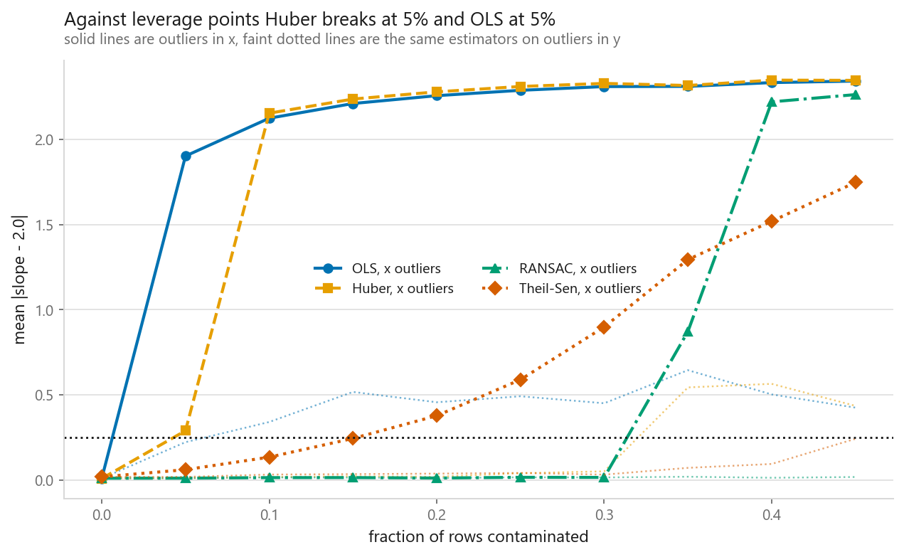
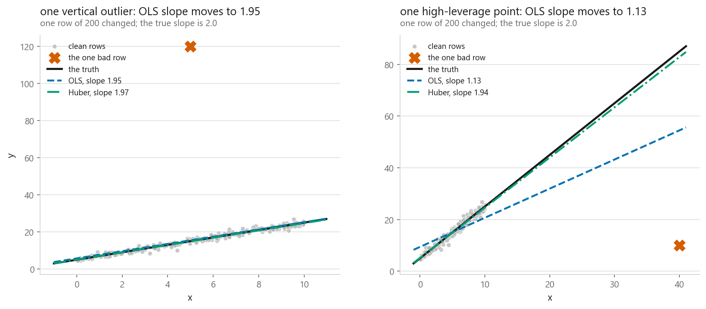
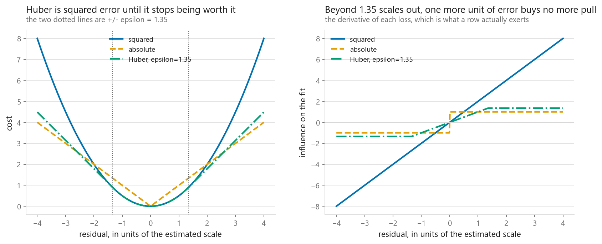
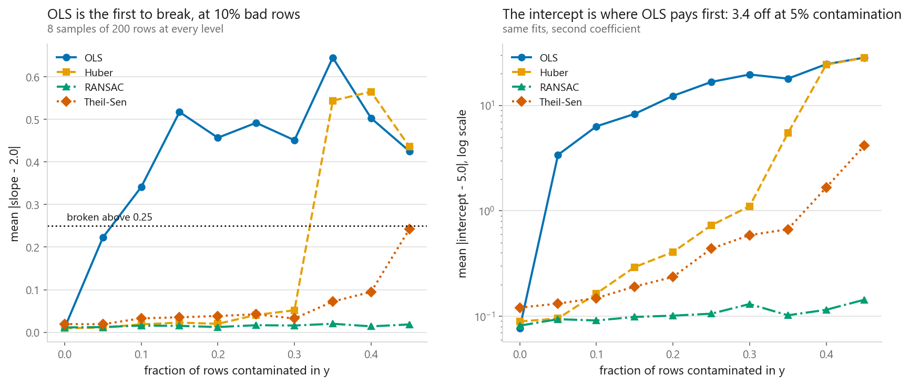
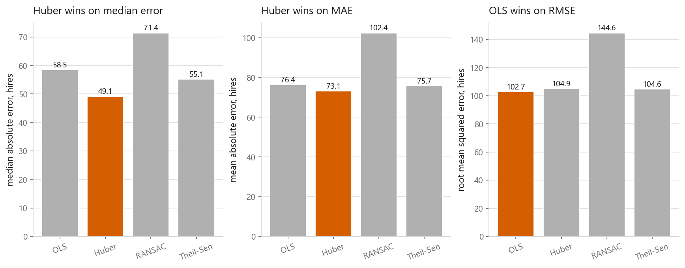

# Outlier-resistant regression: Huber, RANSAC and Theil-Sen

### Finding the point where each estimator gives up, by pushing it there

**[Open the notebook](notebook.ipynb)** · Part 2, Regression ·
Made by [Elyes Lounissi](https://www.linkedin.com/in/elyes-lounissi/)

| | |
|---|---|
| **What you will learn** | Why squared error hands the answer to its worst row, what Huber, RANSAC and Theil-Sen do instead, how to measure a breakdown point rather than quote one, and why a bad x is a different problem from a bad y |
| **You should already know** | [Linear regression](../01-linear-regression/) and [ridge](../04-ridge-regression/) |
| **Datasets** | A synthetic line I can contaminate on purpose (200 rows, 8 samples per level), then UCI Bike Sharing |
| **Runtime** | Around two minutes on a laptop CPU |

---

## The result I would lead with

The same contamination sweep, run twice. Once with the bad rows given a wrong y
at a normal x, and once with them pushed far out along x. An estimator counts as
broken at the first level where its mean absolute slope error crosses 0.25.

| Estimator | Breaks on outliers in y | Breaks on outliers in x |
|---|---|---|
| OLS | 10% | **5%** |
| Huber | 35% | **5%** |
| Theil-Sen | never in this sweep | 20% |
| RANSAC | never in this sweep | 35% |

**Against high-leverage points Huber breaks at exactly the same contamination as
plain least squares.** At 10% bad rows in x, Huber's slope error is **2.153** and
ordinary least squares' is **2.124**, so the resistant loss is a shade worse than
the loss it was brought in to replace.

The mechanism is not a bug in the implementation. Huber downweights rows with
large *residuals*. A leverage point sits far out in x, the line rotates to reach
it, and once it has rotated the leverage point has a small residual and keeps
full weight. Huber is protecting the line from rows the line already abandoned.

The two survivors never trusted the residual. Their ordering also flips at the
top of the sweep, which the published breakdown points do not tell you:

| Contamination in x | OLS | Huber | RANSAC | Theil-Sen |
|---|---|---|---|---|
| 5% | 1.902 | 0.290 | **0.012** | 0.061 |
| 15% | 2.210 | 2.236 | **0.015** | 0.245 |
| 30% | 2.309 | 2.328 | **0.016** | 0.899 |
| 35% | 2.310 | 2.316 | **0.872** | 1.294 |
| 40% | 2.333 | 2.347 | 2.220 | **1.519** |
| 45% | 2.342 | 2.346 | 2.262 | **1.747** |

RANSAC is near-perfect up to 30% and then snaps. Theil-Sen degrades on a
gradient from the first level and is never as good as RANSAC early, but it is
**ahead of RANSAC by 0.70 at 40%** and by 0.52 at 45%. Whichever one you want
depends on whether you would rather have an excellent answer that might be
catastrophic or a mediocre answer that stays mediocre.

Theil-Sen's measured breakdown of 20% also sits below the 29% usually published
for it, which is what an asymptotic adversarial number does when you meet it on
200 rows with a specific kind of outlier.

## One bad row, where Huber looks like the hero

Before any sweep, the smallest experiment. Take a clean sample of 200 rows, move
exactly one point, refit.

| | Slope, truth is 2.0 |
|---|---|
| clean OLS | 1.975 |
| OLS after one vertical outlier | 1.952 |
| OLS after one high-leverage point | **1.127** |
| Huber after one vertical outlier | 1.967 |
| Huber after one high-leverage point | **1.942** |

One row in 200 moved the OLS slope by **0.848** when placed far out in x, against
**0.022** when placed far out in y. That is the whole case for caring about
leverage.

The right-hand panel is worth pausing on, because it points the opposite way from
the sweep above. Against a *single* leverage point Huber holds the line at 1.942
while least squares falls to 1.127. Against 5% of them Huber is finished. One
leverage point is a minority Huber can afford to downweight; ten of them rotate
the line far enough that they stop looking like outliers at all. A demonstration
built on one bad row will tell you Huber solved the problem it has not solved.

## What the loss actually caps

Huber is quadratic near zero and linear beyond `epsilon`, which scikit-learn
defaults to **1.35** in units of the estimated scale. The derivative is what
decides how hard a row pulls, and Huber's stops growing at `epsilon` and never
grows again, while squared error's grows without limit. A row twice as far away
pulls twice as hard, forever.

That cap is the entire mechanism, and it is also the limit of the method. A
capped pull is still a pull, and enough capped rows pulling together still win.
That is the 35% in the y column of the first table.

## The coefficient you were not watching

The left panel is the slope sweep in y, where OLS is the first to break, at 10%.
The right panel is the same fits' intercepts, and it moves a level earlier:
**OLS's intercept is 3.4 off at 5% contamination**, when its slope error is still
0.223 and technically inside the threshold.

The reason is that the vertical outliers land at random x values, so their average
pull lifts the whole line rather than tilting it. Reading only the slope column
would have credited least squares with surviving one contamination level longer
than it did. An estimator can be badly damaged in a coefficient you are not
looking at.

## On Bike Sharing, where nobody labelled the outliers

13,034 training rows and 4,345 test hours of bicycle hires. Median 142 hires an
hour, mean 189.5, max 977. No injected outliers, plenty of hours no linear model
can explain.

| Estimator | MAE | Median error | RMSE | Worst hour | Negative predictions | Seconds |
|---|---|---|---|---|---|---|
| OLS | 76.37 | 58.53 | **102.66** | **444.92** | 446 | **0.03** |
| Huber | **73.12** | **49.14** | 104.93 | 490.80 | **412** | 1.29 |
| RANSAC | 102.38 | 71.42 | 144.60 | 711.69 | 470 | 0.35 |
| Theil-Sen | 75.75 | 55.13 | 104.63 | 479.44 | 420 | 18.43 |

Huber and least squares disagree about which is better and both are right. Huber
is **9.39 hires closer on the median hour** and 3.25 closer on MAE, and it pays
**2.28 more on RMSE**, because RMSE punishes exactly the busy hours Huber decided
to stop chasing. RMSE and the least squares objective are the same function, so
on that column one of the contestants wrote the exam. Name the cost before you
pick the metric.

RANSAC is last on all five error columns, and by a wide margin: its RMSE of
144.60 is 38% above the next worst. Its default threshold is the median absolute
deviation of y, which on a spiky demand series marks the busy hours as outliers
and fits a line to the quiet ones. Rush hour is not an error, it is the
distribution. RANSAC does keep one column, though, at 0.35 seconds against
Huber's 1.29 and Theil-Sen's 18.43. Being wrong quickly is still a column.

One number in that table belongs to the next two chapters rather than this one.
Every estimator predicted a negative number of bicycles: OLS on **446 of 4,345**
test hours, Huber on 412, Theil-Sen on 420, RANSAC on 470. No amount of outlier
resistance fixes that, because a target that cannot go below zero is a model
problem wearing an outlier costume.

## Cheat sheet

| | |
|---|---|
| **Huber** | Outliers in y, and a minority of them. One dial, `epsilon`, default 1.35 scales. Held to 35% contamination in y here |
| **Huber, do not** | Use it against high-leverage points. It broke at 5%, the same level as plain least squares, and at 10% it was 0.030 worse |
| **RANSAC** | Best resistance in x up to 30%, then it snaps. Set `residual_threshold` yourself; the default guessed wrong on real demand data and cost 29.26 hires of MAE against Huber |
| **Theil-Sen** | No threshold to choose and it degrades gradually, which put it 0.70 ahead of RANSAC at 40% contamination. Costs 18.43 s against 0.03 s for OLS |
| **First question** | Are your outliers in x or in y? The two need different methods, and only one of them is what tutorials demonstrate |
| **Measure, do not quote** | Breakdown points are asymptotic and adversarial. Theil-Sen's published 29% measured at 20% here |
| **Watch every coefficient** | The OLS intercept broke a full level before its slope did |
| **Do not test on one bad row** | One leverage point left Huber at 1.942 of a true 2.0. Ten of them left it at 2.153 of error |
| **Pick the metric first** | Resistant fits lose on RMSE by construction. Huber won the median by 9.39 and lost RMSE by 2.28 |
| **Next** | [Quantile regression](../08-quantile-regression/), then [Poisson regression](../09-generalised-linear-models/) for the negative predictions |

---

Made by **Elyes Lounissi** ·
[LinkedIn](https://www.linkedin.com/in/elyes-lounissi/) ·
[pilot.tun@gmail.com](mailto:pilot.tun@gmail.com)

Back to [Part 2](../) · [the curriculum](../../CURRICULUM.md) · [the book](../../README.md)

`#MachineLearning` `#HuberRegression` `#RANSAC` `#TheilSen` `#BreakdownPoint`
`#OutlierDetection` `#LeveragePoints` `#LinearRegression` `#ScikitLearn`
`#BikeSharing` `#MLTutorial` `#LearnMachineLearning` `#DataScience` `#AI`
