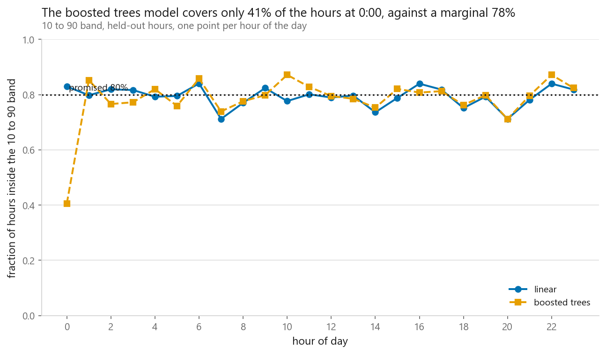
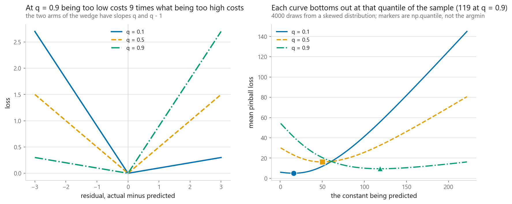
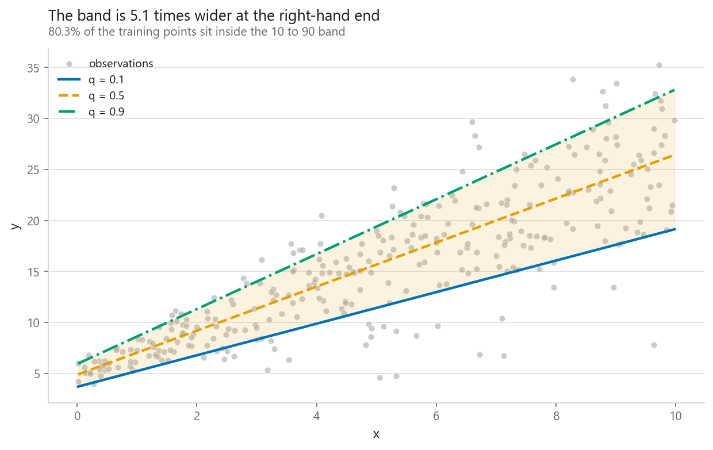
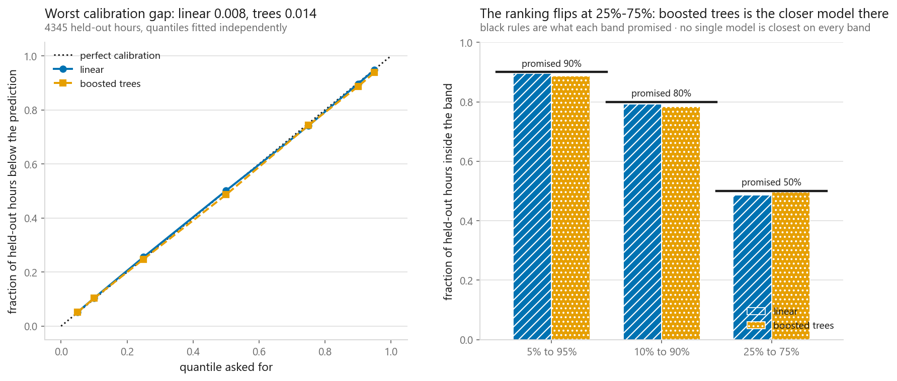
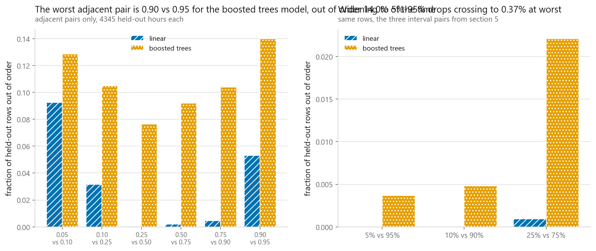

# Quantile regression

### Predicting a range instead of a number, and then checking whether the range is honest

**[Open the notebook](notebook.ipynb)** · Part 2, Regression ·
Made by [Elyes Lounissi](https://www.linkedin.com/in/elyes-lounissi/)

| | |
|---|---|
| **What you will learn** | What the pinball loss is and why minimising it returns a quantile, why fitting it is a linear program rather than a normal equation, how to measure whether a predicted interval covers what it promised, and why two quantile fits can swap places |
| **You should already know** | [Linear regression](../01-linear-regression/) and [outlier-resistant regression](../07-outlier-resistant-regression/) |
| **Datasets** | A synthetic fan whose spread grows with x, then Bike Sharing: 13,034 training rows by 53 columns, 4,345 held out |
| **Runtime** | Around three minutes on a laptop CPU. The seven linear programs take 77.0 s of it and the seven gradient boosters 54.5 s |

---

## The result I would lead with

The boosted model wins the training objective at six of the seven quantiles,
sometimes by a lot:

| q | Linear pinball | Boosted trees | Trees better by |
|---|---|---|---|
| 0.05 | 6.837 | 7.148 | **-0.311** |
| 0.10 | 12.569 | 11.290 | 1.278 |
| 0.25 | 26.029 | 18.786 | 7.243 |
| 0.50 | 36.453 | 22.585 | **13.868** |
| 0.75 | 30.604 | 18.121 | 12.483 |
| 0.90 | 16.977 | 10.849 | 6.128 |
| 0.95 | 9.703 | 7.077 | 2.627 |

Its 10-90 intervals are also narrower, 175.7 hires wide against 233.8, and its
marginal coverage of 78.4% is a point and a half off the 80% it promised. On
every number a paper would print, the trees are the better model.

Then condition on hour of day and the midnight column reads **0.406**.

| | Marginal | Worst hour | Best hour |
|---|---|---|---|
| linear | 0.793 | 0.712 at 20:00 | 0.840 at 6:00 |
| boosted trees | 0.784 | **0.406 at 0:00** | 0.872 at 22:00 |

At midnight the boosted 10-90 band contains four of every ten held-out hours,
against a promise of eight. The marginal number gives no hint of it, because the
other twenty-three hours quietly absorb the damage. The linear model, which is
worse on every loss in the table above, never drops below 0.712 in any hour.

**A single coverage number is an average, and an average over hours is exactly
the thing a planning problem cannot use.** The hour you care about is the one
where the number went wrong.

## The loss is one asymmetric wedge

For a target y, a prediction ŷ and a level q, the cost is `q(y - ŷ)` when the
prediction is too low and `(1 - q)(ŷ - y)` when it is too high. At q = 0.9 being
too low costs nine times what being too high costs, so the fit climbs until only
a tenth of the points remain above it.

The written-from-scratch version agrees with scikit-learn to six decimals,
**10.505835 against 10.505835**.

Minimising it on a constant recovers the sample quantile:

| q | Argmin of the loss | `np.quantile` | Gap |
|---|---|---|---|
| 0.10 | 16.079 | 15.991 | 0.0885 |
| 0.50 | 50.024 | 50.110 | 0.0859 |
| 0.90 | 118.897 | 118.807 | 0.0899 |

The grid step in that search is 0.246, so a gap of 0.09 is the search resolution
rather than a disagreement about the answer.

## Fitting a line means solving a linear program

The pinball loss has no derivative at the kink, so there is no normal equation.
Splitting each residual into non-negative positive and negative parts turns the
objective linear, and a linear program solves it exactly. The notebook runs that
solver, scikit-learn, and a hand-written subgradient descent side by side:

| q | LP loss | Subgradient | scikit-learn | Fraction below the LP line |
|---|---|---|---|---|
| 0.10 | 0.67087 | 0.67236 | 0.67087 | 0.1033 |
| 0.50 | 1.40742 | 1.40745 | 1.40742 | 0.5033 |
| 0.90 | 0.58846 | 0.58930 | 0.58846 | 0.9000 |

The subgradient run, with a decaying schedule and averaged iterates, matches to
five decimals on the median and misses in both tails, where the loss is nearly
flat along one direction. That is the honest reason the library ships a solver
and not a descent loop.

The last column is a property of the optimum, not luck: the fraction of training
points at or below the fitted line comes out at the q you asked for. It is an
**in-sample** guarantee and it says nothing at all about the held-out numbers in
the section above.

## What the fan shows that a single line cannot

On synthetic data whose spread grows with x, the fitted 10-90 band is **2.63
wide at the low end and 13.33 at the high end**, a 5x change, with in-sample
coverage of 0.8033. Three quantile fits give three different slopes. A least
squares line gives one slope and one residual spread, so every interval built
from it is the same width everywhere, which is the wrong shape for this data and
for the bike hires that follow.

## Calibration against sharpness

Held-out coverage on Bike Sharing, with the width alongside it:

| Model | Interval | Promised | Delivered | Mean width | Miss |
|---|---|---|---|---|---|
| linear | 5%-95% | 0.9000 | 0.8964 | 285.8 | -0.0036 |
| boosted trees | 5%-95% | 0.9000 | 0.8872 | 244.0 | -0.0128 |
| linear | 10%-90% | 0.8000 | 0.7933 | 233.8 | -0.0067 |
| boosted trees | 10%-90% | 0.8000 | 0.7839 | 175.7 | -0.0161 |
| linear | 25%-75% | 0.5000 | 0.4863 | 131.1 | -0.0137 |
| boosted trees | 25%-75% | 0.5000 | **0.4967** | 83.6 | **-0.0033** |

The pattern is mostly the one you would expect. Narrower bands catch fewer
points, and the linear model is closer to its promise on the two outer
intervals. On the innermost band it reverses: the trees are 83.6 hires wide,
**36% narrower** than the linear model's 131.1, and still closer to the target,
missing by 0.0033 against 0.0137.

Any model can buy coverage by widening. A coverage number printed without a
width next to it is not a result, and this table is why the notebook prints them
together.

## Crossing is countable, so count it

Seven quantiles were fitted independently. Nothing in any of the seven fits
knows the others exist, and nothing enforces the one property a set of quantiles
must have, which is order. Over 26,070 neighbouring-pair checks:

| Pair | Linear | Boosted trees |
|---|---|---|
| 0.05 vs 0.10 | 0.0925 | 0.1284 |
| 0.10 vs 0.25 | 0.0315 | 0.1049 |
| 0.25 vs 0.50 | 0.0005 | 0.0764 |
| 0.50 vs 0.75 | 0.0021 | 0.0921 |
| 0.75 vs 0.90 | 0.0046 | 0.1040 |
| 0.90 vs 0.95 | 0.0532 | 0.1399 |
| **overall** | **3.07%** (801) | **10.76%** (2,806) |

The flexible model crosses **3.5x more often**, and the linear model's crossings
concentrate in the tails where its two fitted lines are nearly parallel. The
trees cross everywhere, including 7.6% of the time between the 25th and 50th
percentile, where the two levels are far apart.

One held-out row makes it concrete. Row 1 of the test set, boosted trees, all
seven levels in order of q:

`3.1, 2.0, 4.2, 4.0, 0.5, 22.0, 17.1`

The 10th percentile sits 1.1 hires below the 5th, the 75th sits below all of
them, and the 95th sits below the 90th. That is not a noisy estimate of a
distribution. It is not a distribution.

Sorting each row costs one line and is what I would ship. It patches the
symptom; the cause is that seven fits were never constrained to agree.

## The failure that no loss function fixes

Both models predict a negative number of bicycles.

| Model | Held-out hours with a negative 5th percentile |
|---|---|
| linear | **1,011 of 4,345** (23.3%) |
| boosted trees | 212 of 4,345 (4.9%) |

The observed minimum in the entire dataset is 1 hire. Almost a quarter of the
linear model's lower bounds are impossible. This is not a calibration problem or
a crossing problem, and no choice of loss repairs it, because the assumption
that a count cannot go below zero does not live in the loss. It lives in the
link function, which is [the next chapter](../09-generalised-linear-models/).

## Cheat sheet

| | |
|---|---|
| **Use it when** | The spread of the target changes across the input space, or the decision needs a range rather than a point |
| **The loss** | Pinball, slopes q and q - 1. Minimising it returns the q-th conditional quantile with no distributional assumption |
| **Linear version** | `QuantileRegressor`. Exact, solved as a linear program, and slow: 77.0 s for seven fits here |
| **Non-linear version** | `GradientBoostingRegressor(loss="quantile", alpha=q)`. One model per quantile, so n quantiles cost n fits |
| **Always measure** | Held-out coverage next to interval width. Coverage alone can always be bought by widening |
| **Then measure again** | Coverage conditioned on something. A marginal 0.784 here hid an hour sitting at 0.406 |
| **Watch out** | Independent fits cross. 10.76% of neighbouring pairs for the boosted model. Sort the row before shipping it |
| **Does not fix** | A target with a hard bound. 1,011 negative bicycle counts need a link function, not a loss |
| **Next** | [Generalised linear models](../09-generalised-linear-models/) |

---

Made by **Elyes Lounissi** ·
[LinkedIn](https://www.linkedin.com/in/elyes-lounissi/) ·
[pilot.tun@gmail.com](mailto:pilot.tun@gmail.com)

Back to [Part 2](../) · [the curriculum](../../CURRICULUM.md) · [the book](../../README.md)

`#QuantileRegression` `#PinballLoss` `#PredictionIntervals` `#Calibration`
`#GradientBoosting` `#ScikitLearn` `#BikeSharing` `#MachineLearning`
`#MLTutorial` `#LearnMachineLearning` `#DataScience` `#AI`
