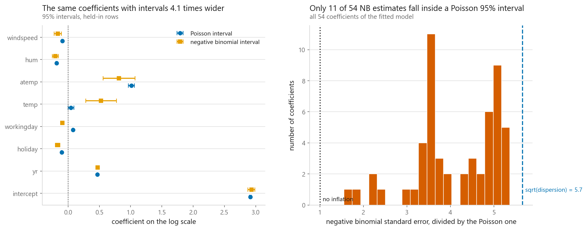
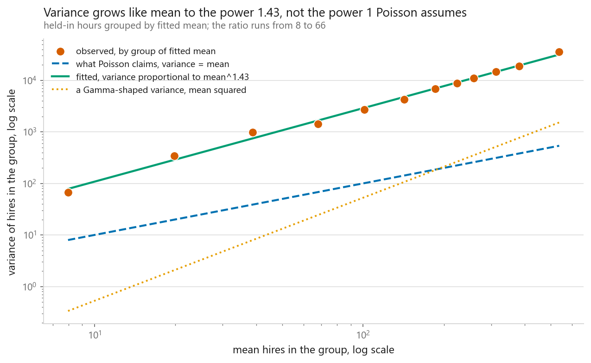
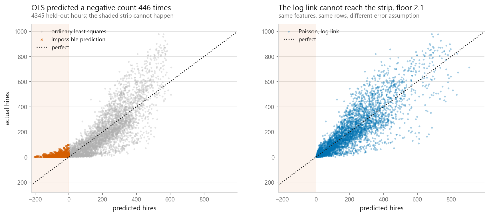
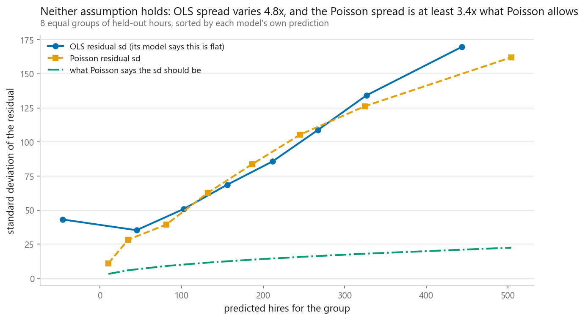
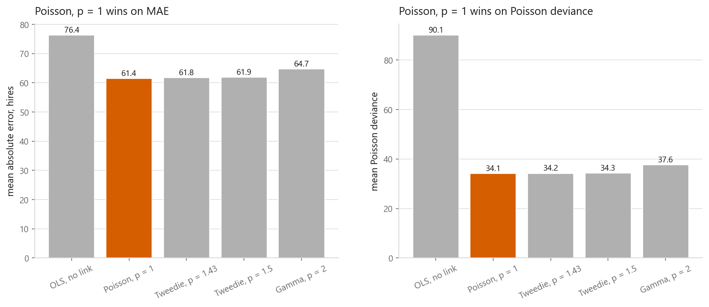

# Generalised linear models

### The Poisson family failed its own test by 32x and still made the best predictions

**[Open the notebook](notebook.ipynb)** · Part 2, Regression ·
Made by [Elyes Lounissi](https://www.linkedin.com/in/elyes-lounissi/)

| | |
|---|---|
| **What you will learn** | What a GLM generalises, how to fit Poisson regression by hand with iteratively reweighted least squares, how to test the Poisson variance assumption instead of assuming it, and what overdispersion does to standard errors |
| **You should already know** | [Linear regression](../01-linear-regression/) and [quantile regression](../08-quantile-regression/), which ends on the negative-count problem this chapter fixes |
| **Dataset** | Bike Sharing, 17,379 hourly counts. 13,034 training rows by 53 columns, 4,345 held out |
| **Runtime** | Around two minutes on a laptop CPU. The statsmodels Poisson fit takes 2.8 s and the negative binomial plus quasi-Poisson 5.6 s |

---

## The result I would lead with

The notebook measures the Poisson assumption instead of assuming it, and the
assumption fails by a wide margin. After the model has explained everything the
53 features can explain, the leftover dispersion is **31.98** where a correct
Poisson model puts it at 1.00. Fitting a negative binomial, which is a real
distribution built for exactly this, improves the fit enormously:

| | AIC | Held-out MAE | Held-out RMSE |
|---|---|---|---|
| Poisson | 508,123 | **61.41** | **91.43** |
| negative binomial | **144,914** | 63.42 | 99.99 |

**AIC favours the negative binomial by 363,209. Held-out mean absolute error
favours the Poisson model by 2.02 hires.**

It happens twice. The notebook also measures the exponent linking variance to
mean directly from the data, gets 1.43, and hands that to a Tweedie model built
for that exact power. It scored 61.78 against plain Poisson's 61.41.

The reason is a property of the Poisson score equation, `Xᵀ(y - μ) = 0`, which
only requires the **mean** model to be right. Get the variance wrong and the
coefficients stay consistent, just inefficient. What breaks is everything
downstream of the variance, which is every standard error and every interval.

So the variance function is about how much you should believe the fit, not about
where the fit goes. If you are predicting, get the link right and stop worrying
about the family. If you are explaining, get the family right, because the next
section is what happens when you do not.

## What overdispersion costs, and what it does not

Quasi-Poisson rescales every standard error by the square root of the
dispersion, and the notebook prints both to check the arithmetic against itself:

| Repair | Median standard error inflation over Poisson |
|---|---|
| quasi-Poisson | 5.66 |
| square root of the dispersion | 5.66 |
| negative binomial | 4.14 |

The consequence is not subtle. Of the 54 coefficients, **only 11 negative
binomial estimates fall inside the corresponding Poisson 95% interval**. Those
intervals are not slightly optimistic. Forty-three of them exclude the estimate
a better-specified model produces for the same coefficient.

Then the counter-result, which the notebook prints rather than skips:

| Model | Coefficients significant at 5%, out of 54 |
|---|---|
| Poisson | 52 |
| quasi-Poisson | 47 |
| negative binomial | 50 |

Inflating every standard error by 5.66x moved the count of stars from 52 to 47.
With 13,034 rows the errors are small enough that most coefficients stay well
clear of zero anyway. The damage lands entirely on the intervals, which is what
an analyst should be reporting, and not on the significance markers, which is
what usually gets read.

## Testing the assumption instead of assuming it

The raw data announces the problem immediately: hourly hires have a mean of
189.46 and a variance of 32,901.5, a ratio of **173.7** where Poisson demands
1.0. That number proves nothing on its own. A mixture of Poisson variables with
different means is overdispersed even when every component is perfectly Poisson,
and hourly demand is precisely such a mixture.

The honest test conditions on the fitted mean first, and the ratio drops from
173.7 to **32.0**, which is where it stops dropping. Binned by fitted level:

| Mean of the bin | Variance | Variance / mean |
|---|---|---|
| 7.98 | 66.63 | 8.35 |
| 38.74 | 981.14 | 25.33 |
| 142.40 | 4,236.99 | 29.75 |
| 312.75 | 14,719.13 | 49.27 |
| 537.20 | 35,406.63 | **65.91** |

Above one in every bin, and climbing with the level. The log-log slope of
variance against mean is **1.425**: Poisson would need 1.000, Gamma would need
2.000, so this data sits between the two families anybody would reach for. The
estimated negative binomial `alpha` is 0.1260, and after that fit the Pearson
statistic over degrees of freedom falls from 31.98 to **1.78**.

## The link is the part that earns its keep

Ordinary least squares on the same counts, same split, same features:

| | MAE | RMSE | Poisson deviance | Lowest prediction |
|---|---|---|---|---|
| OLS, no link | 76.37 | 102.66 | 90.111 | **-201.3** |
| Poisson, log link | **61.41** | **91.43** | **34.057** | 2.10 |

Least squares predicted a negative number of bicycles for **446 of 4,345
held-out hours**, 10.3% of them, with a floor of -201.3. The lowest count ever
recorded in the dataset is 1. The log link makes negative predictions
unreachable by construction, because the exponential of anything is positive,
and it also cut MAE by 15 hires and Poisson deviance by nearly two thirds.

This is the failure [quantile regression](../08-quantile-regression/) ended on
and could not repair, because the constraint that a count cannot go below zero
does not live in the loss function.

## How the residuals actually spread

Sort the held-out hours by what each model predicted, then measure the residual
spread inside each group. If least squares were right, that spread would be flat
across the groups. If Poisson were right, the spread over the square root of the
prediction would be flat instead.

Neither holds:

| | What it assumes is flat | How much it actually varies |
|---|---|---|
| OLS | residual standard deviation | **4.81x** |
| Poisson | residual sd / sqrt(level) | 2.11x |

The Poisson version is less wrong, which is a real improvement, and it is still
above its own curve at every level. Its `sd / sqrt(level)` climbs from 3.42 in
the quietest group to 7.22 in the busiest. That gap is the overdispersion the
previous section put a number on, seen before the test was run.

## Twelve lines of iteratively reweighted least squares

The Poisson log likelihood is concave, its score is `Xᵀ(y - μ)`, and its second
derivative is `-XᵀWX` with `W = diag(μ)`, so Newton's method converges from
anywhere sensible. Each Newton step is a weighted least squares solve, which is
where the name comes from.

The hand-written version **converged in 6 passes in under 0.01 s**, and agrees
with `PoissonRegressor` to eight decimals:

| | Mine | scikit-learn |
|---|---|---|
| intercept | 5.08550808 | 5.08550807 |
| temp | 1.81931738 | 1.81931744 |
| workingday | 0.03052837 | 0.03052839 |
| hum | -1.39435756 | -1.39435762 |

Largest disagreement anywhere: **6.71e-08**.

The log link also changes how a coefficient reads. It is a multiplier rather
than an increment: going from temp 0 to temp 1 multiplies expected hires by
**6.17**.

## Letting the data pick the family

Five variance assumptions, one mean model, one held-out set:

| Family | MAE | RMSE | Poisson deviance | Lowest prediction | Seconds |
|---|---|---|---|---|---|
| OLS, no link | 76.373 | 102.656 | 90.111 | -201.255 | 0.023 |
| **Poisson, p = 1** | **61.406** | **91.426** | **34.057** | 2.103 | 0.344 |
| Tweedie, p = 1.43 | 61.781 | 93.302 | 34.194 | 2.112 | 0.238 |
| Tweedie, p = 1.5 | 61.915 | 93.875 | 34.306 | 2.080 | 0.201 |
| Gamma, p = 2 | 64.678 | 104.345 | 37.622 | 1.825 | 0.062 |

The measured exponent was 1.43. The Tweedie model fitted at exactly that power
lost to the Poisson model that assumes an exponent the data rejects. Every
family with a log link avoids negative predictions and clusters within 3.3 MAE
of each other; the one without a link is 15 MAE behind and 201 bicycles below
zero.

That ordering is the chapter in one table. **The link changed the predictions.
The family changed the error bars.**

## Cheat sheet

| | |
|---|---|
| **Link** | The part that stops impossible predictions. Choose it from the range of the target: log for counts and amounts, logit for probabilities |
| **Family** | The part that sets the variance function and therefore every standard error. Choose it by measuring |
| **Poisson** | `PoissonRegressor` to predict, statsmodels to infer. Assumes variance equals mean. Test that every time |
| **The test** | Pearson chi-squared over degrees of freedom. Near 1 is fine. It read 31.98 here |
| **Not the test** | The unconditional variance-to-mean ratio. It read 173.7 here and a mixture of clean Poissons would inflate it too |
| **Overdispersed** | Quasi-Poisson for a fast rescale by sqrt(phi), negative binomial for a real distribution. Neither will move your predictions much |
| **Watch out** | Significance counts barely moved, 52 to 47, while 43 of 54 intervals shifted enough to exclude the better estimate. Report intervals |
| **Do not** | Assume the better-specified family predicts better. It lost twice here, by 2.02 MAE and by 0.38 |
| **Next** | [Logistic regression](../../03-classification/01-logistic-regression/), the same machinery with a logit link |

---

Made by **Elyes Lounissi** ·
[LinkedIn](https://www.linkedin.com/in/elyes-lounissi/) ·
[pilot.tun@gmail.com](mailto:pilot.tun@gmail.com)

Back to [Part 2](../) · [the curriculum](../../CURRICULUM.md) · [the book](../../README.md)

`#GLM` `#PoissonRegression` `#NegativeBinomial` `#Overdispersion` `#Tweedie`
`#StatsModels` `#ScikitLearn` `#BikeSharing` `#MachineLearning` `#MLTutorial`
`#LearnMachineLearning` `#DataScience` `#AI`
