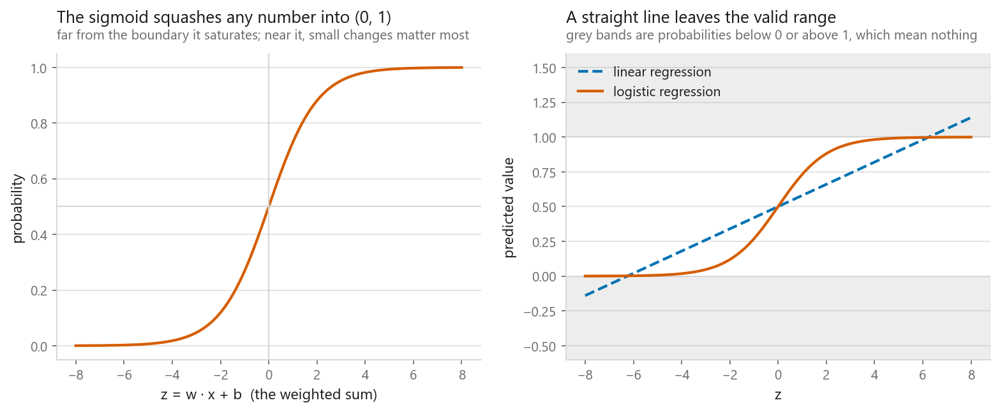
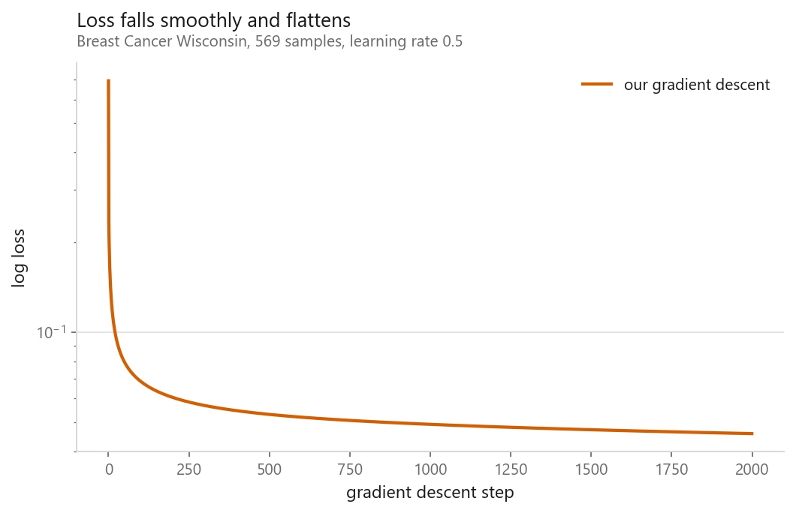
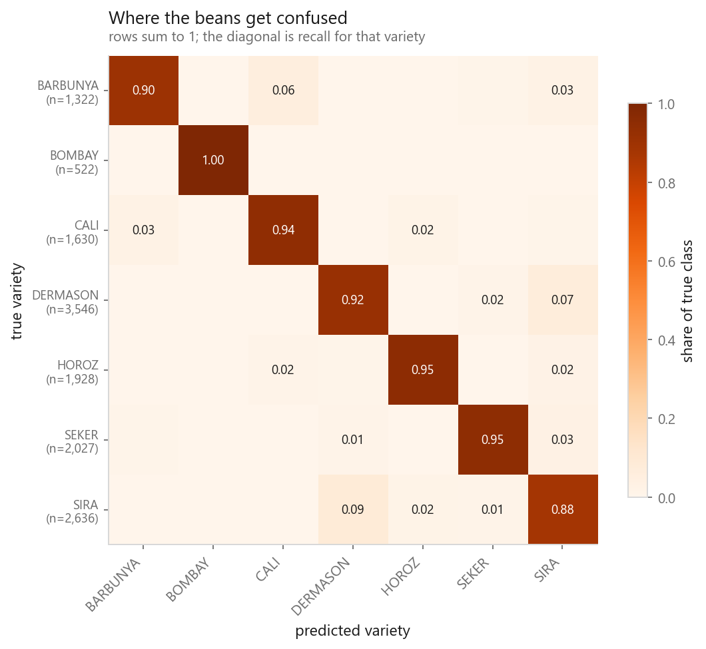
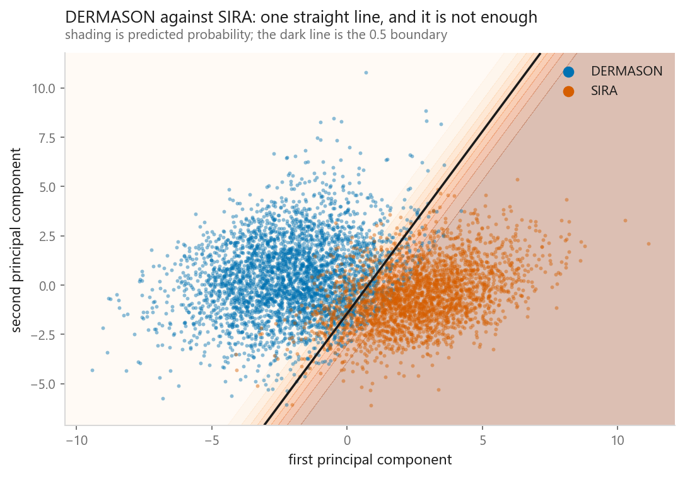

# Logistic regression

### A straight line that outputs a probability

**[Open the notebook](notebook.ipynb)** · Part 3, Classification ·
Made by [Elyes Lounissi](https://www.linkedin.com/in/elyes-lounissi/)

| | |
|---|---|
| **What you will learn** | Why linear regression cannot classify, what the sigmoid fixes, how to train it by gradient descent, and how it behaves on seven unbalanced classes |
| **You should already know** | [Linear regression](../../02-regression/01-linear-regression/) |
| **Datasets** | Breast Cancer Wisconsin (569 × 30), UCI Dry Bean (13,611 × 16) |
| **Runtime** | About a minute on a laptop CPU |

---

## The idea in one line

Keep the weighted sum from linear regression, then squash it through a function
that cannot leave the range 0 to 1:

$$\sigma(z) = \frac{1}{1 + e^{-z}} \qquad z = w \cdot x + b$$

Train it with **log loss** rather than squared error, and the gradient comes out
as $X^\top(\hat{p} - y)/m$, prediction minus truth, exactly the same shape as
linear regression's.

## From scratch, and a result worth explaining

A 40-line NumPy implementation trained by batch gradient descent reaches **0.988
training accuracy** on Breast Cancer. scikit-learn with regularisation switched
off reaches **1.000**.

They disagree, and the reason is instructive. The dataset is **linearly
separable**, so with no penalty the mathematically optimal weights are *infinite*:
the loss keeps falling as weights grow and the sigmoid saturates. L-BFGS chases
that further than 2,000 steps of gradient descent do. Same model, same objective,
different distance travelled toward a target at infinity.

Neither number is worth celebrating. 100% training accuracy on separable data is
what regularisation exists to prevent.

## Seven classes, unevenly sized

| Metric | Score |
|---|---|
| Accuracy | 0.9235 |
| Balanced accuracy | 0.9343 |

**Balanced accuracy is the higher of the two**, which is the opposite of the usual
worry about unbalanced classes.

BOMBAY has only 522 examples, the rarest variety, and is recalled **perfectly**,
because Bombay beans are enormous and nothing else looks like them. The hardest
variety is SIRA at 0.877 recall, and it is one of the most common.

**Class size and class difficulty are different things.** Check, do not assume.

## Where the errors actually come from

Finding the genuinely confused pair takes care. The two varieties with the lowest
recall are not automatically confused *with each other*; each may be losing beans
to a different neighbour. Adding the confusion matrix to its own transpose and
taking the largest off-diagonal entry finds the pair that actually trade beans in
both directions: **DERMASON and SIRA**.

The obvious suspicion is that a straight line is the wrong shape here. The
picture says otherwise. The two clouds are ordinary ellipsoidal blobs, the gap
between them is a straight diagonal band, and the fitted boundary runs along the
middle of it. Nothing is curved, and the line is in the right place.

What it runs into is **overlap**. On two components those 6,182 beans separate at
only **0.910**, and the ones it gets wrong sit inside the band. There, DERMASON and
SIRA of the same size and shape are not distinguishable from these sixteen
measurements by a boundary of any shape at all.

The distinction matters because the two failures ask for opposite repairs. A
curved seam asks for a model that bends. Overlap asks for a better measurement.
On this dataset bending does not help: see
[random forests](../../04-ensembles/02-random-forest/), which tie at 0.924
against logistic regression's 0.9235.

## Cheat sheet

| | |
|---|---|
| **Use it when** | You want a fast, calibrated, explainable baseline; classes are roughly linearly separable; you must defend the model to somebody |
| **Avoid it when** | The boundary is curved; features interact strongly; far more columns than rows with no regularisation |
| **Outputs** | Genuine probabilities, usually well calibrated out of the box, unusual and valuable |
| **Scaling needed** | Yes. The default L2 penalty punishes large weights, so unscaled features are penalised unfairly |
| **Main dials** | `C` (inverse regularisation), `penalty`, `class_weight` |
| **Watch out** | scikit-learn regularises by default. `LogisticRegression()` is not the textbook model; `C=1e6` is |

---

If this chapter was useful, a star on the repository helps other people find it.
The code is yours to use, copy and adapt in your own work, no permission needed.

Made by **Elyes Lounissi** ·
[LinkedIn](https://www.linkedin.com/in/elyes-lounissi/) ·
[pilot.tun@gmail.com](mailto:pilot.tun@gmail.com)

Back to [Part 3](../) · [the curriculum](../../CURRICULUM.md) · [the book](../../README.md)

`#MachineLearning` `#LogisticRegression` `#Classification` `#Python` `#ScikitLearn`
`#DataScience` `#MLTutorial` `#Softmax` `#GradientDescent` `#LearnMachineLearning`
