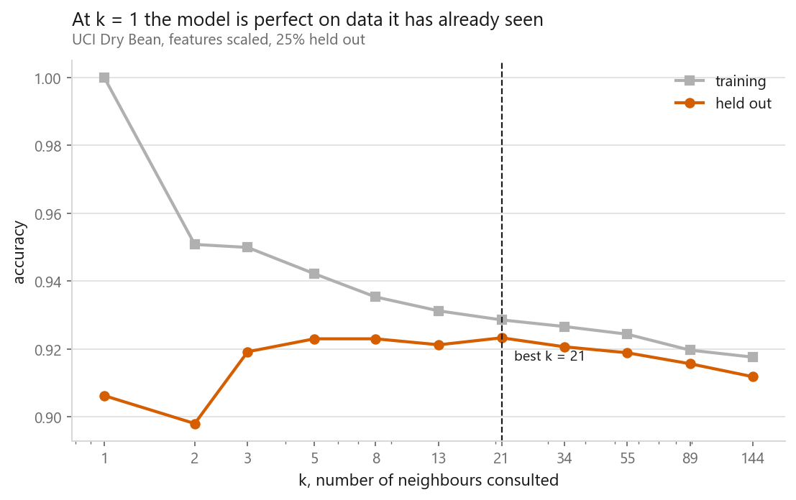
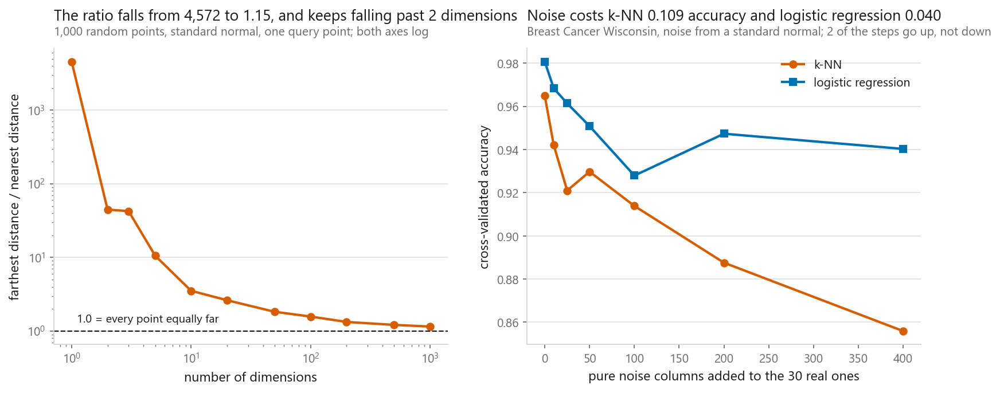

# k-Nearest Neighbours

### The model that does no training at all

**[Open the notebook](notebook.ipynb)** · Part 3, Classification ·
Made by [Elyes Lounissi](https://www.linkedin.com/in/elyes-lounissi/)

| | |
|---|---|
| **What you will learn** | How k-NN classifies by memory, how to choose k, why forgetting to scale breaks it completely, and what the curse of dimensionality actually is |
| **You should already know** | [Logistic regression](../01-logistic-regression/) |
| **Datasets** | UCI Dry Bean (13,611 × 16), Breast Cancer Wisconsin (569 × 30) |
| **Runtime** | About two minutes on a laptop CPU |

---

## The idea

Every other model compresses the training data into parameters and throws the
data away. k-NN keeps everything and does no work until you ask a question. To
classify a new bean: find the `k` closest training beans and take a vote.

`fit()` is literally just storing the array. The cost moves from training to
prediction.

## Scaling is not optional: it is the model

Distance sums squared differences across features, so **every feature contributes
on its own scale**. `Area` runs into the hundreds of thousands; `Eccentricity`
runs 0 to 1.

| | Cross-validated accuracy |
|---|---|
| Without scaling | 0.7185 |
| With scaling | **0.9231** |

**+0.205 from one preprocessing step.** The model is not weighing the features;
the units are.

## Choosing k

At `k=1` the training score is exactly **1.000**, and it has to be: the nearest
neighbour of any training point is *itself*, at distance zero. The model has
learned nothing and scores perfectly.

This is the clearest picture of overfitting in the book. Any evaluation that
trusted training accuracy would call this the best model available. Held out, it
scores 0.9063.

## The curse of dimensionality, measured

**Left:** with 1,000 random points, the farthest is **4,572×** the distance of the
nearest in one dimension. By 1,000 dimensions that ratio falls to **1.15**:
every point is essentially equally far away, and "nearest" has stopped meaning
anything. The vertical axis is logarithmic on purpose. Linear, the single drop
to 44.69 at two dimensions uses up the whole chart and the rest of the decline
is invisible.

**Right:** the practical consequence, and it is messier than the usual telling.
Adding pure noise columns to Breast Cancer:

| Noise columns added | k-NN | Logistic regression |
|---|---|---|
| 0 | 0.9649 | 0.9807 |
| 10 | 0.9420 | 0.9683 |
| 25 | 0.9210 | 0.9614 |
| 50 | **0.9297** | 0.9508 |
| 100 | 0.9138 | **0.9279** |
| 200 | 0.8876 | **0.9473** |
| 400 | 0.8559 | 0.9403 |

**Neither curve falls monotonically.** k-NN goes back up between 25 and 50
columns; logistic regression sags at 100 and recovers at 200 to above where it
sat at 50. Each cell is one five-fold cross-validation on 569 rows against one
random draw of noise, so each carries its own sampling error. Read the sweep end
to end and the trend is unambiguous: k-NN loses 0.109 across the range, logistic
regression 0.040, roughly a third as much.

A linear model can give a useless feature a weight near zero. **k-NN has no
weights, so it cannot ignore anything**: every column votes on what counts as
"near", whether or not it knows anything.

## Cheat sheet

| | |
|---|---|
| **Use it when** | Few features and all relevant; irregular boundary; you want a non-linear baseline with no training |
| **Avoid it when** | Many features, many irrelevant ones, large datasets needing fast prediction |
| **Scaling needed** | Absolutely. Without it the largest-unit column *is* the model |
| **Cost** | Training free. Prediction is O(rows × features) per query, the real limitation |
| **Main dials** | `n_neighbors`, `weights`, `metric`, `p` |
| **Watch out** | `k=1` scores 1.000 on training data by construction. Never judge k-NN on training accuracy |

---

If this chapter was useful, a star on the repository helps other people find it.
The code is yours to use, copy and adapt in your own work, no permission needed.

Made by **Elyes Lounissi** ·
[LinkedIn](https://www.linkedin.com/in/elyes-lounissi/) ·
[pilot.tun@gmail.com](mailto:pilot.tun@gmail.com)

Back to [Part 3](../) · [the curriculum](../../CURRICULUM.md) · [the book](../../README.md)

`#MachineLearning` `#KNN` `#KNearestNeighbours` `#Classification` `#Python`
`#ScikitLearn` `#DataScience` `#MLTutorial` `#CurseOfDimensionality`
