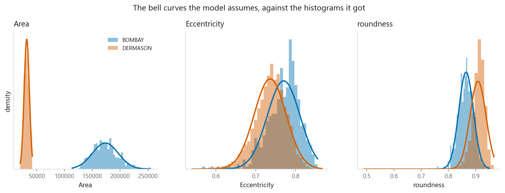
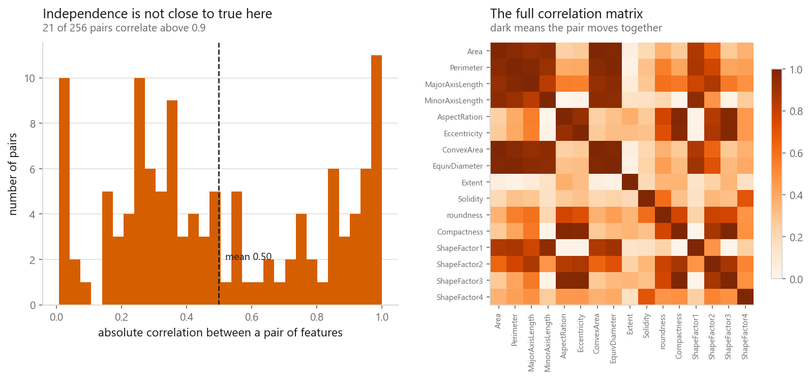
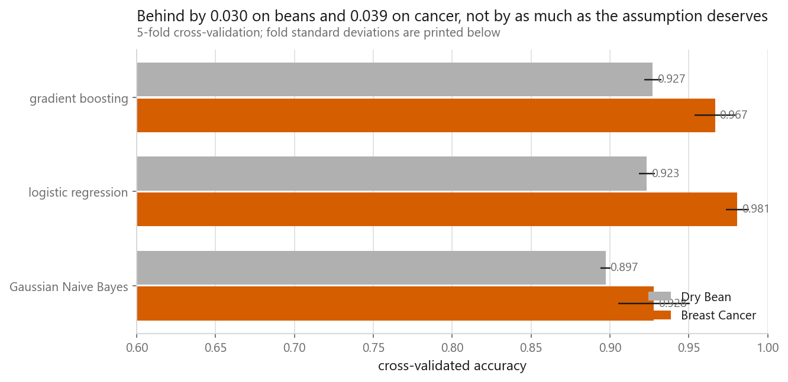
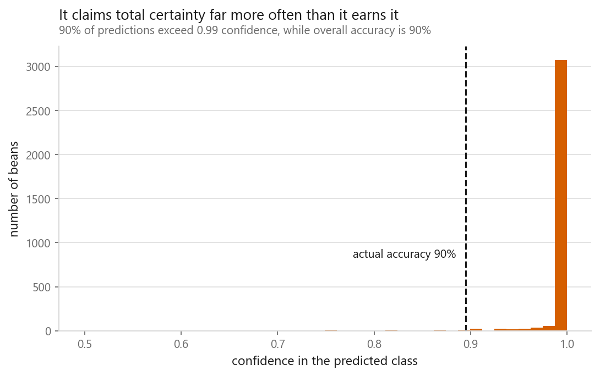

# Naive Bayes

### An assumption everyone knows is false, and a model that works anyway

**[Open the notebook](notebook.ipynb)** · Part 3, Classification ·
Made by [Elyes Lounissi](https://www.linkedin.com/in/elyes-lounissi/)

| | |
|---|---|
| **What you will learn** | How Bayes' theorem becomes a classifier, what "naive" refers to, why the assumption being wrong often does not matter, and where it very much does |
| **You should already know** | [Logistic regression](../01-logistic-regression/) |
| **Datasets** | UCI Dry Bean, Breast Cancer Wisconsin |
| **Runtime** | Under a minute on a laptop CPU |

---

## The idea

Every other classifier here learns a boundary. Naive Bayes models **what each class
looks like**, then asks which class most likely produced the thing in front of it.

$$P(c \mid x) \propto P(c) \prod_{i} P(x_i \mid c)$$

That product is the **naive** part: it assumes features are independent given the
class. On Dry Bean, `Area` and `Perimeter` correlate at **0.9997**. The assumption
is not approximately true; it is wrong.

Mean absolute correlation between feature pairs is **0.498**, with **21 of 256
pairs above 0.9**.

## A thirteen-point detour worth taking

Our from-scratch version and scikit-learn's disagreed badly on identical data:

| | Dry Bean accuracy |
|---|---|
| Our implementation | **0.8954** |
| `GaussianNB()`, default, unscaled | 0.7629 |
| `GaussianNB(var_smoothing=1e-12)` | 0.8807 |
| `GaussianNB()`, default, **scaled** | 0.8951 |

Not a bug in either. Both add a small constant to every variance to avoid dividing
by zero: ours a flat `1e-9`, scikit-learn's **`1e-9 × the largest variance across
all features`**.

On Dry Bean the largest variance is 8.87×10⁸ (`ConvexArea`), so the smoothing is
0.886. The smallest feature variance is 3.55×10⁻⁷. **The smoothing is 2,496,841×
that feature's entire variance**, flattening it into uselessness.

**The textbook says Naive Bayes needs no feature scaling. The textbook is right
about the maths and wrong about the library.** Scale before `GaussianNB`.

## Where it lands

| Model | Dry Bean | Breast Cancer |
|---|---|---|
| Gaussian Naive Bayes (scaled) | 0.8972 | 0.9279 |
| Logistic regression | 0.9234 | 0.9807 |
| Gradient boosting | 0.9271 | 0.9385 |

It trails, but stays in the conversation on data where its core assumption is
violated about as badly as it can be. **Classification only needs the right
*ranking*, not the right probabilities.** Correlated features make it count the
same evidence repeatedly, which usually pushes it further toward the class that
evidence already supported. The decision survives.

## The probabilities do not survive

**Nine predictions in ten claim above 99% confidence, and 85% claim above 99.9%**,
on a model that gets 89.5% right. A prediction stamped 99.9% should be wrong about
one time in a thousand. This one is wrong about one time in ten.

It has counted `Area`, `Perimeter`, `ConvexArea` and `EquivDiameter` as four
independent pieces of evidence when they are nearly one. The certainty compounds
four times over.

**Trust its labels. Do not trust its probabilities.**

## Cheat sheet

| | |
|---|---|
| **Use it when** | You want a baseline in one line; the data is enormous or streaming; text with bag-of-words (the classic case) |
| **Avoid it when** | You need probabilities you can act on |
| **Variants** | `GaussianNB` continuous, `MultinomialNB` counts, `BernoulliNB` binary |
| **Scaling needed** | Not by the maths, **but yes for `sklearn.GaussianNB`**. Unscaled it cost 13 points here |
| **Cost** | One pass over the data. Nothing iterates |
| **Watch out** | Wildly overconfident when features correlate |

---

Made by **Elyes Lounissi** ·
[LinkedIn](https://www.linkedin.com/in/elyes-lounissi/) ·
[pilot.tun@gmail.com](mailto:pilot.tun@gmail.com)

Back to [Part 3](../) · [the curriculum](../../CURRICULUM.md) · [the book](../../README.md)

`#MachineLearning` `#NaiveBayes` `#BayesTheorem` `#Classification` `#Python`
`#ScikitLearn` `#DataScience` `#MLTutorial` `#LearnMachineLearning`
