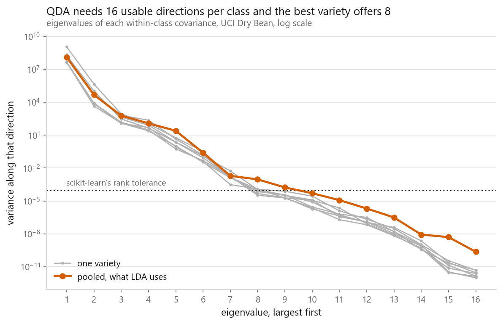
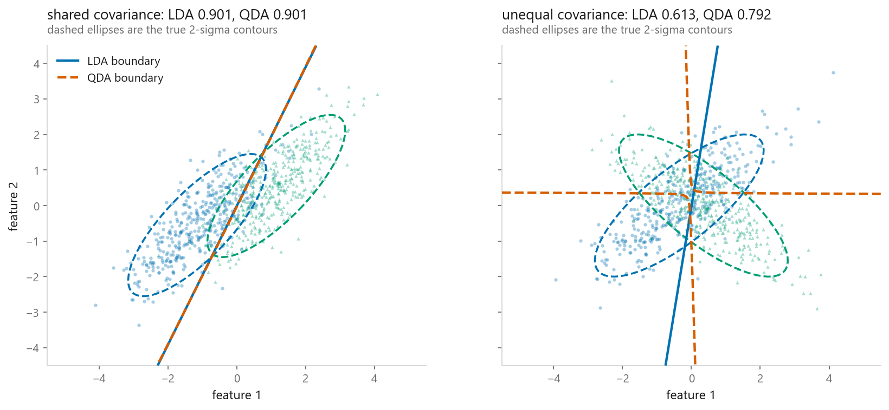
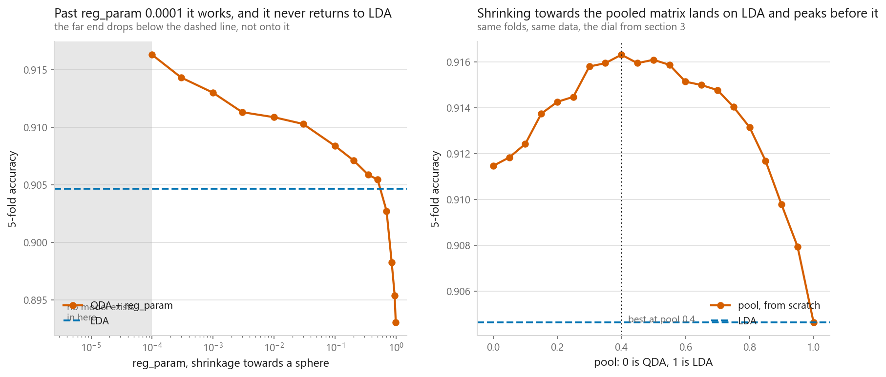
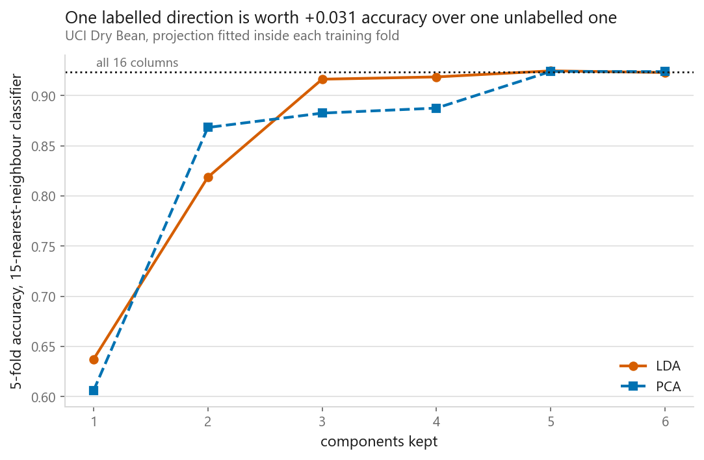
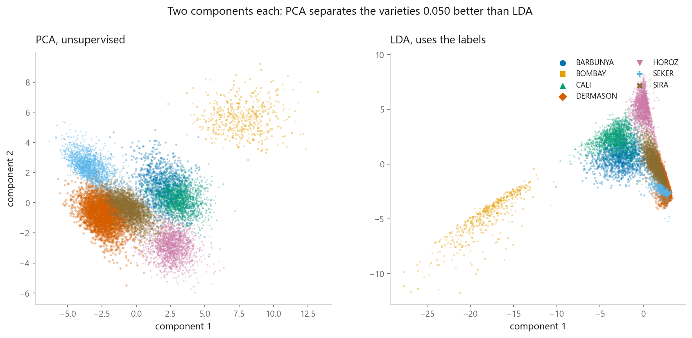
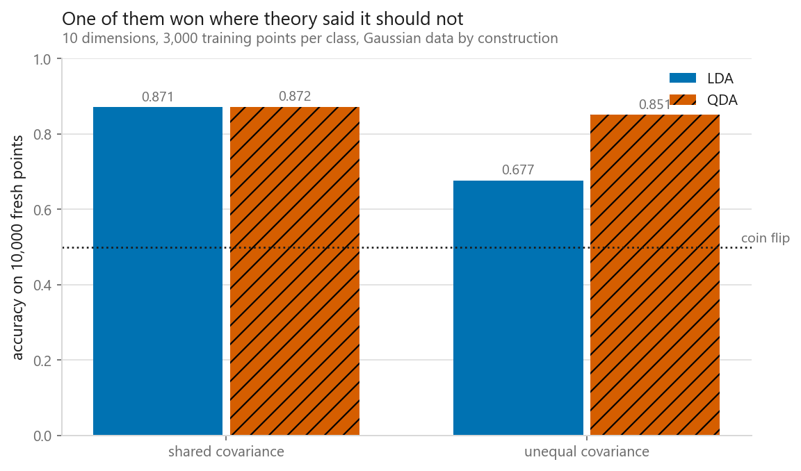
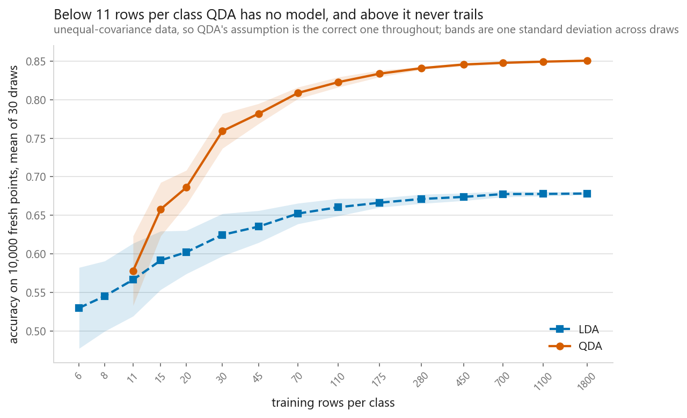

# Linear and quadratic discriminant analysis

### Two models one assumption apart, and the more expressive one will not return a model at all

**[Open the notebook](notebook.ipynb)** · Part 3, Classification ·
Made by [Elyes Lounissi](https://www.linkedin.com/in/elyes-lounissi/)

| | |
|---|---|
| **What you will learn** | Where LDA and QDA come from as generative models, why sharing one covariance makes the boundary straight, why QDA refuses outright to fit Dry Bean, which of the standard repairs actually work, and what a supervised projection is worth against an unsupervised one |
| **You should already know** | [Naive Bayes](../03-naive-bayes/) and [logistic regression](../01-logistic-regression/) |
| **Datasets** | UCI Dry Bean, 13,611 rows by 16 columns across 7 varieties, plus Gaussian data generated twice: once obeying the shared-covariance assumption and once breaking it |
| **Runtime** | Three to four minutes on a laptop CPU. Every fit on the leaderboard takes under a second, the slowest at 0.7522 s |

---

## The result I would lead with

QDA does not score badly on Dry Bean. It stops.

```
QDA raised LinAlgError:
    The covariance matrix of class BARBUNYA is not full rank. Increase the
    value of `reg_param` to reduce the collinearity.

LDA, same array, same call: fitted. Training accuracy 0.9050
```

Same data, same call, one line apart in the API. The obvious explanation is that
some class is too small to estimate a covariance from, and the notebook kills
that idea before the section starts: the smallest variety is BOMBAY with **522
rows, 33 rows for every column**. There are plenty of rows. They do not point in
enough directions.

scikit-learn counts a direction as usable when its eigenvalue clears
`tol = 0.0001`, and a full-rank fit needs all 16 to survive:

| Class | Rows | Numerical rank | Eigenvalues above tol | Condition number |
|---|---|---|---|---|
| BARBUNYA (the one the error names) | 1322 | 11 | 8 | 4.46e+19 |
| **BOMBAY** | 522 | **9** | 7 | **1.13e+21** |
| CALI | 1630 | 10 | 7 | 1.27e+20 |
| DERMASON | 3546 | 11 | 7 | 8.60e+18 |
| HOROZ | 1928 | 11 | 8 | 3.80e+19 |
| SEKER | 2027 | 11 | 8 | 1.88e+19 |
| SIRA | 2636 | 11 | 7 | 3.14e+19 |
| pooled, what LDA uses | 13611 | 12 | 9 | 5.49e+17 |

**Read the message as "which class did we get to first", not "which class is the
problem".** BARBUNYA is one of the three best rows on the tolerance count, at 8.
The worst rows belong to BOMBAY, which has the largest condition number at
1.13e+21 and the only numerical rank in single figures. The classes are
enumerated in sorted order and the check raises on the first failure rather than
surveying all seven, so the name in the exception is alphabetical. Treating it as
a diagnosis sends you to the wrong bean.

**The best any single variety manages is 8 of 16 directions.** Pooling gets to 9
and drops the worst condition number from 1.13e+21 to 5.49e+17, a factor of
2,052, and it is still short of 16. So the reason LDA runs and QDA does not is
narrower than "pooling makes it invertible". scikit-learn's LDA drops the
directions it cannot use and carries on; its QDA treats the same situation as an
error. One library made a judgement call in each direction and only one of them
says so.

Then the number that makes the mechanism unambiguous. Sweeping `reg_param`, the
smallest value that produces a model is **0.0001**, and scikit-learn's rank
tolerance is **0.0001**. Adding gamma to every eigenvalue lifts the flat tail of
the spectrum past the threshold, and the fit starts working the moment it clears
it. This is not regularisation improving an estimate in some vague sense. It is
moving specific eigenvalues past a specific number.



## What is actually redundant

Every Dry Bean column is a geometric quantity computed from the same photographed
outline, so several of them are functions of the others:

| Pair | Correlation |
|---|---|
| Area and ConvexArea | 0.9999 |
| Compactness and ShapeFactor3 | 0.9987 |
| Perimeter and EquivDiameter | 0.9914 |
| AspectRation and Compactness | 0.9877 |

A correlated pair is a much weaker statement than a column being reconstructable
from all the others at once, so the notebook regresses each column on the
remaining fifteen inside a single class. Within BOMBAY alone: Compactness
**0.999999**, EquivDiameter 0.999999, ShapeFactor3 0.999998, MajorAxisLength
0.999996, Area 0.999995. That is as close to one as floating point gets.

## Where the straight boundary comes from



Two synthetic regimes, both Gaussian by construction so the assumption is exactly
true or exactly false rather than approximately either. On 4,000 fresh points:

| Regime | LDA | QDA | QDA minus LDA |
|---|---|---|---|
| shared covariance | **0.9012** | 0.9011 | -0.0001 |
| unequal covariance | 0.6129 | **0.7916** | **+0.1788** |

In the left panel QDA is allowed to bend and has nothing to bend around, so it
fits a curve that is nearly straight. In the right panel the ellipses cross and
the centres are close, so most of what separates the classes is the shape of the
cloud rather than its position. A straight line cannot express that.

The from-scratch implementation is one class with a `pool` dial, where `pool=1`
is LDA and `pool=0` is QDA, and both ends are checked against scikit-learn:
predictions agree at a rate of 1.0 and the largest probability gap is
**2.553513e-15** for LDA and **1.243450e-14** for QDA. The affine claim gets its
own check. LDA's score gap matches the closed-form hyperplane to
**1.066e-14**, and the same measurement on QDA, where the derivation says it must
fail, leaves a residual of **9.159e-01**.

QDA's bill is in the parameter count. With 7 classes and 16 columns, LDA
estimates 248 numbers and QDA estimates **1,064**, a ratio of 4.29x.

## The repair, and the one that does not reach LDA



Two dials shrink a class covariance towards something better conditioned, and
they do not shrink towards the same thing. `reg_param` pulls each class towards a
sphere. The `pool` dial pulls it towards the pooled matrix, which is LDA's
matrix. Only one of them has LDA at the far end, and the sweep says which:

| Setting | 5-fold accuracy |
|---|---|
| `reg_param` 0 to 3e-05 | refused to fit |
| **`reg_param` 0.0001** | **0.9163** |
| `reg_param` 0.01 | 0.9109 |
| `reg_param` 0.5 | 0.9054 |
| `reg_param` 0.99, heaviest shrinkage tried | 0.8930 |
| LDA on the same folds | 0.9046 |

The best `reg_param` beats LDA by **+0.0117** and the heaviest one loses to it by
**-0.0116**. If `reg_param` interpolated between QDA and LDA, that last row would
land on LDA's line. It lands well below, because a sphere is not the pooled
covariance, and shrinking towards a sphere throws away every correlation the data
has.

The `pool` dial does interpolate, by construction. `pool=1` from scratch scores
**0.9046** and scikit-learn's LDA on the same folds scores **0.9046**. The best
setting is `pool 0.4` at **0.9163**, strictly inside the interval, so the best
model on this data is neither of the two named methods.

The left end of that curve is the uncomfortable part. `pool=0` is plain QDA on
the very matrices scikit-learn refused to invert, and it scores **0.9115**. The
exception is a guard rail rather than a verdict. What justifies the guard rail is
the perturbation test: nudging every measurement by about one part in ten
thousand, less than the noise in measuring a bean from a photograph, moves **144
of 13,611 predictions at `pool=0` and 61 of 13,611 at `pool=0.4`**. The
unregularised fit is balanced on numerical accidents. It happens to be standing
up.

## Dropping columns fails where PCA works

Removing the redundancy is the repair people reach for first, and on the raw
columns it does not work at any threshold tried:

| Drop above \|r\| | Columns kept | Raw | Standardised first |
|---|---|---|---|
| 0.99 | 13 | refused to fit | refused to fit |
| 0.95 | 10 | refused to fit | refused to fit |
| 0.90 | 8 | refused to fit | 0.915436 |
| 0.80 | 6 | refused to fit | 0.919036 |

The units explain it. Area runs into the tens of thousands and ShapeFactor2 sits
near zero, so the smallest eigenvalue of any matrix holding both is under an
absolute tolerance on account of scale alone, before collinearity gets a say.
Standardising separates the two effects, and then dropping columns starts to work
only once the threshold removes half of them.

Principal components work and win, because they are orthogonal by construction so
the redundancy is gone rather than reduced:

| Components | Accuracy |
|---|---|
| 4 | 0.887223 |
| **6** | **0.917493** |
| 8 | 0.914187 |
| 9 | 0.912350 |
| 10, 12, 16 | refused to fit |

Keeping the whole set puts the problem back exactly as it was, which is the
neatest confirmation that PCA is deleting the flat directions rather than doing
anything clever. The best setting, 6 components at 0.9175, beats LDA by
**+0.0129**.

## The leaderboard, with the failure left in it

| Model | Accuracy | Balanced | Seconds |
|---|---|---|---|
| logistic regression | **0.9234** | 0.9341 | 0.7522 |
| QDA on 6 principal components | 0.9175 | 0.9312 | 0.1127 |
| QDA + `reg_param` 0.0001 | 0.9163 | 0.9297 | 0.1157 |
| LDA | 0.9046 | 0.9167 | 0.1239 |
| LDA + shrinkage | 0.9029 | 0.9144 | 0.1228 |
| Gaussian naive Bayes | 0.7641 | 0.7670 | 0.0738 |
| **QDA, as it comes** | **did not fit** | **did not fit** | 0.0163 |

The bottom two rows are what this section is about. Gaussian naive Bayes is QDA with every
off-diagonal covariance entry forced to zero, and it fits this data without
complaint at 0.7641, because a diagonal matrix with positive entries is never
singular. The assumption everybody calls naive is the thing keeping it alive.
[03-03](../03-naive-bayes/) measures the same model on the same folds and gets
0.8972 with the features scaled, which is the `var_smoothing` trap that chapter is
about; the 0.7641 here is the unscaled default.

Ignore the small gaps at the top of that table. Logistic regression's 0.9234
against QDA-on-components' 0.9175 is about two standard errors on 13,611 rows, and
the four rows between 0.90 and 0.93 are one cluster. The result is the gap between
that cluster, naive Bayes, and the row that produced no model at all.

## LDA as a projection, against PCA



Both projections sit inside a pipeline, fitted on the training fold only, scored
by a 15-nearest-neighbour classifier:

| Components | LDA | PCA | LDA minus PCA |
|---|---|---|---|
| 1 | **0.6373** | 0.6061 | +0.0312 |
| 2 | 0.8187 | **0.8683** | -0.0495 |
| 3 | 0.9164 | 0.8826 | +0.0338 |
| 4 | 0.9187 | 0.8876 | +0.0311 |
| 5 | **0.9247** | 0.9241 | +0.0006 |
| 6 | 0.9231 | 0.9240 | -0.0009 |

An accuracy over 13,611 rows carries a binomial standard error near 0.0026, which
the notebook prints, so the top four rows of that difference column are between
twelve and nineteen standard errors wide and the bottom two are inside one. That
splits the table cleanly into a part that says something and a part that says
nothing.

The row to read first is the second one. **At two components PCA wins, and by
-0.0495, the largest margin anywhere in the column**, larger than LDA's own lead
at one component. Access to the labels is not worth a constant amount and it is
not concentrated where the budget is tightest either. It is worth +0.0312 at one
direction, worth less than nothing at two, and worth roughly its one-component
lead again at three and four. The sign genuinely reverses twice inside those four
rows.

LDA maximises separation between class means relative to within-class scatter,
which is not the same objective as leaving the 15 nearest neighbours of a point
inside the same variety, and at two directions the two objectives disagree enough
to decide the comparison.

Past four components the labels buy nothing: LDA and PCA land within a thousandth
of each other, well inside that standard error, so the last two rows are one
result written twice rather than two more sign changes. That has a cause worth
keeping. Sixteen heavily correlated bean measurements do not contain sixteen
independent things to find, so a handful of principal components eventually span
whatever subspace LDA was picking out, and once you span the subspace the route
you took to it stops mattering. **The supervised projection is worth having only
while the budget is smaller than the data's real dimensionality.**

All 16 standardised columns with no projection score 0.9232. LDA with one
component scores 0.6373 and PCA needs two components to reach that. Two caveats
the chart cannot show: LDA's ceiling is K-1 components, six for seven varieties,
and LDA needs labels so it cannot be fitted on the unlabelled pile.



The columns weighing most on the first principal component are MajorAxisLength
0.326, ShapeFactor2 0.315, Perimeter 0.311, EquivDiameter 0.297 and ConvexArea
0.283, and the first two components carry **0.8190** of the variance. PCA spreads
the beans along the direction of largest variance and the varieties smear across
it, because nothing in the fit was told varieties exist. The right-hand panel
looks the more sorted of the two and it is the one that scores lower, by the
0.0495 above. Looking separated to a reader and being separable by a
nearest-neighbour rule are different properties, and at two components they come
apart.

## Where the theory did not hold



Ten dimensions, 3,000 training points per class, 10,000 fresh test points, both
regimes Gaussian by construction. Theory says LDA should win where the
covariances are shared:

| Regime | LDA | QDA | Winner |
|---|---|---|---|
| shared covariance | 0.8714 | **0.8722** | QDA |
| unequal covariance | 0.6768 | **0.8507** | QDA |

The notebook checks its own prediction and prints `each method won where its
assumption holds: False`. Read the two margins in the standard errors the notebook
prints beside them: on 10,000 test points that is about 0.005, so +0.1739 in the
unequal regime is a real win and +0.0009 in the shared regime is nothing at all.

The claim worth making is therefore the weaker one. **QDA did not lose on data
designed for LDA.** With 3,000 rows per class its extra covariance parameters are
pinned down well enough that estimating a covariance it did not need cost nothing
measurable. The textbook is right that a wrong assumption costs you; what it does
not say is that the cost scales with how badly the extra parameters are estimated,
and at this sample size they are estimated well. That is exactly why the next sweep
shrinks the sample.



Then the sweep that shrinks the training set while keeping QDA's assumption
correct. Across 450 attempted fits per model, **65 QDA fits were refused
outright**:

| Rows per class | LDA | QDA | QDA minus LDA |
|---|---|---|---|
| 6 | 0.5298 | refused to fit | refused to fit |
| 8 | 0.5451 | refused to fit | refused to fit |
| **11** | 0.5664 | **0.5780** | **+0.0116** |
| 20 | 0.6022 | 0.6860 | +0.0839 |
| 45 | 0.6353 | 0.7818 | +0.1465 |
| 110 | 0.6604 | 0.8227 | +0.1623 |
| 450 | 0.6739 | 0.8457 | +0.1718 |
| 1800 | 0.6783 | 0.8506 | +0.1723 |

The smallest training size where QDA returns a model at all is **11 per class
against 10 columns**, which is the arithmetic floor and nothing more. Once it
fits, QDA leads at every size tested, by **+0.0116 at worst**. That is not the
result I expected when I set the sweep up, and the figure's own runtime title is
the honest version. The two failures stay separate: in section 4 the covariance
could not be inverted at any sample size because the columns were redundant, and
here it inverts fine at 11 rows per class and immediately earns its keep.

The shaded bands carry the rest, and they run the other way from the textbook
reasoning. More parameters is supposed to mean more sensitivity to which rows you
happened to draw, so QDA's band should be the wider one. **LDA's is wider at all
13 sizes where both models fit**, and the gap grows rather than shrinks as rows
are added: 0.0473 against 0.0451 at 11 rows per class, 0.0019 against 0.0009 at
1,800.

The textbook reasoning is about the variance of the parameter estimates and the
band here is the variance of the accuracy they produce. In this regime the two
classes have nearly the same centre, so the mean difference LDA is estimating is
faint and the boundary it draws swings with the draw. QDA is estimating a
difference in shape, which in this data is loud, and once it has rows enough to
see it the answer stops moving. The mean is what people quote and the spread is
what ruins an afternoon, and QDA is ahead on both.

## Cheat sheet

| | |
|---|---|
| **Use LDA when** | Classes look like the same cloud in different places, rows per feature are few, or the columns are redundant |
| **Use QDA when** | Class clouds genuinely differ in shape, you have rows to spare per class, and those rows point in enough independent directions |
| **The error to recognise** | `LinAlgError: the covariance matrix of class ... is not full rank`. It is a statement about your columns, not about your code |
| **Diagnose it with** | Eigenvalues per class against `tol`, not rows per class. Dry Bean's smallest variety has 33 rows per column and still cannot be fitted |
| **Main dials** | `reg_param` for QDA, `shrinkage` with `solver="lsqr"` for LDA. Note what each shrinks towards: `reg_param` pulls to a sphere and lands 0.0116 below LDA at full strength |
| **Best repair here** | 6 principal components, at 0.9175. Second best was `reg_param` 0.0001 at 0.9163 |
| **Watch out** | An absolute rank tolerance fails on units alone. Dropping correlated raw columns refused at every threshold; standardising first fixed it |
| **Sanity check** | Perturb the inputs in their fourth significant digit. The unregularised fit moved 144 of 13,611 predictions, the regularised one 61 |
| **Next** | [Support vector machines](../05-support-vector-machines/), which drop the density model and fit the boundary directly |

---

If this chapter was useful, a star on the repository helps other people find it.
The code is yours to use, copy and adapt in your own work, no permission needed.

Made by **Elyes Lounissi** ·
[LinkedIn](https://www.linkedin.com/in/elyes-lounissi/) ·
[pilot.tun@gmail.com](mailto:pilot.tun@gmail.com)

Back to [Part 3](../) · [the curriculum](../../CURRICULUM.md) · [the book](../../README.md)

`#LDA` `#QDA` `#DiscriminantAnalysis` `#Classification` `#DryBean`
`#ScikitLearn` `#CovarianceMatrix` `#MachineLearning` `#MLTutorial`
`#LearnMachineLearning` `#DataScience` `#AI`
