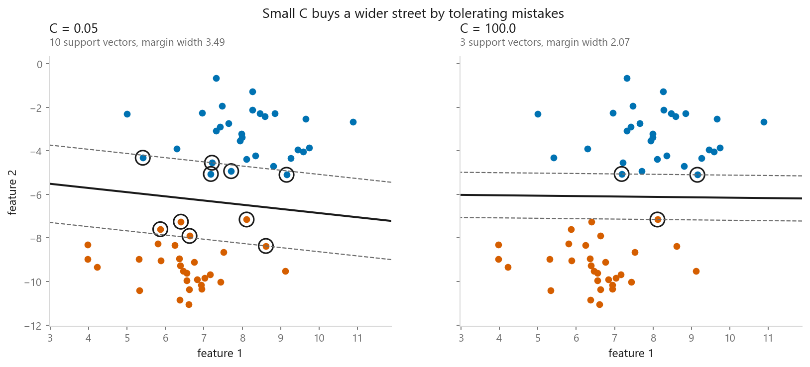
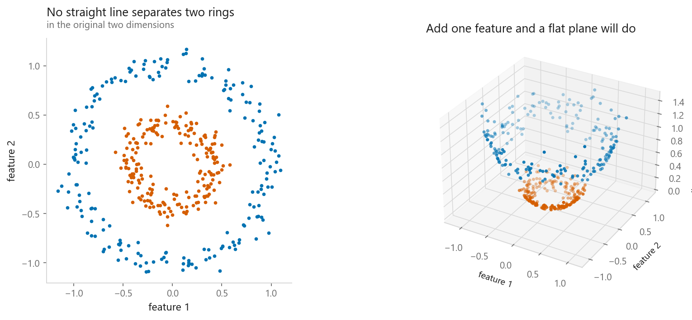
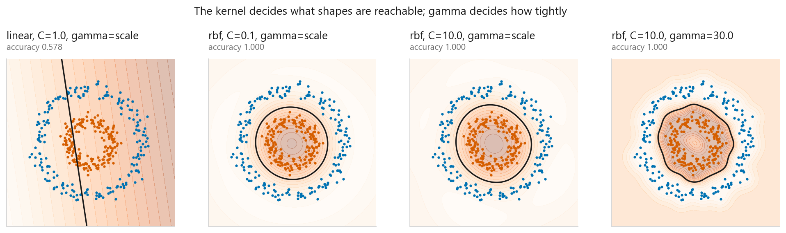
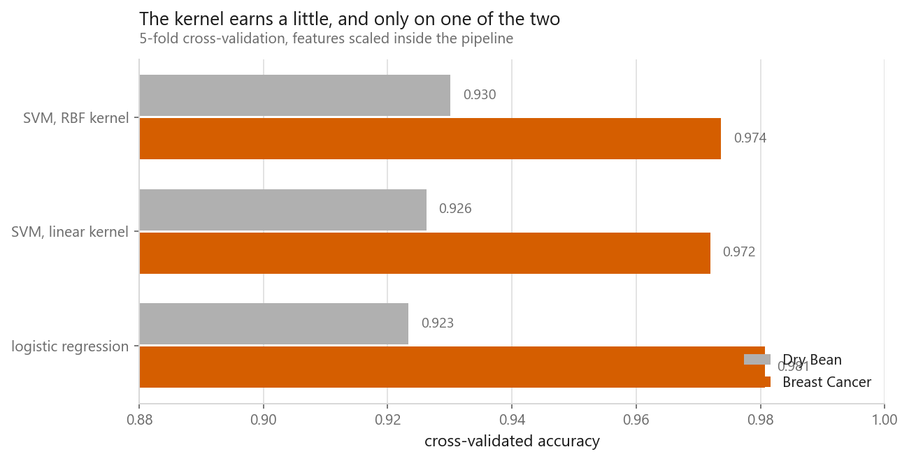
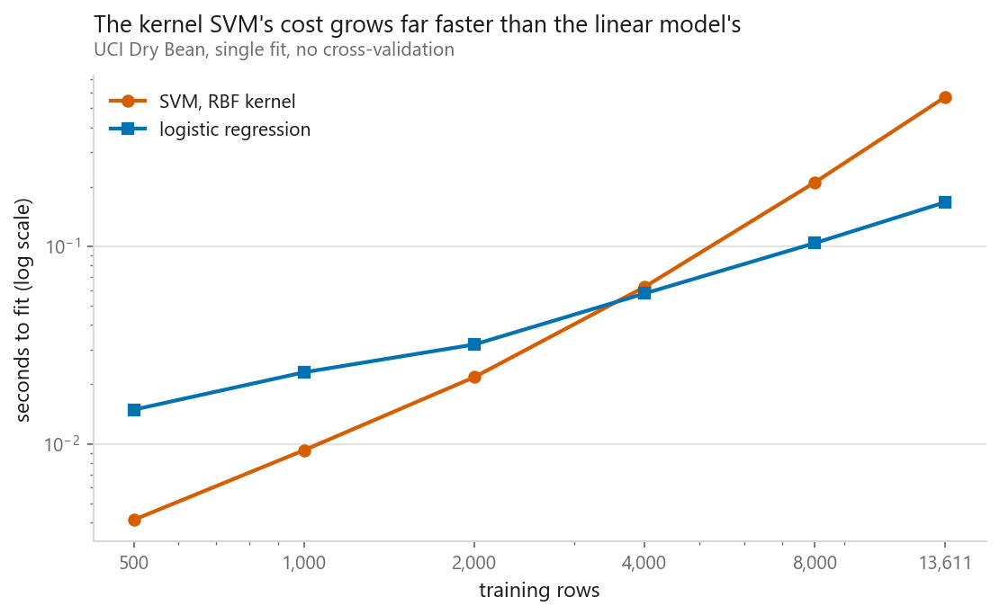

# Support Vector Machines

### The widest possible street between two classes

**[Open the notebook](notebook.ipynb)** · Part 3, Classification ·
Made by [Elyes Lounissi](https://www.linkedin.com/in/elyes-lounissi/)

| | |
|---|---|
| **What you will learn** | What a margin is, what `C` really controls, what the kernel trick actually does, and when a kernel is worth its cost |
| **You should already know** | [Logistic regression](../01-logistic-regression/) |
| **Datasets** | UCI Dry Bean, Breast Cancer Wisconsin, plus two synthetic shapes |
| **Runtime** | Three to four minutes on a laptop CPU |

---

## The idea

When two classes are separable, infinitely many lines separate them. Logistic
regression picks one by minimising log loss. An SVM asks a different question:
**which line leaves the most room on both sides?**

The points touching the kerb are the **support vectors**, and they are the only
ones that matter — move any other point and the boundary does not shift.

| `C` | Support vectors | Margin width |
|---|---|---|
| 0.05 | 10 | **3.486** |
| 1.0 | 3 | 2.072 |
| 100.0 | 3 | 2.072 |

**`C` is the price of a training mistake.** Large `C` makes violations expensive,
so the model contorts to classify everything — narrow margin, overfitting. Small
`C` buys a wider street by tolerating errors. Note the direction: **large `C`
means _less_ regularisation**, which is backwards from most libraries.

## The kernel trick

Two concentric rings: no line separates them, and a linear SVM manages only
**0.578**. Add one feature — distance from the origin — and the inner ring lifts
while the outer stays down. A flat plane now slides between them: **1.000**.

The trick is that the SVM's maths only ever touches the data through **dot
products between pairs of points**. So if a function returns the dot product the
points *would have had* in a higher-dimensional space, you work in that space
without ever building it.

$$K_{\text{rbf}}(a, b) = \exp\left(-\gamma \|a - b\|^2\right)$$

The RBF kernel corresponds to a space with **infinitely many dimensions**. You
could not construct those features if you tried. It scores **1.000** on the rings
without building anything.

The last panel is the one to stare at. With `gamma = 30` the boundary stops being
a ring and becomes islands drawn around individual training points. That is
overfitting made visible.

## Does the kernel pay?

| Model | Dry Bean | Breast Cancer |
|---|---|---|
| Logistic regression | 0.9234 | **0.9807** |
| SVM, linear kernel | 0.9262 | 0.9719 |
| SVM, RBF kernel | **0.9301** | 0.9736 |

The RBF SVM is the **first model in this book to clearly beat logistic regression
on Dry Bean** — and it loses to it on Breast Cancer. The kernel earns a little,
and only on one of the two.

## The cost nobody mentions

| Training rows | SVM (RBF) | Logistic regression |
|---|---|---|
| 500 | 0.004 s | 0.015 s |
| 13,611 | 0.571 s | 0.167 s |

A **27×** increase in rows cost the SVM **139×** the time. Logistic regression grew
11×. And the fitted model stores **2,801 of 13,611 rows (20.6%)** as support
vectors — every one consulted at prediction time.

The promise was that only points near the boundary matter. On overlapping real
data, a fifth of the rows *are* near the boundary.

## Cheat sheet

| | |
|---|---|
| **Use it when** | Rows in the thousands not millions; complicated boundary; features outnumber rows |
| **Avoid it when** | Large datasets, you need calibrated probabilities, or you need to explain the model |
| **Scaling needed** | Absolutely. Both the margin and the RBF kernel are distance-based |
| **Main dials** | `C`, `gamma`, `kernel` — and `C` with `gamma` must be tuned together, never one at a time |
| **Probabilities** | `probability=True` bolts on Platt scaling with internal cross-validation. Slow, not free |

---

Made by **Elyes Lounissi** ·
[LinkedIn](https://www.linkedin.com/in/elyes-lounissi/) ·
[pilot.tun@gmail.com](mailto:pilot.tun@gmail.com)

Back to [Part 3](../) · [the curriculum](../../CURRICULUM.md) · [the book](../../README.md)

`#MachineLearning` `#SVM` `#SupportVectorMachine` `#KernelTrick` `#Classification`
`#Python` `#ScikitLearn` `#DataScience` `#MLTutorial` `#RBFKernel`
