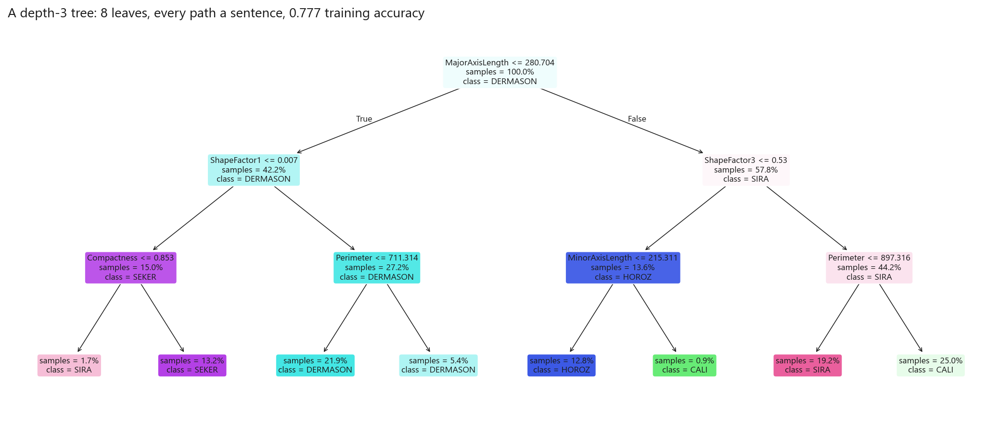
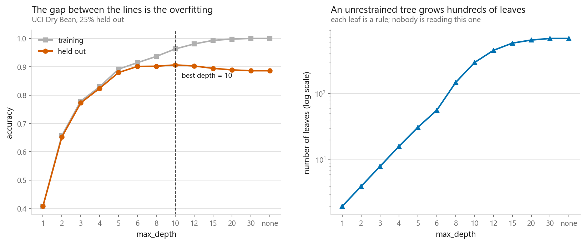
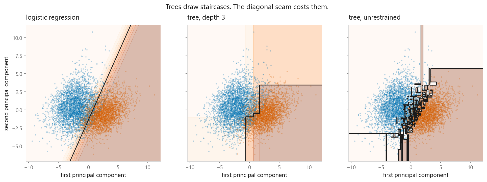

# Decision trees

### Twenty questions, chosen by arithmetic

**[Open the notebook](notebook.ipynb)** · Part 3, Classification ·
Made by [Elyes Lounissi](https://www.linkedin.com/in/elyes-lounissi/)

| | |
|---|---|
| **What you will learn** | How a split is actually chosen, what Gini impurity measures, how depth trades memorisation against generalisation, and why a tree you can read beats one that scores slightly better |
| **You should already know** | [Logistic regression](../01-logistic-regression/) |
| **Dataset** | UCI Dry Bean (13,611 × 16) |
| **Runtime** | Under a minute on a laptop CPU |

---

## How a split is chosen

**Gini impurity** measures how mixed a group is:

$$G = 1 - \sum_{c} p_c^2$$

A pure group scores 0. An even mix of seven varieties scores 0.857. A split's
value is how much impurity it removes, weighted by how many beans land each side.
The tree tries **every feature at every threshold** and keeps the best. Greedy:
it never looks ahead.

The notebook implements that search from scratch. Starting impurity is **0.8271**,
and the single best question in the whole dataset turns out to be:

> is `MajorAxisLength` ≤ 278.90 ?

which removes **0.1423** of impurity and cleanly separates small varieties from
large ones. One question, chosen by arithmetic alone.

## Reading the tree

Eight leaves, and every path from root to leaf is a rule you can state in a
sentence and check against common sense. Almost nothing else in this book offers
that.

## Depth is the whole story

| max_depth | Training | Held out | Leaves |
|---|---|---|---|
| 10 (best) | 0.9630 | **0.9066** | 294 |
| unrestrained | **1.0000** | 0.8860 | 679 |

The unconstrained tree reaches a **perfect training score** across 679 leaves and
is **worse** on held-out data than a tree with less than half as many. It has
memorised, and you can count the leaves it invented in order to do it.

## Trees draw staircases

Trees split one feature at a time, so every boundary is a staircase of
axis-aligned steps. The depth-3 tree draws two or three steps and misses the seam.
The unrestrained tree follows it closely and then keeps going, carving small
pockets around individual beans, visible as islands of the wrong shade.

Those pockets are exactly what [bagging](../../04-ensembles/01-bagging/) and
[random forests](../../04-ensembles/02-random-forest/) exist to average away.

## And it loses here

| Model | Cross-validated accuracy |
|---|---|
| Logistic regression | **0.9234** |
| Tree, depth 6 | 0.8978 |
| Tree, unrestrained | 0.8945 |

Dry Bean rewards smooth linear boundaries, and a staircase is the wrong shape for
it. A single tree is rarely the model you deploy; it is the model you *read*, and
the building block for the ensembles that follow.

## Cheat sheet

| | |
|---|---|
| **Use it when** | You must explain the decision to a human; mixed feature types; interactions and thresholds rather than smooth trends |
| **Avoid it when** | The boundary is diagonal or smooth; you need to extrapolate; you want stability |
| **Scaling needed** | No. Splits are thresholds, so units do not matter |
| **Main dials** | `max_depth`, `min_samples_leaf`, `min_samples_split`, `ccp_alpha` |
| **Watch out** | Unconstrained trees always hit 100% training accuracy, and they are unstable: reshuffle and the tree changes shape |

---

Made by **Elyes Lounissi** ·
[LinkedIn](https://www.linkedin.com/in/elyes-lounissi/) ·
[pilot.tun@gmail.com](mailto:pilot.tun@gmail.com)

Back to [Part 3](../) · [the curriculum](../../CURRICULUM.md) · [the book](../../README.md)

`#MachineLearning` `#DecisionTree` `#CART` `#GiniImpurity` `#Classification`
`#Python` `#ScikitLearn` `#DataScience` `#MLTutorial` `#ExplainableAI`
