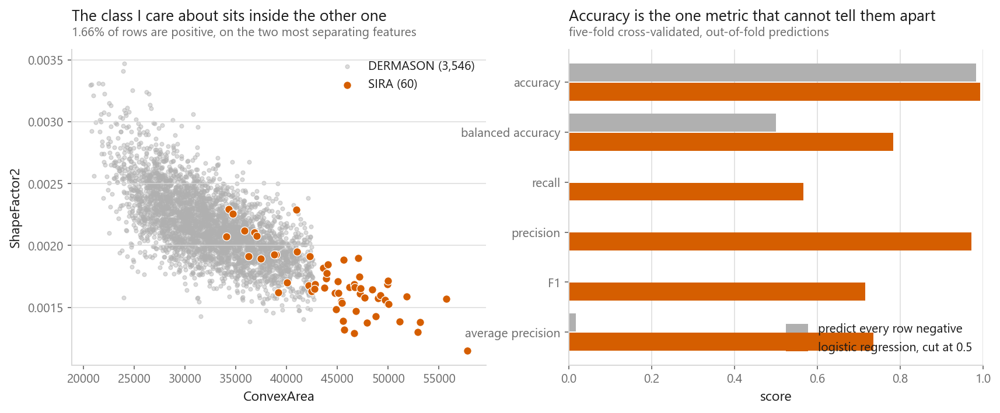
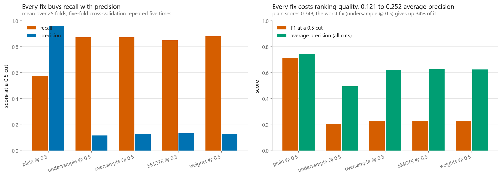
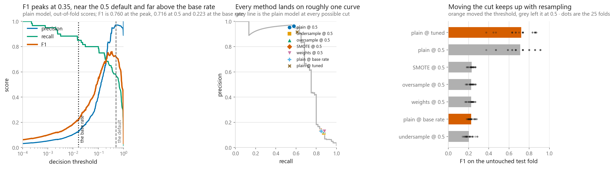
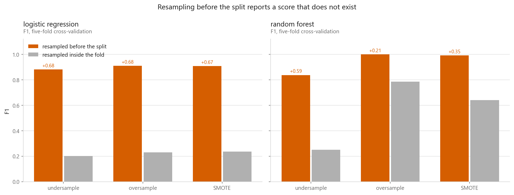

# Imbalanced classes

### Resampling, class weights, and the threshold almost nobody moves

**[Open the notebook](notebook.ipynb)** · Part 3, Classification ·
Made by [Elyes Lounissi](https://www.linkedin.com/in/elyes-lounissi/)

| | |
|---|---|
| **What you will learn** | Why accuracy is unusable on a rare class, how to write undersampling, oversampling and SMOTE yourself in NumPy, what `class_weight="balanced"` actually does, why moving the decision threshold does the same job for a tenth of the work, and how much score you invent by resampling before the split |
| **You should already know** | [Logistic regression](../01-logistic-regression/), [decision trees](../06-decision-trees/) |
| **Datasets** | UCI Dry Bean and UCI Breast Cancer, both cut down to a rare positive class |
| **Runtime** | Two to three minutes on a laptop CPU |

---

## The result that made me write this

Same model, same folds, 3,606 beans with a **1.66%** positive rate. The only thing
that changes is how the decision is made.

| Recipe | F1 | Precision | Recall | Average precision |
|---|---|---|---|---|
| Undersample, cut at 0.5 | 0.205 | 0.117 | 0.873 | 0.496 |
| Oversample, cut at 0.5 | 0.227 | 0.130 | 0.873 | 0.624 |
| SMOTE, cut at 0.5 | 0.231 | 0.134 | 0.850 | 0.627 |
| `class_weight="balanced"`, cut at 0.5 | 0.226 | 0.130 | 0.880 | 0.625 |
| Plain model, cut at the base rate | 0.225 | 0.130 | 0.850 | **0.748** |
| Plain model, tuned cut | **0.723** | 0.917 | 0.610 | **0.748** |

Every resampler lands within 0.026 F1 of the plain model cut at its base rate — one
line of arithmetic, no refitting. And a cut tuned on inner folds reaches **0.723**,
three times the best resampler, on a model nobody rebalanced at all.

Average precision, which reads the whole ranking instead of one cut, is 0.748 for
the plain model and never beaten. Resampling did not improve the ranking. It moved
the cut.

## Accuracy is a measurement of the common class

| | Accuracy | Balanced accuracy | Recall | Precision | F1 | Average precision |
|---|---|---|---|---|---|---|
| Predict every row negative | 0.983 | 0.500 | 0.000 | 0.000 | 0.000 | 0.017 |
| Logistic regression at 0.5 | 0.993 | 0.783 | 0.567 | 0.971 | 0.716 | 0.735 |

A model that has never once said "positive" is **0.0092** behind a real one on
accuracy. Every other column separates them properly. Average precision has the
base rate as its floor, not one half, which is why the do-nothing model scores
0.017 rather than looking respectable. I avoid ROC-AUC here: with one positive per
60 rows the false positive rate has an enormous denominator, so a model can drown
you in false alarms and still post 0.963.

## Imbalance is not the problem — imbalance plus overlap is

Same rarity, same model, same 60 positives, different rare variety. SIRA overlaps
DERMASON heavily: average precision 0.735, recall at 0.5 of 0.567. BOMBAY beans are
several times larger: **1.000** and **1.000**.

The BOMBAY version is solved before anything is done about the imbalance. If your
rare class separates cleanly you can stop reading. If it overlaps badly, no
resampler invents a separation the features do not contain.

## The three families, and what they cost

| Method | Rows after | Positive rate | Distinct positive rows |
|---|---|---|---|
| As is | 3,606 | 1.7% | 60 |
| Undersample | 120 | 50.0% | 60 |
| Oversample | 7,092 | 50.0% | **60** |
| SMOTE | 7,092 | 50.0% | 3,546 |

Oversampling reports 3,546 positive rows and 60 distinct ones. SMOTE's rows are all
distinct, but every one is a convex combination of the same 60.

Across 25 folds, F1 at a fixed 0.5 cut spans **0.5076** between best and worst
method. Average precision spans **0.2518**, and most of that gap is undersampling
alone — the only method that deletes real rows, so the only one that can genuinely
damage the ranking.

## Why rebalancing is a threshold in disguise

For a calibrated model, rebalancing the training set to fifty-fifty and cutting at
0.5 is the same decision as cutting the original model at the base rate $\pi$:

$$\frac{p'(x)}{1-p'(x)} = r\cdot\frac{p(x)}{1-p(x)}, \qquad
  \frac{1}{1+r} = \frac{n_{\text{pos}}}{n_{\text{pos}}+n_{\text{neg}}} = \pi$$

The measured version: best resampler (SMOTE) **0.2313** F1, plain model at the base
rate **0.2252**, plain model at a tuned cut **0.7227**.

The tuned cut averages **0.3381** across folds (sd 0.0630, range 0.2616 to 0.5569).
The base rate itself is 0.0166 — free, needs no data, and reproduces the resamplers
almost exactly. Tuning is worth doing when you have positives to spare and wobbles
a lot when you do not.

A threshold is also a dial. "Catch ninety percent of the fraud" is a request you
satisfy by reading a number off the recall curve. No resampling ratio takes that
as input.

### Second dataset, same shape of answer

Breast Cancer thinned to 375 rows, 18 positive (**4.80%**):

| Recipe | F1 | Precision | Recall | Average precision |
|---|---|---|---|---|
| Plain at 0.5 | 0.928 | 1.000 | 0.883 | 0.993 |
| Undersample | 0.726 | 0.610 | 0.980 | 0.900 |
| Oversample | 0.937 | 0.935 | 0.955 | 0.997 |
| SMOTE | 0.932 | 0.930 | 0.950 | 0.997 |
| Class weights | **0.945** | 0.963 | 0.940 | 0.994 |
| Plain at base rate | 0.823 | 0.720 | 0.995 | 0.993 |

Easier separation, higher base rate, and the methods still finish close together
while the ranking metric barely notices which one ran.

## Resampling before the split invents score

| Model | Resampler | Before the split | Inside the fold | Inflation |
|---|---|---|---|---|
| Logistic regression | Undersample | 0.882 | 0.202 | +0.680 |
| Logistic regression | Oversample | **0.910** | **0.229** | **+0.681** |
| Logistic regression | SMOTE | 0.908 | 0.237 | +0.672 |
| Random forest | Undersample | 0.838 | 0.251 | +0.586 |
| Random forest | Oversample | 1.000 | 0.786 | +0.213 |
| Random forest | SMOTE | 0.991 | 0.640 | +0.351 |

Oversample first and **100.0%** of the positive test rows are exact copies of a
training row. Undersample first and the test fold arrives at a **50.00%** positive
rate instead of the real 1.66%, so precision is measured in a world that does not
exist.

The random forest reaches a perfect 1.000 on leaked oversampling. A tree can put a
duplicated row in its own leaf; a linear model cannot. The more flexible the model,
the more the leak pays out. Class weights and thresholds cannot make this mistake,
because they never create a row.

## Cheat sheet

| | |
|---|---|
| **Use it when** | The class you care about is rare and overlaps the common one. If it separates cleanly, none of this is needed |
| **Do this first** | Stop reading accuracy. Use average precision, or precision and recall at a stated cut |
| **Do this second** | Move the threshold. Start at the base rate, tune on inner folds if you have positives to spare |
| **Scaling** | Needed for the model and for SMOTE, which picks neighbours by distance |
| **Main dials** | The decision threshold, then `class_weight="balanced"`. Resampling ratios last |
| **Watch out** | Resample inside the fold, never before the split. Leaked oversampling inflated F1 by +0.681 here |

---

Made by **Elyes Lounissi** ·
[LinkedIn](https://www.linkedin.com/in/elyes-lounissi/) ·
[pilot.tun@gmail.com](mailto:pilot.tun@gmail.com)

Back to [Part 3](../) · [the curriculum](../../CURRICULUM.md) · [the book](../../README.md)

`#MachineLearning` `#ImbalancedData` `#SMOTE` `#ClassWeights` `#Threshold`
`#PrecisionRecall` `#DataLeakage` `#Python` `#ScikitLearn` `#MLTutorial`
