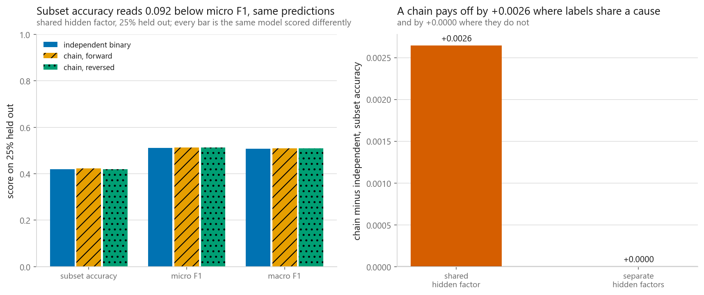
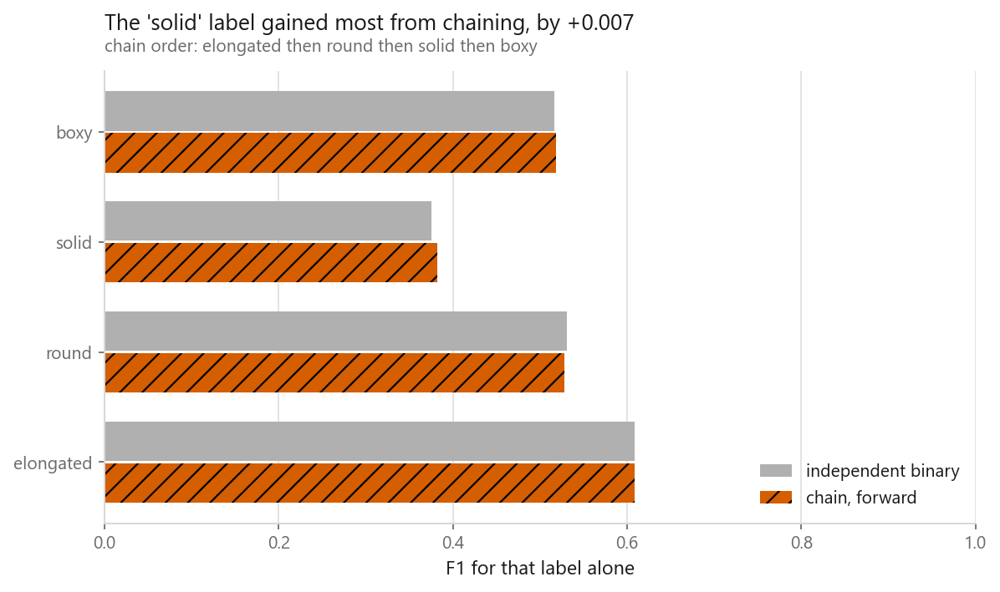
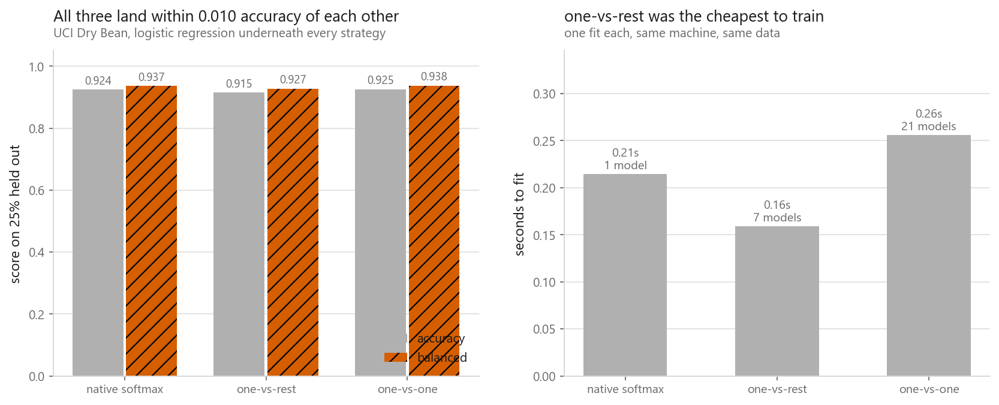
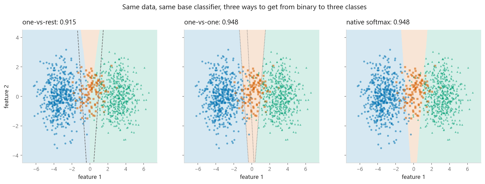
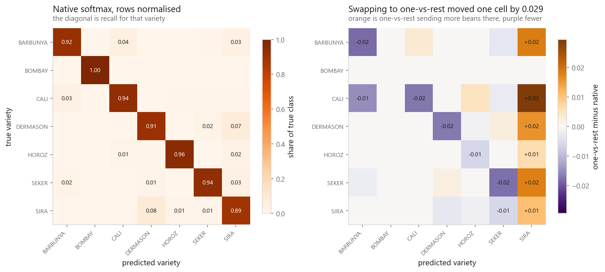

# Multiclass and multilabel strategies

### Three ways to reach seven classes, and a second problem that looks identical and is not

**[Open the notebook](notebook.ipynb)** · Part 3, Classification ·
Made by [Elyes Lounissi](https://www.linkedin.com/in/elyes-lounissi/)

| | |
|---|---|
| **What you will learn** | What one-vs-rest, one-vs-one and native multiclass each fit, what they cost, where they actually disagree, why multilabel is a different problem rather than a harder one, and which metric to report when a row carries several labels |
| **You should already know** | [Logistic regression](../01-logistic-regression/) · [Classification metrics](../../01-foundations/05-classification-metrics/) · [Imbalanced classes](../07-imbalanced-classes/) |
| **Datasets** | UCI Dry Bean (13,611 x 16, seven varieties, 6.79x imbalance), plus a four-label multilabel target built from it |
| **Runtime** | Three to four minutes on a laptop CPU |

---

## The result I would lead with

The multilabel half of this notebook was built to make classifier chains look
good. Four labels, each thresholded at the same quantile so prevalence is
identical at 0.3000, and a hidden factor pushing all four in the same direction
so that correlation survives after the model has read every feature. The control
regime is the same construction with a private hidden factor per label.

Mean absolute correlation between the four labels:

| Regime | Before the model sees X | Left over afterwards |
|---|---|---|
| shared hidden factor | 0.3403 | **0.4730** |
| separate hidden factors | 0.0914 | **0.0092** |

That is a clean separation, and here is what the chain did with it:

| Regime | Approach | Subset accuracy | Hamming loss | Micro F1 | Macro F1 |
|---|---|---|---|---|---|
| shared | independent binary | 0.4202 | 0.2424 | 0.5118 | 0.5079 |
| shared | **chain, forward** | **0.4229** | **0.2416** | **0.5130** | **0.5093** |
| shared | chain, reversed | 0.4199 | 0.2418 | 0.5126 | 0.5088 |
| separate | independent binary | 0.3209 | **0.2427** | 0.5134 | 0.5084 |
| separate | chain, forward | 0.3209 | 0.2429 | 0.5128 | 0.5077 |
| separate | chain, reversed | **0.3212** | 0.2428 | **0.5138** | **0.5090** |

**The chain won by 0.0027 of subset accuracy in the regime designed to reward
it.** Twenty-seven rows in ten thousand. The reversed chain, the same method with
the labels in the other order, came in **0.0003 below** four independent models
in that same regime. And in the control regime, where the design says a chain has
nothing to feed on, the reversed chain still finished ahead of independent binary
on subset accuracy, micro F1 and macro F1.

One seed, one 25% split, 3,403 test rows. A 0.0027 gap over that is not
distinguishable from which rows landed in the test set. The honest reading is
that a chain built on 0.4730 of leftover label correlation bought nothing you
could measure, and that the y-axis on the right panel above runs from 0 to
0.0026 for a reason.

Chains are still the right tool when the leftover correlation is large. This
experiment says the bar for "large" is higher than a notebook can conveniently
construct.

## Per-label F1, and the label that was supposed to gain

The design predicts that the label gaining most from chaining sits late in the
order, since it receives the most extra columns. Chain order was elongated, then
round, then solid, then boxy:

| Label | Position | Independent binary | Chain, forward | Difference |
|---|---|---|---|---|
| elongated | 1st | 0.6085 | 0.6085 | 0.0000 |
| round | 2nd | 0.5308 | 0.5281 | **-0.0027** |
| solid | 3rd | 0.3755 | 0.3823 | **+0.0068** |
| boxy | 4th | 0.5169 | 0.5183 | +0.0014 |

The winner is `solid`, third of four. `boxy`, the last link and the only one
handed three predicted labels, gained 0.0014. `round` lost. Whatever the chain is
doing here, it is not the thing the ordering was built to do.

The column moving in both directions is the part to carry forward, and it is about
macro averages rather than about chains. Chaining is not a uniform improvement
applied to four labels, it is a redistribution, and the macro F1 is an average of
gains and losses that partly cancel. If one of these labels mattered more than the
others to whoever reads the output, the macro number would be the wrong thing to
optimise and this table would be the right one. The failure a macro average hides
completely is a label the model has stopped predicting: it scores zero, the other
three carry the average, and no summary line says a quarter of the output is dead.

## Why accuracy is the wrong word for a label matrix

`accuracy_score` on a label matrix means **subset accuracy**: all four labels
right, or the row scores zero. Two deliberately useless predictors show what each
metric can be fooled by. Both are scored against the same 0.3000-prevalence
labels, where 0.4281 of rows carry no label at all and 1.1999 labels per row is
the average.

| Predictor | Subset accuracy | Hamming loss | Macro F1 |
|---|---|---|---|
| wrong about exactly one label on every row | **0.0000** | 0.2500 | 0.6419 |
| returns no labels at all, ever | **0.4281** | 0.3000 | **0.0000** |

The metric that gets fooled is **subset accuracy**. A predictor that predicts
nothing scores 0.4281 on it, above every real model in the table further up
(those are scored on the 25% test split, this one on all 13,611 rows), purely
because 42.81% of rows genuinely carry no labels. The same predictor scores
0.0000 on macro F1, which is the metric that refuses to be fooled.

Hamming loss does not fall for it either: the do-nothing predictor's 0.3000 is
*worse* than the three-out-of-four predictor's 0.2500. What Hamming loss misses
is the other direction, since it cannot tell a near miss from a total miss on a
row. Report all three.

## Three strategies, one dataset, and almost no difference

Dry Bean, 13,611 beans, seven varieties from 522 to 3,546 rows. Same logistic
regression underneath every strategy, same split, same scaling.

| Strategy | Models | Accuracy | Balanced accuracy | Fit seconds |
|---|---|---|---|---|
| native softmax | 1 | 0.9245 | 0.9366 | **0.1892** |
| one-vs-rest | 7 | 0.9148 | 0.9272 | 0.1564 |
| **one-vs-one** | 21 | **0.9251** | **0.9376** | **0.1547** |

All three land within **0.010 accuracy** of each other, and the two metrics agree
on the winner. The part worth staring at is the last column. **Fitting 21 models
was faster than fitting 1.** One-vs-one does `(K-1)n` = 81,666 rows of work
against one-vs-rest's `Kn` = 95,277 and native's `n` = 13,611, and it still came
first, because 21 small logistic regressions converge more easily than one
seven-class softmax.

The whole spread is 0.034 seconds, so on a linear base learner neither accuracy
nor cost is a real reason to choose. The wrapper only starts mattering when the
base learner scales worse than linearly.

An RBF kernel SVM on a 3,000-bean subsample, where cost is roughly quadratic in
rows:

| Strategy | Models | Fit seconds | Accuracy |
|---|---|---|---|
| one-vs-rest | 7 | 0.1777 | 0.9289 |
| one-vs-one | 21 | **0.0721** | 0.9280 |

**One-vs-rest took 2.47x as long while fitting 3x fewer models.** Twenty-one small
squares beat seven large ones. This is why `SVC` already does one-vs-one
internally.

## The rare class that turned out fine

The textbook complaint about one-vs-rest is that it compares scores from models
that were never calibrated against each other, and that rare classes suffer. On
the toy problem, where the middle class is squeezed between the other two and
much rarer, that is exactly what happens: one-vs-rest assigns the middle class
**2.05% of rows against a true share of 9.91%**, and scores 0.9153 against 0.9477
for native softmax.

On the real beans it does not happen at all. Recall by variety, rarest first:

| Variety | Test rows | Native softmax | One-vs-rest | One-vs-one |
|---|---|---|---|---|
| BOMBAY | 130 | **1.0000** | **1.0000** | **1.0000** |
| BARBUNYA | 330 | 0.9212 | 0.9030 | 0.9303 |
| CALI | 408 | 0.9412 | 0.9240 | 0.9436 |
| HOROZ | 482 | 0.9606 | 0.9544 | 0.9627 |
| SEKER | 507 | 0.9389 | 0.9211 | 0.9349 |
| SIRA | 659 | 0.8877 | 0.8983 | 0.8816 |
| DERMASON | 887 | 0.9064 | 0.8895 | 0.9098 |

The rarest variety is perfectly recalled by all three. BOMBAY is 522 rows out of
13,611 and it is also trivially separable, so the wrapper never gets a chance to
mishandle it. Where one-vs-rest actually loses is on the *common* varieties:
DERMASON 0.8895 against 0.9098, SEKER 0.9211 against 0.9389. Rarity was not the
axis that mattered on this dataset. Separability was.

## Where they disagree, and who is right there

Two models with the same accuracy are not the same model. **106 of 3,403 test
rows (3.11%)** get different answers from at least one strategy, and on those
rows the three are not close:

| Strategy | Accuracy on contested rows |
|---|---|
| native softmax | 0.5943 |
| **one-vs-rest** | **0.2830** |
| one-vs-one | 0.6132 |

One-vs-rest is right on less than a third of the rows where the strategies part
company, half the rate of the other two. On 106 rows a proportion carries a
standard error near 0.049, so the 0.31 gap is six of those and the 0.019 between
native softmax and one-vs-one is less than half of one. Two of these are the same
model. One is not.

The mechanism is the one the maths section predicts. One-vs-rest picks a winner by
comparing scores from `K` separately fitted binary models, and nothing ever put
those scores on a common scale: each was trained against a different negative set,
so a 2 from one and a 2 from another are not the same claim. When one model is
confident and the rest are ambivalent that does not matter, which is why the
aggregate accuracy of 0.9148 is fine. On a close call, which is what a contested
row is, the comparison is between quantities that were never made comparable.

**When two models score the same, look at the rows where they disagree before
concluding they are the same model.** It costs one boolean mask, and here it is
the difference between "pick the wrapper on cost" and "pick it on cost unless the
close calls are the ones you are paid for".
[03-09](../09-probability-calibration/) is the other route, since putting `K`
scores on a common scale is exactly what calibration does.

The mistakes are also redistributed rather than merely more numerous. Swapping
native softmax for one-vs-rest moves one confusion cell by **0.029**, and the
pattern is one-directional: one-vs-rest sends more beans to SIRA from almost
every other variety, and correspondingly it is the only strategy that beats the
others on SIRA recall.

Pairwise disagreement rates: native against one-vs-one 0.0088, native against
one-vs-rest 0.0238, one-vs-rest against one-vs-one 0.0300. Native softmax and
one-vs-one are close to the same model. One-vs-rest is the odd one out.

## Cheat sheet

| | |
|---|---|
| **Native multiclass** | Use it if the model has it. One fit, no wrapper. It was the slowest of the three here, at 0.1892 s against 0.1547 s |
| **One-vs-one** | `K(K-1)/2` models but only `(K-1)n` rows of work. Won accuracy, balanced accuracy and speed on Dry Bean, and beat one-vs-rest 2.47x on a kernel SVM |
| **One-vs-rest** | `K` models, `Kn` rows of work, one readable binary model per class. Its scores share no scale, which cost it 0.2830 against 0.6132 on the contested rows |
| **Model count is not cost** | 21 models fitted faster than 1 here. Time the thing rather than counting the fits |
| **Rare classes** | Check separability before you blame rarity. The rarest variety here scored 1.0000 under all three strategies |
| **Multilabel metrics** | Subset accuracy is the one that gets fooled: a predictor that predicts nothing scored 0.4281. Report Hamming loss and macro F1 beside it |
| **Chains** | Use `cv=5` so each link trains on predicted rather than true previous labels. Order matters and averaging random orders is the standard fix |
| **Before you reach for a chain** | Measure the label correlation that survives conditioning on X. Even at 0.4730 leftover, the chain bought 0.0027 of subset accuracy here |
| **Next** | [Probability calibration](../09-probability-calibration/), which is what makes one-vs-rest scores comparable |

---

If this chapter was useful, a star on the repository helps other people find it.
The code is yours to use, copy and adapt in your own work, no permission needed.

Made by **Elyes Lounissi** ·
[LinkedIn](https://www.linkedin.com/in/elyes-lounissi/) ·
[pilot.tun@gmail.com](mailto:pilot.tun@gmail.com)

Back to [Part 3](../) · [the curriculum](../../CURRICULUM.md) · [the book](../../README.md)

`#MachineLearning` `#Multiclass` `#Multilabel` `#OneVsRest` `#OneVsOne`
`#ClassifierChains` `#BinaryRelevance` `#HammingLoss` `#SubsetAccuracy`
`#ScikitLearn` `#DryBean` `#MLTutorial` `#LearnMachineLearning` `#DataScience`
`#AI`
