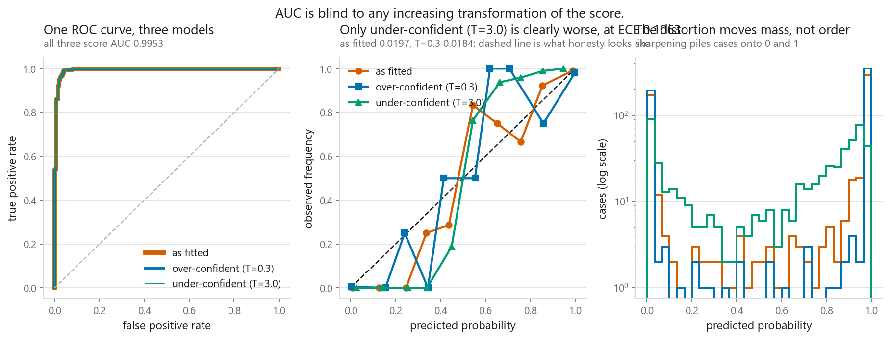
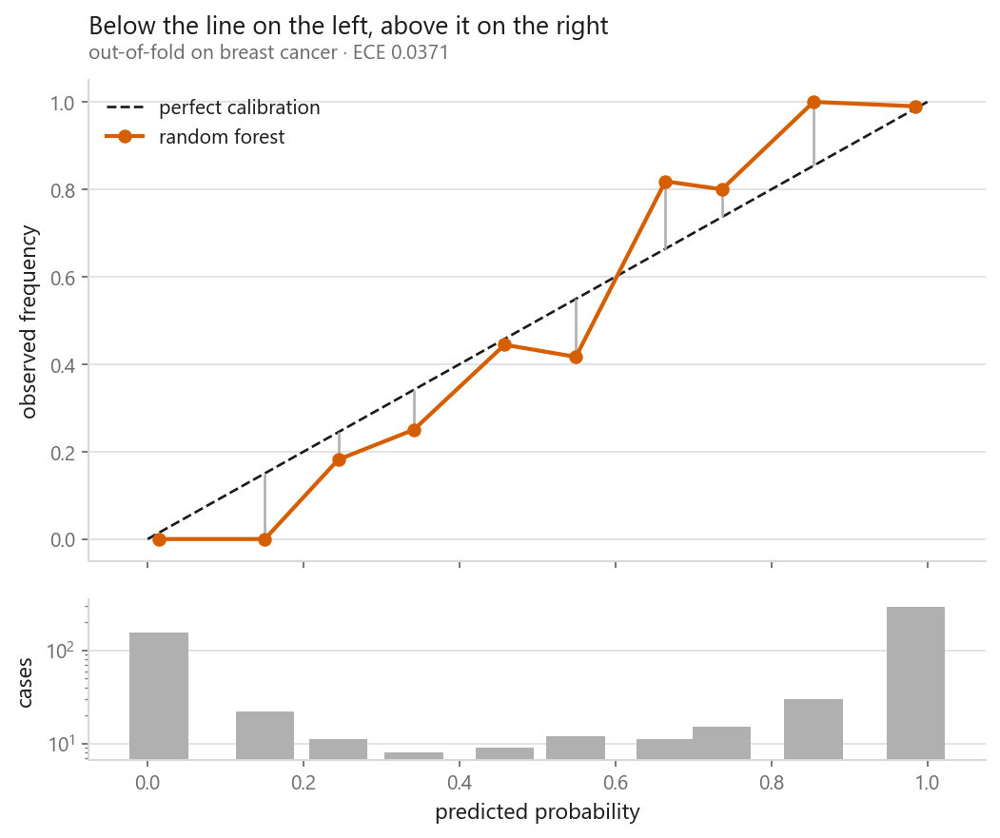
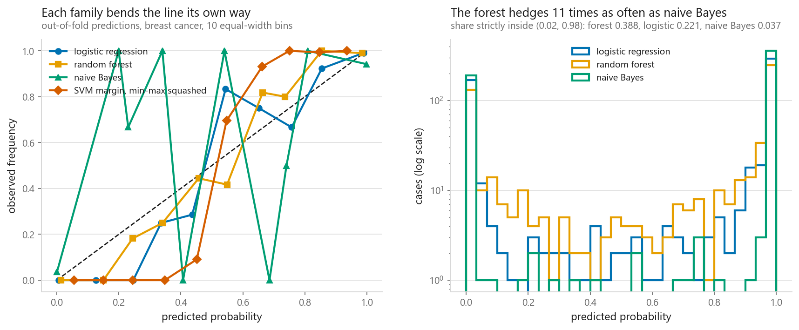
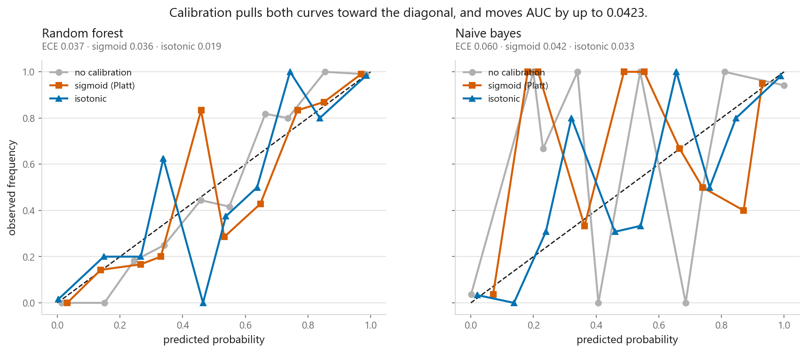
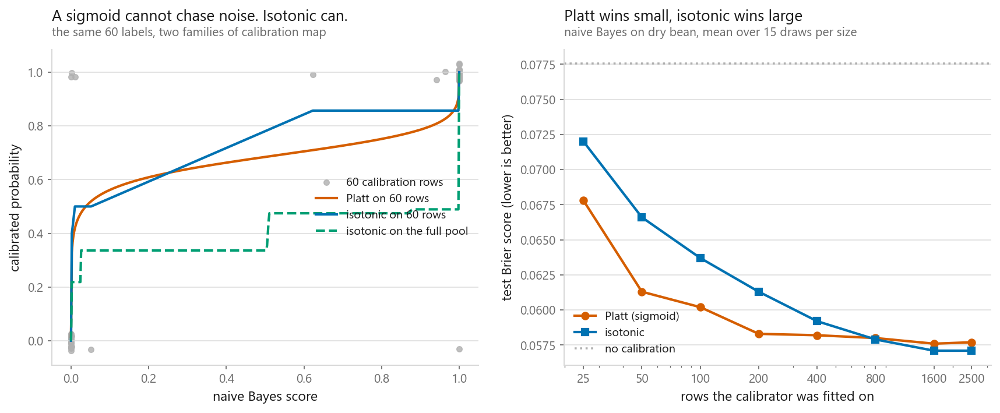

# Probability calibration

### Getting a predicted 0.8 to mean eight times out of ten

**[Open the notebook](notebook.ipynb)** · Part 3, Classification ·
Made by [Elyes Lounissi](https://www.linkedin.com/in/elyes-lounissi/)

| | |
|---|---|
| **What you will learn** | Why ranking cases correctly and reporting honest probabilities are two separate skills, how to read a reliability diagram, how to write expected calibration error yourself in a few lines of NumPy, the shape of miscalibration each model family produces, and when Platt scaling beats isotonic regression |
| **You should already know** | [Logistic regression](../01-logistic-regression/), [naive Bayes](../03-naive-bayes/), [support vector machines](../05-support-vector-machines/), [classification metrics](../../01-foundations/05-classification-metrics/), [cross-validation](../../01-foundations/04-cross-validation/) |
| **Datasets** | UCI Breast Cancer Wisconsin, UCI Dry Bean |
| **Runtime** | Under two minutes on a laptop CPU |

---

The measurement I did not expect: fitting a calibrator on the model's own training
rows left a random forest **worse than never calibrating at all** (ECE **0.0651**
against **0.0171** uncalibrated) and knocked its AUC from 0.9820 to 0.9411. Platt
scaling then nearly tripled the error of a logistic regression that had arrived
calibrated already. Calibration is a separate axis from accuracy, and it is easy to
move the wrong way.

## Ranking is not probability

I built the two extremes by hand first. A model that orders every case correctly and
lies about every number: **AUC 1.0000, ECE 0.6109**, labelling everything positive at
the 0.5 threshold so accuracy lands on the base rate of 0.3000. Then a model that
ranks at chance and tells the truth on average: **AUC 0.5000, ECE 0.0000**. No single
number catches both failures. On real data I took a logistic regression on breast
cancer and divided its logits by a temperature $T$, which cannot move the order.

| Variant | AUC | ECE | Brier |
|---|---|---|---|
| As fitted | 0.995283 | 0.0197 | 0.0195 |
| Over-confident, $T = 0.3$ | 0.995283 | 0.0184 | 0.0186 |
| Under-confident, $T = 3.0$ | 0.995283 | **0.1063** | 0.0381 |

AUC spread across the three: **0.0000000000**. ECE spread: **0.0878**. Sharpening
this model slightly *improved* its ECE (the fitted version was already a little
under-confident), so only the flattening did damage.

## Reliability diagrams and expected calibration error

ECE is a weighted average of the per-bin gaps between predicted probability and
observed frequency, $\sum_b (n_b/n)\,|\bar{y}_b - \bar{p}_b|$, and nothing else is
going on. I wrote it twice, as a loop and vectorised, and checked both against
`toolkit.evaluate`: all three returned **0.0184214056**.

The bin populations are what most reliability plots hide. Here **79.3% of the data
sat in the two end bins**: the largest held 296 cases at a gap of +0.005, while the
bin with the worst gap on the plot, +0.154, held 11. Those two dots look identical
and should not. ECE is also not a proper scoring rule (predicting the base rate for
everything scores near zero, as above), so quote Brier or log loss beside it.

## Each model family fails in its own shape

Four models on breast cancer, all scored out of fold.

| Model | AUC | Accuracy | Brier | ECE |
|---|---|---|---|---|
| Logistic regression | 0.9953 | 0.9789 | 0.0195 | 0.0197 |
| Random forest | 0.9907 | 0.9578 | 0.0301 | 0.0371 |
| Naive Bayes | 0.9877 | 0.9385 | 0.0568 | 0.0603 |
| SVM margin, min-max squashed | 0.9953 | 0.9754 | 0.0654 | **0.1927** |

**The forest is under-confident.** Its score is the share of trees voting positive,
and near a boundary a few dissent, so the prediction lands in between. It is
tempting to conclude that 0 and 1 become unreachable. They do not: the forest's
printed range is **min 0.0000, max 1.0000**, and 79.3% of its cases sat in the two
end bins of the diagram above, because most breast cancer cases are nowhere near a
boundary and all 300 trees agree on them.

What the forest does is hedge *more often* than the others: **38.8%** of its
predictions sit strictly inside (0.02, 0.98), against **22.1%** for logistic
regression and **3.7%** for naive Bayes. The middle is fuller, not full, and that
is enough to bend the reliability curve.

**The SVM margin is not a probability.** `decision_function` returned a signed
distance in [−2.765, 2.592]. Min-max squashing and a plain sigmoid both hold the AUC
at exactly 0.9953 and both stay badly calibrated, at ECE 0.1927 and 0.1753: neither
looked at a label.

**Naive Bayes has the widest confidence-versus-accuracy gap of the models that are
actually estimating probabilities.** It counts correlated features repeatedly, as if
they were independent: **95.6% of its predictions came out above 0.99 confidence** at
a mean confidence of **0.9919**, against an overall accuracy of **0.9385**.

It is not the worst-calibrated thing in the table, though. Naive Bayes scores ECE
**0.0603**; the squashed SVM margin scores **0.1927**, three times worse. The two
failures differ in kind: naive Bayes is badly wrong about a quantity it set out to
estimate, while the margin was never estimating a probability at all.

## Platt scaling against isotonic regression

| Model | ECE none | ECE sigmoid | ECE isotonic | AUC, none → isotonic |
|---|---|---|---|---|
| Logistic regression | **0.0197** | 0.0571 | 0.0119 | 0.9953 → 0.9938 |
| Random forest | 0.0371 | 0.0358 | 0.0191 | 0.9907 → 0.9886 |
| Naive Bayes | 0.0603 | 0.0418 | 0.0332 | 0.9877 → 0.9854 |
| SVM (rbf) | 0.1927 | 0.0433 | **0.0159** | 0.9953 → 0.9931 |

The SVM is the clean win: ECE from 0.1927 to 0.0159, a **12× reduction**, for 0.0022
of AUC. That is what calibration is for. Two results argue against reaching for it
reflexively. Sigmoid on logistic regression made ECE **2.9× worse**: log loss is a
proper scoring rule, so that model was already fine and the wrapper solved a problem
that did not exist. And sigmoid on naive Bayes cost **0.0423 of AUC**, 0.9877 down
to 0.9454, which the usual "a calibrator is monotone and cannot reorder anything"
does not cover. Monotone holds in the idealised case. In practice the map is
*fitted*: a sigmoid fitted on scores already crushed against 0 and 1, which is
exactly what naive Bayes produces, saturates and maps whole groups of distinct
scores onto one output. Ties are not reorderings, but AUC counts them at half
credit, so it falls. On top of that `CalibratedClassifierCV` refits the base
estimator on each internal fold and averages, so the score being calibrated is not
quite the one you started with. Measure AUC after wrapping rather than assuming it
held.

### Where isotonic overfits

Breast cancer is too small to sweep, so I switched to dry bean, kept the two
varieties that get confused most, and split 1730 train / 2597 calibration pool /
1855 test: uncalibrated Brier 0.0775, ECE 0.0736. Then I held the base model fixed
and grew only the calibration set.

| Calibration rows | 25 | 50 | 100 | 200 | 400 | 800 | 1600 | 2500 |
|---|---|---|---|---|---|---|---|---|
| Platt Brier | **0.0678** | **0.0613** | **0.0602** | **0.0583** | **0.0582** | 0.0580 | 0.0576 | 0.0577 |
| Isotonic Brier | 0.0720 | 0.0666 | 0.0637 | 0.0613 | 0.0592 | **0.0579** | **0.0571** | **0.0571** |

**The crossover fell at about 800 calibration rows.** Read the margins as well as
the winner: at 25 rows Platt wins by 0.0042, at 2500 isotonic wins by 0.0006.
Choosing Platt when isotonic was right costs seven times less than the reverse, so
sigmoid is the safer default and the crossover is a long way up.

## Fit the calibrator on data the model has not seen

This forest scored **1.0000 on its own training rows** and 0.9261 on test, at mean
confidence 0.9618 on those training rows. A calibrator fitted there learns that 0.95
means near-certain, because on those rows it was.

| Calibration data | ECE | Brier | AUC |
|---|---|---|---|
| No calibration | 0.0171 | 0.0515 | 0.9820 |
| Sigmoid, on the training rows | 0.0566 | 0.0614 | 0.9820 |
| Sigmoid, on held-out rows | 0.0344 | 0.0528 | 0.9820 |
| Isotonic, on the training rows | **0.0651** | 0.0671 | **0.9411** |
| Isotonic, on held-out rows | **0.0144** | 0.0523 | 0.9815 |
| Isotonic, cross-fitted on everything | 0.0152 | **0.0497** | **0.9836** |

Both methods came out worse than doing nothing when fitted on the training rows,
isotonic hardest at **3.8× the uncalibrated ECE** plus a 0.0409 AUC loss. Sigmoid on
held-out rows, at 0.0344, still failed to beat leaving this model alone.
Cross-fitting is the one to reach for: best Brier and best AUC of the six, and no
data set aside permanently.

The danger scales with overfitting. Repeated with naive Bayes, which fits its
training rows about as well as anything else (0.9035 train against 0.9121 test), the
two rows land at ECE 0.0176 and 0.0187, barely a difference. Rather than reason
about that per model, always use held-out data.

## Cheat sheet

| | |
|---|---|
| **Discrimination** | Does the model order the cases. AUC. Invariant to any increasing transform of the score |
| **Calibration** | Does the number mean what it says. ECE, read against the diagonal of a reliability diagram |
| **Report together** | ECE plus Brier or log loss. ECE alone rewards a model that predicts the base rate and nothing else |
| **Random forest** | Under-confident. Votes average away from 0 and 1, 38.8% of scores inside (0.02, 0.98) here |
| **Naive Bayes** | Over-confident. 95.6% of predictions above 0.99 confidence at 0.9385 accuracy |
| **SVM** | `decision_function` is a distance. Squashing it by hand fixes nothing: ECE stayed at 0.1927 |
| **Logistic regression** | Usually arrives calibrated. Wrapping it made ECE 2.9× worse here |
| **Platt vs isotonic** | Sigmoid below roughly 800 calibration rows, isotonic past it, and by a small margin even then |
| **Where to fit it** | Never the training rows. Held-out split, or `CalibratedClassifierCV(estimator=..., cv=5)` to cross-fit. For a prefit model, `FrozenEstimator`: the old `cv="prefit"` is gone in scikit-learn 1.8 |

---

If this chapter was useful, a star on the repository helps other people find it.
The code is yours to use, copy and adapt in your own work, no permission needed.

Made by **Elyes Lounissi** ·
[LinkedIn](https://www.linkedin.com/in/elyes-lounissi/) ·
[pilot.tun@gmail.com](mailto:pilot.tun@gmail.com)

Back to [Part 3](../) · [the curriculum](../../CURRICULUM.md) · [the book](../../README.md)

`#MachineLearning` `#Calibration` `#ProbabilityCalibration` `#ReliabilityDiagram`
`#PlattScaling` `#IsotonicRegression` `#Python` `#ScikitLearn` `#DataScience`
`#MLTutorial`
