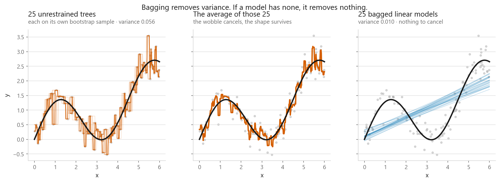
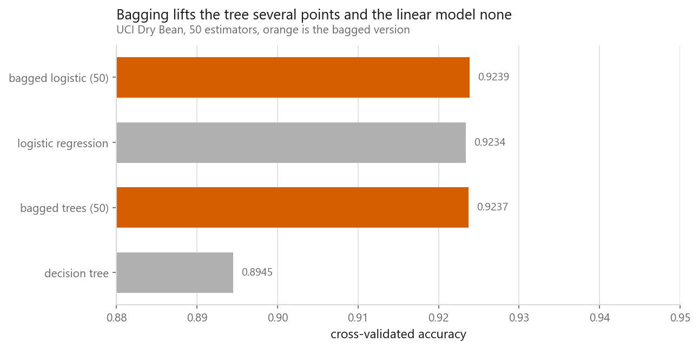
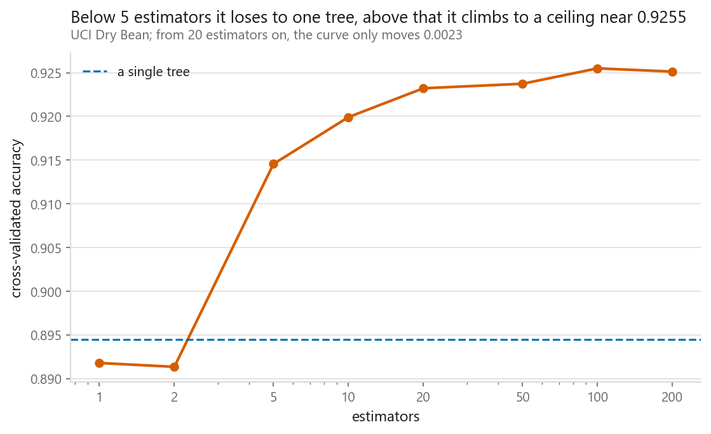

# Bagging

### Why averaging unstable models makes a stable one

**[Open the notebook](notebook.ipynb)** · Part 4, Ensembles ·
Made by [Elyes Lounissi](https://www.linkedin.com/in/elyes-lounissi/)

| | |
|---|---|
| **What you will learn** | What a bootstrap sample is, why averaging cuts variance and leaves bias alone, which models bagging helps and which it cannot, and where out-of-bag scoring comes from |
| **You should already know** | [Decision trees](../../03-classification/06-decision-trees/), [overfitting](../../01-foundations/03-overfitting-and-underfitting/) |
| **Datasets** | UCI Dry Bean, plus a synthetic curve |
| **Runtime** | Two to three minutes on a laptop CPU |

---

## The idea

Averaging $B$ independent estimates each with variance $\sigma^2$ gives an average
with variance $\sigma^2/B$. The errors point in different directions and cancel;
the signal is common to all of them and survives.

You have one training set, not $B$. **Bootstrapping** fakes it: draw $n$ rows *with
replacement* from your $n$ rows.

| Rows | Left out of a bootstrap sample | Theory: $(1-1/n)^n$ |
|---|---|---|
| 100 | 36.500% | 36.603% |
| 20,000 | **36.790%** | 36.787% |

About **37% of rows are missing from every sample**, converging on $1/e$. Those
rows become the out-of-bag validation set.

## Watching variance cancel

| | Variance across 25 fits |
|---|---|
| Unrestrained trees | 0.0563 |
| Linear models | 0.0099 |

The left panel is 25 overfitted step functions each chasing its own sample. Their
average tracks the real curve closely: error drops from **0.1037** for a typical
tree to **0.0475** for the average. Nothing was pruned or regularised; the wobble
simply cancelled.

The right panel is the control most explanations skip. **Bagged linear models are
pointless**: a straight line barely changes between samples, so there is no
variance to average away.

## What it helps, measured

| Model | Alone | Bagged (50) | Gain |
|---|---|---|---|
| Decision tree | 0.8945 | 0.9237 | **+0.0292** |
| Logistic regression | 0.9234 | 0.9239 | +0.0005 |

**Bagging helps unstable models and does nothing for stable ones.** That is the
rule for deciding whether to reach for it.

## How many estimators

| Estimators | Accuracy | Against a single tree (0.8945) |
|---|---|---|
| 1 | 0.8918 | **-0.0027** |
| 2 | 0.8913 | **-0.0032** |
| 20 | 0.9232 | +0.0287 |
| 100 | **0.9255** | +0.0310 |
| 200 | 0.9251 | +0.0306 |

**"More never hurts" is wrong at both ends of this curve.** Going from one
estimator to two, accuracy *falls*. And both sit **below the single tree** they are
meant to beat. Bagging does not start paying until five estimators.

The reason is the mechanism running in reverse. Each bootstrap sample leaves out
about 37% of the rows, so every tree in the ensemble trains on less data than the
single tree and is worse than it. Averaging is what buys that back, and with one or
two models there is nothing to average. You have paid the cost of discarding rows
and collected none of the benefit. **Bagging is a trade, and at small ensemble sizes
the trade is a loss.**

At the far end the curve reaches 0.9255 at 100 and returns to 0.9251 at 200. That
is noise, not decline, which is the real point: past twenty estimators the curve
moves by less than the fold-to-fold error, so more is neither helping nor hurting
measurably.

The ceiling exists because bootstrap samples overlap in roughly 63% of their rows,
so the models share most of their mistakes. Pushing that correlation down is exactly
what [random forests](../02-random-forest/) add.

## Out-of-bag scoring, for free

| | Score | Cost |
|---|---|---|
| Out-of-bag | 0.9239 | 3.2 s, **one fit** |
| 5-fold CV | 0.9255 | 12.2 s, five fits |

They agree within 0.0016, and the out-of-bag version is **3.8× faster**.

## Cheat sheet

| | |
|---|---|
| **Use it when** | Your base model is unstable: deep trees, small-k k-NN, anything that swings when the data shifts |
| **Do not bother when** | The base model is already stable |
| **What it fixes** | Variance. Bias is left exactly where it was |
| **Estimators** | Too few is worse than not bagging: one and two both lost to a single tree here. Twenty gets most of it |
| **Free extra** | `oob_score=True`, validation for one fit instead of five |

---

If this chapter was useful, a star on the repository helps other people find it.
The code is yours to use, copy and adapt in your own work, no permission needed.

Made by **Elyes Lounissi** ·
[LinkedIn](https://www.linkedin.com/in/elyes-lounissi/) ·
[pilot.tun@gmail.com](mailto:pilot.tun@gmail.com)

Back to [Part 4](../) · [the curriculum](../../CURRICULUM.md) · [the book](../../README.md)

`#MachineLearning` `#Bagging` `#Ensemble` `#Bootstrap` `#DecisionTrees`
`#Python` `#ScikitLearn` `#DataScience` `#MLTutorial` `#VarianceReduction`
