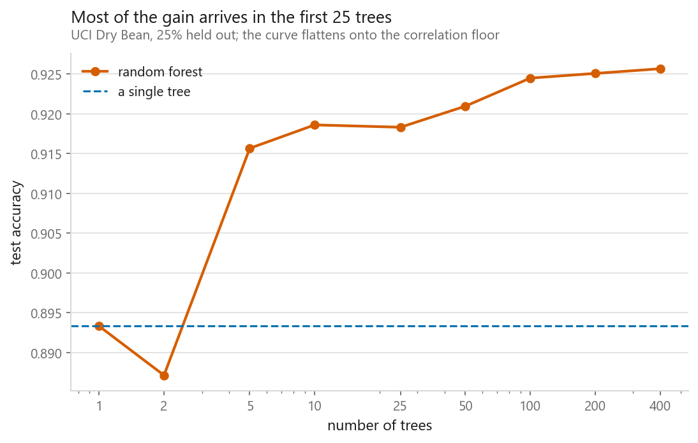
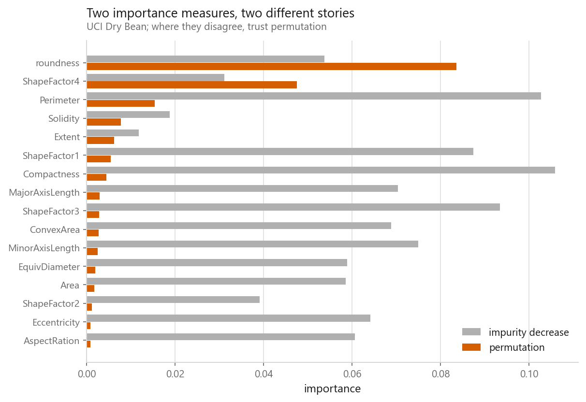
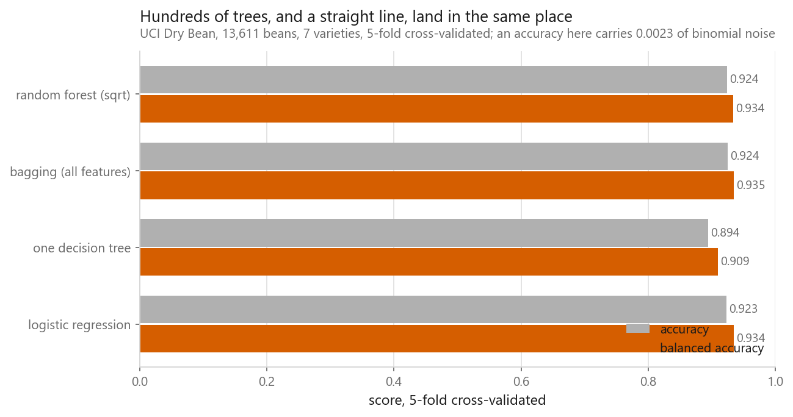
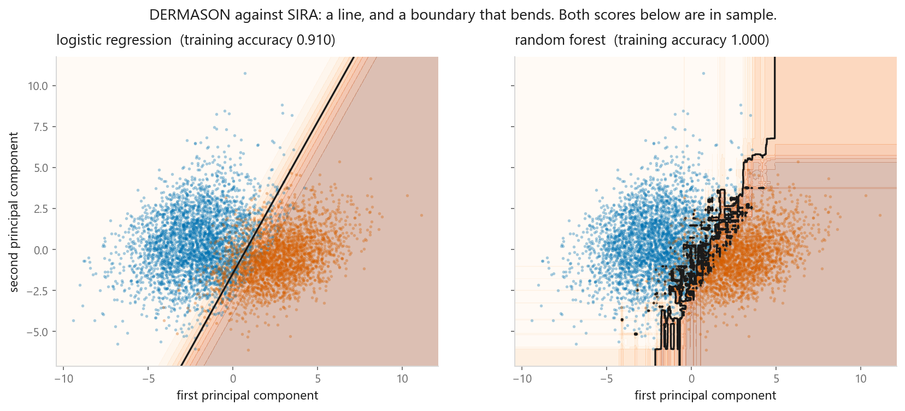

# Random forests

### Hundreds of mediocre trees, voting

**[Open the notebook](notebook.ipynb)** · Part 4, Ensembles ·
Made by [Elyes Lounissi](https://www.linkedin.com/in/elyes-lounissi/)

| | |
|---|---|
| **What you will learn** | Why averaging overfitted trees works, what each source of randomness contributes, how to read feature importance without being misled, and why on this dataset the forest does **not** beat a straight line |
| **You should already know** | [Logistic regression](../../03-classification/01-logistic-regression/) |
| **Dataset** | UCI Dry Bean (13,611 × 16), the same one the logistic regression notebook uses |
| **Runtime** | Two to three minutes on a laptop CPU |

---

## The idea

A single decision tree grown to full depth memorises its training data. Trees
have **low bias and enormous variance**: change a few rows and you get a visibly
different tree.

A random forest turns that weakness into the mechanism: grow hundreds of
overfitted trees, each on a different view of the data, and average their votes.
Individual mistakes differ from tree to tree and cancel; the signal is common to
all of them and survives.

Two sources of randomness make the trees differ: **bootstrap sampling** of rows,
and **feature subsampling** at each split.

## Why it works, in one equation

For $B$ predictors each with variance $\sigma^2$ and pairwise correlation $\rho$:

$$\operatorname{Var}(\bar{f}) = \rho\sigma^2 + \frac{1 - \rho}{B}\sigma^2$$

The second term vanishes as you add trees, which is why more trees never hurt.
The first does not shrink at all; it is floored by how correlated the trees are.
That single fact explains the entire design: bootstrapping and feature
subsampling exist to push $\rho$ down.

Most of the gain arrives in the first 25 trees. Going from 25 to 400 buys
**+0.007** and costs sixteen times the compute.

## Feature importance, and how it lies

The default **impurity decrease** measure is free and biased: it inflates
continuous and high-cardinality features, because they offer more places to
split. **Permutation importance** shuffles a column and measures the damage.
Slower, much harder to fool. Where they disagree, believe the second.

## The result I did not expect

| Model | Accuracy | Balanced accuracy |
|---|---|---|
| One decision tree | 0.8945 | 0.9094 |
| Logistic regression | 0.9234 | 0.9341 |
| Bagging (all features) | 0.9245 | **0.9346** |
| Random forest (sqrt) | **0.9244** | 0.9335 |

I built this notebook expecting the forest to pull clearly ahead. **It ties.** The
forest gains a thousandth of a point of accuracy over logistic regression and
*loses* on balanced accuracy.

The single tree is the informative row. At 0.894 it sits three points below both,
so the ensemble is doing exactly what it promises, recovering the variance a lone
tree throws away. It just has nothing left over.

**Feature subsampling bought nothing either.** Plain bagging over all 16 features
matched the `sqrt` version, because with only 16 mostly-informative columns,
restricting each split to four costs about as much signal as the decorrelation
gains.

**Why:** bean features are geometric measurements of one object: area, perimeter,
axis lengths, equivalent diameter. Smooth, heavily correlated, and the varieties
differ mostly in size and elongation. That is close to the ideal case for a linear
boundary. There is very little non-linear structure for a forest to find.

The forest's boundary does bend, and it is visibly rougher, a staircase of
axis-aligned splits. It barely helps, because the seam between these varieties is
genuinely close to straight.

**The lesson:** a more flexible model is not automatically a better one. It is
better when there is non-linear structure to exploit. Check whether there is.

## Cheat sheet

| | |
|---|---|
| **Use it when** | Tabular data, mixed feature types, non-linear boundaries, and you want a strong result without tuning |
| **Avoid it when** | You need to extrapolate beyond the training range (trees cannot), you need a tiny model, or the data is images, audio, or text |
| **Scaling needed** | No. Trees split on thresholds; units are irrelevant |
| **Main dials** | `n_estimators` (more is never worse), `max_features` (the real lever), `max_depth`, `min_samples_leaf` |
| **Free extras** | `oob_score=True` gave 0.9248 against a cross-validated 0.9244, with no extra fitting |
| **Watch out** | Default feature importance inflates continuous columns. Use permutation importance to check |

---

Made by **Elyes Lounissi** ·
[LinkedIn](https://www.linkedin.com/in/elyes-lounissi/) ·
[pilot.tun@gmail.com](mailto:pilot.tun@gmail.com)

Back to [Part 4](../) · [the curriculum](../../CURRICULUM.md) · [the book](../../README.md)

`#MachineLearning` `#RandomForest` `#Ensemble` `#Bagging` `#DecisionTrees`
`#Python` `#ScikitLearn` `#DataScience` `#MLTutorial` `#FeatureImportance`
