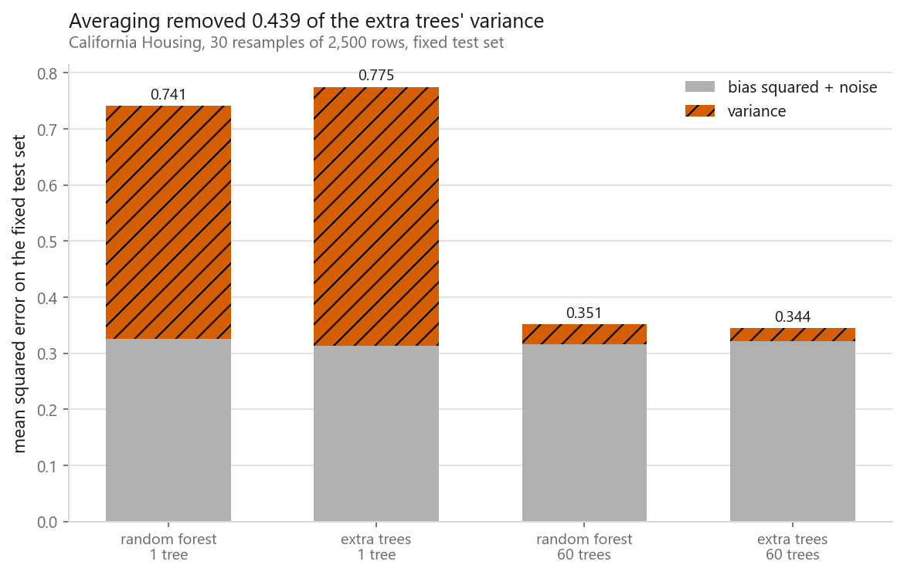
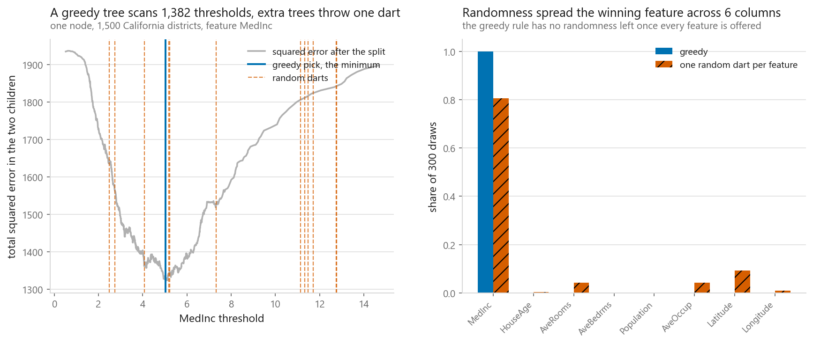
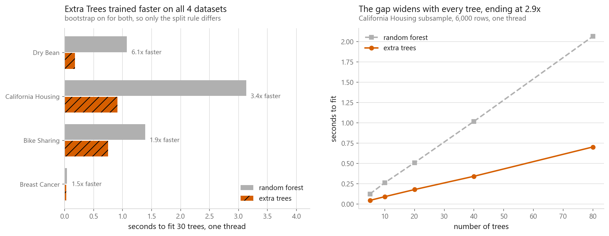
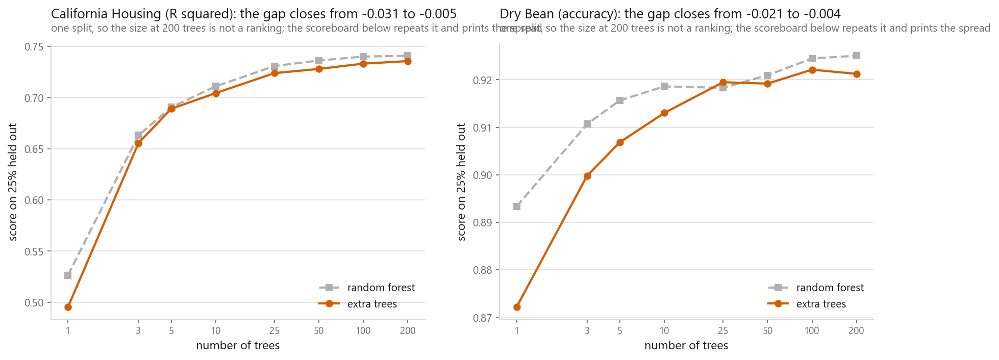
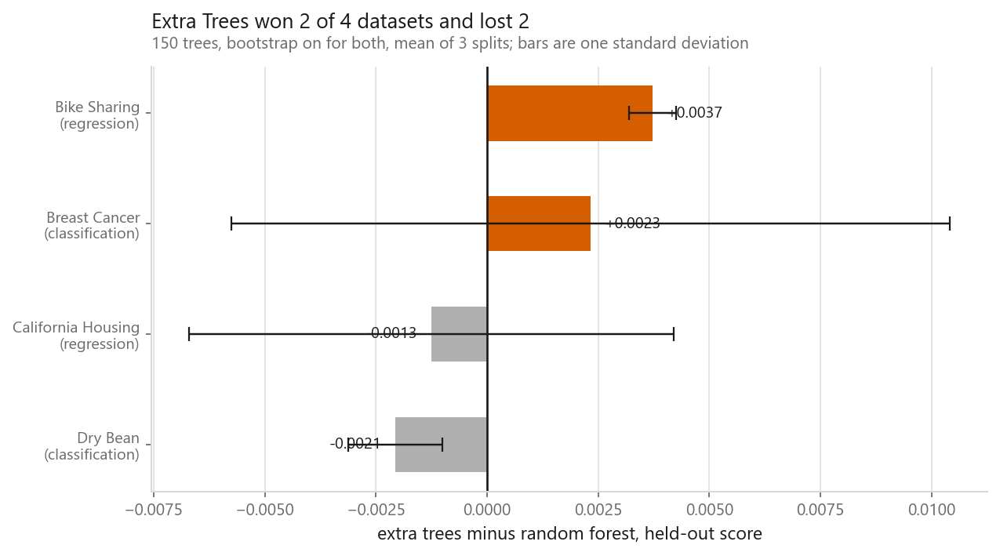

# Extra Trees

### The famous difference is worth +0.0049. The default nobody mentions is worth +0.1808

**[Open the notebook](notebook.ipynb)** · Part 4, Ensembles ·
Made by [Elyes Lounissi](https://www.linkedin.com/in/elyes-lounissi/)

| | |
|---|---|
| **What you will learn** | The one line that separates an extremely randomised forest from an ordinary one, how to measure an ensemble's bias and variance instead of quoting the textbook claim, where the speed advantage comes from, and why the ranking flips between datasets |
| **You should already know** | [Bagging](../01-bagging/), [random forests](../02-random-forest/), and [decision trees](../../03-classification/06-decision-trees/) |
| **Datasets** | All four house datasets: California Housing, Bike Sharing, Dry Bean, Breast Cancer |
| **Runtime** | Three to five minutes on a laptop CPU. Timings are single-threaded on purpose, because `n_jobs=-1` measures your core count |

---

## The result I would lead with

`ExtraTreesRegressor` and `RandomForestRegressor` differ in two things, not one.
Everybody knows about the split rule. Almost nobody mentions that scikit-learn
ships them with different `bootstrap` defaults, `False` for Extra Trees and
`True` for random forests. Moving one at a time on California Housing:

| Change | Effect on held-out R² |
|---|---|
| split rule alone, both with bootstrap on | **+0.0049** |
| bootstrap alone, both with random splits | -0.0087 |
| bootstrap alone, both with greedy splits | **+0.1808** |
| the two library defaults against each other | +0.0136 |

**The change the entire method is named after is worth a thirty-seventh of the
change that lives in a keyword argument.** A default `ExtraTreesRegressor()`
against a default `RandomForestRegressor()` is measuring both, and reporting one.

The row that explains it is the third one. A greedy tree that sees all the rows
and all the features is deterministic, so `RandomForestRegressor(bootstrap=False)`
with the default `max_features=1.0` does not build a forest. It builds the same
tree two hundred times and averages it with itself. The measured spread between
its trees is **0.0921**, against **0.4829** for Extra Trees under the same
setting.

| Variant | R² held out | Spread between trees | Fit seconds |
|---|---|---|---|
| random forest, bootstrap on (default) | 0.7947 | 0.4520 | 4.9804 |
| random forest, bootstrap off | **0.6139** | **0.0921** | 7.2687 |
| extra trees, bootstrap off (default) | 0.8083 | 0.4829 | 2.4002 |
| extra trees, bootstrap on | 0.7996 | 0.5069 | 1.6866 |

That asymmetry is why the two classes ship with different defaults, and it is
why every comparison below keeps **bootstrap on for both**. Turning it off would
hand Extra Trees a win by disabling its opponent.

## The textbook claim about bias and variance failed at one tree

The standard story is that random splits raise bias and lower variance. Bias and
variance are properties of a procedure rather than of a fitted model, so the
notebook measures them properly: 30 fresh training sets of 2,500 rows each,
predicting one fixed test set of 3,000 rows.

| Family | Trees | Bias² + noise | Variance | Expected error |
|---|---|---|---|---|
| random forest | 1 | 0.3264 | 0.4147 | 0.7411 |
| extra trees | 1 | **0.3132** | **0.4618** | 0.7750 |
| random forest | 60 | 0.3159 | 0.0354 | 0.3513 |
| extra trees | 60 | 0.3212 | 0.0233 | **0.3445** |

At one tree, Extra Trees carry **-0.0132 bias and +0.0471 variance**. That is the
textbook claim with both signs backwards, and the notebook prints the verdict
line as `False`. At sixty trees it flips to +0.0053 bias and -0.0121 variance,
which is the textbook claim holding, and that is the configuration you would
actually deploy.

So the tidy sentence about a bias-variance trade is a statement about the
ensemble, not about the splitter. One extremely randomised tree was not a
higher-bias estimator here. It was a noisier one, and averaging is what converts
that noise into the advantage.

One caveat the notebook states rather than hides: with a single observed y per
test point the noise term cannot be separated from the bias term, so the first
column is bias² plus noise. The noise is identical for both methods, so
differences between the two bias figures are still real.

## What the split rule actually does

On one node of California Housing, the greedy search scored **1,382 candidate
thresholds** and picked `MedInc <= 5.032`. Twelve random darts thrown at the
same axis landed between **2.481 and 12.766**.

The consequence is the right-hand panel. Across 300 draws on the same rows:

| Rule | Distinct features ever chosen | Most common |
|---|---|---|
| greedy (random forest) | **1** | MedInc, 1.00 of the time |
| one random dart per feature (extra trees) | **6** | MedInc, 0.81 |

Offered every feature, the greedy rule is deterministic: same data, same answer,
every time. Once the threshold is a coin toss the winning feature stops being
fixed, and two trees grown on identical rows disagree from the root down.

The from-scratch implementation, with the splitter passed as an argument so that
swapping `greedy_split` for `dart_split` is the whole difference, shows the trade
on 15 trees and 1,200 rows:

| | Mean single tree R² | Worst single tree R² | 15 trees averaged | Gain from averaging |
|---|---|---|---|---|
| greedy | 0.5399 | 0.5006 | 0.6800 | +0.1401 |
| random darts | 0.4489 | 0.3111 | 0.5975 | **+0.1485** |

The random version starts further behind and climbs further, exactly as the
decorrelation argument predicts. It also does not climb far enough to catch up
here, which is the part the argument does not promise.

## The clock, which is the one advantage that does not depend on the data

The greedy rule sorts each candidate feature at each node, `O(m·n log n)`. The
random rule reads a minimum and a maximum and evaluates one threshold, `O(m·n)`,
with no sort. One fit of 30 trees, single-threaded, bootstrap on for both:

| Dataset | Extra trees | Random forest | Speedup |
|---|---|---|---|
| Bike Sharing | 2.025 s | 3.334 s | 1.647x |
| Breast Cancer | 0.076 s | 0.106 s | 1.401x |
| California Housing | 2.312 s | 6.963 s | 3.011x |
| Dry Bean | 0.403 s | 2.327 s | **5.778x** |

Both curves are straight lines through the origin, because trees are built
independently. What changes is the slope, and the slope is the per-tree cost of
the sort. The gap is smallest on the smallest dataset, 1.40x on Breast Cancer's
569 rows, and largest on Dry Bean at 5.78x, which fits the `n log n` term.

## Does more randomness need more trees

| Trees | California R², RF | California R², ET | Difference |
|---|---|---|---|
| 1 | 0.5264 | 0.4953 | **-0.0311** |
| 5 | 0.6905 | 0.6890 | -0.0015 |
| 25 | 0.7308 | 0.7239 | -0.0069 |
| 200 | 0.7410 | 0.7357 | -0.0053 |

| Trees | Dry Bean accuracy, RF | Dry Bean accuracy, ET | Difference |
|---|---|---|---|
| 1 | 0.8933 | 0.8722 | **-0.0212** |
| 5 | 0.9157 | 0.9068 | -0.0088 |
| 25 | 0.9183 | 0.9195 | **+0.0012** |
| 200 | 0.9251 | 0.9212 | -0.0038 |

The single-tree row is the cost of random splitting with none of the benefit
collected yet, and it is the biggest gap in both tables by a wide margin. Most of
it closes by five trees, which is the decorrelation argument working exactly as
advertised.

The far end of both curves is the part to resist reading. These are single splits,
and the differences past 25 trees are a few thousandths on one partition. The
crossover the decorrelation story leads you to expect does not appear, but the
honest way to put that is that this experiment cannot see a difference this small.
The scoreboard below repeats each dataset over three splits and prints the spread,
and two of its four rows turn out to be smaller than their own spread. Treat these
two tables as being about the shape of the curves, not about which one ends higher.

## The sign flips

Three repeated splits per dataset, so the ordering is not decided by one lucky
partition:

| Dataset | Extra trees | Random forest | Difference | Spread of the difference |
|---|---|---|---|---|
| Bike Sharing | **0.9444** | 0.9407 | +0.0037 | 0.0005 |
| Breast Cancer | **0.9534** | 0.9510 | +0.0023 | **0.0081** |
| California Housing | 0.7990 | **0.8002** | -0.0013 | **0.0054** |
| Dry Bean | 0.9271 | **0.9292** | -0.0021 | 0.0011 |

**Extra trees ahead on two, random forest ahead on two.** Anybody who tells you
one is better than the other is describing their dataset.

Read the last column before reading the fourth. On Breast Cancer and California
Housing the difference is smaller than its own spread across splits, so those two
rows are not results at all, they are noise with a sign. Only Bike Sharing and
Dry Bean have a difference that clears its spread, and those two point opposite
ways.

When the accuracy column is a coin flip, the timing column should decide. On
California Housing that means Extra Trees give up 0.0013 R² and finish in
**1.4249 s against 3.3244 s**.

## Cheat sheet

| | |
|---|---|
| **What changes** | The split threshold is drawn uniformly at random per candidate feature instead of chosen by an exhaustive scan |
| **What also changes** | `bootstrap` defaults to `False` on Extra Trees and `True` on random forests. That default was worth 37x the split rule here |
| **Before comparing** | Set `bootstrap` explicitly on both. `RandomForestRegressor(bootstrap=False, max_features=1.0)` averages one deterministic tree with itself |
| **Speed** | Faster to train on all four datasets here, 1.40x to 5.78x. The gap grows with rows and with distinct values per column |
| **Accuracy** | Dataset dependent, and the sign flipped 2-2. Test both; it costs one word |
| **Trees needed** | At least as many as a random forest. The single-tree gap was the largest in both curves and took about five trees to close |
| **Do not** | Quote the bias-variance story about the splitter. Measured at one tree it came out with both signs reversed |
| **Also do not** | Report a difference without its spread across splits. Two of the four here are smaller than their own spread |
| **Next** | [AdaBoost](../04-adaboost/), which builds trees in sequence and attacks bias rather than variance |

---

If this chapter was useful, a star on the repository helps other people find it.
The code is yours to use, copy and adapt in your own work, no permission needed.

Made by **Elyes Lounissi** ·
[LinkedIn](https://www.linkedin.com/in/elyes-lounissi/) ·
[pilot.tun@gmail.com](mailto:pilot.tun@gmail.com)

Back to [Part 4](../) · [the curriculum](../../CURRICULUM.md) · [the book](../../README.md)

`#ExtraTrees` `#RandomForest` `#Ensemble` `#BiasVariance` `#DecisionTrees`
`#ScikitLearn` `#CaliforniaHousing` `#MachineLearning` `#MLTutorial`
`#LearnMachineLearning` `#DataScience` `#AI`
