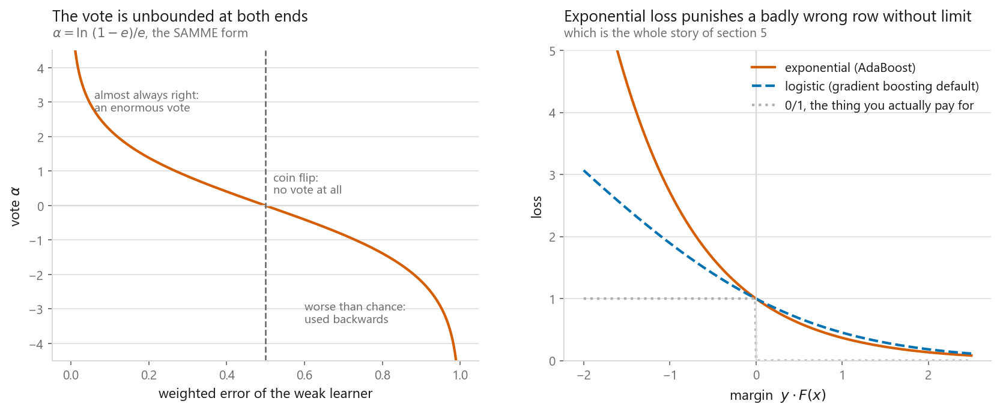
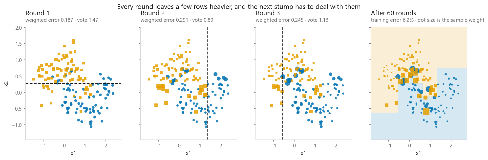
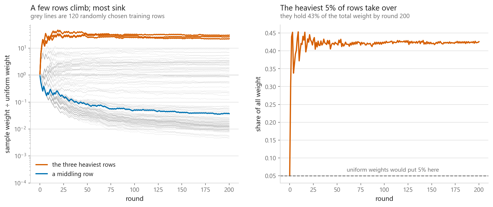
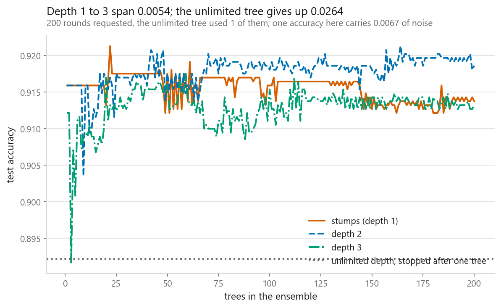
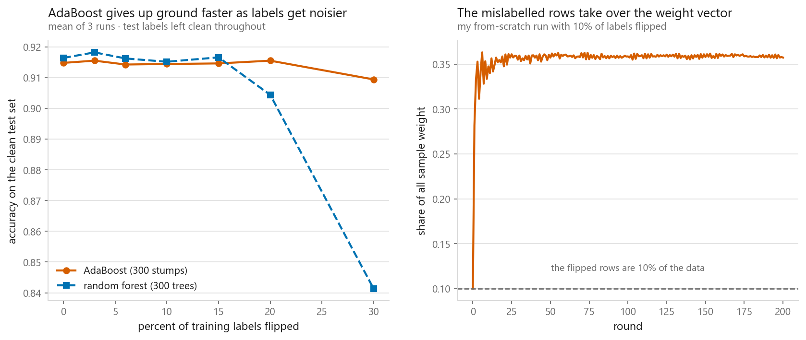

# AdaBoost

### Fixing mistakes by making them heavier

**[Open the notebook](notebook.ipynb)** · Part 4, Ensembles ·
Made by [Elyes Lounissi](https://www.linkedin.com/in/elyes-lounissi/)

| | |
|---|---|
| **What you will learn** | Where the sample weights and the vote $\alpha$ come from, why AdaBoost is gradient boosting under another name, why the base learner has to be weak on purpose, and what label noise really costs |
| **You should already know** | [Bagging](../01-bagging/), [decision trees](../../03-classification/06-decision-trees/) |
| **Datasets** | UCI Dry Bean cut to its two largest varieties, plus two interleaving crescents |
| **Runtime** | Two to three minutes on a laptop CPU |

---

## The result I did not expect

Every account of AdaBoost warns that label noise destroys it. I flipped up to 30%
of the training labels and measured it against a random forest on the same budget
of 300 trees. **AdaBoost barely moved and the forest fell apart.**

| Labels flipped | AdaBoost, 300 stumps | Random forest, 300 trees |
|---|---|---|
| 0% | 0.9148 | 0.9164 |
| 10% | 0.9145 | 0.9152 |
| 20% | 0.9155 | **0.9044** |
| 30% | **0.9094** | **0.8413** |

Accuracy lost from clean to 30% noise: **0.0054 for AdaBoost, 0.0751 for the
forest**, fourteen times more. Test labels were clean throughout, and each row is
the mean of three runs. The mechanism behind the warning is real and I measured it
directly further down; it just did not reach the accuracy on this dataset.

## Where the weights come from

Write the classes as $y \in \{-1, +1\}$ and minimise the exponential loss
$\sum_i \exp(-y_i F(x_i))$. Substitute $F_m = F_{m-1} + \alpha h$ and the
exponential factors apart. The part that does not involve $\alpha$ or $h$ is a
number attached to row $i$, and **that number is the sample weight**. Nobody
invented the reweighting rule; it is the leftover. Differentiate what remains and
$\alpha = \frac{1}{2}\ln\frac{1-e}{e}$ falls out.

| Weighted error | Vote $\alpha$ | Wrong rows get |
|---|---|---|
| 0.05 | +2.944 | 19.00× heavier |
| 0.20 | +1.386 | 4.00× heavier |
| 0.40 | +0.405 | 1.50× heavier |
| 0.50 | +0.000 | 1.00× heavier |
| 0.60 | **−0.405** | 0.67× heavier |

A coin flip gets a vote of exactly zero. A learner worse than chance gets a negative
vote, meaning it is used backwards, which is correct.

Sixty stumps on two interleaving crescents. Uniform weight was 0.00625; after one
round the spread was 0.00385 to 0.01667, after sixty it was 0.00002 to 0.05260 with
the heaviest row at **8.4× uniform**. Each dashed line is a terrible classifier
alone. Sixty of them build a boundary none could describe.

## On real data, from scratch

Two Dry Bean varieties, DERMASON against SIRA: 4,327 training rows, 1,855 test
rows, 16 features, majority-class baseline **0.5736**.

| Round | Feature | Threshold | Weighted error | $\alpha$ |
|---|---|---|---|---|
| 1 | Perimeter | 749.00 | 0.0823 | 2.4118 |
| 2 | Perimeter | 699.57 | 0.2445 | 1.1280 |
| 3 | Area | 42,240.69 | 0.2981 | 0.8564 |
| 4 | Perimeter | 749.00 | 0.3306 | 0.7057 |
| 8 | ShapeFactor4 | 1.00 | 0.3850 | 0.4683 |

The weighted error climbs toward 0.5 and stays. That is the algorithm working:
each round pushes the weights until the previous stump is a coin flip on them.

My 200 stumps scored **0.9208**, scikit-learn's scored **0.9137**, and the two
agreed on **97.68%** of test rows. Training error went from 0.0823 after one round
to 0.0666 after 200; test error finished at 0.0792. The gap comes from my quantile
thresholds against sklearn's exhaustive weighted-Gini search: two different
stumps at round one send the weights down paths that never reconverge.

## It is gradient boosting

I ran a second loop that never mentions a sample weight: negative gradient of the
exponential loss, stump most correlated with it, step size by exact line search.
The two loops chose the same stump in **200 of 200 rounds**. Largest gap between
AdaBoost's $\alpha$ and twice the gradient step: **4.00e-14**. Largest gap between
the two ensemble scores $F$: **5.24e-14**. Same rounds, same answer.

## Where the weight ends up

By the final round the heaviest training row sat at **31× the uniform weight**, the
heaviest 1% of rows held **15.5%** of all the weight, and the lightest half held
**0.76%**. Most rows sink out of the bottom of the chart: they are settled, and no
later stump is paid anything for getting them right.

## Boost something too strong and it collapses

| Base learner | Trees used | Round-1 error | Round-1 $\alpha$ | Train | Test |
|---|---|---|---|---|---|
| Stump, depth 1 | 200 | 0.0800 | 2.4428 | 0.9344 | 0.9137 |
| Depth 2 | 200 | 0.0800 | 2.4428 | 0.9411 | **0.9186** |
| Depth 3 | 200 | 0.0779 | 2.4715 | 0.9813 | 0.9132 |
| Unlimited | **1** | **0.0000** | 1.0000 | 1.0000 | 0.8922 |

An unlimited tree memorises the training set, its weighted error is zero, $\alpha$
is undefined, and scikit-learn stops after one tree. The ensemble is a single
overfitted tree wearing an ensemble's name, and it is the worst of the four.
Depth 2 won here, and an ensemble of stumps is why: each stump touches one feature,
so the total is a sum of one-dimensional step functions with no interaction terms.

## Label noise, mechanism and cost

The mechanism is exactly as advertised. Flip 10% of the training labels and by the
last round those rows hold **35.7% of the total weight**, each flipped row carrying
on average **5× the weight of a clean one**.

So most late stumps are indeed fitted to rows whose labels are wrong. What did not
follow is the accuracy collapse. See the table at the top. The forest was the one
that gave ground, dropping 0.0751 against AdaBoost's 0.0054.

One warning if you open the notebook: the left panel's title was written before the
run and reads that AdaBoost gives up ground faster. The curves it plots say the
opposite. Trust the printed numbers. The reasonable reading is that concentrating
weight on 36% of the mass is survivable when the clean signal is this separable, and
that the textbook failure needs harder noise, more rounds, or less headroom. The
mitigations still apply: fewer rounds, a smaller `learning_rate`, or logistic loss,
which grows linearly in the margin so a hopeless row plateaus instead of exploding.
The weight vector doubles as a label-error detector: rows AdaBoost pushes to the
top of the ranking are worth reading by hand.

## Cheat sheet

| | |
|---|---|
| **What it does** | Weak models in sequence, reweighting the rows each one gets wrong, then a weighted vote |
| **Loss** | Exponential, $\sum_i \exp(-y_i F(x_i))$. This one choice explains everything else |
| **The vote** | $\alpha = \ln\frac{1-e}{e}$ for two classes. Zero at chance, negative below it |
| **Base learner** | Depth 1 to start. Depth 2 or 3 when the problem needs feature interactions. Never unpruned |
| **Mainly reduces** | Bias. The opposite tool to [bagging](../01-bagging/), which reduces variance |
| **Can it overfit** | Yes. Rounds are a hyperparameter, not a more-is-better dial |
| **Relation to boosting proper** | It *is* gradient boosting, with exponential loss and an exact line search |
| **Multiclass** | SAMME adds $\ln(K-1)$ to $\alpha$; scikit-learn does this for you |
| **Next** | [Gradient boosting](../05-gradient-boosting/), which lets you choose the loss |

---

Made by **Elyes Lounissi** ·
[LinkedIn](https://www.linkedin.com/in/elyes-lounissi/) ·
[pilot.tun@gmail.com](mailto:pilot.tun@gmail.com)

Back to [Part 4](../) · [the curriculum](../../CURRICULUM.md) · [the book](../../README.md)

`#MachineLearning` `#AdaBoost` `#Boosting` `#Ensemble` `#DecisionStumps`
`#GradientBoosting` `#Python` `#ScikitLearn` `#DataScience` `#MLTutorial`
