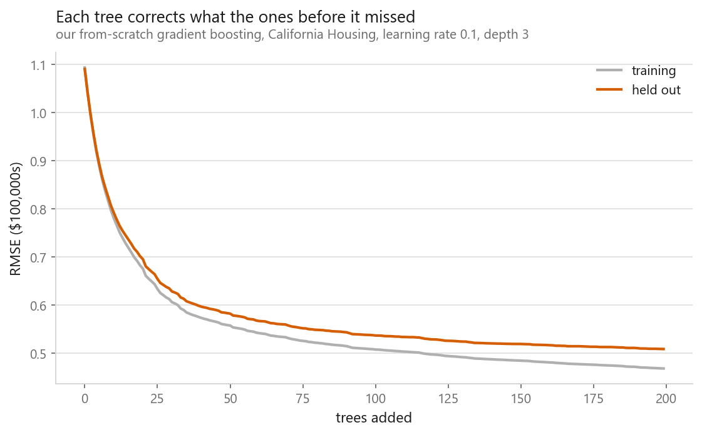
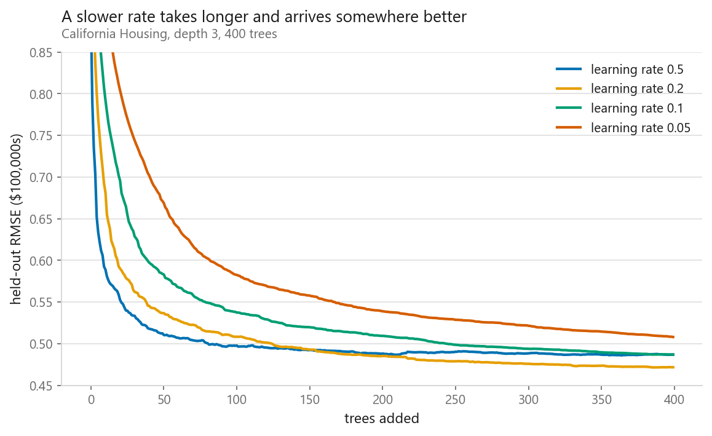
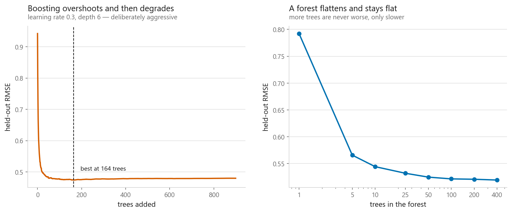
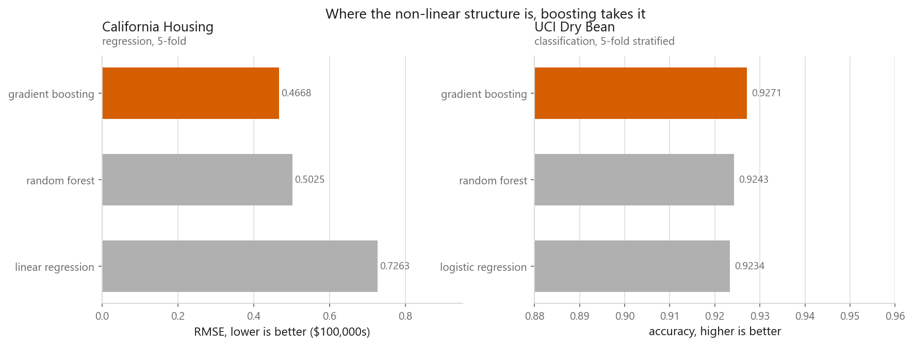

# Gradient boosting

### Each tree fixes what the last one got wrong

**[Open the notebook](notebook.ipynb)** · Part 4, Ensembles ·
Made by [Elyes Lounissi](https://www.linkedin.com/in/elyes-lounissi/)

| | |
|---|---|
| **What you will learn** | How boosting differs from bagging, why fitting the residual is gradient descent in disguise, what the learning rate trades against, and why boosting can overfit where a forest cannot |
| **You should already know** | [Random forests](../02-random-forest/) |
| **Datasets** | California Housing (20,640 × 8), UCI Dry Bean (13,611 × 16) |
| **Runtime** | Three to four minutes on a laptop CPU |

---

## The idea

A [random forest](../02-random-forest/) grows trees **in parallel** and averages
them — every tree tries to solve the whole problem. Gradient boosting grows trees
**in sequence**, and each has a smaller job: predict the error the previous trees
are still making.

Start with the mean, fit a small tree to the residuals, add a fraction of it,
recompute, repeat.

## Why "gradient" is literal

For squared error, $L = \tfrac{1}{2}(y - \hat{y})^2$, so:

$$\frac{\partial L}{\partial \hat{y}} = \hat{y} - y$$

which is the residual, negated. **Fitting the next tree to the residuals is
fitting it to the negative gradient.** Boosting is gradient descent taken in the
space of functions, one small tree per step.

| Stage | Held-out RMSE |
|---|---|
| Predicting the mean | 1.1500 |
| After 1 tree | 1.0909 |
| After 10 trees | 0.8074 |
| After 200 trees | **0.5091** |

## The learning rate

The learning rate scales down every tree's contribution. Halve it and you need
roughly twice as many trees — but the path is smoother and generalises better,
because no single tree makes a large correction alone.

## Boosting can overfit. A forest cannot.

| | Best | At 900 / 400 trees |
|---|---|---|
| Gradient boosting | **0.4742** at 164 trees | 0.4799 (**+0.0057 worse**) |
| Random forest | 0.5209 at 200 trees | 0.5195 (flat) |

This is the sharpest practical difference between the two. Adding trees to a
forest never hurts, because it is averaging. Adding trees to a boosted model
eventually hurts, because it is still descending a gradient on the *training*
loss and will happily keep fitting noise.

The remedy is **early stopping**, which every serious boosting library does for
you.

## Two datasets, two different stories

| California Housing | RMSE (lower better) |
|---|---|
| Linear regression | 0.7263 |
| Random forest | 0.5025 |
| Gradient boosting | **0.4668** |

| UCI Dry Bean | Accuracy |
|---|---|
| Logistic regression | 0.9234 |
| Random forest | 0.9243 |
| Gradient boosting | **0.9271** |

**California Housing** is where boosting earns its reputation — a **36% RMSE
reduction** over the linear model. The relationship between income, location and
price is full of interactions and thresholds, and the
[linear regression notebook](../../02-regression/01-linear-regression/) measured
exactly the bias that comes from ignoring them.

**Dry Bean** is where it does not. Boosting edges the forest and barely clears
logistic regression, because bean measurements are smooth correlated geometry with
little non-linear structure to find.

**This is the answer to "which algorithm should I use", and it is not a ranking.**
Gradient boosting is the strongest default for tabular data, but how much it beats
a linear model by is a property of your data, not of the algorithm.

## Cheat sheet

| | |
|---|---|
| **Use it when** | Tabular data with interactions and thresholds — the strongest default in this book for that case |
| **Avoid it when** | Images, audio, text; you need to extrapolate; you cannot afford to tune |
| **Scaling needed** | No |
| **Main dials** | `learning_rate` and `n_estimators` together, then `max_depth` (2–6), then subsampling |
| **Watch out** | It **will** overfit if you let it. Always early-stop on a validation slice |
| **Versus a forest** | The forest is harder to get wrong; boosting is harder to beat once tuned |

---

Made by **Elyes Lounissi** ·
[LinkedIn](https://www.linkedin.com/in/elyes-lounissi/) ·
[pilot.tun@gmail.com](mailto:pilot.tun@gmail.com)

Back to [Part 4](../) · [the curriculum](../../CURRICULUM.md) · [the book](../../README.md)

`#MachineLearning` `#GradientBoosting` `#XGBoost` `#LightGBM` `#Ensemble`
`#Python` `#ScikitLearn` `#DataScience` `#MLTutorial` `#Boosting`
