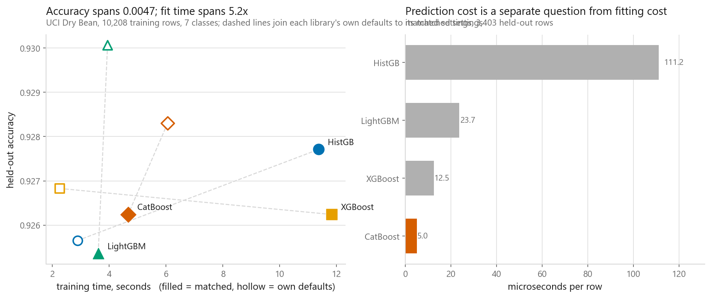
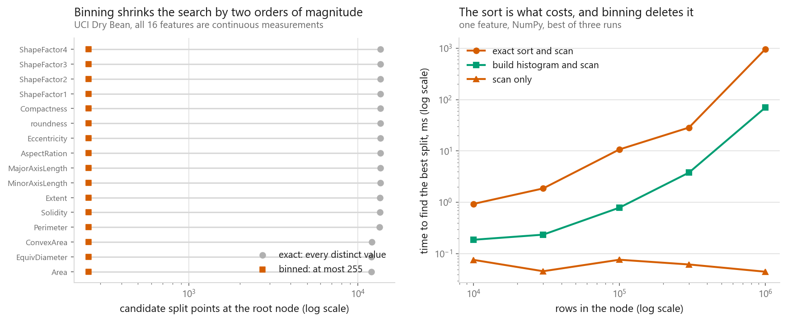
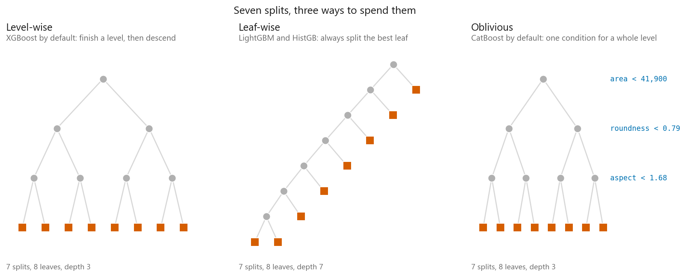
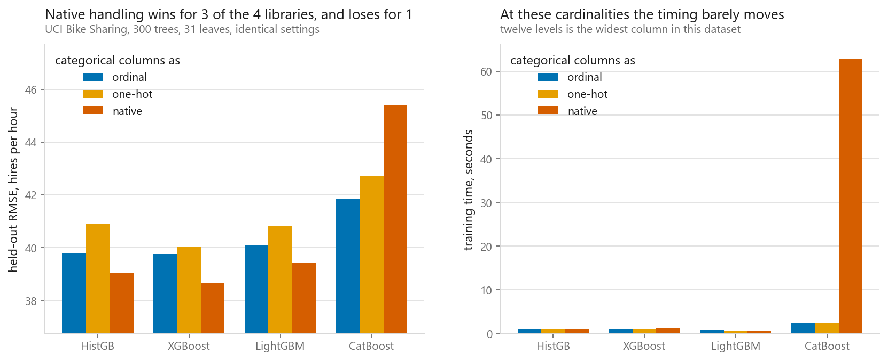
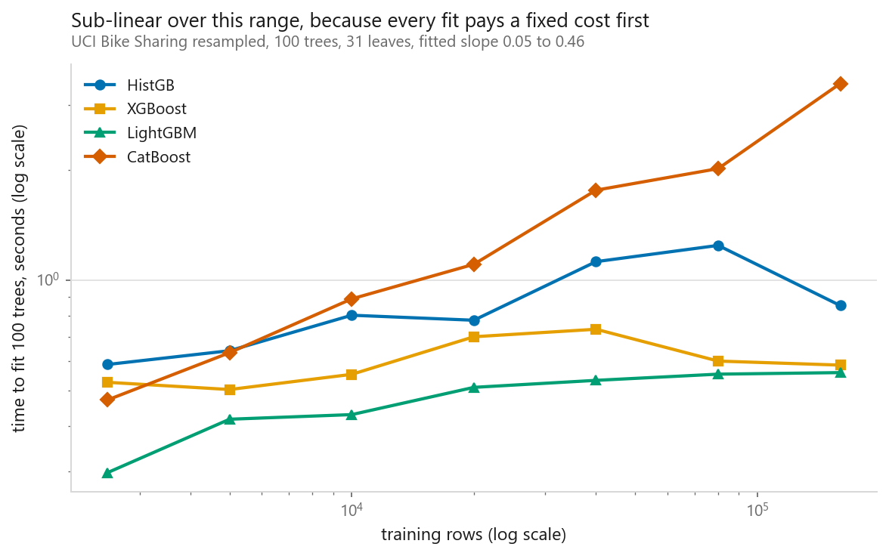

# XGBoost, LightGBM, CatBoost

### Four libraries, six configurations, four splits, and a total spread of 0.0129 accuracy

**[Open the notebook](notebook.ipynb)** · Part 4, Ensembles ·
Made by [Elyes Lounissi](https://www.linkedin.com/in/elyes-lounissi/)

| | |
|---|---|
| **What you will learn** | Why histogram binning made boosting fast, how level-wise, leaf-wise and oblivious growth differ, what native categorical handling buys and when it costs instead, why target encoding leaks, how much of the gap between these libraries is the library rather than your settings, and how a silent NumPy broadcast hands you an accuracy no hyperparameter can move |
| **You should already know** | [Gradient boosting from first principles](../05-gradient-boosting/) |
| **Datasets** | Dry Bean (13,611 x 16) for classification, Bike Sharing (17,379 x 12) for the categorical work |
| **Runtime** | Three to five minutes on a laptop CPU. Versions here: HistGB 1.8.0, XGBoost 3.2.0, LightGBM 4.6.0, CatBoost 1.2.10 |

---

## The result I would lead with

The question the chapter is built around: does the choice of library move
accuracy more than the choice of settings? Six configurations run through all
four libraries gives one answer, and it is the wrong one to stop at:

| Configuration | HistGB | XGBoost | LightGBM | CatBoost |
|---|---|---|---|---|
| 100 trees, lr 0.3, 15 leaves, 255 bins | **0.9123** | 0.9169 | 0.9129 | 0.9209 |
| 150 trees, lr 0.1, 31 leaves, 255 bins | 0.9154 | 0.9180 | 0.9129 | 0.9217 |
| 200 trees, lr 0.05, 63 leaves, 255 bins | 0.9189 | 0.9163 | 0.9166 | 0.9223 |
| 300 trees, lr 0.05, 15 leaves, 127 bins | 0.9149 | 0.9171 | 0.9160 | **0.9251** |
| 100 trees, lr 0.1, 127 leaves, 63 bins | 0.9171 | 0.9220 | 0.9180 | 0.9231 |
| 200 trees, lr 0.2, 7 leaves, 255 bins | 0.9157 | 0.9194 | 0.9140 | 0.9240 |

On that split the settings move accuracy by 0.0054 on average and the library
moves it by 0.0083, a ratio of 0.66. Which would be a clean headline, except
that both quantities are small enough for the ordering between them to turn over
on sampling noise. So the notebook runs the whole grid on four splits:

| Split | Settings move | Library moves | Ratio | Whole table |
|---|---|---|---|---|
| 0 | 0.0054 | 0.0083 | **0.66** | 0.0129 |
| 1 | 0.0047 | 0.0057 | 0.83 | 0.0114 |
| 2 | 0.0060 | 0.0049 | **1.22** | 0.0080 |
| 3 | 0.0040 | 0.0038 | 1.05 | 0.0071 |

**The ratio runs 0.66 to 1.22 and crosses 1.00, so neither effect is reliably
the larger one.** The author's note in the notebook is the honest version: the
opposite conclusion had been written there on the strength of a single split
that turned out to be a coin toss.

What does survive every split is the width of the band. **Every library, every
configuration, every split lands inside a range of 0.0071 to 0.0129 accuracy.** On
3,403 held-out rows a single accuracy near 0.92 carries about 0.0045 of binomial
noise, so that band is one to three standard errors wide in total, for twenty-four
combinations.

That is the more useful finding and a stronger one than a ranking would have been.
When the entire menu finishes that close together, accuracy is not the variable
worth optimising, because there is almost nothing left in it to win. Pick on an
axis that has a gap on it instead, and the chart below shows one: the same four
libraries that tie on the vertical axis span several-fold on the horizontal one.

## The ranking inverts when you match the settings

Most benchmarks compare these libraries at their own defaults, which measures
the defaults. LightGBM builds 100 trees of 31 leaves, XGBoost 100 trees of depth
6, CatBoost a thousand trees, and scikit-learn switches early stopping on by
itself once the data is large enough. So the notebook runs it both ways:

| Library | Its own defaults | Matched settings |
|---|---|---|
| HistGB | 0.9257 (last) | 0.9277 (first) |
| XGBoost | 0.9268 | 0.9262 |
| LightGBM | 0.9301 (first) | 0.9254 (last) |
| CatBoost | 0.9283 | 0.9262 |

First and last swap places, and the useful thing to do with that is not to explain
it. On 3,403 held-out rows an accuracy near 0.925 carries a binomial standard
error of about 0.0045. The defaults column spans 0.0044 and the matched column
spans 0.0024, so **both columns fit inside one standard error and neither is a
ranking**.

That is what makes the flip informative. If the ordering were real it would not
reverse from changing settings that were supposed to make the comparison fairer.
An ordering that turns over under a fair-minded change of protocol is an ordering
that was noise in the first place, and the flip is the cheapest possible proof of
it. The four-split grid above reaches the same verdict from a different direction.

The spread shrinking from 0.0044 to 0.0024 is the one directional thing here, and
it says what a defaults benchmark is measuring: matching the settings removed
roughly half of a spread that was already inside the noise, which means most of
what a defaults comparison shows you is the defaults.

The cost of matching is real, because the matched configuration is more model
than most of the defaults were:

| Library | Fit, own defaults | Fit, matched | Predict µs/row, matched |
|---|---|---|---|
| HistGB | 0.6530 s | 2.6370 s | 28.0987 |
| XGBoost | **0.5927 s** | 2.3354 s | 7.2189 |
| LightGBM | 0.7663 s | **1.7068 s** | 16.6890 |
| CatBoost | **4.3411 s** | 2.6876 s | **1.9414** at defaults, 2.5105 matched |

CatBoost is the only one that got *faster* when matched, because its default is a
thousand trees. And its prediction cost is in a different class from the rest,
2.5105 µs per row against HistGB's 28.0987, which is the oblivious tree paying
off: every leaf is reached by the same sequence of answers, so prediction is an
array index rather than a pointer walk.

## The score that no hyperparameter could move

This is the section I would send someone to. Every accuracy above came from
comparing predictions against labels with `==`. Three libraries return a vector.
One does not:

| Library | Shape from `predict` |
|---|---|
| HistGB | (3403,) |
| XGBoost | (3403,) |
| LightGBM | (3403,) |
| **CatBoost** | **(3403, 1)** |

Comparing (3403, 1) against (3403,) broadcasts into a **(3403, 3403)** matrix and
raises nothing at all. Then:

| | |
|---|---|
| mean of that matrix | **0.1739** |
| chance two random rows share a class | **0.1739** |
| the same sum using the labels twice, no model involved | 0.1729 |
| accuracy once the column is flattened | **0.9254** |

The first two agree to every digit because they are the same sum written two
ways. The third replaces the model's class shares with the labels' own and lands
in the same place, which is the giveaway: **a score this insensitive to the model
is a description of the dataset.**

The part worth carrying is what such a number does when you tune. A wrong score
usually still moves when you change a setting, even if it moves to the wrong
place. This one sits still through every value of `max_bin`, every leaf budget
and every learning rate, because none of those change the class balance. **A
score that does not respond to any setting at all is not a badly tuned model. It
is a number that was never measuring the model.**

NumPy is doing exactly what it promises. The mistake is assuming four libraries
agree on the shape of an answer.

## Histogram binning, the change that mattered

The exact method sorts every feature at every node. The binned method chops each
feature into buckets once before training, then a node's search is one pass to
accumulate gradients plus a scan over the buckets. Milliseconds to find the best
split on one feature:

| Rows | Exact sort and scan | Build histogram and scan | Scan only |
|---|---|---|---|
| 10,000 | 0.225 | 0.051 | 0.019 |
| 100,000 | 3.793 | 0.255 | 0.019 |
| 1,000,000 | **55.982** | **5.120** | **0.019** |

At a million rows the histogram path is **10.9x faster** than sorting. The third
column is what a node costs when its histogram arrived by subtracting a sibling
from its parent, which is free because two children partition their parent's
rows. That column is flat to three decimals from ten thousand rows to a million,
and against the exact method it is **3,010x faster**. Flat is the whole point.

What binning costs in accuracy is smaller than the noise:

| max_bin | HistGB | XGBoost | LightGBM | CatBoost |
|---|---|---|---|---|
| 15 | 0.9180 | 0.9227 | 0.9165 | 0.9218 |
| 63 | 0.9239 | **0.9286** | 0.9257 | **0.9259** |
| 255 | **0.9292** | 0.9242 | **0.9301** | 0.9254 |

Two of the four improve with more bins and two peak at 63. Nobody tunes
`max_bin` because the default already sits past the knee; turn it down when
memory is the constraint, since it also sets the size of the binned matrix.

## Three ways to spend a split budget

**Level-wise**, XGBoost's default: split every node on the current level first.
Balanced, and `max_depth` controls size exactly. **Leaf-wise**, LightGBM's only
mode and what HistGB does: always split the leaf with the largest gain.
Lopsided, sometimes very deep down one branch. **Oblivious**, CatBoost's default:
one condition per level applied at every node on it. Perfectly balanced, and
heavy regularisation, because the tree has far less freedom.

### The dial I had backwards, and the library that sat it out

900 training rows, 25 trees, leaf budget swept from 2 to 128. Held-out accuracy:

| | 2 | 4 | 8 | 16 | 32 | 64 | 128 |
|---|---|---|---|---|---|---|---|
| LightGBM, guard on at 20 rows | 0.889 | 0.910 | 0.909 | 0.910 | 0.910 | 0.910 | 0.910 |
| LightGBM, guard off at 1 row | 0.889 | **0.913** | 0.902 | 0.892 | **0.884** | 0.884 | 0.884 |
| HistGB, guard on | 0.888 | 0.910 | 0.909 | 0.904 | 0.903 | 0.904 | 0.904 |
| HistGB, guard off | 0.888 | 0.910 | 0.899 | 0.892 | 0.895 | 0.888 | **0.885** |
| CatBoost, guard on | 0.808 | 0.893 | 0.902 | 0.903 | 0.905 | 0.903 | 0.903 |
| CatBoost, guard off | 0.808 | 0.895 | 0.894 | **0.906** | **0.907** | 0.906 | 0.906 |

With the guard on, held-out accuracy across the largest four leaf budgets moves
**0.001 for HistGB, 0.001 for LightGBM and 0.002 for CatBoost**. The leaf budget
stops mattering entirely, because the minimum rows per leaf binds first.

**The minimum rows per leaf is the protection, not `num_leaves`.** Turn it off
and the leaf budget becomes dangerous; leave it alone and raising it does
nothing, because there is nothing left that is legal to split.

Then a divide that only shows up with all four libraries present. Peak **training**
accuracy once the guard is off:

| | |
|---|---|
| HistGB | **1.000** |
| LightGBM | **1.000** |
| CatBoost | **0.940** |

HistGB and LightGBM memorise these 900 rows outright and their held-out score
peaks early and falls back. **CatBoost does not come close, with the same guard
removed.** That is ordered boosting doing the job it was designed for: each row
is fitted using a model built only from rows earlier in a random permutation, so
a leaf cannot quietly absorb the answers of the rows sitting inside it. A
training slice this small is exactly where it shows, and it is the concrete
version of "CatBoost is the safe choice on small data".

XGBoost sits out this sweep because it has no rows-per-leaf setting, only
`min_child_weight`, which counts Hessian mass.

## Categorical columns, and the exception that is not a bug

Bike Sharing's `season`, `mnth`, `weekday` and `weathersit` arrive as integers.
One-hot turns those 4 columns into 27. RMSE, lower is better:

| Library | Ordinal | One-hot | Native | Spread |
|---|---|---|---|---|
| HistGB | 39.776 | 40.897 | **39.048** | 1.85 |
| XGBoost | 39.769 | 40.051 | **38.679** | 1.37 |
| LightGBM | 40.105 | 40.835 | **39.416** | 1.42 |
| **CatBoost** | **41.856** | 42.708 | **45.404** | **3.55** |

For three of the four the expected pattern holds exactly: native wins, ordinal
second, one-hot last. That last part is the surprise. I expected the invented
ordering in ordinal codes to be the worst thing on the chart, and instead the
tree recovers from it well, because it can carve a fake ordering into pieces with
two or three splits while one-hot forces it to find several low-gain splits that
only pay off together.

**CatBoost inverts it, and its native fit is the slowest cell in the table by a
wide margin: 35.773 s, 26x the next slowest.** This is not a bug and it is not a
scoring artefact. The reason is in which columns were declared.

`mnth` and `weekday` arrive as integers that **carry a real order**. Any month
genuinely sits between the one before it and the one after, and bike hire follows
that order closely. Declaring them categorical throws the order away and replaces
each level with an ordered target statistic, so CatBoost has to rediscover from
noisy per-level estimates something the plain ordinal codes handed it for free.
The time goes to the same place: those statistics are built over several
permutations.

So the rule is narrower than "declare your categoricals". **Declare the columns
whose levels have no order.** `season` and `weathersit` qualify. `mnth` and
`weekday` are labels in name only, and a model splitting on them numerically is
already using information that target encoding discards.

### One-hot is slow, for some libraries

Crossing weekday with hour gives `hour_of_week`, 168 levels, 203 one-hot columns:

| Library | One-hot RMSE | Native RMSE | One-hot time vs native |
|---|---|---|---|
| HistGB | 42.167 | **41.765** | 4.1x slower |
| XGBoost | **43.313** | 43.609 | 1.1x slower |
| LightGBM | 42.397 | **42.311** | 0.9x, faster |
| CatBoost | 48.387 | **45.088** | 0.1x, faster |

"Never one-hot for a boosted tree, it is slow" holds for HistGB, which bins and
scans all 203 dummy columns at every node. It does not hold for LightGBM, which
does **exclusive feature bundling**: it finds features never non-zero on the same
row and packs them back into one column, which is exactly what one-hot dummies
from a shared source are. LightGBM undoes the one-hot before training starts.

And on this column the accuracy argument does not hold universally either.
XGBoost scored better one-hot than native, 43.313 against 43.609. Read the RMSE
column rather than assuming it.

One practical ceiling: HistGB bins categories the way it bins numbers, so a
declared categorical column must have fewer levels than `max_bins`, capped at 255.
`hour_of_week` fits at 168. Crossing month with hour instead raises a
`ValueError` rather than falling back.

## The leak in target encoding, on a column of pure noise

Target encoding replaces a category with the mean target for that category. The
row being encoded contributed to that mean, so the feature carries a piece of its
own answer. The notebook encodes a column generated with **no relationship to the
target at all**:

| | Train RMSE | Held out | Gap |
|---|---|---|---|
| column left out entirely | 19.31 | **53.81** | 34.50 |
| naive target encoding | **15.46** | **77.22** | **61.77** |
| ordered target statistics | 17.22 | 57.10 | 39.88 |

A column that means nothing improved training error by 3.85 and damaged held-out
error by **23.41**. That is what a leak looks like from the inside: better during
development, worse in production, and nothing in the training curve says so.

CatBoost's fix is ordered target statistics. It draws a random permutation,
treats it as time, and encodes row i using only rows before i, plus a prior so a
category seen once does not take that single target as its value. The row never
contributes to its own encoding, so the leak closes by construction, and the
measured held-out RMSE lands at 57.10 against 53.81 for dropping the column,
which is the right answer for a column with no signal.

## How they scale with rows

Seconds to fit 100 trees on resampled Bike Sharing:

| Rows | HistGB | XGBoost | LightGBM | CatBoost |
|---|---|---|---|---|
| 2,500 | 0.18 | 0.11 | **0.07** | 0.37 |
| 20,000 | 0.28 | 0.17 | **0.13** | 0.76 |
| 160,000 | 0.64 | 0.43 | **0.41** | **3.04** |

Log-log slopes, where 1.00 would be exactly linear in rows:

| | Whole range | Large end only |
|---|---|---|
| HistGB | 0.27 | 0.40 |
| XGBoost | 0.33 | 0.47 |
| LightGBM | 0.42 | 0.54 |
| CatBoost | 0.51 | 0.66 |

Every slope is far below one, and that is not the algorithm being sub-linear. It
is the fixed cost: allocating the booster, binning the columns, waking the thread
pool. On a few thousand rows that setup is most of what the clock sees, so the
left of the chart sits too high and a line through all seven points comes out too
shallow. Fit only the large end and every slope climbs toward one.

**On small data you are timing the setup, not the algorithm.** That applies to
any benchmark you read, including the fit times higher up this page.

## Cheat sheet

| Situation | Reach for |
|---|---|
| A strong tabular baseline with no new dependency | `HistGradientBoostingClassifier`. It took first place at matched settings here |
| Millions of rows, or a search over hundreds of configurations | LightGBM. Fastest at every size measured |
| Serving under a latency budget | CatBoost. 2.5105 µs per row against HistGB's 28.0987 |
| A few thousand rows and no room to overfit | CatBoost. With the row guard off it stopped at 0.940 training accuracy where the others hit 1.000 |
| Categorical columns whose levels have no order | Declare them. Native won for three of four libraries |
| Categorical columns whose integer codes carry an order | Leave them ordinal. CatBoost's native path cost 3.55 RMSE and 26x the fitting time on `mnth` and `weekday` |
| A categorical column with more than 255 levels | Anything except HistGB, which raises rather than falls back |
| Before comparing any two of them | Force the same tree count, learning rate, leaf budget and bin count. Doing that inverted first and last place here |
| Protecting leaf-wise growth on small data | The minimum rows per leaf, not `num_leaves`. With the guard on, the leaf budget moved held-out accuracy by 0.001 |
| Target encoding | Only out of fold, or ordered. A pure-noise column cost 23.41 RMSE held out when encoded naively |
| Before trusting any score | Check the shape `predict` returns. A column against a vector broadcasts to a matrix and gives a plausible number that no setting can move |
| Choosing on accuracy | Do not. The whole four-library, six-configuration table spans 0.0071 to 0.0129 |

| Dial | XGBoost | LightGBM | CatBoost | HistGB |
|---|---|---|---|---|
| Number of trees | `n_estimators` | `n_estimators` | `iterations` | `max_iter` |
| Step size | `learning_rate` | `learning_rate` | `learning_rate` | `learning_rate` |
| Tree size | `max_depth` | `num_leaves` | `depth` | `max_leaf_nodes` |
| Rows per leaf | none, `min_child_weight` counts Hessian mass | `min_child_samples` | `min_data_in_leaf` | `min_samples_leaf` |
| Bins | `max_bin` | `max_bin` | `border_count` | `max_bins` |
| Categorical | `enable_categorical=True` | pandas `category` dtype | `cat_features=[...]` | `categorical_features=[...]` |
| Shape out of `predict` | `(n,)` | `(n,)` | `(n, 1)` on multiclass | `(n,)` |

---

If this chapter was useful, a star on the repository helps other people find it.
The code is yours to use, copy and adapt in your own work, no permission needed.

Made by **Elyes Lounissi** ·
[LinkedIn](https://www.linkedin.com/in/elyes-lounissi/) ·
[pilot.tun@gmail.com](mailto:pilot.tun@gmail.com)

Back to [Part 4](../) · [the curriculum](../../CURRICULUM.md) · [the book](../../README.md)

`#XGBoost` `#LightGBM` `#CatBoost` `#GradientBoosting` `#HistGradientBoosting`
`#TargetEncoding` `#OrderedBoosting` `#DryBean` `#BikeSharing`
`#MachineLearning` `#MLTutorial` `#LearnMachineLearning` `#DataScience` `#AI`
