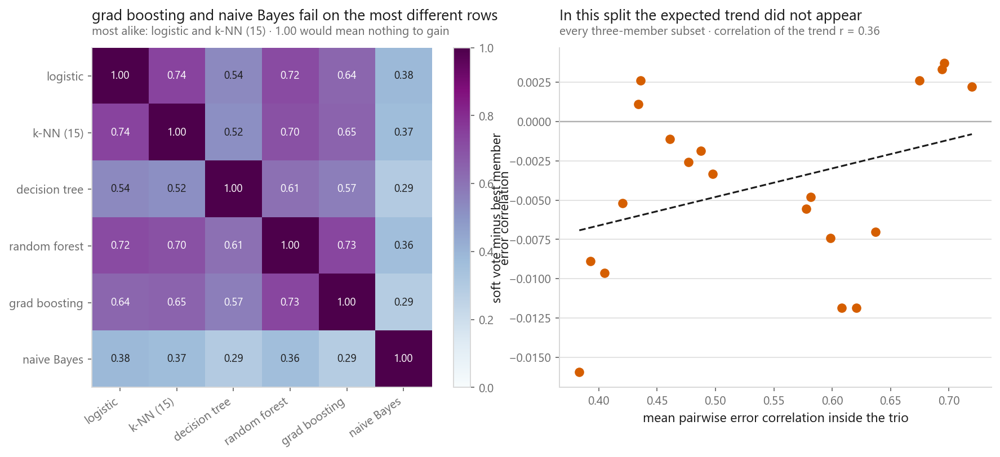
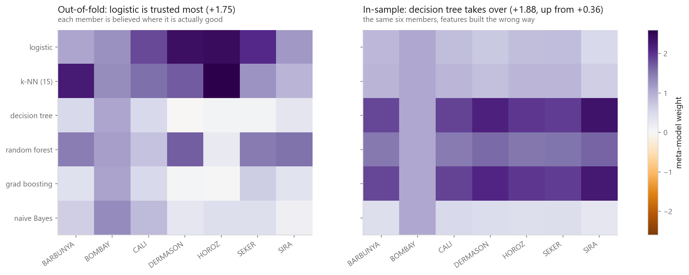
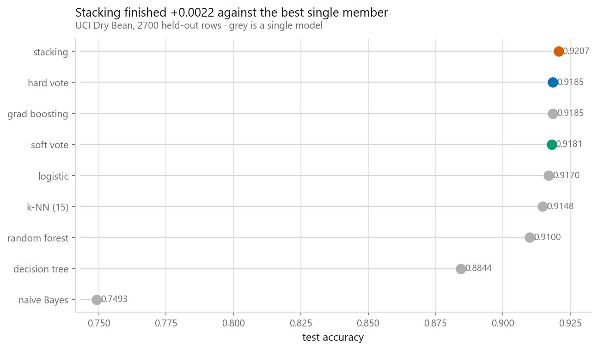
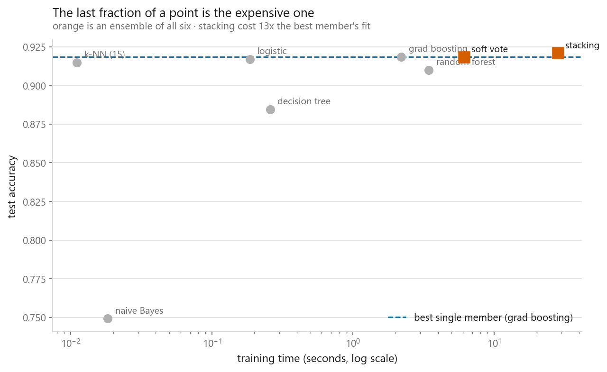

# Stacking and voting

### Six models combined, and an honest accounting of what the combination bought

**[Open the notebook](notebook.ipynb)** · Part 4, Ensembles ·
Made by [Elyes Lounissi](https://www.linkedin.com/in/elyes-lounissi/)

| | |
|---|---|
| **What you will learn** | Hard against soft voting, why an ensemble only pays when its members fail on different rows, how a meta-model learns to weight base models, why its training features must be out-of-fold, and what all of it costs |
| **You should already know** | [Bagging](../01-bagging/), [cross-validation](../../01-foundations/04-cross-validation/), [logistic regression](../../03-classification/01-logistic-regression/) |
| **Datasets** | UCI Dry Bean (6,300 train / 2,700 test, 16 features, 7 classes), California Housing |
| **Runtime** | Two to three minutes on a laptop CPU |

---

## Start here: the ensemble barely paid, and one version lost

Stacking six models did beat the best single model. By **+0.0022** accuracy, for
**14.7× the training time**, and the gain is **0.4 standard errors** at this sample
size. It fixed **60 rows** the best member got wrong and **broke 54** it had right.

Soft voting did not beat the best member at all: **-0.0004**.

| | Accuracy | Time | Against the best member |
|---|---|---|---|
| Best single member (gradient boosting) | 0.9185 | 1.5 s | — |
| Soft vote | 0.9181 | 3.7 s | **-0.0004** at 2.5× time |
| Stacking | **0.9207** | 21.5 s | **+0.0022** at 14.7× time |

One standard error on a test accuracy at n = 2700 is **0.0053**. The stacking gain is
smaller than that. I am not telling you stacking is useless — I am telling you that on
a well-tuned gradient booster with five look-alike friends, this is how the numbers
usually come out, and nobody prints the "broke 54" line on a leaderboard.

## The six members

| Member | Test accuracy | Fit time |
|---|---|---|
| Gradient boosting | **0.9185** | 1.47 s |
| Logistic regression | 0.9170 | 0.12 s |
| k-NN (15) | 0.9148 | 0.01 s |
| Random forest | 0.9100 | 1.91 s |
| Decision tree | 0.8844 | 0.16 s |
| Naive Bayes | 0.7493 | 0.01 s |

Hard voting matched the best member exactly at **0.9185 (+0.0000)**; soft voting came
in at **0.9181 (-0.0004)**. The two rules disagreed on only **58 of 2,700 rows**, and
the hard vote tied on **53**.

Test row 69 is the case worth reading. The true class is SIRA. Hard voting said HOROZ
4-2 and was wrong; soft voting said SIRA and was right. Three of those four HOROZ
votes were cast at **0.508**, **0.520** and **0.607** — members barely leaning — while
the two SIRA votes came in at **0.667** and **0.998**. Counting labels throws that
away.

That cuts both ways. Mean confidence in its own winner: decision tree **1.000**,
gradient boosting **0.970**, naive Bayes **0.902** — and naive Bayes multiplies
independent likelihoods it does not have, so its near-certainty is unearned. A loud
member drags a soft vote toward itself regardless of skill. Stacking can discount it;
soft voting cannot.

## Diversity is the whole requirement

Mean pairwise correlation between the members' error indicators: **0.540**. Most alike
were logistic and k-NN at **0.740**; least alike were gradient boosting and naive
Bayes at **0.287**. Across every three-member subset, the best trio gained **+0.0037**
and the worst **lost 0.0159**, with a correlation of only **r = 0.36** between how
alike a trio was and what voting bought it.

The control experiment is the one that settles it:

| Family mix | Mean error correlation | Vote | Best member | Gain |
|---|---|---|---|---|
| Five k-NN variants | **0.888** | 0.9144 | 0.9137 | +0.0007 |
| Six different families | **0.540** | 0.9181 | 0.9185 | -0.0004 |

Five k-NN models with different $k$ are five views of one geometry. They agree on
which beans are confusing, and averaging cannot cancel an error every member makes.
Check the correlation matrix before spending an afternoon on the ensemble.

## The out-of-fold rule, and the leak done on purpose

Fit the base models on the training set, predict the training set, and hand those
columns to the meta-model. Here is what those columns claim:

| Member | In-sample | Out-of-fold | Gap |
|---|---|---|---|
| Logistic | 0.9251 | 0.9229 | +0.0022 |
| k-NN (15) | 0.9322 | 0.9216 | +0.0106 |
| **Decision tree** | **1.0000** | 0.8921 | **+0.1079** |
| Random forest | 1.0000 | 0.9200 | +0.0800 |
| Gradient boosting | 1.0000 | 0.9192 | +0.0808 |
| Naive Bayes | 0.7724 | 0.7694 | +0.0030 |

Three members look infallible on rows they were fitted on. Building the honest
out-of-fold columns took **16.9 s**. Both meta-models, side by side:

| Meta-model trained on | What it claims | What it gets |
|---|---|---|
| Out-of-fold columns | 0.9310 | **0.9207** |
| In-sample columns | **1.0000** | 0.9130 |

Two harms, and they are separate. The leak invents **+0.0793** of reported accuracy
that no held-out data will confirm, and it costs **-0.0078** of real accuracy. You do
not merely misjudge the model. You build a worse one.

## What the meta-model learned

| Member | Honest mean weight | Leaky mean weight | Trusted most on |
|---|---|---|---|
| Logistic | **+1.75** | +0.81 | HOROZ (+2.42) |
| k-NN (15) | **+1.66** | +0.88 | HOROZ (+2.60) |
| Decision tree | **+0.36** | **+1.88** | BOMBAY (+1.08) |
| Random forest | +1.19 | +1.48 | DERMASON (+1.70) |
| Gradient boosting | **+0.44** | **+1.86** | BOMBAY (+1.11) |
| Naive Bayes | +0.58 | +0.52 | BOMBAY (+1.33) |

Read the decision tree row across. The honest meta-model gives it **+0.36**; the leaky
one gives it **+1.88**, five times as much, because in-sample it scored 1.0000. The
weighting is inverted by the leak, and that inverted weighting is what gets shipped.
Widest spread of trust across members was 1.39 honest against 1.37 leaky.

Per-class weights are what voting cannot express: a vote gives every member the same
say on every class forever, and it can never subtract a member.

`StackingClassifier` reproduced my hand-built version to **0.0000** difference, at
**0.9207 in 21.5 s**.

## The full board, and regression

| | Accuracy |
|---|---|
| **Stacking** | **0.9207** |
| Hard vote | 0.9185 |
| Gradient boosting | 0.9185 |
| Soft vote | 0.9181 |
| Logistic | 0.9170 |
| k-NN (15) | 0.9148 |
| Random forest | 0.9100 |
| Decision tree | 0.8844 |
| Naive Bayes | 0.7493 |

On California Housing the same pattern, more starkly. Boosting alone reached
**R² 0.7898**; stacking reached **0.7897**, a hair *behind*. The plain average — the
regression version of a vote — managed **0.7224**, worse than boosting alone, because
it counted ridge (0.5845) and k-NN (0.6296) equally. The meta-model's weights explain
both results: **ridge +0.02, k-NN +0.05, boosting +0.93**. It learned to be gradient
boosting.

## What it cost

Stacking with $k$ folds and $M$ members costs $M(k+1)$ base fits plus the meta-model,
against one fit for a single model, and every member has to be trained, versioned,
loaded and served. Soft voting is nearly free once the members exist and rarely hurts,
so it is a reasonable default. Stacking is worth its cost when the members are
genuinely different, when their error correlation is low, and when a fraction of a
point justifies six models in production.

## Cheat sheet

| | |
|---|---|
| **Hard voting** | Counts labels. Tied on 53 of 2,700 rows here. Use only when a member cannot give probabilities |
| **Soft voting** | Averages probabilities. Default choice, but an overconfident member dominates it — calibrate first |
| **Diversity** | Check pairwise error correlation first. Five k-NN variants sat at 0.888 and gained +0.0007 |
| **Stacking** | A meta-model learns per-class weights and may weight a member negatively |
| **The rule** | Meta-model features must be out-of-fold. The leak invented +0.0793 and cost -0.0078 |
| **Meta-model** | Keep it small — logistic regression or ridge on six correlated columns |
| **Cost** | $M(k+1)$ fits. Compare the gain to one standard error (0.0053 here) before believing it |

---

Made by **Elyes Lounissi** ·
[LinkedIn](https://www.linkedin.com/in/elyes-lounissi/) ·
[pilot.tun@gmail.com](mailto:pilot.tun@gmail.com)

Back to [Part 4](../) · [the curriculum](../../CURRICULUM.md) · [the book](../../README.md)

`#MachineLearning` `#Ensemble` `#Stacking` `#VotingClassifier` `#ModelBlending`
`#DataLeakage` `#Python` `#ScikitLearn` `#DataScience` `#MLTutorial`
