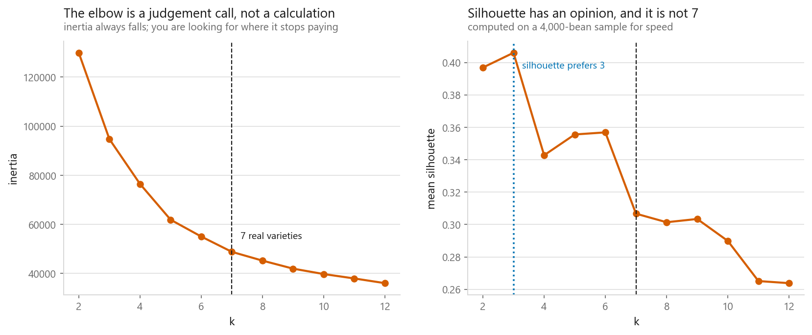
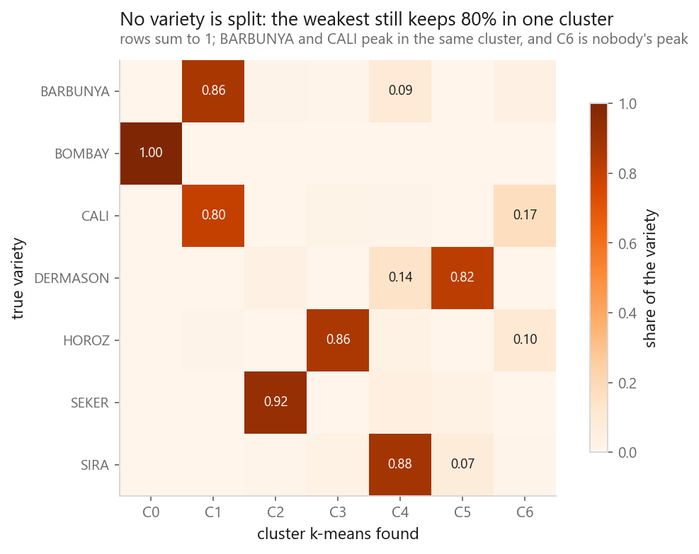
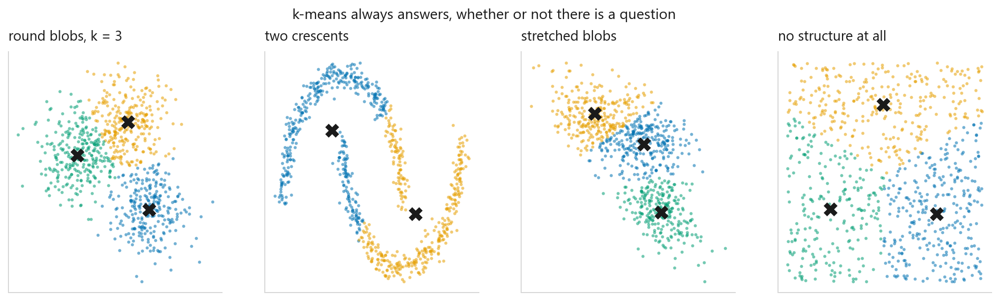

# k-Means clustering

### Finding groups when nobody tells you the answer

**[Open the notebook](notebook.ipynb)** · Part 5, Unsupervised learning ·
Made by [Elyes Lounissi](https://www.linkedin.com/in/elyes-lounissi/)

| | |
|---|---|
| **What you will learn** | How Lloyd's algorithm works, how to choose k with no answer key, and the failure modes k-means cannot see in itself |
| **You should already know** | Nothing beyond NumPy. [PCA](../../06-dimensionality-reduction/01-principal-component-analysis/) helps for the plots |
| **Dataset** | UCI Dry Bean (13,611 × 16), labels hidden during clustering, then used to grade it |
| **Runtime** | About a minute on a laptop CPU |

---

## The idea

Everything before this was **supervised**. Clustering has no labels. k-means
assumes a cluster is *a blob around a centre*, and alternates two steps until
nothing moves:

1. **Assign** every point to its nearest centre
2. **Move** every centre to the mean of its members

Both steps lower the within-cluster sum of squares, so it always converges. Our
from-scratch version took **69 iterations**.

$$J = \sum_{i=1}^{k} \sum_{x \in C_i} \|x - \mu_i\|^2$$

Two consequences fall straight out of that objective. **Squared distance means
scaling matters.** And **minimising distance to a centre makes clusters round**:
k-means cannot find a crescent, because a crescent has no centre its members are
near.

## Choosing k, with no answer key

| | Value |
|---|---|
| Silhouette prefers | **k = 3** (score 0.406) |
| Silhouette at the true k = 7 | 0.307 |

There are genuinely **seven** varieties of bean in this dataset, and neither the
elbow nor the silhouette points at seven. Silhouette confidently prefers three.

This is the honest state of clustering: the diagnostics disagree with the truth
and with each other. If you had no labels, the situation clustering is *for*,
you would probably have chosen wrong.

## How much did it recover?

| Measure | Score |
|---|---|
| Adjusted Rand index | 0.669 |
| Normalised mutual information | 0.714 |

Respectable for a method that was never shown a single label. Some varieties map
cleanly onto one cluster; others get split across two.

## The failure k-means cannot see

**Round blobs**: the case it was designed for. Nails it.

**Two crescents**: obvious to your eye, impossible for k-means, because neither
crescent has a centre its members are near. [DBSCAN](../04-dbscan-and-hdbscan/)
handles this by defining clusters through density.

**Stretched blobs**: real groups, elongated, and plain Euclidean distance slices
them across the grain. [Gaussian mixtures](../05-gaussian-mixture-models/) fix
this by giving each cluster its own shape.

**No structure at all**: uniform random noise, and k-means confidently returns
three neat wedges.

That last panel is the one to remember: **the output of a clustering algorithm is
not evidence that clusters exist.** Nothing in the method will ever tell you the
answer is meaningless. That check is your job.

## Cheat sheet

| | |
|---|---|
| **Use it when** | Clusters are roughly round and similarly sized, you have a rough idea of k, and the data is large |
| **Avoid it when** | Clusters are elongated, nested, or crescent-shaped; outliers are common (they drag centres) |
| **Scaling needed** | Yes, always. Squared distance means the largest-unit column dominates |
| **Main dials** | `n_clusters`, `n_init` (10 or more), `init` (k-means++) |
| **Watch out** | Converges to a *local* minimum, so seeds change the answer. And it clusters pure noise without complaint |

---

Made by **Elyes Lounissi** ·
[LinkedIn](https://www.linkedin.com/in/elyes-lounissi/) ·
[pilot.tun@gmail.com](mailto:pilot.tun@gmail.com)

Back to [Part 5](../) · [the curriculum](../../CURRICULUM.md) · [the book](../../README.md)

`#MachineLearning` `#KMeans` `#Clustering` `#UnsupervisedLearning` `#Python`
`#ScikitLearn` `#DataScience` `#MLTutorial` `#Silhouette`
