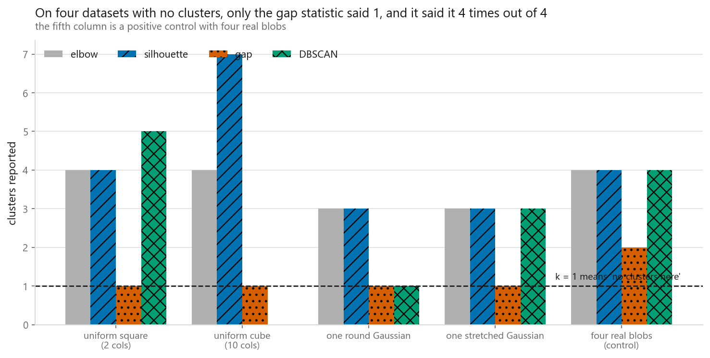
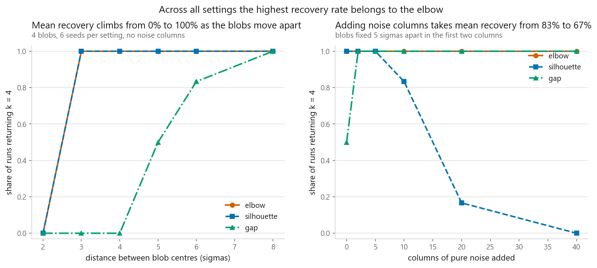
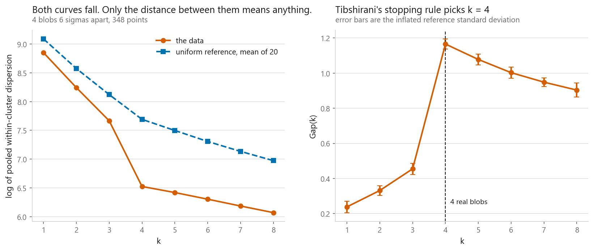
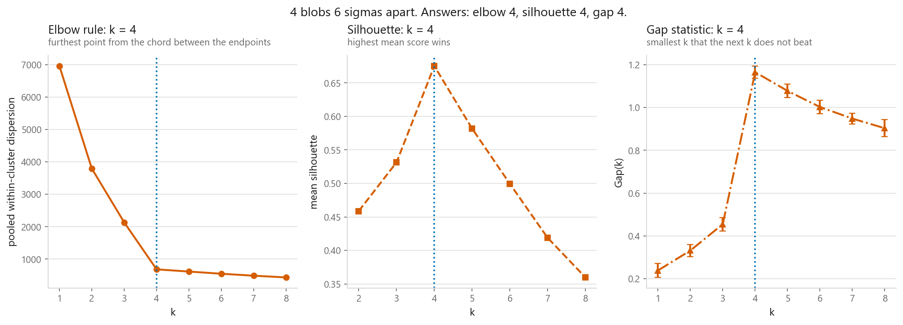
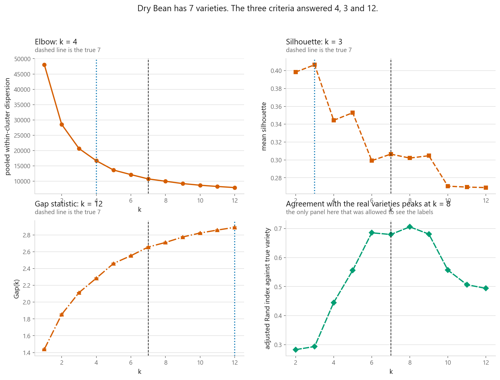

# Choosing k

### Three criteria scored on data whose answer is known, including data whose answer is none

**[Open the notebook](notebook.ipynb)** · Part 5, Unsupervised learning ·
Made by [Elyes Lounissi](https://www.linkedin.com/in/elyes-lounissi/)

| | |
|---|---|
| **What you will learn** | How the elbow, the silhouette and the gap statistic each turn a clustering into a number, how to write the gap statistic from scratch because scikit-learn has none, how often each recovers a k you already know, and which of the three can report that the data has no clusters at all |
| **You should already know** | [k-means](../01-k-means/), and that features are standardised before any distance is computed |
| **Datasets** | Synthetic four-blob clouds with a known k, swept over separation and over noise columns. Then UCI Dry Bean, 13,611 rows by 16 measurements, seven varieties, subsampled to 3,000 |
| **Runtime** | Two to three minutes on a laptop CPU. The 72-dataset recovery sweep alone is 142 s of that |

---

## The result I would lead with

The gap statistic is the only one of the three that is allowed to answer k = 1,
so it is the only one that can say "there are no clusters here". It did that
perfectly. It also failed the positive control sitting in the same table.

| Data | True k | Elbow | Silhouette | Gap | DBSCAN | DBSCAN noise |
|---|---|---|---|---|---|---|
| uniform square, 2 columns | 1 | 4 | 4 | **1** | 5 | 6% |
| uniform cube, 10 columns | 1 | 4 | 7 | **1** | 0 | 100% |
| one round Gaussian | 1 | 3 | 3 | **1** | 1 | 24% |
| one stretched Gaussian | 1 | 3 | 3 | **1** | 3 | 23% |
| four real blobs (control) | **4** | 4 | 4 | **2** | 4 | 4% |

Four datasets with no structure whatsoever, and the gap statistic said 1 on all
four while the elbow and the silhouette said 1 on none of them. That is the case
for it, and it is a strong one.

Then read the last row. **On four well-separated Gaussian blobs, the criterion
that got every null right answered 2.** The elbow, the silhouette and DBSCAN all
answered 4.

The same generator at the same separation appears earlier in the notebook with
348 points instead of 400, and there the gap statistic answers 4 (see the section
below). Six sigmas of separation, identical seed, identical reference count, and
the answer moves from 4 to 2 on a change in sample size. Tibshirani's stopping
rule takes the smallest k that the next k does not clearly beat, which makes it
conservative by design, and conservative here means it stopped two clusters
early on data that could not have been more obliging.

A criterion that cannot fail is not evidence. A criterion that can fail will,
sometimes, and the control column is where you find out.

## The Gaussian failure mode that did not show up

The gap statistic's null hypothesis is uniform over the bounding box of your
data. The standard warning follows from that: a single Gaussian is dense in the
middle and empty at the edges, so against a uniform reference that density
contrast could register as real structure, and a stretched Gaussian should stress
it harder still because the bounding box is a wide rectangle while the data fills
a thin diagonal band.

That is a good argument. It is not what happened. **Both Gaussians came back as
k = 1**, round and stretched alike, the same as both uniform clouds. On these
four nulls at these sample sizes, the wrong-null concern cost nothing and the
observed failure was in the opposite direction: under-calling structure that was
genuinely there.

The uniform-box null is still worth knowing about before trusting the method on
strongly anisotropic data, and Tibshirani's paper offers a principal-component
aligned reference for it. Just do not expect it to be the thing that breaks
first.

## Recovery, and the criterion that never degraded

72 datasets, four blobs each, six seeds per setting. One sweep moves the blobs
apart; the other holds them 5 sigmas apart and adds columns of pure noise.

| Separation (sigmas) | Elbow | Silhouette | Gap |
|---|---|---|---|
| 2 | 0.000 | 0.000 | 0.000 |
| 3 | **1.000** | **1.000** | 0.000 |
| 4 | **1.000** | **1.000** | 0.000 |
| 5 | **1.000** | **1.000** | 0.500 |
| 6 | **1.000** | **1.000** | 0.833 |
| 8 | 1.000 | 1.000 | 1.000 |

| Noise columns added | Elbow | Silhouette | Gap |
|---|---|---|---|
| 0 | **1.000** | 1.000 | 0.500 |
| 2 | **1.000** | 1.000 | 1.000 |
| 5 | **1.000** | 1.000 | 1.000 |
| 10 | **1.000** | 0.833 | 1.000 |
| 20 | **1.000** | 0.167 | 1.000 |
| 40 | **1.000** | **0.000** | 1.000 |

The second table is the one to sit with, because the usual claim is that every
distance-based criterion degrades as you bury the signal in nuisance columns.
Squared Euclidean distance does sum over all 42 columns at the right-hand end, so
the mechanism is real. **The outcome is not shared.** The elbow returned k = 4 on
all 36 runs at every noise level. The gap statistic improved, from 0.500 with no
noise columns to a perfect 1.000 from two columns onward, and stayed there. Only
the silhouette collapsed, from 1.000 to 0.000.

Averaging the three together produces a mean recovery falling from 83% to 67%,
which is true and tells you almost nothing, because the whole fall is one method.

Across every setting in both sweeps:

| Criterion | Share of 72 runs recovering k = 4 |
|---|---|
| **elbow** | **0.917** |
| silhouette | 0.750 |
| gap | 0.653 |

The elbow wins. The elbow is also the one whose rule is closest to a heuristic:
draw the chord between the endpoints of the normalised curve, take the point
furthest from it. It cannot return the smallest k in the range, because both
endpoints lie on the chord at distance zero, so it can never say "no clusters"
either. It is the least principled of the three and it recovered the right answer
more often than either of the others.

Both of the gap statistic's weak spots are visible in the first table: it scored
0.000 at separations 3 and 4, where the other two were already perfect, and only
reached 1.000 at 8 sigmas.

## Watching it work, when it works

Four blobs 6 sigmas apart, 348 points, 20 uniform reference datasets:

| k | log W, data | log W, reference | Gap | s_k |
|---|---|---|---|---|
| 1 | 8.848 | 9.087 | 0.239 | 0.033 |
| 2 | 8.241 | 8.573 | 0.332 | 0.028 |
| 3 | 7.665 | 8.120 | 0.455 | 0.032 |
| **4** | **6.525** | **7.690** | **1.165** | 0.029 |
| 5 | 6.420 | 7.497 | 1.077 | 0.031 |
| 6 | 6.304 | 7.306 | 1.002 | 0.032 |
| 7 | 6.186 | 7.134 | 0.948 | 0.025 |
| 8 | 6.071 | 6.974 | 0.903 | 0.040 |

Both curves fall with k. Within-cluster dispersion always falls with k, on
structured and structureless data alike, reaching zero when every point is its
own cluster, so the fall itself carries no information. Only the vertical
distance between the two curves does, and here it jumps from 0.455 to 1.165 at
exactly the right k.

On this one dataset all three agree at k = 4. That agreement is what makes the
control failure at 400 points worth reporting rather than burying.

## Dry Bean, where nobody is told the answer

3,000 beans sampled from 13,611, 16 standardised measurements, seven true
varieties:

| Criterion | Answer |
|---|---|
| elbow | 4 |
| silhouette | 3 |
| gap statistic | 12 |
| **true varieties** | **7** |

None of the three landed on 7, and they did not land on each other either.

The 12 deserves an asterisk. The sweep searched k = 1 to 12, and the gap panel in
the figure above shows Gap(k) still climbing at the right-hand edge with no
stopping point anywhere in range. The stopping rule never fired; the
implementation falls through to the largest k it was given. **The honest
statement is that the gap statistic returned no answer inside k <= 12, not that
it chose 12.** Widen the range and the number changes.

Then the panel that reframes the other three, and the only one computed with the
labels in hand:

| k | Adjusted Rand index against true variety |
|---|---|
| 7 (the true count) | 0.679 |
| **8** | **0.705** |

Agreement with the botanical varieties peaks at k = 8, not at 7. So the k that
best reproduces the real varieties is not quite the k that best reproduces the
geometry the varieties happen to have, and no criterion reading only the geometry
could have known. Two varieties that overlap in shape space are one cluster no
matter how you count them.

## What DBSCAN adds, and what it does not

DBSCAN is in the null table because
[05-04](../04-dbscan-and-hdbscan/) found it reporting clusters in uniform noise,
and a result quoted across chapters should be re-measured rather than trusted.
It reproduces qualitatively: **5 clusters on a uniform square**, with only 6% of
points called noise.

It is not the worst performer on that table, though. On the 10-column uniform
cube it returned 0 clusters and called 100% of points noise, and on the round
Gaussian it returned 1. That is two of four nulls answered acceptably, against
zero of four for the elbow and zero of four for the silhouette. Having a noise
label is a genuinely different capability from anything k-means offers. It is
also not a reliable way to ask whether clusters exist, because the same knob that
produced 0 clusters on one null produced 5 on another.

## Cheat sheet

| | |
|---|---|
| **Elbow** | Free, since `inertia_` is already computed. Highest recovery here at 0.917, and untouched by 40 columns of noise. Cannot return the smallest k in your range, so it can never say "no clusters" |
| **Silhouette** | Has a genuine maximum and gives per-point scores you can plot. The only criterion that collapsed under noise columns, 1.000 to 0.000 by 40 of them. Undefined at k = 1. O(n squared) in distances, so subsample |
| **Gap statistic** | The only one that can answer "no clusters", and it got all four nulls right. Also the lowest recovery at 0.653, and it answered 2 on a four-blob positive control. Not in scikit-learn |
| **The gap's null** | Uniform over the bounding box. Worth knowing on anisotropic data, but here it was the conservative stopping rule that failed, not the null |
| **Read the fall-through** | If the gap returns the largest k in your range, check whether the rule fired at all. On Dry Bean it did not, and 12 was the edge of the sweep |
| **Noise columns** | Do not assume all criteria degrade together. Two of these three did not degrade at all |
| **Before any of them** | Standardise, and plot the data in two dimensions with [PCA](../../06-dimensionality-reduction/01-principal-component-analysis/) |
| **Run all three** | Where they agree the structure is obvious anyway. Where they disagree, 4 and 3 and no-answer, report the range and say which criterion said what |
| **Always include a control** | The null datasets tell you a criterion is not hallucinating. Only the positive control tells you it can still see something real |
| **Next** | [Hierarchical clustering](../03-hierarchical-clustering/), which gives every k at once and moves the decision to where you cut the tree |

---

Made by **Elyes Lounissi** ·
[LinkedIn](https://www.linkedin.com/in/elyes-lounissi/) ·
[pilot.tun@gmail.com](mailto:pilot.tun@gmail.com)

Back to [Part 5](../) · [the curriculum](../../CURRICULUM.md) · [the book](../../README.md)

`#MachineLearning` `#Clustering` `#KMeans` `#GapStatistic` `#Silhouette`
`#ElbowMethod` `#DBSCAN` `#DryBean` `#UnsupervisedLearning` `#ScikitLearn`
`#MLTutorial` `#LearnMachineLearning` `#DataScience` `#AI`
