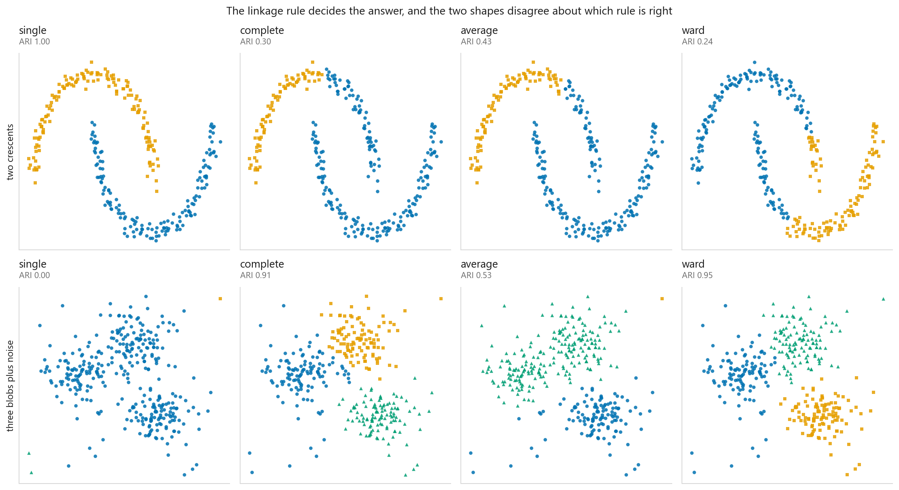
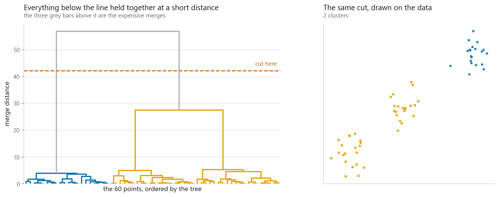
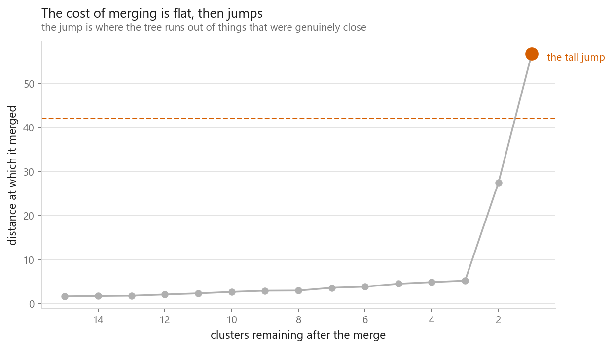
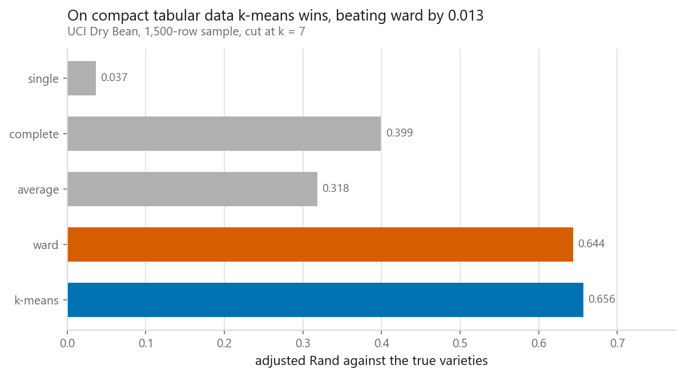
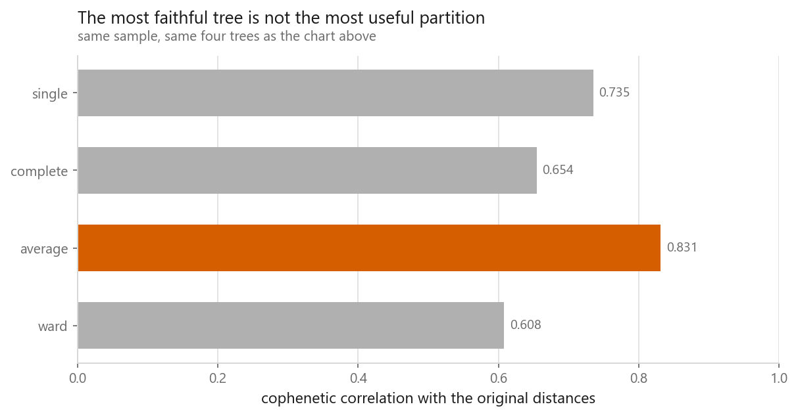

# Hierarchical clustering and dendrograms

### Picking the linkage moved the score further than picking k did

**[Open the notebook](notebook.ipynb)** · Part 5, Unsupervised learning ·
Made by [Elyes Lounissi](https://www.linkedin.com/in/elyes-lounissi/)

| | |
|---|---|
| **What you will learn** | How bottom-up merging builds a tree, what the four linkage rules do to the answer, how to read a dendrogram and where to cut it, what cophenetic correlation measures, and why the method stops working above a few thousand rows |
| **You should already know** | [k-means](../01-k-means/), Euclidean distance, and why features are standardised before any distance is computed |
| **Datasets** | UCI Dry Bean (13,611 × 16, 7 varieties), plus `make_moons` and `make_blobs` |
| **Runtime** | About a minute on a laptop CPU |

---

## Start here: everyone argues about k and shrugs at the linkage

That is backwards, and it is measurable. I compared how far apart the four linkages
land at the *correct* $k$ against how far apart Ward lands across $k = 2,3,4,5$:

| Shape | Four linkages at the right k | Ward at k = 2,3,4,5 |
|---|---|---|
| Two crescents | ARI 0.241 to 1.000, **spread 0.759** | ARI 0.190 to 0.304, spread 0.114 |
| Three blobs plus noise | ARI 0.000 to 0.950, **spread 0.950** | ARI 0.558 to 0.950, spread 0.393 |

The linkage swing is **6.7×** the $k$ swing on the crescents and **2.4×** on the blobs.
Getting $k$ wrong splits or merges a cluster. Getting the linkage wrong changes what a
cluster *is*.

Second thing worth knowing before you invest an afternoon: on the real dataset **plain
k-means beat every linkage**, Ward included, on the same 1,500-row sample.

## The merge record is the whole model

Eight points in three obvious groups give seven merges, at distances 0.224, 0.224,
0.316, 0.361, 0.412, then **3.895** and **4.031**. Ids 0 to $n-1$ are points; merge $i$
creates id $n+i$, so anything above 7 is a cluster. The distance column never
decreases. The jump from 0.412 to 3.895 is the three groups being forced together, and
that jump is the entire basis for cutting a tree.

## The four linkages

| Linkage | Two crescents | Three blobs plus noise |
|---|---|---|
| Single | **ARI 1.000** | **ARI 0.000** |
| Complete | 0.297 | 0.912 |
| Average | 0.425 | 0.527 |
| Ward | 0.241 | **0.950** |

Single linkage goes from perfect to worthless between two panels. It only needs a chain
of near neighbours to walk along, which is exactly what traces a crescent and exactly
what walks through scattered noise from one blob to the next. That failure is called
**chaining**, and it is why single linkage is never a safe default. Ward makes the
opposite trade: it will never chain, and it will never find the crescents.

## Reading a dendrogram

The height of a bar is the distance at which that merge happened, and nothing else in
the picture carries information — leaf order is only constrained by the tree. On sixty
points from three blobs, the largest gap in the last twelve merges runs from **27.492
to 56.750**, so the cut goes at **42.121**, leaving **2 clusters**.

Merge distances going up: 8 clusters left at 3.009, 6 at 3.886, 4 at 4.923, 3 at
**5.260**, then 2 at **27.492** and 1 at 56.750. Six merges under 5.3, then one at
27.5. Everything below that height held together far more cheaply, which is the tree
telling you where to cut.

**Cutting by height and cutting by count are different questions.** Cutting at 42.121
gave 2 clusters, asking for 3 gave 3 clusters, `same partition: False`.
`criterion="distance"` states a claim about distance and accepts the count that
follows; `criterion="maxclust"` states a claim about $k$ and hides the height.

Chaining seen from that side, single linkage on 340 noisy blob points:

| Cut height | Clusters | Largest cluster | Singletons |
|---|---|---|---|
| 0.450 | 35 | 196 of 340 | 26 |
| 0.826 | 12 | 325 of 340 | 9 |
| 1.534 | 3 | **337 of 340** | 1 |

However you move the line you get one cluster holding almost everything and singletons
peeling off the edge. Asking for exactly three clusters does not fix that — it stops
you noticing it.

## On real beans, against k-means

The full set is **92,622,855 pairs**. I sampled **1,500 rows (11.0%)**, or **1,124,250
pairs**, because the full distance matrix does not fit comfortably in memory.

| Method | ARI |
|---|---|
| **k-means** | **0.656** |
| Ward | 0.644 |
| Complete | 0.399 |
| Average | 0.318 |
| Single | **0.037** |

Ward lost to k-means by 0.012 on identical data. That is the honest result and not a
surprise: Ward merges greedily on the same within-cluster sum of squares k-means
minimises directly, so on round similar-sized clouds the direct optimiser should edge
the greedy one. Single linkage sits near zero because in sixteen standardised
dimensions there is always a chain of near neighbours between any two varieties.

Hierarchical clustering does buy one thing k-means cannot: any distance works, since
the algorithm only ever asks for distances. Average linkage scored **0.318** on
Euclidean and **0.300** on Manhattan, and complete linkage on cosine reached
**0.428** — better than complete on Euclidean.

## Is the tree a fair summary?

Cophenetic distance is the height at which two points first share a cluster — the
tree's opinion of how far apart they are. Correlate that against the real distances and
you measure the tree, not the clusters.

| Linkage | Cophenetic correlation | ARI |
|---|---|---|
| Single | 0.735 | 0.037 |
| Complete | 0.654 | 0.399 |
| **Average** | **0.831** | 0.318 |
| Ward | 0.608 | **0.644** |

The two columns invert at the top: the most faithful tree is average, the best
partition is Ward, and Ward is last on faithfulness while first on ARI. Average linkage
merges on the mean cross-pair distance, so it is close to optimising this quantity by
construction. Use the number to catch a tree that has distorted the data, not to pick a
linkage.

## The $O(n^2)$ wall

Ward on samples of the standardised beans: 250 rows in 0.002 s, 500 in 0.009 s, 1,000
in 0.050 s, 2,000 in 0.236 s, 4,000 in 1.116 s — the last three doublings costing
**5.7×**, **4.7×** and **4.7×**. That is the $O(n^2)$ of SciPy's nearest-neighbour
chain, not the $O(n^3)$ of the naive algorithm. Time is not the problem. Memory is:

| Rows | Pairs | Just to hold the distances |
|---|---|---|
| 13,611 | 92.6M | **0.69 GB** |
| 100,000 | 4,999.9M | **37.25 GB** |
| 1,000,000 | 499,999.5M | **3,725.29 GB** |

Two escapes, both ordinary practice. **Sample, then assign**: the tree fitted on 1,500
rows scored ARI 0.644 on the sample and **0.672 across all 13,611 rows** once every
remaining row took its nearest centroid — better on the full set than on the sample it
was built from. **Connectivity constraint**: hand sklearn a k-nearest-neighbour graph
and the dense matrix is never built; all 13,611 rows clustered in **6.6 s** at **ARI
0.658**, sizes [3986, 3036, 2353, 1918, 1679, 522, 117]. Both beat the 1,500-row
unconstrained Ward fit.

## Cheat sheet

| | |
|---|---|
| **Use it when** | You do not know $k$, you want the nesting and not only the partition, and $n$ is a few thousand at most |
| **Single linkage** | ARI 1.000 on crescents, 0.000 on noisy blobs. Never a default |
| **Complete linkage** | Compact clusters of similar diameter. One far point sets the whole cluster distance |
| **Average linkage** | The middle option, and the one that topped cophenetic correlation at 0.831 |
| **Ward** | Euclidean only. The safe default, and it lost to k-means by 0.012 on the beans |
| **Cut by height** | `fcluster(Z, t, "distance")` — states a distance, accepts the count |
| **Cut by count** | `fcluster(Z, k, "maxclust")` — states a count, hides the distance |
| **Cophenetic** | `cophenet(Z, pdist(X))`. A diagnostic, not a model selection score |
| **Cost** | $O(n^2)$ memory, always. 0.69 GB at 13,611 rows, 37 GB at 100,000 |

---

Made by **Elyes Lounissi** ·
[LinkedIn](https://www.linkedin.com/in/elyes-lounissi/) ·
[pilot.tun@gmail.com](mailto:pilot.tun@gmail.com)

Back to [Part 5](../) · [the curriculum](../../CURRICULUM.md) · [the book](../../README.md)

`#MachineLearning` `#Clustering` `#HierarchicalClustering` `#Dendrogram`
`#UnsupervisedLearning` `#Python` `#SciPy` `#ScikitLearn` `#DataScience`
`#MLTutorial`
