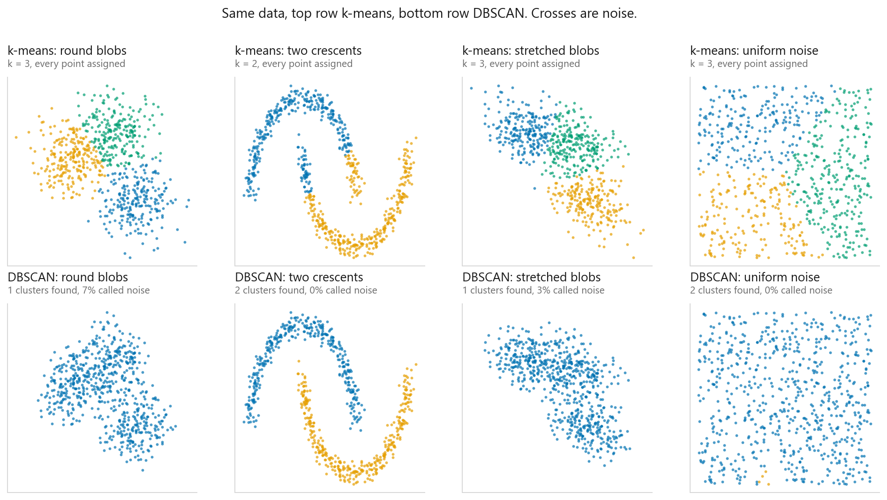
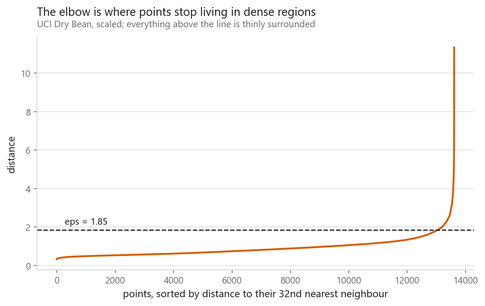
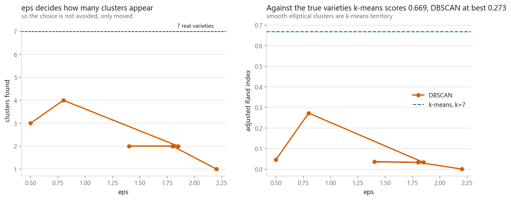

# DBSCAN and HDBSCAN

### Clusters defined by density, not by distance to a centre

**[Open the notebook](notebook.ipynb)** · Part 5, Unsupervised learning ·
Made by [Elyes Lounissi](https://www.linkedin.com/in/elyes-lounissi/)

| | |
|---|---|
| **What you will learn** | How density-based clustering finds shapes k-means cannot. How to choose `eps` from the data instead of guessing. Why some points get labelled noise, and where the method fails |
| **You should already know** | [k-Means](../01-k-means/) |
| **Datasets** | UCI Dry Bean, plus synthetic shapes chosen to separate the two methods |
| **Runtime** | About a minute on a laptop CPU |

---

## The idea

[k-means](../01-k-means/) defines a cluster as *points near a centre*, and must
assign every point to one. DBSCAN defines it as **a dense region of any shape,
separated from other dense regions by sparse space**.

Every point is **core** (at least `min_samples` neighbours within `eps`),
**border** (within `eps` of a core point), or **noise**. Clusters grow by chaining
core points together, which is why a crescent works: no point needs to be near a
centre, only near its neighbours.

**Two crescents** is the headline: DBSCAN recovers both, k-means cannot.

**Uniform noise did not go the way I expected**, and the correction is the most
useful thing here. I assumed DBSCAN would label the structureless cloud as noise.
At `eps=0.30` it found **2 clusters and called nothing noise at all**. Uniform
random points are *evenly* dense, not sparse: every point has plenty of
neighbours, so every point is core, and the chaining runs through the whole square.

Tightening `eps` does not rescue it either:

| eps | Clusters found | Called noise |
|---|---|---|
| 0.30 | 2 | 0.0% |
| 0.20 | 16 | 9.3% |
| 0.15 | 19 | 71.7% |
| 0.10 | 0 | 100% |

**There is no setting at which DBSCAN reports "this data has no structure."** It
goes from 2 spurious clusters, to 19, straight to rejecting every point. The
useful middle answer never appears. Deciding whether clusters exist at all remains
your job.

## Choosing eps without guessing

Plot each point's distance to its `k`-th nearest neighbour, sorted. The elbow marks
where points stop living in dense regions, here **eps ≈ 1.85**. This beats trial
and error, which is how most people meet DBSCAN.

## On real data, k-means wins

| Method | Adjusted Rand vs true varieties |
|---|---|
| k-means, k=7 | **0.669** |
| DBSCAN, eps=1.85 | 0.033 |
| HDBSCAN, min_cluster_size=150 | 0.036 |

**DBSCAN loses badly here**, and the reason is instructive. Bean varieties form
smooth, roughly elliptical, overlapping clouds of *similar density*, exactly what
k-means was designed for. There is no sparse space between varieties to cut along,
so DBSCAN merges everything into two blobs.

It also exposes the honest limitation: **`eps` decides how many clusters you get.**
DBSCAN does not remove the "how many clusters" decision, it renames it. What it
genuinely adds is arbitrary shapes and the ability to emit a noise label.

## Cheat sheet

| | |
|---|---|
| **Use it when** | Clusters are irregular shapes; outliers exist and should stay out; you genuinely do not know the cluster count |
| **Avoid it when** | Clusters differ in density (use HDBSCAN); high dimensions; smooth overlapping groups |
| **Scaling needed** | Yes. `eps` is a distance |
| **Main dials** | `eps` and `min_samples` (rule of thumb: twice the dimensions) |
| **Choosing eps** | The sorted k-distance elbow. Not trial and error |
| **Watch out** | Label `-1` means noise, not a cluster. Never treat it as one |
| **If you want the noise** | [Anomaly detection](../06-anomaly-detection/) gives you a ranked score rather than a yes or no, which is what you need when the cutoff is a decision about alert volume |
| **If the groups overlap** | [Gaussian mixture models](../05-gaussian-mixture-models/), the method for the case this chapter lost |

---

If this chapter was useful, a star on the repository helps other people find it.
The code is yours to use, copy and adapt in your own work, no permission needed.

Made by **Elyes Lounissi** ·
[LinkedIn](https://www.linkedin.com/in/elyes-lounissi/) ·
[pilot.tun@gmail.com](mailto:pilot.tun@gmail.com)

Back to [Part 5](../) · [the curriculum](../../CURRICULUM.md) · [the book](../../README.md)

`#MachineLearning` `#DBSCAN` `#HDBSCAN` `#Clustering` `#UnsupervisedLearning`
`#Python` `#ScikitLearn` `#DataScience` `#MLTutorial` `#AnomalyDetection`
