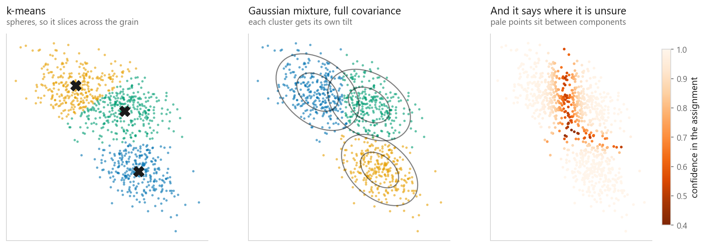
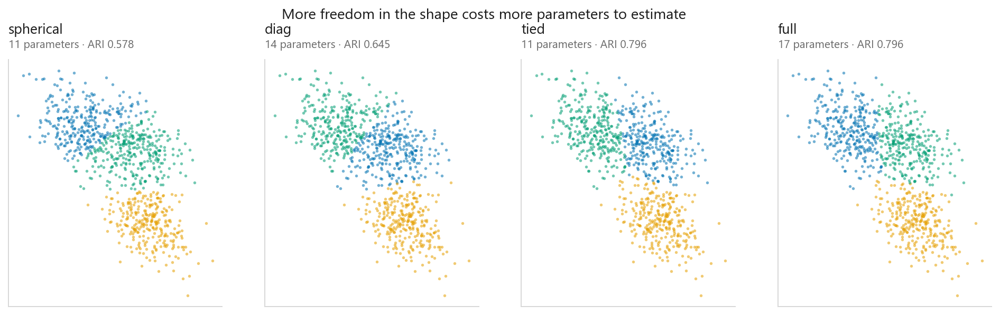
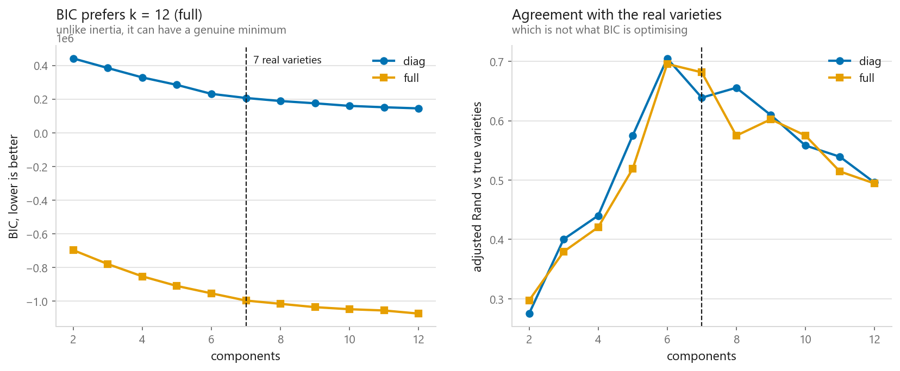

# Gaussian Mixture Models

### Clustering that admits it is uncertain

**[Open the notebook](notebook.ipynb)** · Part 5, Unsupervised learning ·
Made by [Elyes Lounissi](https://www.linkedin.com/in/elyes-lounissi/)

| | |
|---|---|
| **What you will learn** | How a mixture model differs from k-means, and what expectation-maximisation does. What the four covariance types buy you. And what BIC does and does not tell you about the number of components |
| **You should already know** | [k-Means](../01-k-means/) |
| **Datasets** | UCI Dry Bean, plus the stretched blobs that broke k-means |
| **Runtime** | About a minute on a laptop CPU |

---

## The idea

[k-means](../01-k-means/) has two limits: every cluster is a sphere, and every
point belongs to exactly one. A Gaussian mixture relaxes both.

$$p(x) = \sum_{i=1}^{k} \pi_i \, \mathcal{N}(x \mid \mu_i, \Sigma_i)$$

The chance of seeing a bean like $x$ is the sum, over the $k$ components, of how
common component $i$ is ($\pi_i$) times how likely it was to produce that bean.
$\mathcal{N}$ is the normal distribution, $\mu_i$ is where component $i$ sits, and
$\Sigma_i$ is its covariance matrix. So each component carries three things: how
common it is, where it sits, and **what shape it has**. That third one is the
whole upgrade: a cluster can be a stretched, tilted ellipse instead of a ball.

**k-means is the special case** where every covariance is the identity and every
assignment is hard.

**Expectation-maximisation** breaks the circularity: given components, compute the
probability each point came from each (E-step); given those probabilities,
recompute each component as a weighted average (M-step). Same shape as Lloyd's
algorithm, with soft assignment.

## The shapes k-means could not see

On stretched blobs where k-means slices across the grain:

| Method | Adjusted Rand |
|---|---|
| k-means | 0.589 |
| Gaussian mixture, full covariance | **0.796** |

The third panel is what k-means genuinely cannot do. **17.3% of points are
assigned with under 80% confidence**, the model telling you where it does not
know. k-means assigns every point with equal, unearned certainty.

## The covariance types

**spherical** is k-means with soft assignment. **diag** allows axis-aligned
ellipses. **tied** shares one shape across clusters. **full** lets every cluster
tilt freely, and costs the most parameters.

| Type | Parameters | ARI |
|---|---|---|
| spherical | 11 | 0.578 |
| diag | 14 | 0.645 |
| **tied** | **11** | **0.796** |
| full | 17 | **0.796** |

The extra freedom stopped paying halfway along. **`tied` matched `full` at ARI
0.796 on 11 parameters instead of 17**, and beat `diag` while costing less than
`diag` did.

That is not a fluke of this run. `stretched` is three isotropic blobs put through
one linear map, so all three clusters genuinely share a covariance, which is
exactly what `tied` assumes. `tied` is the correctly specified model here and
`full` is spending six extra parameters estimating three matrices that had to
agree. `diag` loses to both because the shared shape is tilted and `diag` cannot
tilt. The rule to carry away: **the cheapest covariance type whose assumption is
true will match or beat every richer one.** Reach for `full` when you do not know
the shapes and have data to spare, and check whether something cheaper got there
first.

## Choosing k, and the minimum that never arrived

$$\text{BIC} = -2\log L + p \log n$$

$L$ is how likely the fitted model says your data was, $p$ is how many parameters
it used to say so, and $n$ is the number of beans. The first term rewards fit and
the second charges rent on every parameter, and lower is better.

The promise is that BIC can turn around where inertia never does, because every
extra component costs $p \log n$. **On this dataset it did not turn around.**

BIC fell at every step from k = 2 to k = 12, for both covariance types: diag from
441,945 to 145,130, full from -697,488 to -1,074,464. There is no minimum in the
range I swept, and the lowest value sits at k = 12 only because k = 12 is where I
stopped. Reporting that as "BIC chose twelve" would be the same mistake as reading
an elbow off the largest k on the axis.

The last step shows how far off a turn is. Going from eleven to twelve
full-covariance components adds 153 parameters, costing about **1,456** of BIC at
n = 13,611, against a likelihood credit of about **19,871**, which is **13.6× the
charge**. The penalty is not weak, it is outgunned, and nothing suggests the gap
is closing by k = 12.

Three things follow, and they are more useful than a tidy minimum would have been.

**BIC is not a defence against runaway k by itself.** The penalty grows linearly in
$k$; so does the likelihood, usually faster. Which wins is an empirical question
about your data.

**A minimum you did not observe is not a minimum.** If you want to say BIC chose
something, the curve has to visibly turn inside your range.

**BIC answers a density question, not your question.** Seven real varieties, each
slightly non-Gaussian, are described better by twelve Gaussians than by seven, and
better still by more. It is doing its job correctly and its job is not yours.

The right panel is the contrast. Agreement with the true varieties **does** peak,
at **k = 6, diag, ARI 0.705**, one component below the truth, falling away on both
sides. The curve that knows the answer has the shape BIC was supposed to have.

At the true k of 7:

| Method | Adjusted Rand |
|---|---|
| Gaussian mixture (full) | **0.682** |
| k-means | 0.669 |

## Cheat sheet

| | |
|---|---|
| **Use it when** | Clusters are elliptical or differently shaped; you want probabilities not hard labels |
| **Avoid it when** | Clusters are non-convex: crescents and rings need [DBSCAN](../04-dbscan-and-hdbscan/); very few points per cluster |
| **Scaling needed** | Yes, as for k-means |
| **Main dials** | `n_components`, `covariance_type`, `n_init` (EM finds local optima) |
| **Choosing k** | BIC can turn around where inertia cannot. Check that yours did: mine fell at every k from 2 to 12 |
| **Bonus** | `score_samples` gives a density, so it doubles as an [anomaly detector](../06-anomaly-detection/) |

---

If this chapter was useful, a star on the repository helps other people find it.
The code is yours to use, copy and adapt in your own work, no permission needed.

Made by **Elyes Lounissi** ·
[LinkedIn](https://www.linkedin.com/in/elyes-lounissi/) ·
[pilot.tun@gmail.com](mailto:pilot.tun@gmail.com)

Back to [Part 5](../) · [the curriculum](../../CURRICULUM.md) · [the book](../../README.md)

`#MachineLearning` `#GaussianMixture` `#GMM` `#Clustering` `#UnsupervisedLearning`
`#ExpectationMaximization` `#Python` `#ScikitLearn` `#MLTutorial` `#BIC`
