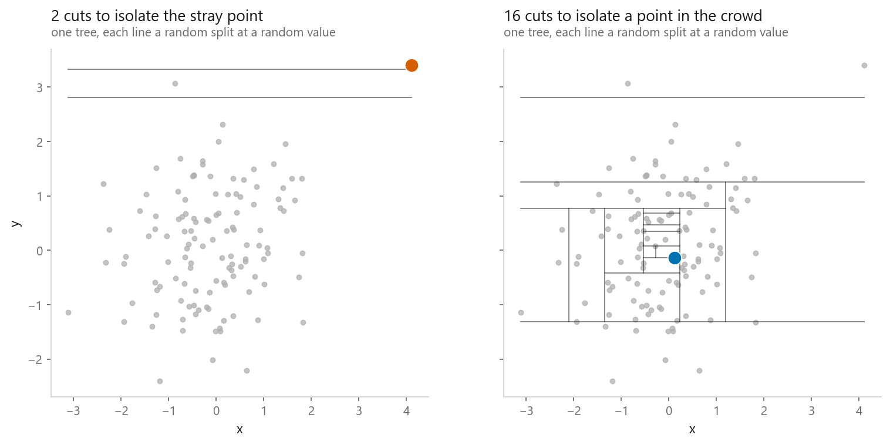
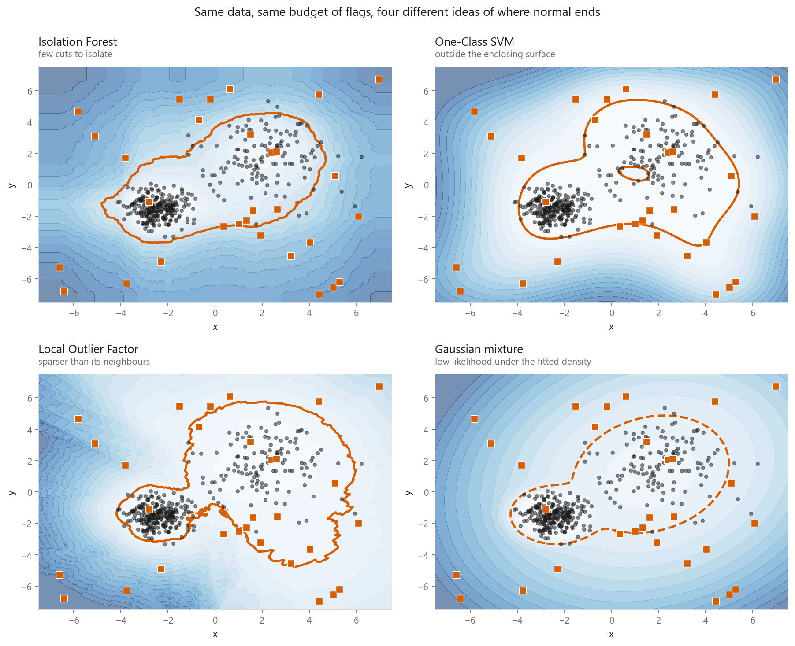
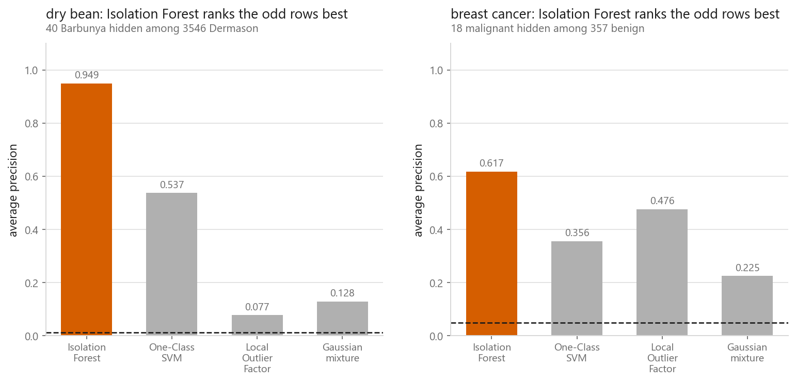
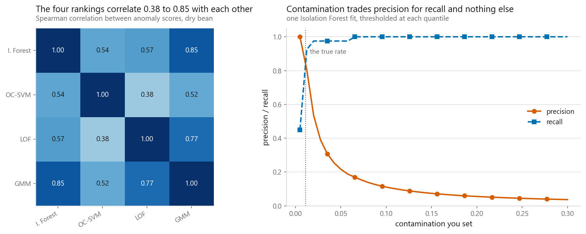

# Anomaly detection

### Four ways to say "this one is not like the others"

**[Open the notebook](notebook.ipynb)** · Part 5, Unsupervised learning ·
Made by [Elyes Lounissi](https://www.linkedin.com/in/elyes-lounissi/)

| | |
|---|---|
| **What you will learn** | How Isolation Forest, One-Class SVM, Local Outlier Factor and a Gaussian-mixture density each define unusual, how to judge a detector with no labels and how to judge one honestly when you have them, and what `contamination` really does |
| **You should already know** | [Gaussian mixtures](../05-gaussian-mixture-models/), [density-based clustering](../04-dbscan-and-hdbscan/), [support vector machines](../../03-classification/05-support-vector-machines/), [random forests](../../04-ensembles/02-random-forest/) |
| **Datasets** | UCI Dry Bean, Wisconsin Breast Cancer, plus blobs with uniform noise scattered over them |
| **Runtime** | Two to three minutes on a laptop CPU |

---

## The result I did not expect

40 BARBUNYA beans hidden among 3,546 DERMASON, a base rate of **1.1154%**. Each of
the four detectors flags its top 40 rows. Then I count how often they agree:

| | Rows | Of which really anomalies |
|---|---|---|
| Flagged by all four detectors | 3 | **0** |
| Flagged by exactly one detector | 56 | **18** |

Every row the four detectors agreed on was a normal bean. Eighteen real anomalies
were spotted by one detector and missed by the other three. The obvious next move
makes it worse. Averaging the four rankings — the cheapest ensemble there is, and
one that needs no labels — scores:

| | Average precision |
|---|---|
| Rank-average of all four | **0.087** |
| Best single detector (Isolation Forest) | **0.949** |
| Worst single detector (LOF) | 0.077 |

The consensus landed 0.010 above the worst member and 0.862 below the best.
Combining detectors that measure different things is not averaging noise out of a
shared signal — there is no shared signal. Consensus here means "boring in all four
senses at once", which is a description of a normal row.

## What each one is asking

Isolation Forest asks how few random cuts separate a point from the rest. On a
120-point cloud with one stray, over 200 random trees:

| Point | Average cuts to isolate |
|---|---|
| The stray | 2.60 |
| A central point | 11.57 |

The central point takes **4.5×** as many. No distance metric, no scaling, no
assumption about shape. The other three: One-Class SVM asks whether a point falls
outside a boundary wrapped around the training data; Local Outlier Factor asks
whether it sits in a thinner patch than its own neighbours do; a Gaussian mixture
asks how unlikely it is under a fitted density. Four different questions, which is
why the four answers diverge.

## Drawn on 2-D data

30 uniform points hidden among 370 blob points, each detector allowed 32 flags:

| Detector | Noise caught | Blob points wrongly flagged |
|---|---|---|
| Isolation Forest | **22/30** | 10 |
| One-Class SVM | 21/30 | 12 |
| Local Outlier Factor | 19/30 | 13 |
| Gaussian mixture | **22/30** | 10 |

Within three points of each other, but the boundaries look nothing alike. Isolation
Forest draws a boxy region because it can only cut along the axes. The SVM draws a
smooth contour around both blobs. LOF hugs each blob separately, tight around the
narrow one and loose around the wide one — that is what *local* buys. The mixture
draws two clean ellipses, which is exactly right here only because I generated two
ellipses. Some noise points landed inside a blob: nothing about them is observably
unusual, so no detector flags them and none should. The ceiling is set by the data.

## Judging a detector with no labels

Three things you can measure without labels, none of which is correctness.

**Stability.** Top-40 overlap when you change the seed or the neighbourhood:

| | Overlap |
|---|---|
| Isolation Forest, seed 0 vs 1 / 2 / 3 | 98% / 95% / 98% |
| LOF, k=20 vs k=10 | 72% |
| LOF, k=20 vs k=40 | 70% |
| LOF, k=20 vs k=80 | **12%** |

Isolation Forest is the random one and LOF is deterministic, yet LOF's answer moves
far more, because $k$ is a decision and every value of it asks a different question.

**Resolution.** Score 2,000 uniform points from the same box as the data:

| | Above the 99th percentile of real scores |
|---|---|
| Real rows | 1.0% |
| Uniform junk | **88.6%** |

If those two were equal the score would carry no information. They are not close.

**A describable difference.** The flagged rows, in standard deviations from the
rest: ConvexArea **+5.32**, Area +5.26, Perimeter +5.10, EquivDiameter +4.53,
MinorAxisLength +4.33. That is the honest deliverable of a label-free run — not
"these are wrong", but "these are much bigger, and here is by how much".

## Scored with labels

| Detector | Dry bean (base rate 0.011) | Breast cancer (base rate 0.048) |
|---|---|---|
| Isolation Forest | **0.949** (85× base) | **0.617** (13× base) |
| One-Class SVM | 0.537 (48× base) | 0.356 (7× base) |
| Gaussian mixture | 0.128 (11× base) | 0.225 (5× base) |
| Local Outlier Factor | 0.077 (7× base) | 0.476 (10× base) |

Isolation Forest won both. Below first place the order inverts: LOF goes from last
on the beans (0.077) to second on the cells (0.476), and the mixture goes the other
way.

The structure of the anomaly decides it. The odd beans are one variety, so they sit
in their own tight clump of forty — and a clump is not sparse relative to itself,
which is precisely the case a local method cannot see. The malignant cells spread
along several correlated measurements, which suits a density model. You usually
cannot see that structure before you pick the detector.

Report average precision with the base rate printed next to it. Accuracy is
meaningless at 1.1% positives, and ROC AUC flatters because the enormous normal
class dominates the false-positive rate.

## Contamination is not a parameter

Sweeping `contamination` on one Isolation Forest fit, and comparing every score
against what scikit-learn produces when it refits:

| contamination | Rows flagged | Precision | Recall | Largest score change vs the default fit |
|---|---|---|---|---|
| 0.01 | 36 | 0.917 | 0.825 | **0.00e+00** |
| 0.05 | 180 | 0.217 | 0.975 | **0.00e+00** |
| 0.2 | 717 | 0.056 | 1.000 | **0.00e+00** |

Not one score moved by a single bit. `contamination` only draws a line through a
ranking that was already fixed. It is your prior about how many anomalies exist,
handed back to you as a result. Set it to the true rate and you look accurate — and
the only way you knew the true rate is that you had labels, in which case you had
better options.

The One-Class SVM is the exception, because `nu` enters the optimisation:

| | Support vectors | Average precision |
|---|---|---|
| `nu=0.01` | 101 | 0.186 |
| `nu=0.20` | 607 | **0.568** |

Spearman between the two rankings: **0.6573**. Two different fits, two different
answers, and a threefold difference in average precision. For the SVM the dial is
real and needs tuning; for the other three it is cosmetic. Easy to miss, since
scikit-learn spells both as one small float in the constructor.

## Cheat sheet

| | |
|---|---|
| **Try first** | Isolation Forest. No scaling, near-linear in rows, few knobs, best on both labelled problems here |
| **Use LOF when** | Density varies and "unusual" means unusual for its own neighbourhood. Set `novelty=True` to score rows it was not fitted on |
| **Use One-Class SVM when** | Under a few thousand rows. It is quadratic, so subsample to fit and score everything afterwards |
| **Use a mixture when** | You can defend the shape assumption. Regularise the covariances (`reg_covar`) or it goes singular |
| **Scaling** | Everything except Isolation Forest needs it |
| **Metric** | Average precision with the base rate beside it |
| **Main dials** | `n_neighbors` for LOF (12% overlap between k=20 and k=80 here), `nu` for the SVM, `n_components` for the mixture |
| **Watch out** | `contamination` moves a threshold, not the model. And do not average the four rankings — the consensus scored 0.087 against 0.949 for the best member |

---

Made by **Elyes Lounissi** ·
[LinkedIn](https://www.linkedin.com/in/elyes-lounissi/) ·
[pilot.tun@gmail.com](mailto:pilot.tun@gmail.com)

Back to [Part 5](../) · [the curriculum](../../CURRICULUM.md) · [the book](../../README.md)

`#MachineLearning` `#AnomalyDetection` `#OutlierDetection` `#IsolationForest`
`#OneClassSVM` `#LocalOutlierFactor` `#UnsupervisedLearning` `#Python`
`#ScikitLearn` `#MLTutorial`
