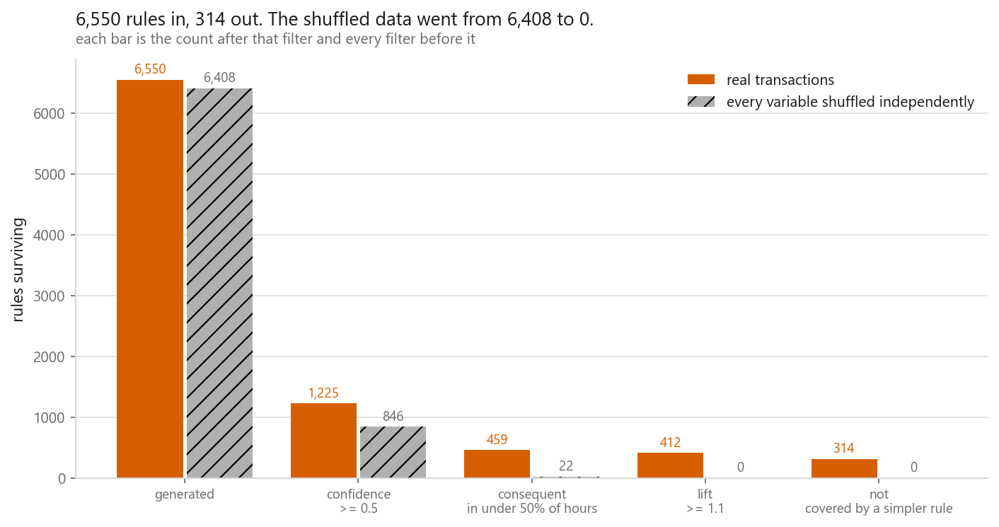
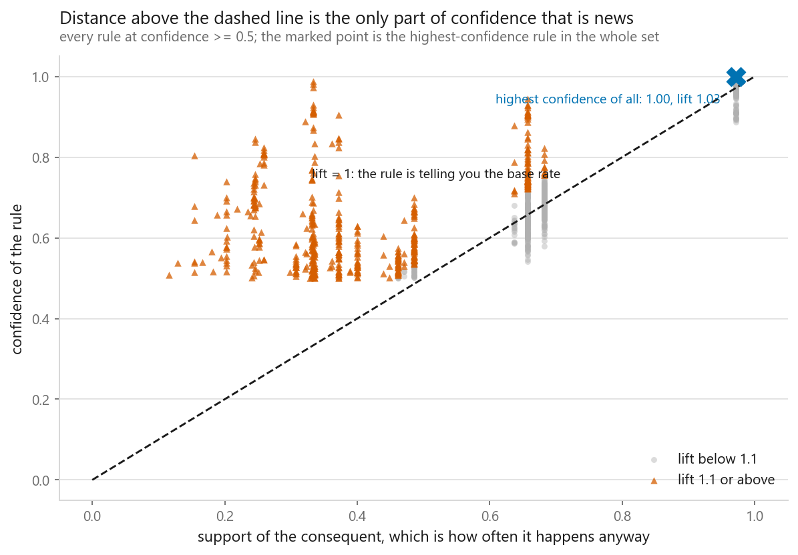
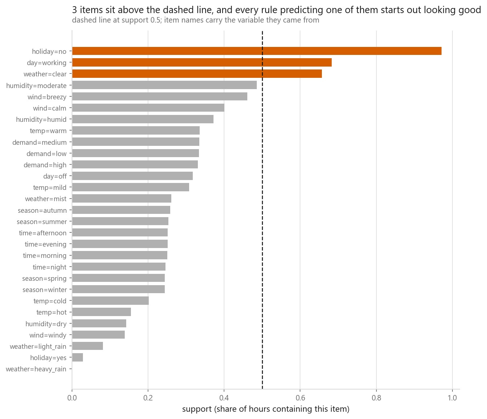
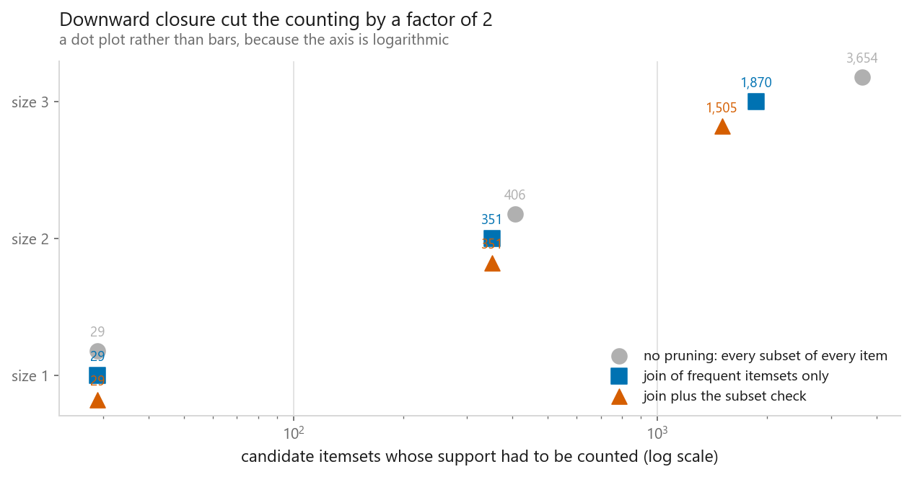
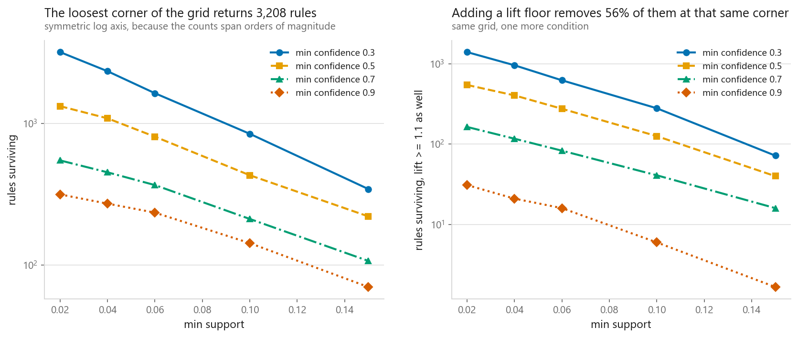

# Association rules with Apriori

### Finding what goes with what, and then throwing 95% of it away

**[Open the notebook](notebook.ipynb)** · Part 5, Unsupervised learning ·
Made by [Elyes Lounissi](https://www.linkedin.com/in/elyes-lounissi/)

| | |
|---|---|
| **What you will learn** | How downward closure makes an impossible search finite, how to write Apriori in NumPy and check it against mlxtend, why a high-confidence rule is usually worthless, which filter actually does the work, and how to prove a filter works by running it on data with nothing in it |
| **You should already know** | Nothing beyond basic probability. No model, no train-test split |
| **Dataset** | UCI Bike Sharing, 17,379 hours binned into 17,379 transactions of exactly 9 items each, drawn from 29 distinct items |
| **Runtime** | One to two minutes on a laptop CPU |

---

## The result I would lead with

Five filters applied in order, counted at every stage, and the same pipeline run
on a null version of the data where every variable has been shuffled
independently so that item supports are identical and every relationship between
variables is destroyed.

| Filter | Real transactions | Shuffled |
|---|---|---|
| generated | 6,550 (100.0%) | 6,408 (100.0%) |
| confidence >= 0.5 | 1,225 (18.7%) | **846 (13.2%)** |
| consequent in under 50% of hours | 459 (7.0%) | **22 (0.3%)** |
| lift >= 1.1 | 412 (6.3%) | 0 (0.0%) |
| not covered by a simpler rule | **314 (4.8%)** | **0 (0.0%)** |

Two things in that table are not what the usual telling says.

**The confidence floor barely separates real from noise.** Shuffled data, which
by construction contains no association at all, kept 13.2% of its rules through a
confidence threshold of 0.5, against 18.7% for the real file. If confidence were
your only filter you would ship 846 rules mined from pure independence.

**The filter that collapses the null column is the base-rate check, not lift.**
Requiring the consequent to happen in under half of all hours cut the shuffled
column from 846 to 22, a 97% kill. The lift floor removed the last 22, and the
redundancy check removed nothing because there was nothing left. On real data the
redundancy check is also the smallest cut of the four, removing 98 of 412 rules,
1.5% of everything generated. Most rules die at the very first filter.

The end-to-end number is the one to remember: **6,550 rules in, 314 out, and 0
out of 6,408 on data that cannot contain a finding.**

## The confidence trap, in two rules

| | Rule | Confidence | Consequent happens anyway | Lift |
|---|---|---|---|---|
| highest confidence | `day=working + demand=high => holiday=no` | **1.000** | 0.971 | **1.030** |
| highest lift | `season=autumn + time=afternoon => temp=hot` | 0.805 | 0.154 | **5.210** |

A rule that is right 100% of the time and a rule that is right 80% of the time.
The perfect one has learned that 97.12% of hours are not holidays.

Of the 1,225 rules surviving a confidence floor of 0.5, **547 (44.7%) have a lift
between 0.95 and 1.05**. Those rules describe independence and nothing else.

The dashed line is where confidence equals the consequent's base rate, which is
lift exactly 1. Distance above that line is the only part of confidence that is
news, and ranking by confidence ranks by how common the consequents are.

You can see the trap coming before any rule is generated. Three of the 29 items
sit above 50% support, and every rule predicting one of them starts out looking
good:

| Item | Support |
|---|---|
| holiday=no | **0.9712** |
| day=working | 0.6827 |
| weather=clear | 0.6567 |
| humidity=moderate | 0.4857 |

At the far end, `weather=heavy_rain` occurs in 0.0002 of hours and
`holiday=yes` in 0.0288, both below the 0.03 support floor, so 27 of the 29
items survive to size 1.

## Downward closure, counted

The whole algorithm is one line: if an itemset is frequent, every subset of it is
frequent. Read backwards, a candidate with an infrequent subset never needs
counting.

| Size | Every subset of every item | Join of frequent itemsets only | Join plus the subset check | Found frequent |
|---|---|---|---|---|
| 1 | 29 | 29 | 29 | 27 |
| 2 | 406 | 351 | **351** | 275 |
| 3 | 3,654 | 1,870 | 1,505 | 1,000 |
| **total counted** | **4,089** | **2,250** | **1,885** | **1,302** |

Downward closure cut the counting by a factor of 2 overall, and the split between
the two mechanisms is lopsided. Restricting the join to already-frequent itemsets
saved 1,839 support counts. The extra subset check saved 365, **all of them at
size 3**, and nothing at all at size 2, where 351 candidates went in and 351 were
counted.

That size-2 row is worth knowing about, because it means the encoding's
impossible itemsets are not free. Items from the same variable are mutually
exclusive, so no hour can be both `temp=hot` and `temp=cold`, but at size 2 every
such pair has two frequent single-item subsets, passes the check, and gets
counted before its support comes back near zero. The check only starts removing
them at size 3.

The from-scratch NumPy implementation and mlxtend agree exactly: 1,302 frequent
itemsets each, identical sets, largest support disagreement 0.00e+00, at 0.12 s
against 0.15 s.

## The two dials

| Min support | Min confidence | Itemsets | Rules | Rules with lift >= 1.1 |
|---|---|---|---|---|
| 0.02 | 0.3 | 1,613 | **3,208** | 1,401 |
| 0.02 | 0.9 | 1,613 | 316 | **31** |
| 0.06 | 0.3 | 683 | 1,642 | 624 |
| 0.10 | 0.5 | 326 | 432 | 126 |
| 0.15 | 0.9 | 148 | 70 | **3** |

Lowering the support floor explodes the rule count, which every tutorial says.
The column worth having is the last one. At the loosest corner of the grid,
**adding a lift floor of 1.1 removes 56% of the 3,208 rules**, and at min
confidence 0.9 it removes 90% of them, since a high confidence floor selects
precisely for common consequents.

## The bin edges are doing some of the work

The items came from binning continuous columns, so the encoding is a choice that
has to be stress tested. Named physical bands for temperature, humidity and wind,
against equal-frequency bins, everything else identical:

| Binning | Items | Frequent itemsets | Rules | Rules with lift >= 1.1 | Max lift |
|---|---|---|---|---|---|
| named physical bands | 29 | 1,302 | 1,225 | **489** | **5.210** |
| equal-frequency bins | 29 | 1,282 | 1,140 | **376** | **3.689** |

The itemset count barely moved, at 1.5%. The interesting counts moved a lot:
**23% fewer rules cleared the lift floor** and the strongest rule in the file lost
**29% of its lift**. So the headline strength of these rules is partly a property
of where the temperature bands were cut. The structure survives the re-encoding,
the magnitudes do not, and both facts belong in any report of rules mined from
binned data.

## About the transactions

There is no retail basket file among this book's datasets, so each of the 17,379
hours becomes one transaction. Nine variables (season, time of day, holiday,
working day, weather, temperature, humidity, wind, demand) each contribute
exactly one item, from 29 distinct items in total.

Two consequences, both different from a supermarket. **Every transaction has the
same length**, 9 items, minimum and maximum. And **items from the same variable
are mutually exclusive**, so a large class of itemsets is impossible before
counting starts. Both push support values far above retail, where a single
product sits in a tiny fraction of baskets. That is why the support floor here is
0.03 rather than 0.001, and it is why the confidence trap is so sharp: an item at
0.9712 support does not exist in a shopping basket.

## Cheat sheet

| | |
|---|---|
| **Use it when** | You have transactions and someone who can act on a readable sentence |
| **Avoid it when** | You want prediction. A rule has no held-out score |
| **Support** | Sets the search and the return. 0.02 gave 1,613 itemsets, 0.15 gave 148 |
| **Confidence** | Ranks by how common the consequents are. It let 13.2% of pure-noise rules through here |
| **Lift** | Confidence divided by the base rate. Symmetric, so it says association and never direction |
| **The filter that worked** | Requiring the consequent under 50% support. It cut the null column from 846 to 22 |
| **Redundancy check** | Worth having, but it removed only 98 of 412 rules. Do not expect it to do the cleaning |
| **Downward closure** | Cut counting from 4,089 to 1,885. The join restriction did 1,839 of that; the subset check did 365 and none of it below size 3 |
| **Binning** | Re-run with different bin edges and print both. Max lift here fell from 5.210 to 3.689 |
| **Always** | Shuffle every column independently and rerun the whole pipeline. Whatever survives is your false-positive count. Here it was 0 |
| **Next** | [Principal Component Analysis](../../06-dimensionality-reduction/01-principal-component-analysis/), which starts part 6 |

---

Made by **Elyes Lounissi** ·
[LinkedIn](https://www.linkedin.com/in/elyes-lounissi/) ·
[pilot.tun@gmail.com](mailto:pilot.tun@gmail.com)

Back to [Part 5](../) · [the curriculum](../../CURRICULUM.md) · [the book](../../README.md)

`#MachineLearning` `#AssociationRules` `#Apriori` `#MarketBasketAnalysis`
`#Lift` `#Confidence` `#FrequentItemsets` `#mlxtend` `#UnsupervisedLearning`
`#BikeSharing` `#MLTutorial` `#LearnMachineLearning` `#DataScience` `#AI`
