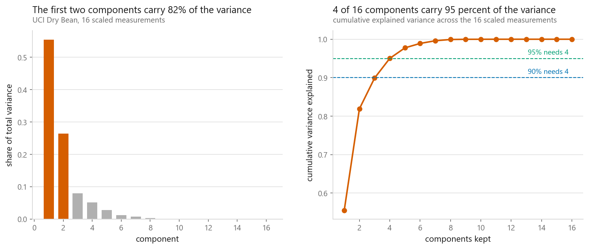
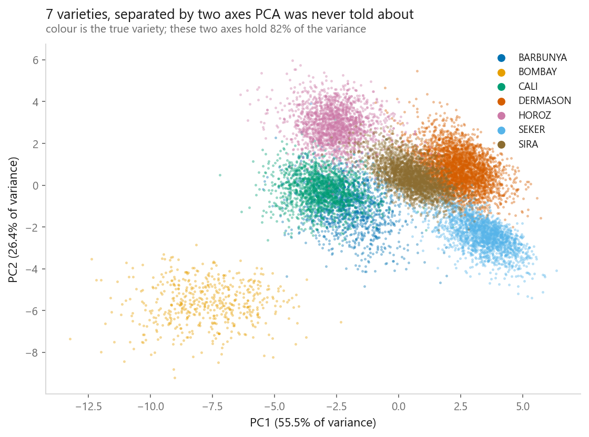
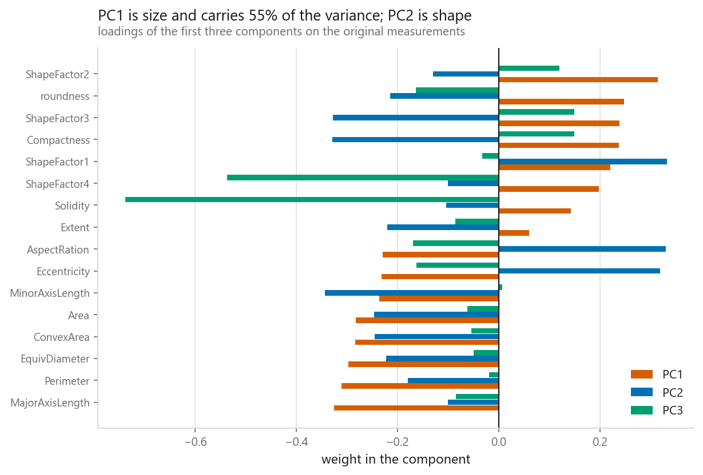
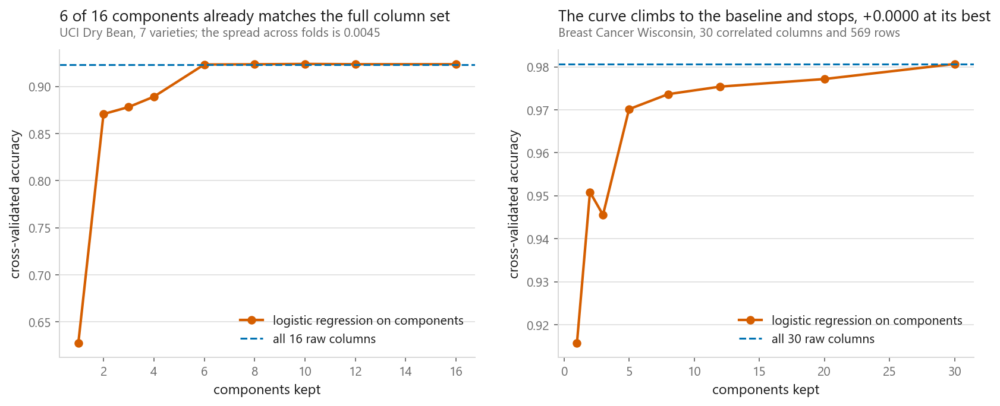

# Principal Component Analysis

### Fewer columns, almost the same information

**[Open the notebook](notebook.ipynb)** · Part 6, Dimensionality reduction ·
Made by [Elyes Lounissi](https://www.linkedin.com/in/elyes-lounissi/)

| | |
|---|---|
| **What you will learn** | What a principal component is, how to compute PCA from the covariance matrix by hand, how many components to keep, and whether reducing dimensions actually helps a downstream model |
| **You should already know** | Matrix multiplication. Eigenvectors help, but the notebook explains what is needed |
| **Datasets** | UCI Dry Bean (13,611 × 16), Breast Cancer Wisconsin (569 × 30) |
| **Runtime** | About a minute on a laptop CPU |

---

## The idea

Dry Bean has sixteen measurements per bean, but not sixteen independent facts.
`Area`, `Perimeter`, `ConvexArea` and `EquivDiameter` all essentially say *how big
is it*: several pairs correlate above **0.99**.

PCA finds new axes that are combinations of the old ones, ordered so the first
captures as much variation as possible. It is a rotation, chosen so variance
concentrates in the earliest axes.

Components are the **eigenvectors** of the covariance matrix; each eigenvalue is
the variance along it. The from-scratch version agrees with scikit-learn to
**2.2 × 10⁻¹⁶**.

## How much do you keep?

| Variance explained | Components needed |
|---|---|
| 80% | 2 of 16 |
| 90% | 4 of 16 |
| 95% | **4 of 16** |
| 99% | 7 of 16 |

## What the components mean

PCA is **unsupervised**: it never saw the varieties. It only looked for
directions of large variance, and the varieties came out largely separated along
them.

Reading the weights names them. **PC1 loads heavily and in the same direction on
`Area`, `Perimeter`, `ConvexArea`, `EquivDiameter` and the axis lengths: it is
measuring how big the bean is**, which is why it carries so much variance: those
six columns were always saying the same thing. **PC2 separates elongation from
bulk: it is measuring shape.**

Naming components is not always possible, and forcing it is a good way to fool
yourself. When it works it is a real insight.

## Does it actually help? Not the way I expected

| Dataset | All raw columns | Best PCA result | Difference |
|---|---|---|---|
| UCI Dry Bean | 0.9234 (16 cols) | 0.9239 at 10 components | +0.0005 |
| Breast Cancer | 0.9807 (30 cols) | 0.9807 at **30** components | 0.0000 |

Both differences are ten-thousandths, and the spread across the five folds is an
order of magnitude larger. So the honest sentence is not that PCA lost, and not
that it won by a hair. **PCA did not change the accuracy on either dataset**, and
the sign of a gap that size carries no information at all.

I expected Breast Cancer to show a clear gain. Thirty correlated columns against
only 569 rows is exactly the crowded regime where dropping dimensions is supposed
to pay, and the best score came from keeping all thirty components, which is a
rotation and no reduction at all.

The reason is the useful part, because it says when the textbook case would have
turned up. Reducing dimensions helps a model starved of rows relative to its
parameters. Logistic regression on thirty scaled columns fits thirty-one numbers
from 569 rows, and scikit-learn regularises it by default on top of that. The
regularisation is already doing PCA's job and doing it better, because it shrinks
the directions that do not help the classes rather than the directions that
happen to have small variance. Turn the penalty off, or push the row count down
towards the column count, and the picture changes.

What PCA *did* buy is **compression at no measurable cost**. That is worth having
when a model is slow, when storage matters, or when you need a two-dimensional
picture of something with sixteen axes. It is not an accuracy trick, and material
presenting it as one is overselling it.

## Cheat sheet

| | |
|---|---|
| **Use it when** | Columns are correlated; you want a 2-D picture; you need to speed up a downstream model |
| **Avoid it when** | You need to explain individual features; the structure is non-linear (try [t-SNE](../03-t-sne/) or [UMAP](../04-umap/)); the informative direction has low variance |
| **Scaling needed** | Yes, whenever units differ. Otherwise the largest-unit column becomes PC1 |
| **Main dials** | `n_components`, an integer, or a variance fraction like `0.95` |
| **Watch out** | Fit PCA **inside** the pipeline. Fitting on all data before splitting leaks test information |
| **Before believing a gain** | Put the difference next to the spread across folds. Both of this chapter's gains vanish under that test |

## Where this chapter sits in Part 6

PCA is the linear answer, and the rest of Part 6 is what you reach for when it is
not enough. Come back here when the non-linear methods start looking impressive.

- [Kernel PCA, ICA and NMF](../02-kernel-pca-ica-nmf/) keep the matrix machinery
  and change what is being maximised.
- [t-SNE](../03-t-sne/) and [UMAP](../04-umap/) give up the rotation entirely.
  They make far better pictures, and you are allowed to read far less into them:
  neither objective can see a distance once the neighbour graph exists.
- [Feature selection](../05-feature-selection/) does the opposite of all of these
  and drops columns rather than mixing them, which is the option to take when
  somebody has to explain the model afterwards.

---

If this chapter was useful, a star on the repository helps other people find it.
The code is yours to use, copy and adapt in your own work, no permission needed.

Made by **Elyes Lounissi** ·
[LinkedIn](https://www.linkedin.com/in/elyes-lounissi/) ·
[pilot.tun@gmail.com](mailto:pilot.tun@gmail.com)

Back to [Part 6](../) · [the curriculum](../../CURRICULUM.md) · [the book](../../README.md)

`#MachineLearning` `#PCA` `#DimensionalityReduction` `#UnsupervisedLearning`
`#Python` `#ScikitLearn` `#DataScience` `#MLTutorial` `#Eigenvectors`
