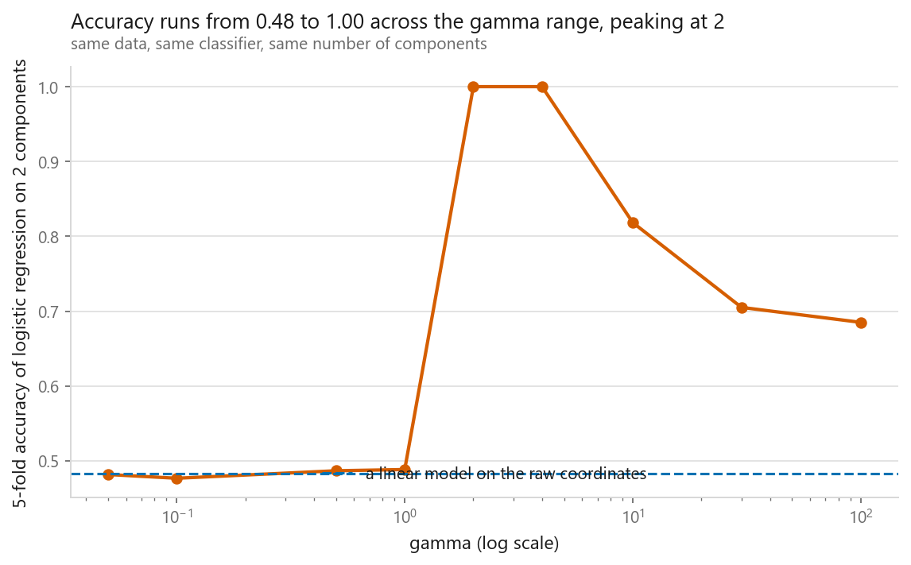
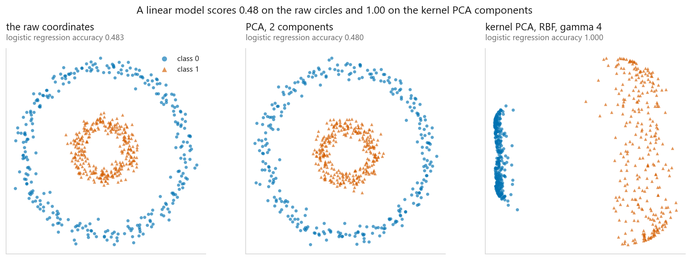
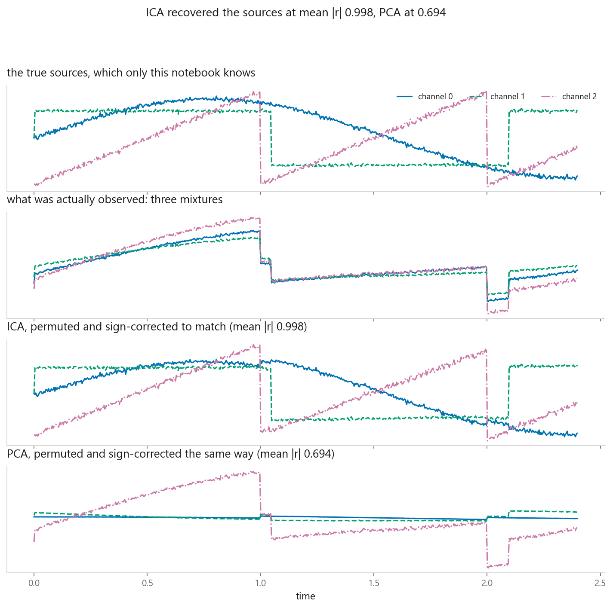
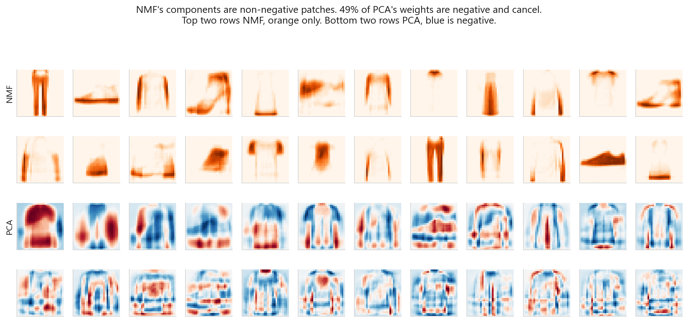
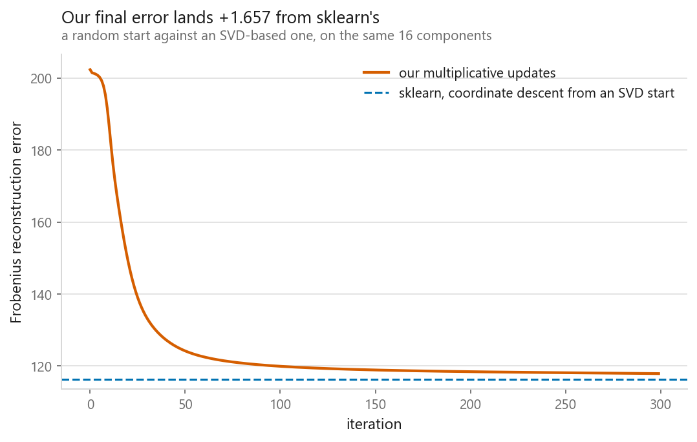
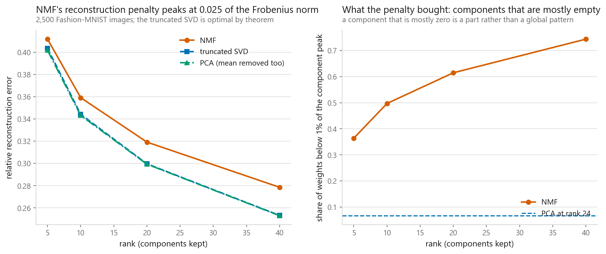

# Kernel PCA, ICA, and NMF

### Three ways to leave PCA behind, each for a different reason, each scored against a known answer

**[Open the notebook](notebook.ipynb)** · Part 6, Dimensionality reduction ·
Made by [Elyes Lounissi](https://www.linkedin.com/in/elyes-lounissi/)

| | |
|---|---|
| **What you will learn** | How kernel PCA runs PCA in a space it never builds, how ICA recovers mixed sources and how to score that when the answer has no ordering, how NMF produces parts instead of ghosts, and what non-negativity costs |
| **You should already know** | [PCA](../01-principal-component-analysis/), and ideally the [kernel trick](../../03-classification/05-support-vector-machines/) |
| **Datasets** | `make_circles` for kernel PCA, synthetic signals with known sources for ICA, Fashion-MNIST for NMF |
| **Runtime** | Two to four minutes on a laptop CPU. All three methods are fitted from scratch first, then checked against scikit-learn |

---

## The result I would lead with

Kernel PCA is sold as the fix for curved structure, and on two concentric
circles it delivers a result no linear method can touch:

| Method | 5-fold cross-validated accuracy |
|---|---|
| logistic regression on the raw coordinates | 0.4833 |
| logistic regression on 2 PCA components | 0.4800 |
| logistic regression on kernel PCA, gamma 4 | **1.0000** |

Then sweep the one dial:

| gamma | Accuracy |
|---|---|
| 0.05 | 0.4817 |
| 0.10 | **0.4767** |
| 0.50 | 0.4867 |
| 1.00 | 0.4883 |
| 2.00 | **1.0000** |
| 4.00 | **1.0000** |
| 10.00 | 0.8183 |
| 30.00 | 0.7050 |
| 100.00 | 0.6850 |

**Two of nine values reached 1.0. Four of nine scored below chance.** The same
method, the same data, the same classifier, running from a coin flip to a
perfect score depending on one number.

At small gamma the RBF kernel is nearly linear and kernel PCA quietly becomes
PCA. At large gamma every point is far from every other, the kernel matrix
approaches the identity, and the components stop describing anything shared.

Here is the part that makes this a real problem rather than a tuning chore.
**Kernel PCA is unsupervised, so nothing inside the method tells you where to put
gamma.** The table above only exists because a downstream classifier supplied a
score. Take that away, which is the situation you are in when you use kernel PCA
as an exploratory tool, and you are choosing between 0.4767 and 1.0000 by eye.

Plain PCA has no dial. That is worth something.

## Kernel PCA, and the centring step people get wrong

PCA in feature space only ever needs inner products, never the mapped vectors,
so a kernel supplies them directly and the infinite-dimensional space is never
built. The detail that breaks implementations is that PCA needs centred data and
you cannot subtract a mean you cannot compute, so the centring has to happen
inside the kernel matrix:

`K̃ = K - 1ₙK - K1ₙ + 1ₙK1ₙ`

The from-scratch version agrees with scikit-learn to six decimals, **absolute
correlation 1.000000 on both components**. Absolute, because the sign of an
eigenvector is arbitrary.

The price is written into the formula. K is n by n, so kernel PCA costs memory
and time quadratic in rows and the eigendecomposition is cubic. PCA on d columns
costs d by d and does not care how many rows you have.

Note the second row of the leading table. PCA on 2 columns into 2 components is
a rotation, and a rotation cannot make a circle linearly separable, so 0.4800
against the raw 0.4833 is exactly what should happen.

## ICA, and why the score needs a permutation solver

Three signals mixed by a random matrix, then recovered. Because the sources were
generated here, the recovery is measurable:

| | True source 0 | True source 1 | True source 2 | Mean absolute correlation |
|---|---|---|---|---|
| ICA | +0.9968 | +0.9995 | +0.9970 | **0.9977** |
| PCA | -0.7194 | +0.7920 | +0.5701 | 0.6938 |

PCA had exactly the same information and produced components that are
uncorrelated and still mixtures. Its rotation was chosen by variance, and
variance is not what separates sources.

ICA works because a sum of independent variables is more Gaussian than its
parts, so the least Gaussian direction is the one that has been mixed least. Two
consequences follow, and both are about scoring rather than about the algorithm.

**Order is arbitrary.** ICA matched true source 0 to recovered component 2, true
source 1 to component 1, and true source 2 to component 0. A perfect recovery in
the wrong order scores near zero if you compare component i to source i.
**Sign and scale are arbitrary too**, which is why the PCA row above contains a
-0.7194 that has to be read as 0.7194.

An ICA correlation reported without saying how the components were matched is
not a checkable number.

## Where ICA stops working, and by how much

The theory predicts this before any code runs: for jointly Gaussian variables,
uncorrelated already implies independent, so after whitening every rotation gives
independent components and ICA's objective is flat. Same code, same mixing
matrix, sources swapped for Gaussian noise:

| Sources | Mean abs correlation | Worst channel | Mean abs excess kurtosis |
|---|---|---|---|
| sine, square, sawtooth | 0.9977 | 0.9968 | 1.5135 |
| three independent Gaussians | 0.7683 | 0.6571 | **0.0668** |

The kurtosis column is the only thing that changed between the rows, and it is
the quantity ICA is implicitly hunting.

I would not describe the second row as ICA failing outright, and this is where I
would push back on the usual phrasing. Recovery fell from 0.9977 to **0.7683**,
which is degraded and still well above nothing, and FastICA emitted a
convergence warning rather than returning garbage. What the theory guarantees is
that there is no maximum to climb toward, not that the answer will look obviously
broken. That is the dangerous case: a method with a flat objective returns
something, and the something correlates enough to be believed.

The tell is in the printed warning and in the kurtosis column, not in the output
itself.

## NMF, and what the two inequality signs buy

On 2,500 Fashion-MNIST images at 24 components:

| | Share of weights that are negative | Share of weights below 1% of the component peak | Seconds |
|---|---|---|---|
| PCA | 0.494 | 0.067 | 0.3 |
| NMF | **0.000** | **0.652** | 2.2 |

Nearly half of a PCA component's weights are negative, meaning the component is
a pattern that gets added or subtracted, which is why the PCA panels look like
overlapping ghosts of several garments at once. NMF cannot subtract, so the only
way to build a picture is out of pieces that are each present or absent, and 65%
of its weights are effectively zero against 7% for PCA.

The from-scratch multiplicative update makes the mechanism clear: non-negativity
is never enforced by a constraint, only never violated, because the update only
ever multiplies by non-negative ratios. The smallest entry in the hand-written W
came out at **5.855e-206** and in H at exactly **0.000e+00**.

After 300 updates from a random start it reached `||X - WH||_F = 117.903`
against scikit-learn's **116.246**. Both are running the same objective;
scikit-learn starts from a truncated SVD instead of random numbers, and on a
non-convex objective the starting point is part of the answer.

## What non-negativity cost

NMF cannot beat the truncated SVD at reconstruction. That is Eckart and Young's
theorem rather than an empirical question, so the number worth having is the
size of the loss:

| Rank | NMF | Truncated SVD | PCA | NMF penalty | NMF sparsity |
|---|---|---|---|---|---|
| 5 | 0.4118 | 0.4036 | 0.4018 | **0.0083** | 0.3640 |
| 10 | 0.3592 | 0.3442 | 0.3432 | 0.0150 | 0.4969 |
| 20 | 0.3192 | 0.2996 | 0.2993 | 0.0196 | 0.6145 |
| 40 | 0.2785 | 0.2532 | 0.2530 | **0.0253** | **0.7435** |

The comparison is against `TruncatedSVD` on purpose. PCA subtracts the mean
first, so a rank-k PCA reconstruction really uses k directions plus the mean and
is not the matched comparison. It sits marginally below the SVD in every row for
exactly that reason.

Both columns grow with rank. The penalty triples from 0.0083 to 0.0253 while
sparsity doubles from 0.36 to 0.74, so the trade holds its shape: you pay more
for parts as you ask for more parts, and you get more parts.

If you want the smallest reconstruction error at a given rank, take the SVD,
always. The 0.0253 is what a nameable component costs.

## Cheat sheet

| | |
|---|---|
| **Kernel PCA** | Curved structure that a linear method has plateaued on. O(n²) memory, O(n³) time, so subsample above a few thousand rows |
| **Kernel PCA warning** | `gamma` moved accuracy from 0.4767 to 1.0000 here, and the method is unsupervised. Tune it against a downstream score or do not trust it |
| **ICA** | Columns that are additive mixtures of sources: audio, EEG. Needs non-Gaussian sources |
| **ICA warning** | No order, no scale, no sign. Match with an assignment solver before scoring. Gaussian sources gave 0.7683, degraded rather than obviously broken |
| **NMF** | Non-negative data where you want components a person can name. Costs 0.0083 to 0.0253 reconstruction error against the SVD |
| **NMF warning** | Non-convex, so the initialisation is part of the answer: an SVD start reached 116.246 where a random start reached 117.903. Fix the seed |
| **Scaling** | Kernel PCA and ICA need it. NMF needs non-negative input, so scale to [0, 1] rather than standardising |
| **Leakage** | All three have a `transform`, so all three belong inside a pipeline, fitted on training rows only |
| **Still the default** | Plain PCA. Deterministic, no dial, closed form, inverts exactly |
| **Next** | [t-SNE](../03-t-sne/), which gives up being a transform at all in exchange for a better picture |

---

Made by **Elyes Lounissi** ·
[LinkedIn](https://www.linkedin.com/in/elyes-lounissi/) ·
[pilot.tun@gmail.com](mailto:pilot.tun@gmail.com)

Back to [Part 6](../) · [the curriculum](../../CURRICULUM.md) · [the book](../../README.md)

`#KernelPCA` `#ICA` `#NMF` `#DimensionalityReduction` `#UnsupervisedLearning`
`#FastICA` `#ScikitLearn` `#FashionMNIST` `#MachineLearning` `#MLTutorial`
`#LearnMachineLearning` `#DataScience` `#AI`
