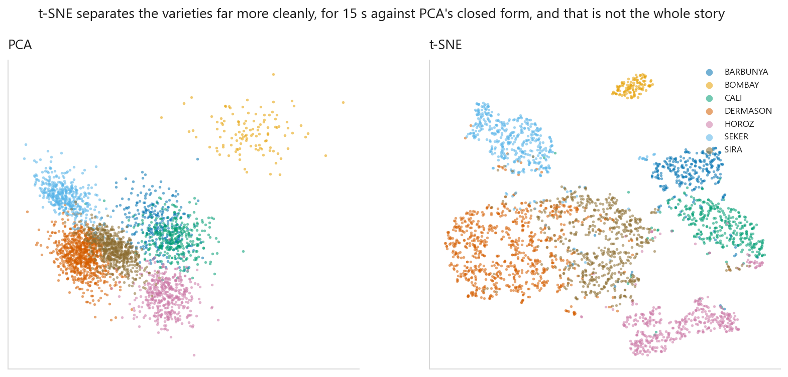
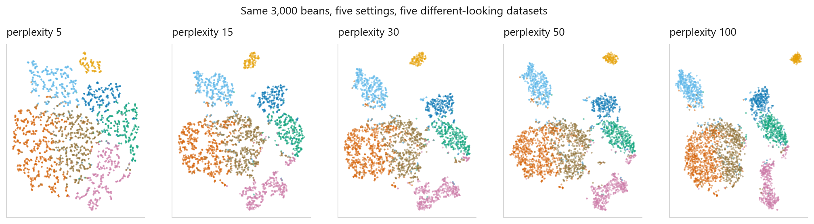
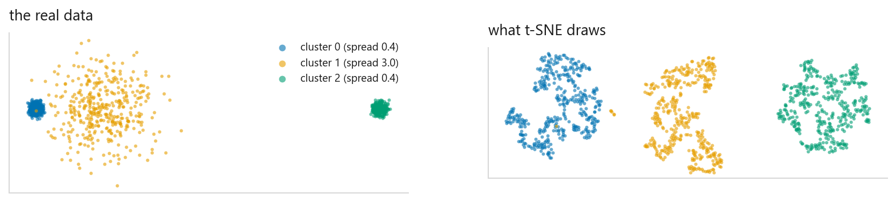
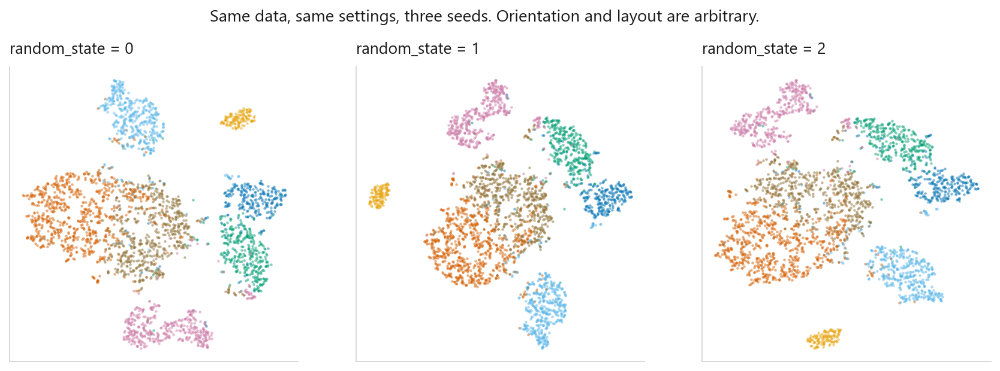

# t-SNE

### A beautiful map you must not over-read

**[Open the notebook](notebook.ipynb)** · Part 6, Dimensionality reduction ·
Made by [Elyes Lounissi](https://www.linkedin.com/in/elyes-lounissi/)

| | |
|---|---|
| **What you will learn** | What t-SNE optimises, why perplexity changes the picture so much, which features of the plot mean something and which are artefacts, and why it must never be a preprocessing step |
| **You should already know** | [PCA](../01-principal-component-analysis/) |
| **Datasets** | UCI Dry Bean, plus a construction where the answer is known |
| **Runtime** | Three to four minutes on a laptop CPU |

---

## The idea

[PCA](../01-principal-component-analysis/) is linear: it can only unfold structure
that was already flat. t-SNE takes a different goal: it does not preserve the data,
it preserves **who is near whom**.



The t-SNE picture is obviously prettier, and prettier is exactly the danger.

One mechanism matters: in two dimensions t-SNE uses a **Student-t** distribution
with heavy tails rather than a Gaussian. Without it everything collapses into one
blob. The heavy tail pushes distant points apart, **and that push is what creates
the gaps you see.**

## Perplexity changes everything



Same 3,000 beans, five settings, five different-looking datasets. Low perplexity
fragments the data into islands that correspond to nothing; high perplexity merges
genuinely separate groups.

**Always look at several perplexities before believing any of them.**

## Three things the plot cannot tell you

I built three clusters where the answer is known: cluster 1 with **seven times**
the spread of the others, and cluster 2 placed **five times** further away than
cluster 1.



| Cluster | Real radius | t-SNE radius |
|---|---|---|
| 0 | 0.58 | 12.91 |
| 1 | **4.14** | 14.37 |
| 2 | 0.57 | 11.89 |

**Cluster size means nothing.** A 7:1 difference in spread came out as roughly
1.1:1. t-SNE equalises local neighbour densities, so a big blob is not a more
variable group.

| Gap | Real | t-SNE |
|---|---|---|
| 0 → 1 | 7.81 | 44.46 |
| 0 → 2 | 40.06 | 94.04 |
| **ratio** | **5.13** | **2.12** |

**Distance between clusters means nothing.** The 5:1 ratio compressed to 2:1.

**Empty space means nothing.** Gaps come from the heavy-tailed repulsion, not from
the data.

What the plot *is* entitled to say: these points were near each other in the
original space. Local neighbourhood, and nothing more.

## Never put it in a pipeline

```
does TSNE have a .transform method? False
does PCA  have a .transform method? True
```



t-SNE cannot embed a new point without refitting everything: the embedding is an
optimisation over one fixed set of points, not a function. So putting it before a
classifier is not merely awkward, it is **leakage**: embedding your test set means
refitting on train and test together.

Use PCA when you need dimensionality reduction inside a model. Use t-SNE when you
need a picture for a human.

## Cheat sheet

| | |
|---|---|
| **Use it when** | You want to *look* at high-dimensional data |
| **Never** | As a preprocessing step. No `transform`, and faking one leaks |
| **Main dials** | `perplexity` (5 to 50, try several), `init="pca"` for stability |
| **Cost** | Slow. Subsample above ~10,000 points, 3,000 beans took 12 s |
| **Read from it** | Which points are neighbours. Nothing else |
| **Do not read** | Cluster sizes, between-cluster distances, or empty space |

---

Made by **Elyes Lounissi** ·
[LinkedIn](https://www.linkedin.com/in/elyes-lounissi/) ·
[pilot.tun@gmail.com](mailto:pilot.tun@gmail.com)

Back to [Part 6](../) · [the curriculum](../../CURRICULUM.md) · [the book](../../README.md)

`#MachineLearning` `#tSNE` `#DimensionalityReduction` `#DataVisualization`
`#UnsupervisedLearning` `#Python` `#ScikitLearn` `#MLTutorial` `#Manifold`
