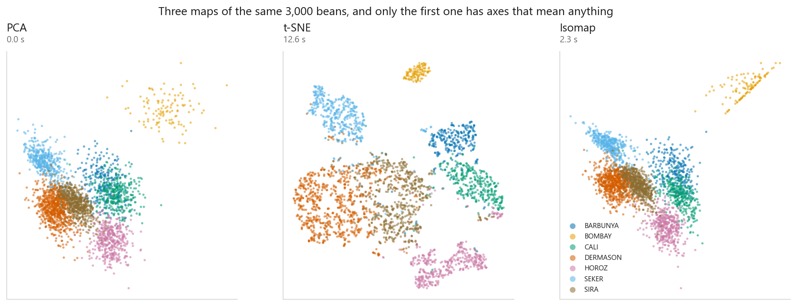
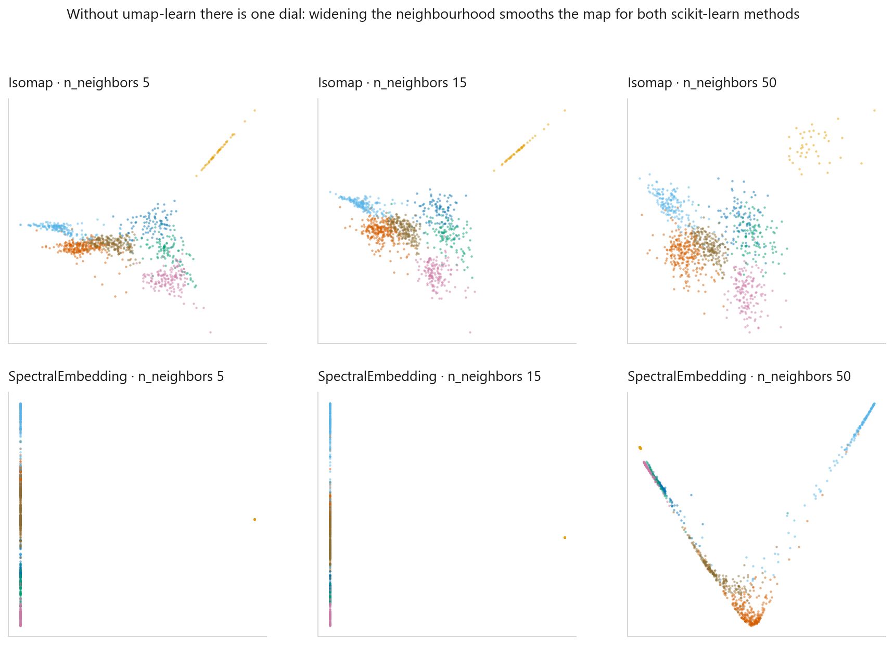
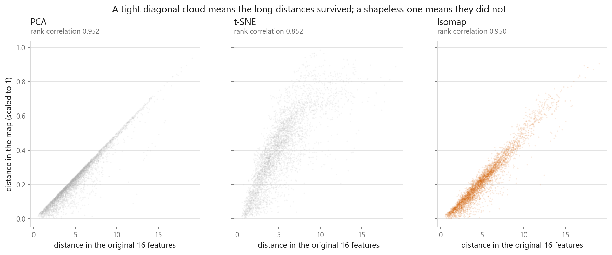
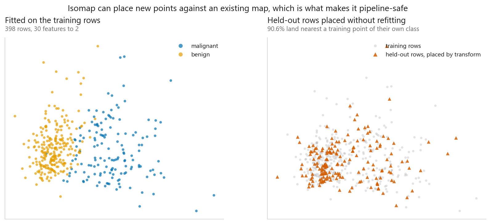

# UMAP

### Faster than t-SNE, and it keeps more of the shape, but check that yourself

**[Open the notebook](notebook.ipynb)** · Part 6, Dimensionality reduction ·
Made by [Elyes Lounissi](https://www.linkedin.com/in/elyes-lounissi/)

| | |
|---|---|
| **What you will learn** | What UMAP optimises, and how that differs from t-SNE. What `n_neighbors` and `min_dist` actually change. How to measure the "preserves global structure" claim instead of repeating it. And why having a `transform` decides where you are allowed to use it |
| **You should already know** | [t-SNE](../03-t-sne/), [PCA](../01-principal-component-analysis/) |
| **Datasets** | UCI Dry Bean, UCI Breast Cancer |
| **Runtime** | Two to four minutes on a laptop CPU |

---

## Read this first: which method produced these numbers

`umap-learn` is not part of scikit-learn, and it was **not installed** on the machine
that executed this notebook. The import guard printed:

```
umap-learn available : False
neighbour method used: Isomap
running the scikit-learn fallback - pip install umap-learn for the real thing
```

So every number on this page came from **`Isomap`**, with `SpectralEmbedding`
alongside it in one figure. Isomap builds a neighbour graph, then measures how far
apart two points are by walking the graph rather than cutting straight through
space, then looks for coordinates whose distances reproduce those walks. It has a
`transform` the way UMAP does. What is missing is `min_dist`, which has no
scikit-learn equivalent, and the stochastic layout: Isomap is deterministic. That
distinction is not a footnote here. It changes one of the conclusions.

## The rigged test came out the wrong way, and that is the lesson

Three planted clusters, spreads and gaps chosen by hand, so the right answer is known
before anything is fitted. The usual demonstration is that the map destroys both.

| | Real | Isomap |
|---|---|---|
| Radius, cluster 0 | 0.56 | 0.62 |
| Radius, cluster 1 | 4.25 | 4.18 |
| Radius, cluster 2 | 0.59 | 0.41 |
| Gap ratio (0→2 over 0→1) | 4.99 | **5.02** |

The seven-fold difference in spread survived, and the five-fold gap ratio came back
at **5.02** against a planted **4.99**. The map kept both quantities it was supposed
to wreck.

That is the objective talking, not luck. Isomap is scored on distances, so radii and
gaps are exactly what it works hardest to keep. UMAP and t-SNE never look at a
distance again once the neighbour graph exists: they match neighbour relationships,
and no neighbour relationship changes when you stretch a cluster or slide it across
the page. **The "cluster size means nothing" warning is a warning about UMAP and
t-SNE, and a table of Isomap numbers is not the thing that demonstrates it.** Before
reading a size or a distance off any two-dimensional map, find out what the method
was minimising.

## Three maps of the same beans



3,000 beans sampled from 13,611, 16 features, timed on the same CPU: PCA **0.0 s**,
t-SNE **15.4 s**, Isomap **2.7 s**.

Read the label on the third panel before you read it as a speed claim. Isomap has its
own cost profile (neighbour graph, shortest paths, eigendecomposition), and it is not
evidence about UMAP either way. The UMAP speed argument is about scale anyway: t-SNE's
all-pairs normalisation is what hurts at tens of thousands of rows, not at 3,000.

## The dials



`n_neighbors` is the one that matters. It sets how many neighbours define "local" when
the graph is built, and it is the closest thing UMAP has to t-SNE's `perplexity`.
Small (2 to 10) splinters the layout into islands; large (50 to 200) forces a broader
arrangement and smooths fine structure away. `min_dist` does something narrower than
people assume: it never touches the graph, only the floor on how close two points may
sit in the output, so it changes how a plot looks without changing what the algorithm
concluded.

Without `umap-learn` this grid is one dial across three settings (5, 15, 50) on the
first 1,000 beans, Isomap on the top row and `SpectralEmbedding` on the bottom.
Widening the neighbourhood merges groups a narrow one kept apart, for both methods. A
reader shown one panel would count a different number of clusters depending on which
panel you picked. **Try three settings of `n_neighbors` before you believe any.**

## Local versus global, measured



Every pair among 1,000 beans, scored two ways. Spearman rather than Pearson, because
no method here promises to preserve distances on a linear scale, only their ordering.

| Method | Global (distance rank correlation) | Local (trustworthiness, k=15) |
|---|---|---|
| PCA | **0.9524** | 0.9434 |
| t-SNE | 0.8516 | **0.9875** |
| Isomap | 0.9499 | 0.9445 |

The whole trade sits in six numbers, and only one method is on the far side of it.
t-SNE wins the local column by 0.0430 over PCA and loses the global column by
0.1008. Both movements are large. The neighbour-graph method lands within
**0.0025** of PCA globally and **0.0011** locally, which on a rank correlation
over a thousand points is not a difference I would report, let alone rank.

So the trade-off this section exists to show is real and has exactly one method
producing it. That is the thing to know before shopping for a non-linear reducer:
whether you get a genuinely different picture depends on whether the objective
gives up distances, and not every neighbour-graph method does. Isomap minimises
error on distances, so it has no reason to lose the global column at all, and it
did not.

Two caveats worth more than the table. This is one dataset at one setting:
`n_neighbors=15` against `perplexity=30` is one point on two different curves,
and `n_neighbors` moves the global score directly, which is what the dial is for.
And a strong global score means different things for different methods: for
Isomap it is the objective, not a discovery.

## It has a transform, so it can go in a pipeline



`hasattr(estimator, "transform")` reads True for PCA and Isomap, **False** for t-SNE
and `SpectralEmbedding`. This is the practical difference, and it is bigger than the
speed.

Fit on 398 training rows of Breast Cancer, `transform` the 171 held-out rows, then ask
each held-out point what class its nearest training neighbour in the map belongs to:
**90.6%** agree, and no test row influenced the map.

Being allowed in a pipeline is not the same as earning a place in one.

| Pipeline | Accuracy | Time for 5 folds |
|---|---|---|
| All 30 features | **0.9789** | 0.0 s |
| PCA to 2D | 0.9578 | 0.0 s |
| Isomap to 2D | 0.9561 | 0.4 s |

Two readings, and only one of them holds.

Squeezing 30 features into 2 costs **0.0211** accuracy, several times the fold
spread. Two dimensions is a picture and a picture is lossy by construction; the
reason to print the number anyway is that people reach for a reducer as a
preprocessing step on the assumption that it is free.

Which reducer is better, this does not say. The two two-dimensional pipelines are
**0.0017** apart, inside the fold spread, so the linear projection and the
neighbour graph are the same model here and only the timing separates them. The
mechanism is in the data: Breast Cancer is close to linearly separable in its
original thirty columns, so a linear projection already captures nearly all the
class-relevant variance and leaves nothing for a non-linear method to recover.
That is the same reason the two tied on both structure scores above. A reducer
that unfolds curvature wins where there is curvature.

The reducer was refit inside every fold, on that fold's training rows only, a loop
you can only write because it has a `transform`.

## What is still true about UMAP

Seed stability read **1.000** here, and the cell prints a note saying that is Isomap
being deterministic rather than a layout earning its steadiness. A UMAP layout moves
when the seed moves, so set `random_state` and say what you set it to. Cluster size,
exact between-cluster distance and empty space remain artefacts in a UMAP plot,
because a loss defined on neighbour relationships cannot see scale. The fallback keeps
them because its loss is defined on distances. Do not carry that result across.

## Cheat sheet

| | |
|---|---|
| **Use it when** | You want to look at high-dimensional data and have more rows than t-SNE will sit still for |
| **Also use it when** | You need a non-linear reduction inside a model. It has a `transform`, so this is legal |
| **Do not use it when** | You need distances. PCA scored 0.9524 on global structure in 0.0 s |
| **Scaling** | Required. It is distance-based |
| **Main dials** | `n_neighbors` (local versus global, try 5 / 15 / 50), `min_dist` (packing only, 0.0 to 0.99), `random_state` always |
| **Install** | `pip install umap-learn`. Not in scikit-learn. `Isomap` is the nearest thing that ships with it |
| **If you ran the fallback** | The numbers came from Isomap, which minimises error on distances and therefore does keep sizes and gaps. That result does not transfer to UMAP |
| **Before quoting the global claim** | Run the rank-correlation test on your own data, at the settings you plan to use |

---

If this chapter was useful, a star on the repository helps other people find it.
The code is yours to use, copy and adapt in your own work, no permission needed.

Made by **Elyes Lounissi** ·
[LinkedIn](https://www.linkedin.com/in/elyes-lounissi/) ·
[pilot.tun@gmail.com](mailto:pilot.tun@gmail.com)

Back to [Part 6](../) · [the curriculum](../../CURRICULUM.md) · [the book](../../README.md)

`#MachineLearning` `#UMAP` `#Isomap` `#DimensionalityReduction` `#DataVisualization`
`#Manifold` `#UnsupervisedLearning` `#Python` `#ScikitLearn` `#MLTutorial`
