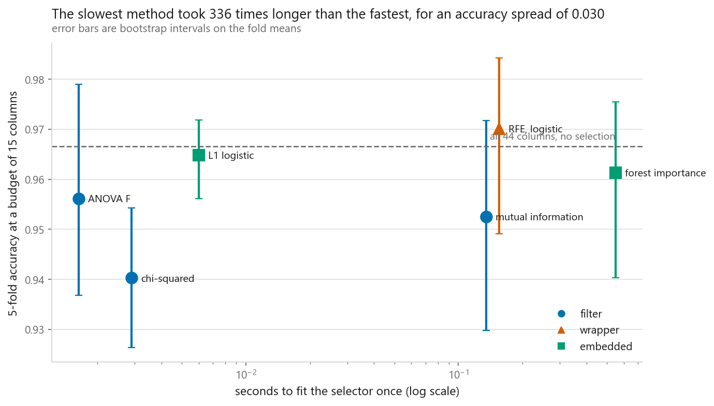
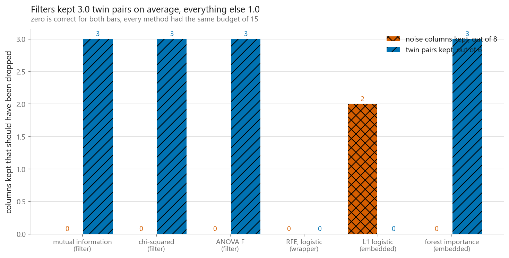
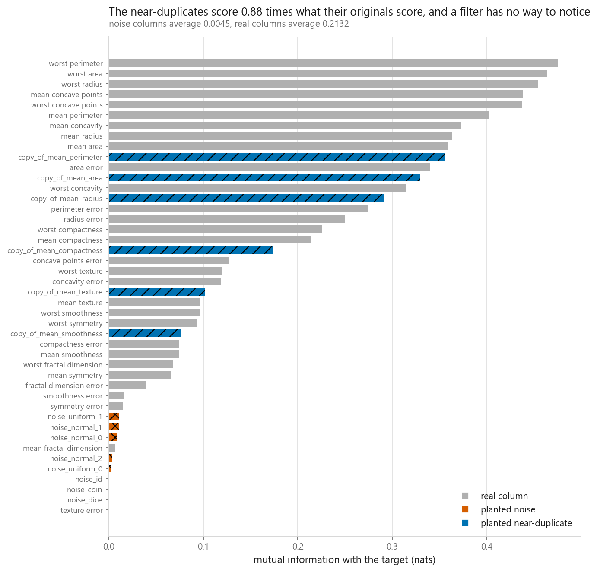
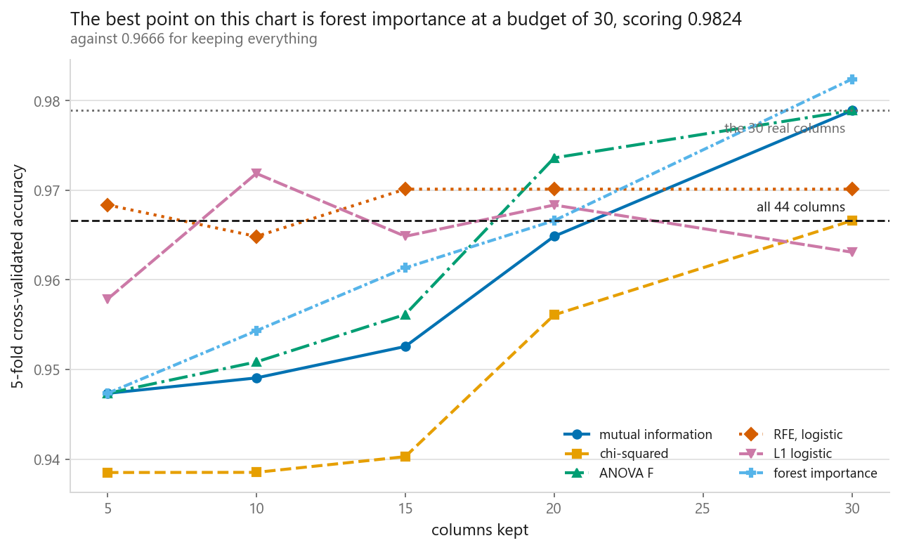
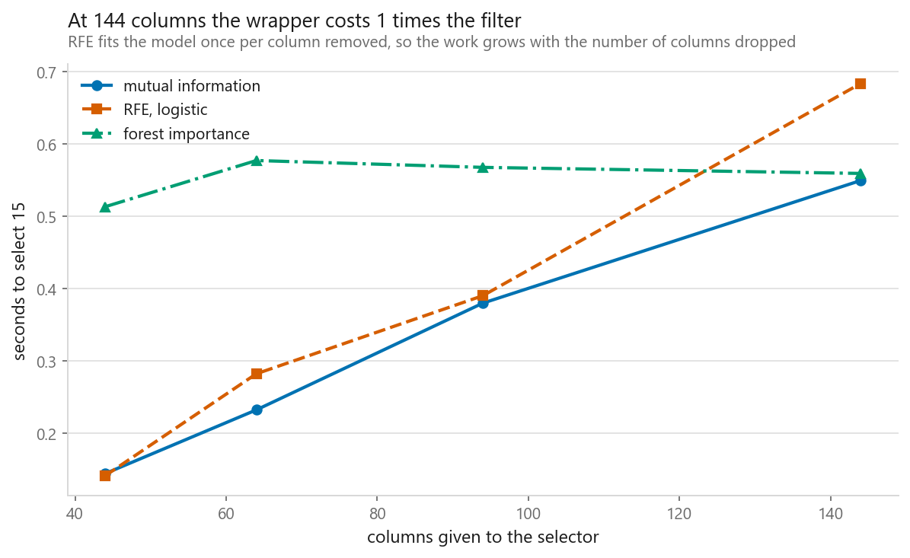

# Feature selection

### Plant columns that should be thrown away, then see who throws them away

**[Open the notebook](notebook.ipynb)** · Part 6, Dimensionality reduction ·
Made by [Elyes Lounissi](https://www.linkedin.com/in/elyes-lounissi/)

| | |
|---|---|
| **What you will learn** | The three families of feature selection and what separates them, how to write mutual information and recursive feature elimination from scratch, which methods remove pure noise, which remove duplicated information, and what the wrapper costs |
| **You should already know** | [Logistic regression](../../03-classification/01-logistic-regression/), [random forests](../../04-ensembles/02-random-forest/), [cross-validation](../../01-foundations/04-cross-validation/) |
| **Dataset** | Breast Cancer Wisconsin, 569 rows and 30 real columns, with 8 columns of known-worthless noise and 6 known near-duplicates planted into it. 44 columns in, keep 15 |
| **Runtime** | One to two minutes on a laptop CPU. Every selector is refitted inside each cross-validation fold |

---

## The result I would lead with

Six selectors, one budget of 15 columns out of 44, with the answer key planted
so that the right behaviour is countable rather than arguable:

| Method | Family | Noise kept | Duplicate pairs kept | Real kept | Accuracy | Seconds |
|---|---|---|---|---|---|---|
| mutual information | filter | 0 | 3 | 12 | 0.9526 | 0.0849 |
| chi-squared | filter | 0 | 3 | 12 | **0.9403** | 0.0018 |
| ANOVA F | filter | 0 | 3 | 12 | 0.9561 | **0.0011** |
| RFE, logistic | wrapper | 0 | **0** | **14** | **0.9701** | 0.0960 |
| L1 logistic | embedded | **2** | **0** | 13 | 0.9649 | 0.0037 |
| forest importance | embedded | 0 | 3 | 12 | 0.9613 | 0.3284 |
| **no selection, all 44 columns** | none | 8 | 6 | 30 | **0.9666** | 0 |
| the 30 real columns, which nobody was told | none | 0 | 0 | 30 | **0.9789** | n/a |

**Doing nothing beat four of the six selectors.** Keeping every column, including
all eight noise columns and all six planted duplicates, scored 0.9666. Only RFE
finished above it.

And the answer key itself, the 30 real columns handed over for free, scored
0.9789, higher than anything any selector produced at this budget. Nobody found
it, which is the honest baseline this chapter exists to print.

I would not read this as feature selection being useless. I would read it as the
accuracy column being the wrong column to judge a selector on. Breast Cancer has
569 rows and a well-regularised logistic model on top, and a model that can
ignore a worthless column will do exactly that. What selection actually bought
here is model size and fitting cost, and those are not in the accuracy column at
all.

## The two failure modes, and nobody avoided both

Read the noise column and the duplicate column instead. Zero is correct in both,
and each method got exactly one of them right:

| | Noise kept, out of 8 | Duplicate pairs kept, out of 6 |
|---|---|---|
| all three filters | 0 | **3** |
| forest importance | 0 | **3** |
| RFE | 0 | 0 |
| L1 logistic | **2** | 0 |

The filters failed exactly as the theory says they must. Mutual information,
chi-squared and ANOVA F kept **the same three planted copies**:
`copy_of_mean_radius`, `copy_of_mean_perimeter`, `copy_of_mean_area`. All three
score one column at a time, and no formula in any of them mentions a second
feature, so two columns carrying the same fact get two good scores and both
survive.

RFE is the one that got both right, and the mechanism is worth stating. When a
linear model sees two duplicated columns it splits the coefficient between them,
both look weak, one gets dropped, and at the next refit the survivor's
coefficient grows back. That is a chain of reasoning a filter has no access to.

L1 is the interesting failure. It dropped every duplicate, which is what a
sparse penalty should do with correlated columns, and then kept **`noise_id` and
`noise_uniform_1`**, two columns generated with no relationship to anything. Its
failure is the mirror image of the filters', and if you had only looked at the
duplicate column you would have called it the winner.

Forest importance is the pleasant surprise. Impurity-based scores are biased
toward high-cardinality columns, and `noise_id` has 345 distinct values with
`noise_normal_0` and friends having 569, so this was the method most likely to
spend budget on noise. It spent none. The bias is real, and on this dataset it
was not large enough to buy a worthless column a place in the top 15.

## The dataset was already redundant before anything was planted

| | |
|---|---|
| Largest absolute correlation between two real columns | **0.9979** |
| Pairs of real columns correlated above 0.90 | **21** |

The 30 real columns are a small set of nucleus measurements each reported three
ways, as a mean, a standard error and a worst case. The six planted copies
correlate with their originals at 0.9687 to 0.9714, which is **less** than the
strongest real pair already in the table.

The planting did not introduce redundancy. It made redundancy countable.

## The accuracy spread survives an error bar, and it should not be trusted anyway

| | Accuracy | Interval |
|---|---|---|
| best, RFE | 0.9701 | [0.9491, 0.9842] |
| worst, chi-squared | 0.9403 | [0.9263, 0.9543] |

Those two intervals overlap heavily, which is where most write-ups would stop
and call the difference noise. Paired over the same folds, which is the correct
test, the difference is **+0.0299 [+0.0106, +0.0544]** and the interval excludes
zero. RFE genuinely beat chi-squared here.

I still would not rank selectors on it, and the reason is the next section.

## The ranking depends entirely on the budget

Five budgets, and four different winners:

| Budget | ANOVA F | L1 | RFE | chi² | Forest | Mutual information |
|---|---|---|---|---|---|---|
| 5 | 0.9473 | 0.9578 | **0.9684** | 0.9385 | 0.9473 | 0.9473 |
| 10 | 0.9508 | **0.9719** | 0.9649 | 0.9385 | 0.9543 | 0.9491 |
| 15 | 0.9561 | 0.9649 | **0.9701** | 0.9403 | 0.9613 | 0.9526 |
| 20 | **0.9736** | 0.9684 | 0.9701 | 0.9561 | 0.9666 | 0.9649 |
| 30 | 0.9789 | 0.9631 | 0.9701 | 0.9666 | **0.9824** | 0.9789 |

The best single number on the whole chart is **forest importance at a budget of
30, scoring 0.9824**, which is the same method that finished fourth at a budget
of 15 and tied for last at a budget of 5. It is also the only cell in the table
that beats handing the model the 30 real columns directly.

RFE is the flattest row, moving 0.0052 across the whole sweep. Chi-squared is
the steepest, moving 0.0281 and never leading anywhere. A comparison at one
budget is a comparison at one point on six different curves.

## What the wrapper costs, and what it does not

The structural argument is clean: RFE fits the model once per column removed, so
going from 44 columns to 15 costs **29 model fits**, and a filter costs **0**.
Multiply by folds if you cross-validate.

The measured version does not follow the story:

| Columns | Mutual information | RFE, logistic | Forest importance |
|---|---|---|---|
| 44 | 0.084 | 0.101 | **0.320** |
| 64 | 0.127 | 0.170 | 0.321 |
| 94 | 0.208 | 0.254 | 0.320 |
| 144 | 0.284 | **0.429** | 0.312 |

**The expensive wrapper is cheaper than the free embedded method at three of the
four widths.** Forest importance is flat because its cost is dominated by
growing the forest, which barely notices 100 extra columns. RFE climbs, and by
144 columns it has overtaken.

The lesson is about the shape, not the seconds. RFE's line is the one that keeps
going up, so the question for your data is where the crossing point sits, and on
a table wide enough for feature selection to matter it will already be behind
you. Use a filter to cut a very wide table down to something a wrapper can chew.

## Two implementations, checked against the library

| | Result |
|---|---|
| hand-written binned mutual information against scikit-learn's nearest-neighbour version | Spearman rank correlation **0.9838**, and **15 of 15** columns shared in the top 15 |
| hand-written RFE against `sklearn.feature_selection.RFE` | **identical selection**, 15 of 15, in 0.09 s |

Two different estimators of mutual information, one binning and one using
distances to neighbours, disagreeing on the exact scores and agreeing on every
column that matters. The top of that list is `worst perimeter` at 0.4695,
`worst radius` at 0.4642 and `worst area` at 0.4607.

## The leak that came out backwards

Every number above put the selector inside the cross-validation pipeline, so it
never saw the fold it was scored on. The usual demonstration then fits the
selector once on all the data and shows the score inflating.

It did not inflate:

| | Accuracy |
|---|---|
| selector inside the folds | 0.9526 |
| selector fitted on all data | 0.9508 |
| the leak is worth | **-0.0018**, interval [-0.0053, +0.0000] |

The leaky version scored **lower**, in a comparison rigged in its favour by
construction, because the selector had already seen every row of every test fold
before choosing.

That result does not weaken the rule, and this is the part worth carrying. The
reason to avoid the leak was never that the number goes up. It is that the leaky
number describes a procedure you cannot run on data you have not collected yet,
so it is not an estimate of anything, whichever direction it happens to move.

## Cheat sheet

| | |
|---|---|
| **Filter** | Cheapest by a wide margin and blind to redundancy by construction. All three kept the same 3 duplicate pairs here |
| **Wrapper (RFE)** | The only method that got both failure modes right. Costs one model fit per column dropped, 29 of them here, times folds |
| **Embedded (L1)** | Dropped every duplicate and kept 2 pure-noise columns. Needs scaled features and a tuned penalty |
| **Embedded (trees)** | Kept 0 noise despite the high-cardinality bias, and produced the single best score in the notebook at a budget of 30 |
| **chi-squared** | Non-negative input only. It is a test of independence, not a measure of strength, and it finished last at every budget |
| **Plant an answer key** | Noise columns and near-duplicates cost almost nothing to add and turn this from an opinion into a count |
| **Do not judge on accuracy** | Keeping all 44 columns beat four of the six selectors. Judge on what was kept, and on model size and fitting cost |
| **Do not judge at one budget** | Five budgets gave four different winners |
| **Always** | Put the selector inside the cross-validation pipeline, even though the leak here was worth -0.0018 |
| **Next** | [The perceptron](../../07-neural-networks/01-the-perceptron/), which starts Part 7 |

---

If this chapter was useful, a star on the repository helps other people find it.
The code is yours to use, copy and adapt in your own work, no permission needed.

Made by **Elyes Lounissi** ·
[LinkedIn](https://www.linkedin.com/in/elyes-lounissi/) ·
[pilot.tun@gmail.com](mailto:pilot.tun@gmail.com)

Back to [Part 6](../) · [the curriculum](../../CURRICULUM.md) · [the book](../../README.md)

`#FeatureSelection` `#MutualInformation` `#RFE` `#Lasso` `#L1Regularisation`
`#RandomForest` `#ScikitLearn` `#BreastCancer` `#MachineLearning` `#MLTutorial`
`#LearnMachineLearning` `#DataScience` `#AI`
