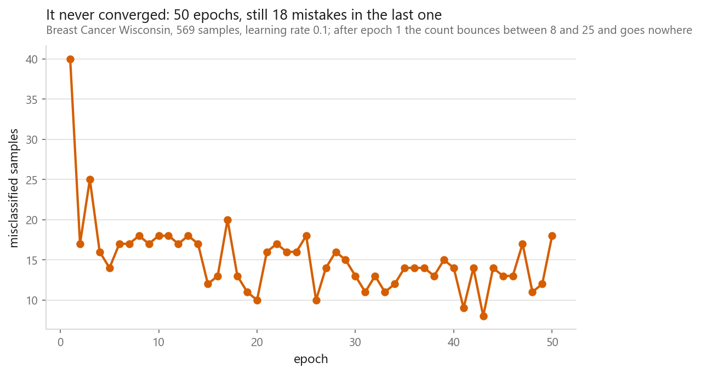
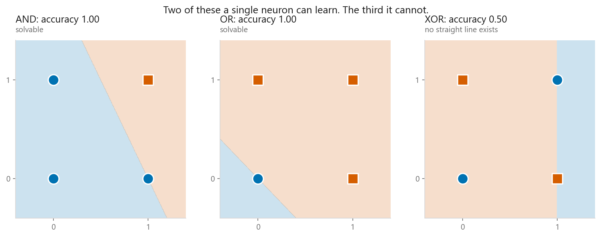
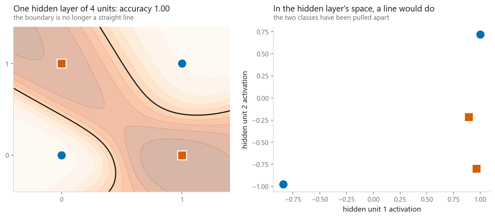

# The perceptron

### One neuron, and the argument that stalled AI for a decade

**[Open the notebook](notebook.ipynb)** · Part 7, Neural networks ·
Made by [Elyes Lounissi](https://www.linkedin.com/in/elyes-lounissi/)

| | |
|---|---|
| **What you will learn** | What a single artificial neuron computes, the learning rule that trains it, why it cannot learn XOR, and how stacking two layers fixes that |
| **You should already know** | [Logistic regression](../../03-classification/01-logistic-regression/) |
| **Datasets** | Breast Cancer Wisconsin, plus the four points of XOR |
| **Runtime** | Under a minute on a laptop CPU |

---

## The idea

Rosenblatt's perceptron (1958) is the ancestor of every neural network in this
book. Weighted sum, hard threshold:

$$\hat{y} = \begin{cases} 1 & \text{if } w \cdot x + b > 0 \\ 0 & \text{otherwise} \end{cases}$$

What made it famous is the learning rule, one line, no calculus:

$$w \leftarrow w + \eta\,(y - \hat{y})\,x$$

Predicted 0 when the answer was 1? Push weights **toward** this input. Predicted 1
when it was 0? Push them **away**. Got it right? Change nothing.

**It did not converge.** The loop has a `mistakes == 0` break and the break never
fired. Fifty epochs ran because fifty was the cap, and the last one still made 18
mistakes on its way past. After epoch 1 the count bounces between 8 and 25 with no
trend: a flat line with noise on it.

**Rosenblatt's convergence theorem**: if a straight line separates the classes, the
perceptron finds one in finite steps. If none exists, it cycles forever, with no
warning that it is doing so.

So the tempting reading of that chart is that the data is not separable. It is
wrong, and the real answer is more useful.

| Check | Result |
|---|---|
| Hard-margin linear SVM, training accuracy | **1.0000** |
| A separating hyperplane exists | **True** |
| Widest margin any hyperplane achieves | 0.00133 |
| Largest sample norm R | 20.57 |
| Novikoff mistake bound, $(R/\gamma)^2$ | **239,890,695** |

The data **is** linearly separable, so the precondition holds and the perceptron
will find a line in finite steps, exactly as promised. The catch is what "finite"
is worth. Novikoff bounds the mistakes by $(R/\gamma)^2$, and on data separable
only by a sliver that comes out near **240 million**. Fifty epochs made nowhere
near that many.

**Convergence in finite time and convergence in useful time are different claims,
and the theorem only makes the first one.** That generalises past the perceptron:
when a training loop stops improving, "the model cannot represent this" and "the
model can, but the optimiser will take longer than you have" look identical from
inside the loop.

## The XOR problem

| Function | Accuracy | Epochs |
|---|---|---|
| AND | 1.00 | 6, converged |
| OR | 1.00 | 4, converged |
| **XOR** | **0.50** | 200, **never converged** |

Four points, and a single neuron cannot do it. The 1s sit on opposite corners, so
no straight line puts both on one side.

This result, published as *Perceptrons* in 1969, is widely credited with draining
funding from neural networks for most of the 1970s. The awkward part of the
history is that the fix was already understood in principle: **stack another
layer.**

## Two layers solve it

| Model | XOR accuracy |
|---|---|
| Single perceptron | 0.50 |
| One hidden layer of 4 units | **1.00** |

The right panel is the whole idea of deep learning in one picture. The hidden
layer took four points that no line could separate and **moved them** into
positions where a line can.

Every layer after the first is doing classification. The layers before it are
inventing the features that make classification easy.

The catch, and why this took until the 1980s to become practical: the perceptron
rule cannot train a hidden layer, because nobody says what a hidden unit *should*
have output. Solving that is [backpropagation](../02-mlp-and-backpropagation/).

## Cheat sheet

| | |
|---|---|
| **Use it when** | Almost never in production: it is here because everything else descends from it |
| **Guarantee** | Converges in finite steps **if** linearly separable, bounded by $(R/\gamma)^2$ mistakes. That was ~240 million here, so it ran out the epoch cap on separable data. Otherwise cycles forever, silently |
| **Versus logistic regression** | Same weighted sum. The perceptron thresholds hard and gives no probabilities |
| **Watch out** | It stops at the *first* separating line, which may sit right against the data. An [SVM](../../03-classification/05-support-vector-machines/) picks the best one |

---

If this chapter was useful, a star on the repository helps other people find it.
The code is yours to use, copy and adapt in your own work, no permission needed.

Made by **Elyes Lounissi** ·
[LinkedIn](https://www.linkedin.com/in/elyes-lounissi/) ·
[pilot.tun@gmail.com](mailto:pilot.tun@gmail.com)

Back to [Part 7](../) · [the curriculum](../../CURRICULUM.md) · [the book](../../README.md)

`#MachineLearning` `#DeepLearning` `#Perceptron` `#NeuralNetwork` `#XOR`
`#Python` `#NumPy` `#MLTutorial` `#LearnMachineLearning` `#AI`
