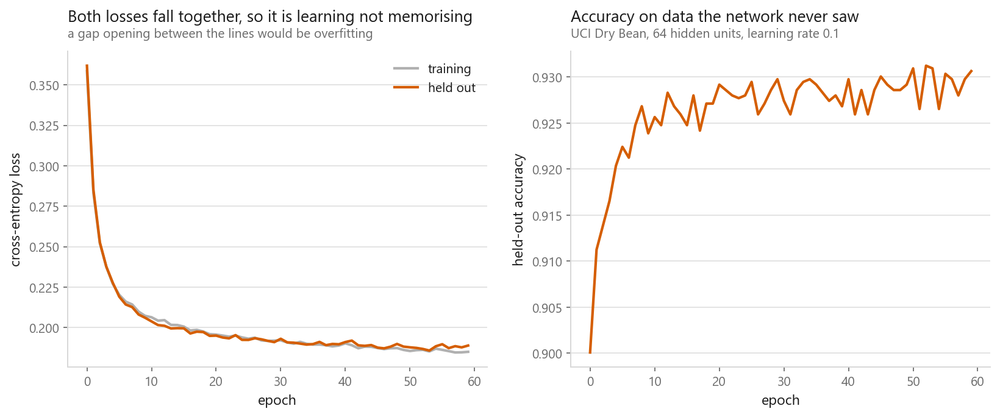
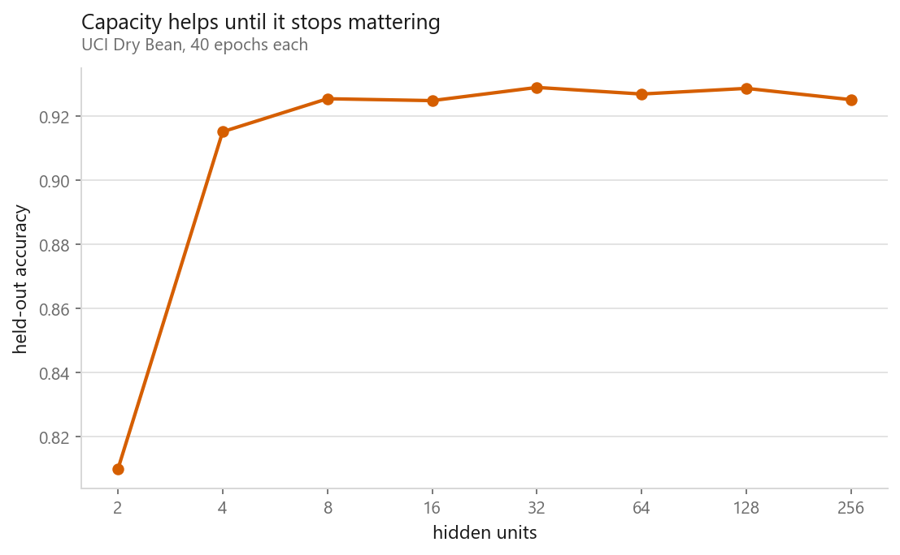
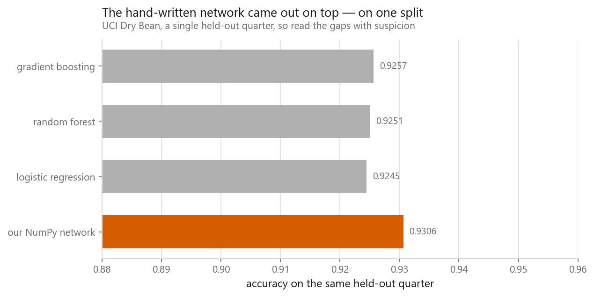

# Multilayer perceptron and backpropagation

### A neural network in NumPy, with every gradient derived

**[Open the notebook](notebook.ipynb)** · Part 7, Neural networks ·
Made by [Elyes Lounissi](https://www.linkedin.com/in/elyes-lounissi/)

| | |
|---|---|
| **What you will learn** | What backpropagation actually computes, how to derive every gradient by hand, how to check them numerically, and how to train a working network in NumPy alone |
| **You should already know** | [The perceptron](../01-the-perceptron/), the chain rule |
| **Dataset** | UCI Dry Bean (13,611 × 16, 7 classes) |
| **Runtime** | About two minutes on a laptop CPU |

---

## The problem it solves

The [perceptron](../01-the-perceptron/) ended on a wall: a hidden layer can rebuild
the input space so a line separates the classes, but the perceptron rule cannot
train one, because **nobody tells you what a hidden unit should have output**.

Backpropagation is not a learning algorithm. It is a way of computing derivatives.
Gradient descent still does the learning; backprop works out efficiently how much
each weight contributed to the error, by applying the chain rule **from the output
backwards** so every intermediate result gets reused.

## The derivation

The network is one hidden layer wide. A bean's 16 measurements, $x$, go through
weights $W_1$ to give the hidden values $z_1$; ReLU zeroes the negative ones; the
survivors go through weights $W_2$ to give seven output numbers $z_2$, one per
variety; softmax turns those into probabilities $\hat{p}$. The true variety is $y$,
a 1 in one slot and zeros elsewhere. $L$ is the loss.

Softmax paired with cross entropy gives a result so clean it looks like a mistake:

$$\frac{\partial L}{\partial z_2} = \hat{p} - y$$

Prediction minus truth, the same expression that appeared in
[linear regression](../../02-regression/01-linear-regression/) and
[logistic regression](../../03-classification/01-logistic-regression/). The messy
softmax derivative and the messy log derivative cancel exactly.

From there, writing $\delta_2 = \hat{p} - y$ for the error arriving at the output:

$$\delta_1 = (\delta_2 W_2^\top) \odot \mathbb{1}[z_1 > 0] \qquad \frac{\partial L}{\partial W_1} = x^\top \delta_1$$

$\odot$ multiplies entry by entry, and $\mathbb{1}[z_1 > 0]$ is ones where a hidden
unit was positive and zeros where it was not. ReLU's derivative is 1 where the
input was positive and 0 elsewhere, so that term is just a mask: the error travels
back through $W_2$ and then gets blanked out at every unit ReLU had switched off.

## Check the gradients before trusting them

A backprop bug does not crash. It trains slightly worse, and you never find out.
The notebook compares analytic gradients against numerical estimates. Each
parameter costs two full forward passes, so it **samples**: up to twelve entries
per tensor, drawn at random, which came to **34 of the 66 parameters**.

```
sampled 34 of the 66 parameters
worst gap between analytic and numerical gradient: 1.947e-10  →  the derivation is correct
```

**Always do this once on a new implementation.** It is slow, impractical for
training, and decisive as a one-off test. Sampling is enough because a wrong
derivation is wrong across a whole tensor, not in one entry of it.

## Training





Wider helps until it stops mattering: 2 units score 0.8099, 4 units 0.9151, and
after that nothing much. Keep the tail of that sweep in mind, because it is the
noise floor for the next section: **across widths 8 to 256, held-out accuracy
still wandered from 0.9248 to 0.9289, a spread of 0.0041**, from a knob the same
chart shows does not matter.

## The comparison, and why I do not trust it



| Model | Accuracy on the same held-out quarter |
|---|---|
| Our NumPy network | **0.9306** |
| Gradient boosting | 0.9257 |
| Random forest | 0.9251 |
| Logistic regression | 0.9245 |

About seventy lines of NumPy came out **ahead of scikit-learn's boosted trees**,
which was not what I expected to be writing.

Before celebrating, read the gap properly. The lead is **0.0049**, on a **single**
held-out quarter. The width sweep above moved **0.0041** on its own, from a knob
that does not matter. The claimed win and the known noise are the same size.

The honest reading is **a tie measured badly**, not a win. A single split is a
sample of size one, and I would not defend an ordering built on it. If the ordering
mattered I would rerun all four under repeated cross-validation and quote the
spread.

It also does not change the advice. Gradient boosting needed one line and no
tuning; the network needed a derivation, an initialisation scheme, a learning rate,
a width, and an epoch count. Neural networks earn their keep where the input has
structure a tree cannot exploit: the grid of an image, the order of a sequence.

## Cheat sheet

| | |
|---|---|
| **Backprop is** | A way to compute derivatives, not a learning algorithm |
| **Key simplification** | Softmax + cross entropy gives $\partial L/\partial z = \hat{p} - y$. Never derive them separately |
| **Numerical stability** | Subtract the row max before `exp`; add `1e-12` before `log` |
| **Initialisation** | He (variance $2/\text{fan-in}$) for ReLU. Zeros make every unit identical forever |
| **Always** | Gradient-check once. A wrong gradient trains quietly and badly |

---

If this chapter was useful, a star on the repository helps other people find it.
The code is yours to use, copy and adapt in your own work, no permission needed.

Made by **Elyes Lounissi** ·
[LinkedIn](https://www.linkedin.com/in/elyes-lounissi/) ·
[pilot.tun@gmail.com](mailto:pilot.tun@gmail.com)

Back to [Part 7](../) · [the curriculum](../../CURRICULUM.md) · [the book](../../README.md)

`#DeepLearning` `#Backpropagation` `#NeuralNetwork` `#NumPy` `#MachineLearning`
`#Python` `#MLTutorial` `#GradientDescent` `#LearnMachineLearning` `#AI`
