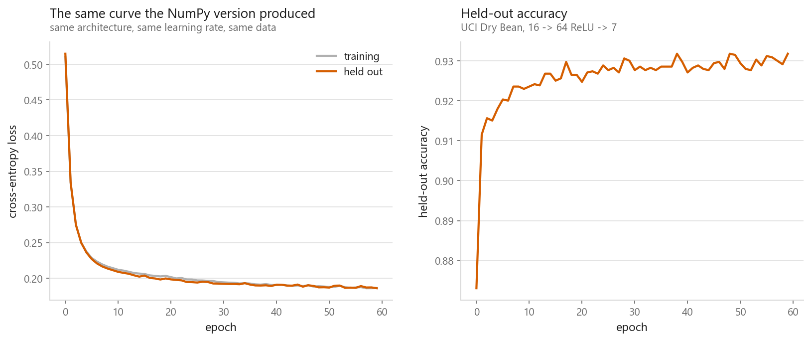
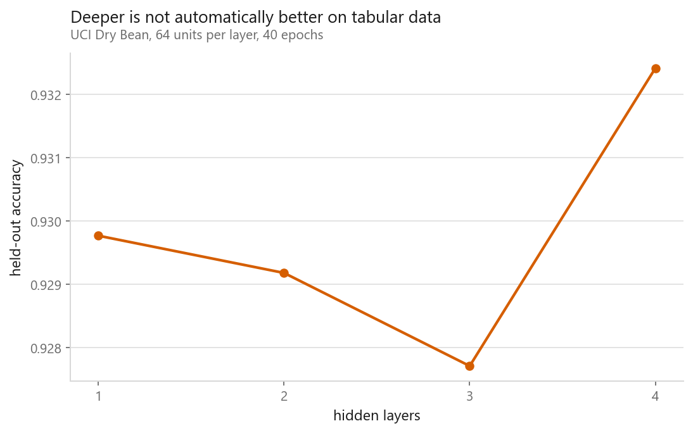

# The same network in PyTorch

### What a framework gives you, and what it hides

**[Open the notebook](notebook.ipynb)** · Part 7, Neural networks ·
Made by [Elyes Lounissi](https://www.linkedin.com/in/elyes-lounissi/)

| | |
|---|---|
| **What you will learn** | How the NumPy network maps onto PyTorch line by line, and what autograd is really doing. The training loop you will reuse everywhere. And the three mistakes everyone makes once |
| **You should already know** | [MLP and backpropagation](../02-mlp-and-backpropagation/) |
| **Dataset** | UCI Dry Bean (13,611 × 16, 7 classes) |
| **Runtime** | About a minute on a laptop CPU |

---

## Autograd in four lines

Before the network, the mechanism on something checkable by hand:

```python
x = torch.tensor(3.0, requires_grad=True)
y = x ** 2 + 5 * x + 1
y.backward()
```

```
y = x^2 + 5x + 1 at x = 3 gives y = 25.0
PyTorch says dy/dx = 11.0
by hand,     dy/dx = 2(3) + 5 = 11
```

`requires_grad=True` records what happens to the tensor. `.backward()` replays the
recording in reverse. Everything else is that idea at scale, the previous
notebook's derivation, automated for any architecture you write.

## The training loop you will reuse

Five steps, in this order, forever:

```python
optimiser.zero_grad()          # 1. clear last step's gradients
loss = loss_fn(model(xb), yb)  # 2. forward, then loss
loss.backward()                # 3. gradients, by autograd
optimiser.step()               # 4. update the weights
```



Final held-out accuracy **0.9318** from 1,543 parameters, the same curve the
NumPy version produced, because it is the same maths.

## The three mistakes everyone makes once

**Forgetting `zero_grad()`.** PyTorch *accumulates* gradients rather than replacing
them. Leave it out and every step adds to the last, the effective learning rate
grows without bound, and training diverges for no visible reason.

**Applying softmax before `CrossEntropyLoss`.** Hand it the raw numbers your last
layer produced, before any squashing. It applies log-softmax internally, and doing
it twice is the single most common bug in PyTorch classification.

**Forgetting `model.train()` / `model.eval()`.** The moment dropout or batch norm
appear, evaluating in training mode gives quietly wrong numbers.

## What the framework buys you



| Hidden layers | Parameters | Held-out accuracy |
|---|---|---|
| 1 | 1,543 | 0.9298 |
| 2 | 5,703 | 0.9292 |
| 3 | 9,863 | 0.9277 |
| 4 | 14,023 | 0.9324 |

Adding layers is now a one-character change, and on this dataset it buys nothing:
the four results span **0.0047**, and the [previous
notebook](../02-mlp-and-backpropagation/) measured 0.0041 of movement on the same
split from a hidden width that provably does not matter. Note that the deepest
model scored *highest*, at 0.9324. Read that as what a null result looks like when
you rank four numbers, rather than as evidence for depth.

The y-axis on that chart is fixed rather than auto-scaled for exactly this reason.
Left alone, matplotlib fits the axis to a 0.005 range, the depth-4 point leaps off
the top of the panel, and the picture argues for a result the numbers do not
support.

Depth pays when the data has hierarchical structure: edges into shapes into
objects, characters into words into meaning. Sixteen geometric measurements of a
bean do not, so the flat line is the expected outcome rather than a disappointing
one.

**A framework makes any architecture cheap to try, and cheap to try is not the same
as worth trying.**

## Cheat sheet

| | |
|---|---|
| **The loop** | `zero_grad` → forward → `backward()` → `step()`. In that order, always |
| **Never** | Softmax before `CrossEntropyLoss`; forget `zero_grad()` |
| **Always** | `model.train()` / `model.eval()`, and `torch.no_grad()` for evaluation |
| **Devices** | Model and data must be on the same device |
| **Reproducibility** | `torch.manual_seed` is necessary and not sufficient: GPU reductions are non-deterministic unless you ask otherwise |

---

If this chapter was useful, a star on the repository helps other people find it.
The code is yours to use, copy and adapt in your own work, no permission needed.

Made by **Elyes Lounissi** ·
[LinkedIn](https://www.linkedin.com/in/elyes-lounissi/) ·
[pilot.tun@gmail.com](mailto:pilot.tun@gmail.com)

Back to [Part 7](../) · [the curriculum](../../CURRICULUM.md) · [the book](../../README.md)

`#DeepLearning` `#PyTorch` `#NeuralNetwork` `#Autograd` `#MachineLearning`
`#Python` `#MLTutorial` `#LearnMachineLearning` `#AI`
